# Gamemaster tabletop platform first draft

Status: SUPERSEDED. Superseded by `.agents/plans/2026-09-22_091051-post-first-draft-hardening.plan.md`.

**Goal:** Finish the first runnable draft of a platform-agnostic tabletop RPG framework on top of SingularityNET Omega, where authoritative game state lives in SQLite, mechanics live in swappable game-system plugins, and the LLM proposes and narrates but never owns truth.

**Architecture:** Four layers that must not collapse into each other. Omega supplies cognition, tools, providers, and channels. One thin MeTTa plugin (`plugins/tabletop/`) is the only Omega-aware code. `tabletop/` is a pure-Python runtime with zero Omega or MeTTa imports, owning orchestration, persistence, visibility, documents, and retrieval. `systems/*` are game-system plugins loaded through `plugin.yaml` manifests that never import Omega, MeTTa, or each other.

**Tech Stack:** Python 3.11, stdlib `sqlite3` with FTS5, pytest, PyYAML (safe loader only), Omega's MeTTa runtime and provider layer, Docker Compose for Portainer.

This plan supersedes `.agents/plans/2026-09-06-tabletop-platform.md`. That file keeps the Phases 1 through 8 completion record and the six-repo prior-art research digest; the durable version of that research is `docs/research/prior-art.md` plus the per-repo reports beside it. Nothing here reuses research-repo code.

---

## Layer boundary (non-negotiable)

| Layer | Responsibility |
|---|---|
| Omega | cognition, tools, model interaction, channels |
| Tabletop Runtime | campaign orchestration, persistence, knowledge boundaries |
| Game System Plugin | mechanics and system-specific schemas |
| Content Pack | rules, settings, adventures, lore |
| Campaign | authoritative world state and history |
| LLM | intent interpretation, narration, ambiguous adjudication |

If an implementation choice starts collapsing these layers, fix the architecture before adding the feature.

## Constraints that govern every task

1. Do not rewrite Omega's agent loop, provider layer, communication layer, memory layer, or plugin machinery. Document any upstream file you must touch in `UPSTREAM.md`.
2. All new tabletop functionality sits behind the single `tabletop` Omega plugin.
3. The tabletop API must not be D&D-shaped. The core never learns what AC, saving throws, hit locations, spell slots, mana, refresh, or sanity mean.
4. The LLM may interpret intent, narrate outcomes, and adjudicate genuine gaps. It must never silently replace deterministic mechanics or author mechanical numbers.
5. Original source documents stay separately accessible from their RAG representations.
6. Campaign truth must never depend on vector-memory recall.
7. Prefer SQLite over external infrastructure. Prefer Python over MeTTa outside the adapter.
8. Canon state, knowledge state, visibility scope, and temporal validity are four independent axes. Model-created facts default to non-canon. Promotion to canon and reveal to players are separate operations that emit separate events.
9. Extraction and import are separate trust boundaries. Model output is untrusted proposal data. The importer performs deterministic validation and holds no model credentials and no network access where practical.
10. Context compaction is refetch-based, never lossy summarization. A compacted entry retains the tool name and arguments needed to reconstruct it.
11. Setting canon and campaign canon are separate scopes. A campaign fact overrides a setting fact for that campaign only, at query time, and never mutates shared setting canon.
12. Promotion changes canon state. Detachment changes provenance ownership. They are different operations on different fields.
13. Forbidden operations are absent from the tool surface, not merely prohibited by prompt text.
14. Research clones under `research/` stay git-ignored. No code is copied from them; all architecture is clean-room.
15. The first draft must run locally and in Docker under Portainer, with no docker socket mount and no hardcoded developer paths.
16. Never merge a pull request without explicit human approval in the conversation that opened it.

## Execution invariants

These bind every task below. Where a task's prose and one of these disagree, the invariant wins.

1. **Branch before edit.** A review branch is created from freshly merged `main` before any file for that boundary changes.
2. **No undeclared stacked PRs.** A task depending on another boundary waits for that boundary's PR to merge.
3. **Setting ownership is first class.** Entities, facts, relationships, and world state may be setting-owned or campaign-owned. No fake campaign stands in for a setting.
4. **`StateChange` targets a documented canonical state tree**, never SQLite schema paths.
5. **After event sourcing lands, every authoritative mutation writes state and its event in one transaction.**
6. **Raw-document immutability is an application convention locally and a filesystem guarantee only under read-only deployment mounts.** Tests must not claim an OS boundary the process does not have.
7. **Workspace skill surfaces are fixed per runtime instance** for the first draft.
8. **Lore and mechanics use distinct precedence policies.**
9. **Extraction-envelope failure and individual-proposal rejection are different failure classes.**
10. **Vector retrieval is optional and backend-independent. Lexical retrieval is the required baseline.**

## Completion record (2026-09-22)

Tasks 01 through 55 are complete. The first draft is on `main` and `origin/main` at `5a81322` (`fix: stop model tools from writing confirmed canon outside the active campaign`). GitHub records that commit as the merge of pull request #8, "Tabletop first draft", merged 2026-09-22. Pull request #7, "Phase 10: dice engine", merged at the same time and is contained in #8.

`python3.11 -m pytest tests/ -q` on that commit: 660 passed.

The work was built as one stacked line of phase branches, then landed as #8, rather than as a separate merged pull request per boundary. Constraint 16 was kept: the agent opened the pull requests and did not merge them.

Deviations from the migration names in the task text, because earlier numbers were already taken:

| Plan name | File that landed |
|---|---|
| `0004_events.sql` | `0005_events.sql` (`0004_scene_state.sql` adds `scenes.system_state`) |
| `0005_relationships.sql` | `0006_relationships.sql` |
| `0006_documents.sql` | `0007_documents.sql` |
| `0007_retrieval.sql` | `0008_retrieval.sql` |
| `0008_rulings.sql` | `0009_rulings.sql` |

Session close added `0010_session_lifecycle.sql` and `0011_session_checklist_progress.sql`.

Evidence docs on that commit: `docs/first-draft-verification.md`, `docs/reports/first-draft-report.md`, `docs/campaign-model.md`, `docs/retrieval.md`, `docs/security.md`, `docs/gurps-validation.md`, `docs/roadmap.md`, and `docs/decisions/0001` through `0010`.

Known gaps recorded with the draft, not treated as unfinished tasks in this plan:

- Omega/PeTTa startup is not met in the environment that verified the suite. `run.sh` and `petta` were absent. `docs/first-draft-verification.md` marks that item not met.
- The full container image was not built. A smaller check showed UID 65534 can create the SQLite file after `entrypoint.sh` repairs volume ownership. That upstream edit is in `UPSTREAM.md`.
- Retrieved chunks can still be dropped during compaction instead of refetched. Quest mutations are not rebuilt by event replay. No registered skill promotes a ruling from proposed to confirmed.
- Seven old Autotests README PDFs remain in git history. They are gone from the tree. `*.pdf` is ignored. History was not rewritten.
- Campaign deletion is unsupported. Archival is documented in ADR 0010 and is not implemented.

## Repository state at `551b21f8faef77c19fc30b5bdb476b8e999244d1`

`551b21f8faef77c19fc30b5bdb476b8e999244d1` is on `main`. It is the 2026-09-07 commit `fix: adapter rename, runtime bootstrap, boundary and loader tests`, parent `092bfa1`. It is an ancestor of `5a81322`. This is the tree the first-draft tasks were built on top of, after the Phase 5 adapter existed and before Phases 6 through 9 and tasks 02 through 55.

What that commit contains:

- Omega bootstrap plus the Gamemaster research and architecture docs (`docs/architecture.md`, `docs/research/`). `docs/plugin-api.md` and `docs/action-resolution.md` are not in this commit. Omega's own `docs/reference-plugin-api.md` is.
- `plugins/tabletop/omega_tabletop_adapter.py`. The commit renames the adapter off `tabletop.py` so Omega's loader does not collide with the `tabletop` package, and it puts the repo root on `sys.path` inside the real `loadPythonPlugin` path.
- Package skeleton under `tabletop/`, `systems/freeform/`, and `systems/dnd5e/`. The modules are docstring stubs that name a later phase. Examples: `tabletop/api/resolution.py` is 8 lines and still describes `requires_ruling = True` as Phase 8 work. `tabletop/dice/parser.py`, `tabletop/storage/sqlite.py`, `tabletop/campaign/store.py`, and `tabletop/orchestration/turn.py` are the same kind of stub. `tabletop/api/errors.py` does not exist.
- Tests: `tests/tabletop/test_omega_loader.py` (one test) and `tests/tabletop/test_skeleton.py` (three tests). No migration SQL. No `pypdf` pin.

Phases 6 through 9, and every task from 02 through 55, are absent from this commit and present on `main` at `5a81322`.

## Working agreements

**Use Python 3.11.** The system interpreter at `/usr/bin/python3` is 3.9.6 and fails collection, because the runtime uses `typing.assert_never` and PEP 604 unions at runtime. Every command below uses `python3.11`.

Confirmed 2026-09-21: `python3.11` resolves to `/opt/homebrew/bin/python3.11` (3.11.16) with `pytest` and `PyYAML` importable, so the commands below run as written.

Baseline before this plan's tasks, recorded 2026-09-21 against the Phase 9 tree:

```bash
python3.11 -m pytest tests/tabletop -q   # 183 passed
python3.11 -m pytest tests/ -q           # 248 passed
```

Suite on `main` at `5a81322`, recorded 2026-09-22:

```bash
python3.11 -m pytest tests/ -q           # 660 passed
```

**One feature branch per review boundary**, merging to `main` through a PR. Existing convention: `phase-<n>-<slug>`.

Branch before edit. At the start of the first task in every boundary, before any file for that boundary changes:

```bash
# 1. confirm every merge gate for this boundary has merged (see the table)
# 2. start from freshly merged main
git switch main
git pull --ff-only
git status --short          # must be clean
git switch -c <branch>
# 3. only now modify files
```

No undeclared stacked PRs. A task whose dependency lives in another boundary waits for that boundary's PR to merge. Architectural independence in the dependency graph is not the same as being safe to execute on a stacked branch, so the merge gate column is binding.

| Tasks | Branch | Merge gate before starting |
|---|---|---|
| 01 | `phase-9-mechanics-boundary` (exists) | none |
| 02 to 04 | `phase-10-dice-engine` | Phase 9 merged (task 04 only) |
| 05 to 11 | `phase-11-campaign-persistence` | none |
| 12 to 16 | `phase-12-13-events-projections` | Phase 11 merged |
| 17 to 20 | `phase-14-16-visibility-npcs` | Phase 11 merged |
| 21 to 23 | `phase-17-document-foundations` | none |
| 24 to 28 | `phase-18-19-ingestion` | Phase 11 and `phase-17-document-foundations` merged |
| 29 to 33 | `phase-20-22-retrieval-precedence` | ingestion merged |
| 34 to 36 | `phase-23-25-rulings-skills-prompt` | retrieval merged |
| 37 to 39 | `phase-26-28-reference-systems` | Phase 10 and Phase 9 merged |
| 40 to 44 | `phase-29-30-session-context-turn` | visibility, retrieval, reference systems merged |
| 45 to 46 | `phase-31-32-security-docker` | ingestion merged |
| 47 to 55 | `phase-33-40-verification-release` | every prior boundary merged |

Tasks 21 to 23 split out of the old single documents boundary because they need no persistence schema, while task 24 onward depends on task 06. Keeping them in one branch would have forced a stacked PR.

Commit at every task boundary. Open the PR at the review boundary, then stop and wait for explicit merge approval.

## Task dependency graph

```mermaid
flowchart TD
  task_01_land_phase_9["✅ task-01-land-phase-9 | Verify the committed Phase 9 boundary and open its pull request"]
  task_02_dice_parser["✅ task-02-dice-parser | Parse generic dice expressions into a frozen AST"]
  task_03_dice_roller["✅ task-03-dice-roller | Roll a parsed expression with an injected seedable RNG"]
  task_04_dice_capability_wiring["✅ task-04-dice-capability-wiring | Advertise the DICE capability and wire the runtime roll skill"]
  task_05_sqlite_foundation["✅ task-05-sqlite-foundation | Add SQLite connection pragmas, transactions, and a migration runner"]
  task_06_core_schema["✅ task-06-core-schema | Write migration 0001 for campaigns, sessions, scenes, and entities"]
  task_07_facts_schema["✅ task-07-facts-schema | Write migration 0002 for facts with four independent axes and provenance"]
  task_08_canon_invariants["✅ task-08-canon-invariants | Reject nonsense canon and knowledge combinations at the write boundary"]
  task_09_ingest_job_schema["✅ task-09-ingest-job-schema | Write migration 0003 for resumable ingest jobs and slices"]
  task_10_campaign_store["✅ task-10-campaign-store | Build the campaign store and apply StateChange paths transactionally"]
  task_11_campaign_model_doc["✅ task-11-campaign-model-doc | Write docs/campaign-model.md describing the authoritative schema"]
  task_12_event_store["✅ task-12-event-store | Add the append-only event log with a monotonic per-campaign sequence"]
  task_13_canon_event_types["✅ task-13-canon-event-types | Separate promotion, reveal, detachment, and contradiction event types"]
  task_14_provenance_purge["✅ task-14-provenance-purge | Purge provenance-owned fact records for a source document id"]
  task_15_projections["✅ task-15-projections | Derive current campaign state from the event log"]
  task_16_file_projections["✅ task-16-file-projections | Write the human-readable campaign directory projection"]
  task_17_visibility_scopes["✅ task-17-visibility-scopes | Parse and compare visibility scopes without game semantics"]
  task_18_visibility_context_filter["✅ task-18-visibility-context-filter | Filter fact queries by active viewpoint"]
  task_19_relationship_graph["✅ task-19-relationship-graph | Store typed temporal relationship edges over SQLite"]
  task_20_npc_model["✅ task-20-npc-model | Model NPC identity, private knowledge, and agenda system-agnostically"]
  task_21_content_pack_manifests["✅ task-21-content-pack-manifests | Load non-executable content pack manifests"]
  task_22_document_storage["✅ task-22-document-storage | Separate raw and processed document roots with path safety"]
  task_23_shape_detection["✅ task-23-shape-detection | Detect document shape deterministically before any model call"]
  task_24_ingestor_text["✅ task-24-ingestor-text | Ingest markdown and text with heading-aware chunking"]
  task_25_ingestor_pdf["✅ task-25-ingestor-pdf | Extract PDF text into the same chunk and provenance pipeline"]
  task_26_resumable_jobs["✅ task-26-resumable-jobs | Resume interrupted ingestion only on matching content and version identity"]
  task_27_proposed_extraction["✅ task-27-proposed-extraction | Bound model extraction to closed ProposedExtraction schemas"]
  task_28_deterministic_importer["✅ task-28-deterministic-importer | Validate and import proposals, then compose the document purge service"]
  task_29_retriever_fts5["✅ task-29-retriever-fts5 | Add the retriever interface and FTS5 lexical search with namespaces"]
  task_30_vector_degrade_ladder["✅ task-30-vector-degrade-ladder | Add vector search with a dimension invariant and a degrade cascade"]
  task_31_retrieval_doc["✅ task-31-retrieval-doc | Write docs/retrieval.md covering namespaces and the degrade ladder"]
  task_32_precedence_resolver["✅ task-32-precedence-resolver | Resolve retrieval precedence with campaign overlaying setting"]
  task_33_rule_reference_resolution["✅ task-33-rule-reference-resolution | Resolve rule references to exact source version identity"]
  task_34_campaign_rulings["✅ task-34-campaign-rulings | Store rulings as first-class records inside the canon lifecycle"]
  task_35_workspace_skill_surface["✅ task-35-workspace-skill-surface | Group Omega skills by workspace capability instead of exposing all"]
  task_36_prompt_extension["✅ task-36-prompt-extension | Register the Omega prompt extension carrying runtime authority policy"]
  task_37_freeform_system["✅ task-37-freeform-system | Implement the freeform reference system with generic checks"]
  task_38_dnd5e_reference["✅ task-38-dnd5e-reference | Implement a partial D&D 5e plugin on one rules revision"]
  task_39_gurps_validation_doc["✅ task-39-gurps-validation-doc | Audit the plugin API against GURPS mechanics in a document"]
  task_40_session_model["✅ task-40-session-model | Add the session lifecycle and end-of-session checklist"]
  task_41_context_budget["✅ task-41-context-budget | Build ContextEntry with a computed budget and priority allocation"]
  task_42_refetch_compaction["✅ task-42-refetch-compaction | Compact aged context entries into refetchable stubs"]
  task_43_contradiction_advisory["✅ task-43-contradiction-advisory | Emit advisory conflict candidates without rewriting canon"]
  task_44_turn_loop["✅ task-44-turn-loop | Wire the turn loop from intake through events to response assembly"]
  task_45_security_doc_and_tests["✅ task-45-security-doc-and-tests | Write docs/security.md and test the trust boundaries it claims"]
  task_46_docker_portainer["✅ task-46-docker-portainer | Add the compose stack with read-only mounts and no docker socket"]
  task_47_invariant_regression_suite["✅ task-47-invariant-regression-suite | Cover every named architectural invariant with a regression test"]
  task_48_freeform_demo["✅ task-48-freeform-demo | Run the freeform example campaign end to end"]
  task_49_dnd5e_demo["✅ task-49-dnd5e-demo | Run the D&D 5e combat demonstration end to end"]
  task_50_readme["✅ task-50-readme | Rewrite the project README without over-claiming maturity"]
  task_51_roadmap_doc["✅ task-51-roadmap-doc | Write docs/roadmap.md with milestones and post first-draft items"]
  task_52_decision_log["✅ task-52-decision-log | Record ADRs 0001 through 0010 in docs/decisions"]
  task_53_git_hygiene["✅ task-53-git-hygiene | Audit the tree for research clones, sourcebooks, secrets, and databases"]
  task_54_definition_of_done["✅ task-54-definition-of-done | Verify every first-draft definition of done item against the build"]
  task_55_final_report["✅ task-55-final-report | Write the final agent report with honest limitations and next steps"]

  task_02_dice_parser --> task_03_dice_roller
  task_03_dice_roller --> task_04_dice_capability_wiring
  task_01_land_phase_9 --> task_04_dice_capability_wiring
  task_05_sqlite_foundation --> task_06_core_schema
  task_06_core_schema --> task_07_facts_schema
  task_07_facts_schema --> task_08_canon_invariants
  task_06_core_schema --> task_09_ingest_job_schema
  task_07_facts_schema --> task_10_campaign_store
  task_08_canon_invariants --> task_11_campaign_model_doc
  task_09_ingest_job_schema --> task_11_campaign_model_doc
  task_10_campaign_store --> task_11_campaign_model_doc
  task_06_core_schema --> task_12_event_store
  task_12_event_store --> task_13_canon_event_types
  task_08_canon_invariants --> task_13_canon_event_types
  task_13_canon_event_types --> task_14_provenance_purge
  task_10_campaign_store --> task_14_provenance_purge
  task_12_event_store --> task_15_projections
  task_10_campaign_store --> task_15_projections
  task_15_projections --> task_16_file_projections
  task_07_facts_schema --> task_17_visibility_scopes
  task_17_visibility_scopes --> task_18_visibility_context_filter
  task_08_canon_invariants --> task_18_visibility_context_filter
  task_06_core_schema --> task_19_relationship_graph
  task_17_visibility_scopes --> task_19_relationship_graph
  task_19_relationship_graph --> task_20_npc_model
  task_18_visibility_context_filter --> task_20_npc_model
  task_21_content_pack_manifests --> task_22_document_storage
  task_22_document_storage --> task_23_shape_detection
  task_23_shape_detection --> task_24_ingestor_text
  task_06_core_schema --> task_24_ingestor_text
  task_24_ingestor_text --> task_25_ingestor_pdf
  task_24_ingestor_text --> task_26_resumable_jobs
  task_09_ingest_job_schema --> task_26_resumable_jobs
  task_26_resumable_jobs --> task_27_proposed_extraction
  task_27_proposed_extraction --> task_28_deterministic_importer
  task_07_facts_schema --> task_28_deterministic_importer
  task_14_provenance_purge --> task_28_deterministic_importer
  task_24_ingestor_text --> task_28_deterministic_importer
  task_24_ingestor_text --> task_29_retriever_fts5
  task_29_retriever_fts5 --> task_30_vector_degrade_ladder
  task_30_vector_degrade_ladder --> task_31_retrieval_doc
  task_29_retriever_fts5 --> task_32_precedence_resolver
  task_10_campaign_store --> task_32_precedence_resolver
  task_25_ingestor_pdf --> task_33_rule_reference_resolution
  task_28_deterministic_importer --> task_33_rule_reference_resolution
  task_29_retriever_fts5 --> task_33_rule_reference_resolution
  task_32_precedence_resolver --> task_34_campaign_rulings
  task_13_canon_event_types --> task_34_campaign_rulings
  task_10_campaign_store --> task_35_workspace_skill_surface
  task_12_event_store --> task_35_workspace_skill_surface
  task_29_retriever_fts5 --> task_35_workspace_skill_surface
  task_04_dice_capability_wiring --> task_35_workspace_skill_surface
  task_35_workspace_skill_surface --> task_36_prompt_extension
  task_01_land_phase_9 --> task_36_prompt_extension
  task_04_dice_capability_wiring --> task_37_freeform_system
  task_01_land_phase_9 --> task_37_freeform_system
  task_37_freeform_system --> task_38_dnd5e_reference
  task_38_dnd5e_reference --> task_39_gurps_validation_doc
  task_12_event_store --> task_40_session_model
  task_16_file_projections --> task_40_session_model
  task_18_visibility_context_filter --> task_41_context_budget
  task_29_retriever_fts5 --> task_41_context_budget
  task_41_context_budget --> task_42_refetch_compaction
  task_35_workspace_skill_surface --> task_42_refetch_compaction
  task_41_context_budget --> task_43_contradiction_advisory
  task_13_canon_event_types --> task_43_contradiction_advisory
  task_41_context_budget --> task_44_turn_loop
  task_15_projections --> task_44_turn_loop
  task_37_freeform_system --> task_44_turn_loop
  task_01_land_phase_9 --> task_44_turn_loop
  task_28_deterministic_importer --> task_45_security_doc_and_tests
  task_22_document_storage --> task_45_security_doc_and_tests
  task_10_campaign_store --> task_46_docker_portainer
  task_22_document_storage --> task_46_docker_portainer
  task_44_turn_loop --> task_47_invariant_regression_suite
  task_34_campaign_rulings --> task_47_invariant_regression_suite
  task_42_refetch_compaction --> task_47_invariant_regression_suite
  task_43_contradiction_advisory --> task_47_invariant_regression_suite
  task_28_deterministic_importer --> task_47_invariant_regression_suite
  task_14_provenance_purge --> task_47_invariant_regression_suite
  task_32_precedence_resolver --> task_47_invariant_regression_suite
  task_44_turn_loop --> task_48_freeform_demo
  task_40_session_model --> task_48_freeform_demo
  task_48_freeform_demo --> task_49_dnd5e_demo
  task_38_dnd5e_reference --> task_49_dnd5e_demo
  task_49_dnd5e_demo --> task_50_readme
  task_39_gurps_validation_doc --> task_51_roadmap_doc
  task_44_turn_loop --> task_52_decision_log
  task_28_deterministic_importer --> task_52_decision_log
  task_42_refetch_compaction --> task_52_decision_log
  task_47_invariant_regression_suite --> task_53_git_hygiene
  task_46_docker_portainer --> task_53_git_hygiene
  task_50_readme --> task_54_definition_of_done
  task_51_roadmap_doc --> task_54_definition_of_done
  task_52_decision_log --> task_54_definition_of_done
  task_53_git_hygiene --> task_54_definition_of_done
  task_45_security_doc_and_tests --> task_54_definition_of_done
  task_49_dnd5e_demo --> task_54_definition_of_done
  task_54_definition_of_done --> task_55_final_report
```



Those four roots have all landed. Task 01 was already complete when execution started. Tasks 02 through 55 landed on `main` at `5a81322`.

---

### Task 01: Verify the committed Phase 9 boundary and open its pull request

**Status: complete.** Phase 9 reached `origin/main` by direct push rather than by pull request, so steps 1 through 4 stand as the verification record and step 5 no longer applies. Steps are retained below as the record of what was checked.

**Objective:** Verify the Phase 9 implementation at `a43e082` and the plan corrections that followed it, run the whole suite, and get the `ResolutionStatus` contract onto `main` for later tasks to build on.

**Files (already committed in `a43e082`, read to verify):**
- `tabletop/api/resolution.py`, `tabletop/api/plugin.py`, `tabletop/orchestration/turn.py`, `tabletop/orchestration/adjudication.py`
- `tests/tabletop/test_mechanics_boundary.py`, `tests/tabletop/test_action_resolution.py`
- `docs/action-resolution.md`, `docs/architecture.md`, `docs/plugin-api.md`

**Step 1: Confirm the four-state taxonomy is what the tree actually implements**

Read `tabletop/api/resolution.py` and check that `ResolutionStatus` has exactly `RESOLVED`, `RULING_REQUIRED`, `UNRESOLVED`, `UNSUPPORTED`, that `requires_ruling` is a derived property rather than a field, and that `__post_init__` enforces the per-status rules: `RULING_REQUIRED` needs a question and forbids `state_changes` and `events`; `UNRESOLVED` and `UNSUPPORTED` forbid `outcome`, `rolls`, `state_changes`, and `events` and require an `explanation`.

**Step 2: Confirm the bypass guard has no escape hatch**

Read `tabletop/orchestration/turn.py`. `resolve_action` must call `plugin.resolve` whenever the plugin advertises `Capability.ACTION_RESOLUTION`, return its `Resolution` unchanged, return `UNSUPPORTED` when the capability is absent, let `PluginNotFoundError` propagate, and raise `InvalidResolutionError` on a non-`Resolution` return. There must be no branch that constructs a `RESOLVED` result from orchestration data.

**Step 3: Run the suites**

```bash
python3.11 -m pytest tests/tabletop/test_mechanics_boundary.py -q
python3.11 -m pytest tests/ -q
```

Expected: 25 passed for the first, 248 passed for the second.

**Step 4: Confirm the branch contains nothing unintended**

Review the whole branch, not one commit, since the PR ships everything between `main` and `HEAD`:

```bash
git log --oneline main..HEAD
git diff --stat main...HEAD
git status --short
```

Expected: `a43e082` (Phase 9 implementation) and `6841f35` (plan corrections), the ten paths from `a43e082` plus this plan file, and no `research/`, PDF, `.env`, `.sqlite`, vector data, or model cache entry. The working tree is clean.

**Verified 2026-09-21.** Steps 1 through 4 pass against the working tree:

- `ResolutionStatus` has exactly the four members, `requires_ruling` is a
  property rather than a field, and `__post_init__` enforces the per-status
  rules as described.
- `resolve_action` has no branch that constructs a result from orchestration
  data. `UNSUPPORTED` is returned only for a system lacking the capability.
- `pytest tests/tabletop/test_mechanics_boundary.py -q` gives 25 passed;
  `pytest tests/ -q` gives 248 passed.
- `a43e082` touches ten paths: the nine listed above plus
  `.agents/plans/2026-09-06-tabletop-platform.md`. No `research/`, PDF,
  `.env`, or `.sqlite` entry. The working tree is clean.
- `6841f35` followed on the same branch, carrying the corrections to this
  plan file. Verify the branch, not just `a43e082`.

Superseded on 2026-09-21: the branch was pushed and `main` took the work
directly, so `a43e082` is now an ancestor of `origin/main` and no PR was
opened.

**Step 5: Superseded.** Phase 9 went to `origin/main` directly, so there is no PR to open. Confirm rather than repeat:

```bash
git merge-base --is-ancestor a43e082 origin/main && echo "phase 9 is on origin/main"
gh pr list --state all --head phase-9-mechanics-boundary   # empty: no PR was opened
```

The `phase-9-mechanics-boundary` branch is fully contained in `main` and can be deleted whenever convenient.

---

### Task 02: Parse generic dice expressions into a frozen AST

**Objective:** Turn a dice string into structured data with no system semantics attached.

**Files:**
- Modify: `tabletop/dice/parser.py`
- Modify: `tabletop/api/errors.py`
- Create: `tests/tabletop/test_dice_parser.py`

**Step 0: Open the review branch before editing anything**

No merge gate: this boundary starts from `main` as it stands.

```bash
git switch main
git pull --ff-only
git status --short
git switch -c phase-10-dice-engine
```

**Step 1: Write the failing test**

```python
import pytest

from tabletop.api.errors import DiceExpressionError
from tabletop.dice.parser import DiceTerm, KeepRule, ParsedExpression, parse


def test_plain_die_defaults_to_one():
    assert parse("d20") == ParsedExpression(terms=(DiceTerm(count=1, sides=20),), modifier=0)


def test_count_sides_and_modifier():
    assert parse("3d6+2") == ParsedExpression(terms=(DiceTerm(count=3, sides=6),), modifier=2)


@pytest.mark.parametrize(
    "expression,kind,keep",
    [
        ("2d20kh1", "kh", 1),
        ("2d20kl1", "kl", 1),
        ("4d6dl1", "dl", 1),
    ],
)
def test_keep_and_drop_rules(expression, kind, keep):
    parsed = parse(expression)
    assert parsed.terms[0].keep == KeepRule(kind=kind, count=keep)


@pytest.mark.parametrize(
    "expression",
    ["", " d20", "d20 ", "0d6", "1d0", "d", "2d6kh3", "2d6kh0", "1d100x", "-1d6"],
)
def test_malformed_expressions_are_rejected(expression):
    with pytest.raises(DiceExpressionError):
        parse(expression)
```

**Step 2: Run it and watch it fail**

```bash
python3.11 -m pytest tests/tabletop/test_dice_parser.py -q
```

Expected: collection error, `cannot import name 'parse'`.

**Step 3: Add the error class**

In `tabletop/api/errors.py`, following the existing pattern:

```python
class DiceExpressionError(GameSystemError):
    """A dice expression is malformed or out of supported range."""

    code = "dice_expression_error"
```

**Step 4: Implement the parser**

`tabletop/dice/parser.py` gets three frozen dataclasses and one function. Grammar for the first draft: **exactly one dice term and one optional signed integer modifier.**

```
<count>?d<sides><selection>?([+-]<modifier>)?
```

```python
_EXPRESSION = re.compile(
    r"\A(?P<count>\d*)d(?P<sides>\d+)"
    r"(?:(?P<keep_kind>kh|kl|dh|dl)(?P<keep_count>\d+))?"
    r"(?:(?P<sign>[+-])(?P<modifier>\d+))?\Z"
)
```

This covers every expression Phase 10 requires: `d20`, `2d6`, `3d6+2`, `2d20kh1`, `2d20kl1`, `4d6dl1`, `1d100`. Multi-term sums such as `2d6+1d4+3` are a later grammar version, deliberately excluded: `ParsedExpression` keeping a `terms` tuple while `RollResult.details` carries one flat `rolls` list was an inconsistency, and one term with one modifier makes both coherent. `terms` stays a one-element tuple so the later grammar is additive.

Validation rules, each raising `DiceExpressionError`: the input must be a non-empty `str` with no leading or trailing whitespace (matching the padded-string rejection already used in `tabletop/api/_contract.py`); `count` defaults to 1 and must be at least 1; `sides` must be at least 2; a keep or drop count must be at least 1 and strictly less than `count`. Signed dice terms are not supported, only a signed constant modifier.

**Step 5: Run the test to green**

```bash
python3.11 -m pytest tests/tabletop/test_dice_parser.py -q
```

Expected: all parametrized cases pass.

**Step 6: Commit**

```bash
git add tabletop/dice/parser.py tabletop/api/errors.py tests/tabletop/test_dice_parser.py
git commit -m "feat: parse generic dice expressions"
```

---

### Task 03: Roll a parsed expression with an injected seedable RNG

**Objective:** Produce a `RollResult` deterministically under a seeded RNG, with kept and dropped dice visible in `details`.

**Files:**
- Modify: `tabletop/dice/roller.py`
- Create: `tests/tabletop/test_dice_roller.py`

**Step 1: Write the failing test**

```python
import random

from tabletop.api.resolution import RollResult
from tabletop.dice.roller import roll


def test_roll_returns_a_roll_result_carrying_the_expression():
    result = roll("d20", rng=random.Random(12345))
    assert isinstance(result, RollResult)
    assert result.expression == "d20"
    assert 1 <= result.total <= 20


def test_same_seed_produces_the_same_roll():
    first = roll("4d6dl1+2", rng=random.Random(9))
    second = roll("4d6dl1+2", rng=random.Random(9))
    assert first.to_dict() == second.to_dict()


def test_details_show_every_die_and_what_was_dropped():
    result = roll("4d6dl1", rng=random.Random(9))
    rolled = result.details["rolls"]
    kept = result.details["kept"]
    dropped = result.details["dropped"]
    assert len(rolled) == 4
    assert len(kept) == 3
    assert len(dropped) == 1
    assert sorted(kept + dropped) == sorted(rolled)
    assert result.total == sum(kept)


def test_advantage_keeps_the_higher_of_two():
    result = roll("2d20kh1", rng=random.Random(4))
    assert result.total == max(result.details["rolls"])
```

**Step 2: Run it and watch it fail**

```bash
python3.11 -m pytest tests/tabletop/test_dice_roller.py -q
```

Expected: `cannot import name 'roll'`.

**Step 3: Implement the roller**

Signature: `roll(expression: str, rng: random.Random | None = None) -> RollResult`. Parse with `tabletop.dice.parser.parse`, default `rng` to `random.Random()`, draw each die with `rng.randint(1, sides)`, apply the keep or drop rule by sorting a copy while preserving the original draw order in `details["rolls"]`, and set `total` to the sum of kept dice plus the modifier. `details` carries `{"rolls": [...], "kept": [...], "dropped": [...], "modifier": int}` with plain lists and ints so the `_contract` JSON freeze accepts it.

No advantage, criticals, or success margins here. A system that needs those reads `details` and puts its interpretation in `Resolution.outcome`.

**Step 4: Run the test to green, then the suite**

```bash
python3.11 -m pytest tests/tabletop/test_dice_roller.py -q
python3.11 -m pytest tests/tabletop -q
```

Expected: new tests pass, previous count plus the new tests, no failures.

**Step 5: Commit**

```bash
git add tabletop/dice/roller.py tests/tabletop/test_dice_roller.py
git commit -m "feat: roll dice expressions with a seedable rng"
```

---

### Task 04: Advertise the DICE capability and wire the runtime roll skill

**Objective:** Replace the `capability_unavailable` placeholder for `roll` with a real result, and let a system advertise `Capability.DICE` honestly.

**Files:**
- Modify: `tabletop/runtime.py` (the `roll` method currently returning `_unavailable(..., phase=10)`)
- Modify: `systems/freeform/__init__.py`
- Create: `tests/tabletop/test_dice_runtime.py`

**Step 0: Take the merged Phase 9 onto this branch first**

Tasks 02 and 03 ran in parallel with the Phase 9 PR, so this branch does not contain Phase 9 even after it merges into `main`. Opening the Phase 10 PR from a base that never incorporated Phase 9 is the failure this step prevents.

```bash
git status --short          # must be clean
git fetch origin
git rebase origin/main      # brings merged Phase 9 onto phase-10-dice-engine
python3.11 -m pytest tests/ -q
```

Expected: the rebase is clean (the two boundaries touch different files) and the suite passes with both the Phase 9 and Phase 10 tests present. Only then implement this task.

**Step 1: Write the failing test**

Assert that `TabletopRuntime.roll("2d6+1")` returns `{"ok": True, "operation": "roll", "data": {...}}` where `data` holds the `RollResult.to_dict()` payload; that a malformed expression returns `ok: False` with error code `dice_expression_error` rather than raising; that the whole envelope survives `json.dumps`; and that `freeform` now reports `dice` in `capabilities()`.

**Step 2: Run it and watch it fail**

Expected: the current placeholder returns `capability_unavailable`.

**Step 3: Implement**

`TabletopRuntime.roll` parses and rolls, returning `self._ok("roll", result.to_dict())` on success and `self._error("roll", exc.code, str(exc))` when `DiceExpressionError` is raised. The exception must not escape to the MeTTa boundary; `plugins/tabletop/omega_tabletop_adapter.py` already contains exceptions, and this keeps the JSON shape stable.

Add `Capability.DICE` to the freeform plugin's `capabilities()` frozenset. Leave `dnd5e` capabilities empty until task 38.

**Step 4: Run tests and confirm the adapter still serializes**

```bash
python3.11 -m pytest tests/tabletop -q
```

**Step 5: Commit, open the phase PR, stop for approval**

```bash
git add tabletop/runtime.py systems/freeform/__init__.py tests/tabletop/test_dice_runtime.py
git commit -m "feat: expose dice rolling through the runtime skill surface"
git push -u origin phase-10-dice-engine
gh pr create --base main --title "Phase 10: dice engine" --body "Generic parser, seeded roller, runtime roll skill, freeform advertises DICE."
```

---

### Task 05: Add SQLite connection pragmas, transactions, and a migration runner

**Objective:** Give every later persistence task one place that opens a correctly configured database and applies numbered schema files.

**Files:**
- Modify: `tabletop/storage/sqlite.py`
- Create: `tests/tabletop/test_storage_sqlite.py`

**Step 0: Open the review branch before editing anything**

No merge gate: this boundary starts from `main` as it stands.

```bash
git switch main
git pull --ff-only
git status --short
git switch -c phase-11-campaign-persistence
```

**Step 1: Write the failing test**

Assert that `connect(path)` returns a connection whose `row_factory` is `sqlite3.Row`, where `PRAGMA foreign_keys` reads 1 and `PRAGMA journal_mode` reads `wal`; that `transaction(conn)` rolls back every write in the block when the body raises; that `migrate(conn)` creates a `schema_migrations` table and records each applied filename; that calling `migrate` twice applies nothing the second time and returns an empty tuple; and that a migration file whose recorded checksum no longer matches raises rather than silently re-running.

**Step 2: Run it and watch it fail**

```bash
python3.11 -m pytest tests/tabletop/test_storage_sqlite.py -q
```

**Step 3: Implement**

```python
def connect(path: Path | str) -> sqlite3.Connection:
    conn = sqlite3.connect(str(path), isolation_level=None)
    conn.row_factory = sqlite3.Row
    conn.execute("PRAGMA foreign_keys = ON")
    conn.execute("PRAGMA journal_mode = WAL")
    conn.execute("PRAGMA busy_timeout = 5000")
    return conn
```

`transaction(conn)` is a `@contextmanager` issuing `BEGIN IMMEDIATE`, then `COMMIT`, with `ROLLBACK` on any exception. `isolation_level=None` above is deliberate: explicit transaction control instead of the driver's implicit one.

`migrate(conn, directory=Path(__file__).parent / "migrations")` reads `*.sql` in sorted filename order, creates `schema_migrations(filename TEXT PRIMARY KEY, checksum TEXT NOT NULL, applied_at TEXT NOT NULL)`, and applies each unapplied file inside one transaction, storing a `hashlib.sha256` hex digest of the file bytes. A mismatch between a stored checksum and the file on disk raises; editing an applied migration is a mistake, not a migration.

Add `StorageError` to `tabletop/api/errors.py` with code `storage_error`.

**Step 4: Run to green and commit**

```bash
python3.11 -m pytest tests/tabletop/test_storage_sqlite.py -q
git add tabletop/storage/sqlite.py tabletop/api/errors.py tests/tabletop/test_storage_sqlite.py
git commit -m "feat: add sqlite connection, transaction, and migration plumbing"
```

---

### Task 06: Write migration 0001 for campaigns, sessions, scenes, and entities

**Objective:** Create the structural core of the authoritative store, with no game-specific columns.

**Files:**
- Create: `tabletop/storage/migrations/0001_core.sql`
- Create: `tests/tabletop/test_schema_core.py`

**Step 1: Write the failing test**

Assert that after `migrate(conn)` the tables `campaigns`, `sessions`, `scenes`, `entities`, and `settings` exist; that inserting a session against a missing campaign id raises `sqlite3.IntegrityError`; that `entities.system_state` accepts an arbitrary JSON blob; and that no column name in the schema mentions hit points, armor class, level, or class.

Also assert the ownership model: a setting scoped entity stores with a `setting_id` and no `campaign_id`; a campaign scoped entity stores with a `campaign_id`; a setting scoped row carrying a `campaign_id` is rejected by the `CHECK`; and the same `entity_id` can exist once per owner, so a campaign entity may shadow a setting entity of the same id through `overrides_id`.

**Step 2: Implement the DDL**

```sql
CREATE TABLE settings (
  setting_id   TEXT PRIMARY KEY,
  name         TEXT NOT NULL,
  created_at   TEXT NOT NULL
);

CREATE TABLE campaigns (
  campaign_id  TEXT PRIMARY KEY,
  name         TEXT NOT NULL,
  system_id    TEXT NOT NULL,
  setting_id   TEXT REFERENCES settings(setting_id) ON DELETE RESTRICT,
  created_at   TEXT NOT NULL,
  system_state TEXT NOT NULL DEFAULT '{}'
);

CREATE TABLE sessions (
  session_id   TEXT PRIMARY KEY,
  campaign_id  TEXT NOT NULL REFERENCES campaigns(campaign_id) ON DELETE CASCADE,
  started_at   TEXT NOT NULL,
  ended_at     TEXT,
  participants TEXT NOT NULL DEFAULT '[]',
  summary      TEXT
);

CREATE TABLE scenes (
  scene_id     TEXT PRIMARY KEY,
  campaign_id  TEXT NOT NULL REFERENCES campaigns(campaign_id) ON DELETE CASCADE,
  session_id   TEXT REFERENCES sessions(session_id) ON DELETE SET NULL,
  name         TEXT NOT NULL,
  opened_at    TEXT NOT NULL,
  closed_at    TEXT
);

CREATE TABLE entities (
  entity_id    TEXT NOT NULL,
  owner_scope  TEXT NOT NULL CHECK (owner_scope IN ('setting', 'campaign')),
  setting_id   TEXT REFERENCES settings(setting_id) ON DELETE CASCADE,
  campaign_id  TEXT REFERENCES campaigns(campaign_id) ON DELETE CASCADE,
  overrides_id TEXT,
  entity_type  TEXT,
  name         TEXT NOT NULL,
  system_state TEXT NOT NULL DEFAULT '{}',
  metadata     TEXT NOT NULL DEFAULT '{}',
  CHECK (
    (owner_scope = 'setting'  AND setting_id  IS NOT NULL AND campaign_id IS NULL)
    OR
    (owner_scope = 'campaign' AND campaign_id IS NOT NULL)
  )
);

CREATE UNIQUE INDEX uq_entities_setting ON entities(setting_id, entity_id)
  WHERE owner_scope = 'setting';
CREATE UNIQUE INDEX uq_entities_campaign ON entities(campaign_id, entity_id)
  WHERE owner_scope = 'campaign';

CREATE INDEX idx_scenes_campaign ON scenes(campaign_id);
CREATE INDEX idx_entities_campaign_type ON entities(campaign_id, entity_type);
CREATE INDEX idx_entities_setting_type ON entities(setting_id, entity_type);
```

`entity_id` matches `EntityRef.id`: opaque, non-empty, not necessarily a UUID. `system_state` is the plugin-owned blob the core never interprets.

**Ownership scope, not campaign-only.** Deities, factions, regions, cultures, and world NPCs belong to a setting and outlive any one campaign. Scoping entities to a campaign would force the setting workspace in task 35 to invent a fake campaign in order to own anything, which is the collapse execution invariant 3 forbids. `owner_scope` plus the two nullable owner ids is the same ownership model the facts table uses in task 07, and `overrides_id` lets a campaign entity specialize the setting entity it shadows without editing it.

A campaign scoped entity may also carry `setting_id`, recording which setting it overlays. Overlay resolution is a query-time decision, exactly as for facts.

**No expression in the key.** SQLite rejects `PRIMARY KEY (owner_scope, COALESCE(setting_id, campaign_id), entity_id)` with `expressions prohibited in PRIMARY KEY and UNIQUE constraints` (verified on SQLite 3.53.4), so uniqueness per owner comes from two partial unique indexes instead. They give the same guarantee and let the same `entity_id` exist once per owner.

**Step 3: Run to green and commit**

```bash
python3.11 -m pytest tests/tabletop/test_schema_core.py -q
git add tabletop/storage/migrations/0001_core.sql tests/tabletop/test_schema_core.py
git commit -m "feat: add core campaign schema migration"
```

---

### Task 07: Write migration 0002 for facts with four independent axes and provenance

**Objective:** Store facts so canon state, knowledge state, visibility scope, and temporal validity are independent columns, and every imported row can be traced to its exact source version.

**Files:**
- Create: `tabletop/storage/migrations/0002_facts.sql`
- Create: `tests/tabletop/test_schema_facts.py`

**Step 1: Write the failing test**

Assert the `facts` table accepts a `setting` scoped fact with a `setting_id` and no `campaign_id`, and a `campaign` scoped fact with the reverse; that a `setting` scoped row carrying a `campaign_id` is rejected by a `CHECK`; that `canon_state` rejects any value outside `proposed` and `confirmed`; that `knowledge_state` rejects anything outside `unrevealed` and `known`; and that a fact with no provenance columns is allowed, because hand-authored facts have no source document.

**Step 2: Implement the DDL**

```sql
CREATE TABLE facts (
  fact_id            TEXT PRIMARY KEY,
  fact_scope         TEXT NOT NULL CHECK (fact_scope IN ('setting', 'campaign')),
  setting_id         TEXT REFERENCES settings(setting_id) ON DELETE CASCADE,
  campaign_id        TEXT REFERENCES campaigns(campaign_id) ON DELETE CASCADE,
  subject_id         TEXT,
  predicate          TEXT NOT NULL,
  value              TEXT NOT NULL,
  canon_state        TEXT NOT NULL DEFAULT 'proposed'
                       CHECK (canon_state IN ('proposed', 'confirmed')),
  knowledge_state    TEXT NOT NULL DEFAULT 'unrevealed'
                       CHECK (knowledge_state IN ('unrevealed', 'known')),
  visibility         TEXT NOT NULL DEFAULT 'GM',
  valid_from         TEXT,
  valid_until        TEXT,
  source_document_id TEXT,
  source_chunk_id    TEXT,
  import_job_id      TEXT,
  extraction_method  TEXT,
  source_ownership   TEXT NOT NULL DEFAULT 'attached'
                       CHECK (source_ownership IN ('attached', 'detached')),
  created_at         TEXT NOT NULL,
  CHECK (
    (fact_scope = 'setting'  AND setting_id  IS NOT NULL AND campaign_id IS NULL)
    OR
    (fact_scope = 'campaign' AND campaign_id IS NOT NULL)
  )
);

CREATE INDEX idx_facts_campaign_subject ON facts(campaign_id, subject_id);
CREATE INDEX idx_facts_setting_subject ON facts(setting_id, subject_id);
CREATE INDEX idx_facts_provenance ON facts(source_document_id, import_job_id);
CREATE INDEX idx_facts_canon_knowledge ON facts(canon_state, knowledge_state);
```

Note what the schema deliberately does not do: it does not forbid `proposed` plus `known`. Storage keeps the axes independent; task 08 adds the invariant layer that rejects the nonsense combinations. Keeping the rejection in one Python layer means the invariant has one testable home instead of being split between a `CHECK` and application code.

A campaign scoped fact may carry a `setting_id` as well, recording which setting it overlays.

`source_ownership` is a checked value rather than a `detached` boolean because the two provenance concepts are different: the `source_*` columns record where a row came from, historically and permanently, while `source_ownership` records whether the source still owns the row's lifecycle. Detachment keeps the historical source identity and stops purge ownership. A checked value also reads correctly in SQL and in event payloads, where `detached = 1` alongside a populated `source_document_id` looks like a contradiction.

**Step 3: Run to green and commit**

```bash
python3.11 -m pytest tests/tabletop/test_schema_facts.py -q
git add tabletop/storage/migrations/0002_facts.sql tests/tabletop/test_schema_facts.py
git commit -m "feat: add facts schema with independent canon, knowledge, and scope axes"
```

---

### Task 08: Reject nonsense canon and knowledge combinations at the write boundary

**Objective:** Enforce the invariant matrix in one place, so the independent axes cannot be combined into states that mean nothing.

**Files:**
- Create: `tabletop/campaign/invariants.py`
- Create: `tests/tabletop/test_canon_invariants.py`
- Modify: `tabletop/campaign/models.py` (add `CanonState`, `KnowledgeState`, `FactScope` enums and the `Fact` dataclass)

**Step 1: Write the failing test**

The matrix to encode, from the amended plan:

| canon state | knowledge state | valid |
|---|---|---|
| confirmed | unrevealed | yes |
| confirmed | known | yes |
| proposed | unrevealed | yes |
| proposed | known | no |

Test that `check_fact_invariants` returns cleanly for the three valid pairs and raises `FactInvariantError` for `proposed` plus `known`; that the error message names both axes so a caller can tell which half is wrong; and that promoting a fact never changes `knowledge_state` while revealing never changes `canon_state`.

**Step 2: Implement**

`tabletop/campaign/invariants.py` exposes `check_fact_invariants(fact)` plus `promote(fact) -> Fact` and `reveal(fact) -> Fact` returning new frozen instances. `reveal` on a `proposed` fact raises: revealing something the GM has not confirmed is the failure mode the matrix exists to catch. Add `FactInvariantError` to `tabletop/api/errors.py` with code `fact_invariant_error`.

**Step 3: Run to green and commit**

```bash
python3.11 -m pytest tests/tabletop/test_canon_invariants.py -q
git add tabletop/campaign/invariants.py tabletop/campaign/models.py \
  tabletop/api/errors.py tests/tabletop/test_canon_invariants.py
git commit -m "feat: enforce canon and knowledge state invariants"
```

---

### Task 09: Write migration 0003 for resumable ingest jobs and slices

**Objective:** Persist ingestion progress so a long document read survives a crash without re-paying for completed work.

**Files:**
- Create: `tabletop/storage/migrations/0003_ingest_jobs.sql`
- Create: `tests/tabletop/test_schema_ingest_jobs.py`

**Step 1: Write the failing test**

Assert both tables exist; that `(document_hash, parser_version, slice_strategy_version)` is unique, which is the resume identity; that `status` rejects values outside `pending`, `running`, `completed`, `failed`; that a slice cannot exist without its job; and that `completed_slices` plus `failed_slices` can be read back per job.

**Step 2: Implement the DDL**

```sql
CREATE TABLE ingest_jobs (
  job_id                 TEXT PRIMARY KEY,
  document_hash          TEXT NOT NULL,
  parser_version         TEXT NOT NULL,
  slice_strategy_version TEXT NOT NULL,
  status                 TEXT NOT NULL
                           CHECK (status IN ('pending','running','completed','failed')),
  total_slices           INTEGER NOT NULL DEFAULT 0,
  completed_slices       INTEGER NOT NULL DEFAULT 0,
  failed_slices          INTEGER NOT NULL DEFAULT 0,
  estimated_cost         REAL,
  actual_cost            REAL,
  started_at             TEXT NOT NULL,
  updated_at             TEXT NOT NULL,
  UNIQUE (document_hash, parser_version, slice_strategy_version)
);

CREATE TABLE ingest_slices (
  job_id       TEXT NOT NULL REFERENCES ingest_jobs(job_id) ON DELETE CASCADE,
  slice_index  INTEGER NOT NULL,
  status       TEXT NOT NULL CHECK (status IN ('pending','completed','failed')),
  error        TEXT,
  updated_at   TEXT NOT NULL,
  PRIMARY KEY (job_id, slice_index)
);
```

**Step 3: Run to green and commit**

```bash
python3.11 -m pytest tests/tabletop/test_schema_ingest_jobs.py -q
git add tabletop/storage/migrations/0003_ingest_jobs.sql tests/tabletop/test_schema_ingest_jobs.py
git commit -m "feat: add resumable ingest job schema"
```

---

### Task 10: Build the campaign store and apply StateChange paths transactionally

**Objective:** Give the runtime one authoritative read and write surface, including the application of plugin-requested `StateChange` operations that Phase 8 deliberately left unapplied.

**Files:**
- Modify: `tabletop/campaign/store.py`
- Create: `tests/tabletop/test_campaign_store.py`

**Step 1: Write the failing test**

Cover: create a campaign and read it back; create and fetch entities and facts; `apply_state_changes(campaign_id, changes)` writes a `SET` at a nested tuple path into the canonical tree defined in step 1a; a path component containing a dot stays a single literal key rather than splitting; an integer component indexes into a JSON list; `DELETE` removes the key and is a no-op on an already absent key; a batch containing one invalid change applies none of them; and the prior value comes from the store rather than the plugin, so `StateChange` has no `previous_value`.

**Step 1a: Define the canonical state tree before writing the applier**

Phase 8 made `StateChange.path` structural but never said what it addresses. Applying paths straight at `entities.system_state` would silently give the tuple a new meaning and leak SQL structure into plugins. Define the tree first, in `docs/action-resolution.md`, and carry it into `docs/campaign-model.md` in task 11:

```
ResolutionContext.state
{
  "campaign": {
    "system": { ... }          # campaign-level system-owned state
  },
  "entities": {
    "<entity-id>": {
      "system": { ... }        # entity system_state, plugin-owned
      "metadata": { ... }      # generic metadata, core-owned shape
    }
  },
  "scene": {
    "system": { ... }          # active scene system-owned state
  }
}
```

Rules to encode and test:

- A plugin `StateChange.path` must start with `campaign`, `entities`, or `scene`. Any other root is rejected with `InvalidResolutionError`.
- `("entities", "<id>", "system", ...)` maps to that entity's `system_state` JSON. `("campaign", "system", ...)` maps to `campaigns.system_state`. `("scene", "system", ...)` maps to the active scene's state.
- Plugins may write under `system`. They may not write `metadata`, ownership columns, provenance columns, canon state, knowledge state, or visibility. Those are core-owned and rejected at the boundary.
- The persistence adapter performs the mapping. No plugin ever sees a table or column name.

**Step 2: Implement**

`CampaignStore(conn)` wraps the connection from task 05. Methods: `create_campaign`, `get_campaign`, `list_campaigns`, `upsert_entity`, `get_entity`, `add_fact`, `get_facts`, `apply_state_changes`. Every write runs inside `transaction(conn)`. `add_fact` calls `check_fact_invariants` from task 08 before the insert.

`apply_state_changes` resolves each path root through the step 1a mapping, walks the remainder against the decoded JSON, creating intermediate dicts for missing string components, requiring an existing list for integer components, then re-encodes. Validate every change in the batch, including its root and its core-owned-field rejection, before mutating anything so a partially applied batch is impossible.

**Mutation methods are building blocks, not the public flow.** Task 12 adds events and task 15 makes replay authoritative. From that point every authoritative mutation is state plus event in one transaction, so these store methods become internal primitives that an application service composes. Mark them as such in the module docstring now, rather than discovering the second history later.

**Step 3: Run to green and commit**

```bash
python3.11 -m pytest tests/tabletop/test_campaign_store.py -q
git add tabletop/campaign/store.py tests/tabletop/test_campaign_store.py
git commit -m "feat: add campaign store with transactional state change application"
```

---

### Task 11: Write docs/campaign-model.md describing the authoritative schema

**Objective:** Document the store so a later reader can see why the axes are separate columns and how provenance survives promotion.

**Files:**
- Create: `docs/campaign-model.md`

**Step 1: Write the document**

Sections: the tables from migrations 0001 through 0003 with column purposes; the ownership model shared by facts, entities, and relationships (`owner_scope` plus `setting_id` and `campaign_id`), and why setting-owned world material exists without a campaign; the canonical state tree from task 10 step 1a and the mapping from a `StateChange` path to storage; the four independent axes and the invariant matrix from task 08; setting scope versus campaign scope, with the note that overlay resolution happens at query time and never mutates setting rows; provenance columns and the chain from fact to extraction to slice to job to document hash to parser version; the difference between promotion and detachment, including the two-row table showing that an imported and confirmed fact is still purged with its source while an imported and detached fact survives; and what SQLite owns versus what the event log owns.

**Step 2: Verify the document matches the code**

Re-read the three migration files and confirm every column named in the doc exists with that spelling. Documentation drift here becomes wrong assumptions in tasks 14, 28, and 33.

**Step 3: Commit, open the phase PR, stop for approval**

```bash
git add docs/campaign-model.md
git commit -m "docs: describe the authoritative campaign model"
git push -u origin phase-11-campaign-persistence
gh pr create --base main --title "Phase 11: campaign persistence" \
  --body "SQLite foundation, core and facts and ingest-job schemas, canon invariants, campaign store, campaign-model doc."
```

---

### Task 12: Add the append-only event log with a monotonic per-campaign sequence

**Objective:** Record what happened as immutable rows, so history is inspectable and state can be rebuilt.

**Files:**
- Create: `tabletop/storage/migrations/0004_events.sql`
- Modify: `tabletop/campaign/event_store.py`
- Create: `tests/tabletop/test_event_store.py`

**Step 0: Open the review branch before editing anything**

Merge gate: Phase 11 merged. Do not start until it has.

```bash
git switch main
git pull --ff-only
git status --short
git switch -c phase-12-13-events-projections
```

**Step 1: Write the failing test**

Assert that deleting a campaign with events raises rather than cascading, since campaign deletion is unsupported; that `append_in_transaction` issues no `BEGIN` of its own and works inside a caller-owned transaction, while `append` works standalone; that `append` assigns sequence 1, 2, 3 within a campaign and restarts at 1 for a different campaign; that two campaigns interleaving appends keep independent sequences; that `UPDATE` and `DELETE` on `events` raise, enforced by SQLite triggers rather than convention; that `read(campaign_id, since=n)` returns rows in sequence order; and that a persisted event carries the fields a proposed `GameEvent` lacks, namely sequence, campaign id, session id, and timestamp.

**Step 2: Implement the DDL**

```sql
CREATE TABLE events (
  campaign_id TEXT NOT NULL REFERENCES campaigns(campaign_id) ON DELETE RESTRICT,
  sequence    INTEGER NOT NULL,
  event_type  TEXT NOT NULL,
  session_id  TEXT,
  scene_id    TEXT,
  actor_id    TEXT,
  target_id   TEXT,
  payload     TEXT NOT NULL DEFAULT '{}',
  occurred_at TEXT NOT NULL,
  PRIMARY KEY (campaign_id, sequence)
);

CREATE TRIGGER events_are_immutable_update
BEFORE UPDATE ON events
BEGIN
  SELECT RAISE(ABORT, 'events are append-only');
END;

CREATE TRIGGER events_are_immutable_delete
BEFORE DELETE ON events
BEGIN
  SELECT RAISE(ABORT, 'events are append-only');
END;
```

`ON DELETE RESTRICT`, not `CASCADE`. An immutable event history and automatic campaign cascade deletion cannot coexist: a cascade would try to delete events, the trigger would abort it, and every campaign delete would fail in a way no caller could fix. SQLite also has no clean session-level way to disable a trigger temporarily, so a purge path that turns the trigger off is a trap rather than an escape hatch.

The rule instead: **campaign deletion is unsupported; archival is the intended lifecycle.** Migration 0004 adds no `status` or `archived_at` column, so archival is not implemented yet either: today a campaign simply stays. Add the column in the migration that first needs it, and until then do not describe archival as available. Task 14 purges facts by provenance ownership and never touches campaign rows.

**Step 3: Implement the store**

`EventStore` exposes two append forms, decided here because task 13 composes them:

- `append_in_transaction(conn, ...)` assumes **the caller owns the transaction** and begins none of its own. This is the primitive every lifecycle and application flow uses.
- `append(...)` is the standalone convenience that opens one `transaction(conn)` around a single call.

Nesting is the failure this prevents: a lifecycle function doing `with transaction(conn): update_fact(...); event_store.append(...)` would otherwise issue `BEGIN IMMEDIATE` inside an open transaction. Store primitives do not begin transactions; application services do.

Both forms compute the next sequence with `SELECT COALESCE(MAX(sequence), 0) + 1 FROM events WHERE campaign_id = ?` inside the owning `BEGIN IMMEDIATE`, so concurrent writers cannot collide. `read(campaign_id, since=0, limit=None)` returns decoded records.

**Step 4: Run to green and commit**

```bash
python3.11 -m pytest tests/tabletop/test_event_store.py -q
git add tabletop/storage/migrations/0004_events.sql tabletop/campaign/event_store.py \
  tests/tabletop/test_event_store.py
git commit -m "feat: add append-only event log"
```

---

### Task 13: Separate promotion, reveal, detachment, and contradiction event types

**Objective:** Make the four canon lifecycle operations four distinct event types, so no operation can happen as a side effect of another.

**Files:**
- Modify: `tabletop/campaign/event_store.py`
- Modify: `tabletop/campaign/invariants.py`
- Create: `tests/tabletop/test_canon_lifecycle_events.py`

**Step 1: Write the failing test**

Assert that promoting a fact appends exactly one `fact.promoted` event and no `fact.revealed`; that revealing appends exactly one `fact.revealed` and no `fact.promoted`; that detaching appends `fact.detached` and changes only provenance ownership, leaving `canon_state` untouched; that promoting an imported fact leaves `source_document_id` and `import_job_id` intact; that revealing a `proposed` fact raises `FactInvariantError` and appends no event; and that a `canon.contradiction_detected` event never changes any `facts` row.

**Step 2: Implement**

Add an `EventType` string enum with at least `fact.proposed`, `fact.promoted`, `fact.revealed`, `fact.detached`, `provenance.purged`, `canon.contradiction_detected`, plus the play events `action.resolved`, `ruling.recorded`, `scene.opened`, `scene.closed`, `session.started`, `session.ended`.

**Define `action.resolved`'s payload here, before task 15 depends on it.** Replay can only rebuild `system_state` if the event carries the exact changes that were applied, so the payload is the serialized resolution:

```
action.resolved payload:
  action           GameAction.to_dict()
  status           ResolutionStatus value
  outcome          plugin-owned mapping
  rolls            RollResult.to_dict() list
  state_changes    StateChange.to_dict() list, the exact list applied
  rule_references  RuleReference.to_dict() list
```

The atomic unit is then unambiguous:

```
plugin Resolution
      |
      v
append action.resolved carrying those StateChange values
      +
apply those same StateChange values
      |
      v
single transaction
```

Without this stated now, task 15 either invents a second `state.changed` event model or discovers late that `action.resolved` cannot rebuild state. There is no separate state-change event: the applied list lives in `action.resolved`. Use an exhaustive `match` with an `assert_never` default anywhere the runtime branches on it, matching the pattern already used in `tabletop/api/resolution.py`.

Each lifecycle helper opens one `transaction(conn)` and calls `append_in_transaction` from task 12 inside it, so a promotion cannot commit without its event and vice versa, and no nested `BEGIN` is issued.

**Step 3: Run to green and commit**

```bash
python3.11 -m pytest tests/tabletop/test_canon_lifecycle_events.py -q
git add tabletop/campaign/event_store.py tabletop/campaign/invariants.py \
  tests/tabletop/test_canon_lifecycle_events.py
git commit -m "feat: separate promotion, reveal, detachment, and contradiction events"
```

---

### Task 14: Purge provenance-owned fact records for a source document id

**Objective:** Establish provenance ownership semantics and their event now, on facts alone, so the rule is tested long before the document tables exist.

**Scope note.** `documents` and `document_chunks` are created in task 24, in a later boundary. This task therefore purges **facts only**, keyed on `source_document_id`, and takes that id as an opaque string. Task 28 composes the full document purge service once the document tables exist. Splitting it this way keeps the ownership rule testable in this boundary instead of deferring it five tasks.

**Files:**
- Modify: `tabletop/documents/provenance.py`
- Create: `tests/tabletop/test_provenance_purge.py`

**Step 1: Write the failing test**

Build a fixture with five facts against one document id: imported and proposed, imported and confirmed, imported and confirmed then detached, hand-authored with no provenance, and imported from a second document id. Assert `purge_facts_for_document(conn, document_id)` removes the first two, keeps the detached one, keeps the hand-authored one, keeps the other document's fact, and appends one `provenance.purged` event naming the removed fact ids. Assert that promotion alone never protects a row, which is the distinction between task 08 promotion and task 13 detachment. Assert the function touches no document or chunk table, since neither exists yet.

**Step 2: Implement**

Two forms, the same split `EventStore` uses in task 12, so a composing caller never triggers a nested `BEGIN`:

- `purge_facts_for_document_in_transaction(conn, document_id)` assumes the caller owns the transaction. It selects `fact_id` where `source_document_id = ?` and `source_ownership = 'attached'`, deletes those rows, and appends `provenance.purged` through `append_in_transaction`. This is the primitive task 28 composes.
- `purge_facts_for_document(conn, document_id)` is the standalone public form: one `transaction(conn)` wrapped around the primitive.

Both return the removed ids so callers can report what happened rather than claiming a silent success. Test both: the primitive inside a caller-owned transaction, and the wrapper standalone.

Add `provenance.purged` to the task 13 `EventType` enum. `document.purged` arrives with the document purge service in task 28.

**Step 3: Run to green and commit**

```bash
python3.11 -m pytest tests/tabletop/test_provenance_purge.py -q
git add tabletop/documents/provenance.py tests/tabletop/test_provenance_purge.py
git commit -m "feat: purge imported records by provenance ownership"
```

---

### Task 15: Derive current campaign state from the event log

**Objective:** Rebuild state from events where practical, so the event log is a real history and not decoration.

**Files:**
- Modify: `tabletop/campaign/projections.py`
- Create: `tests/tabletop/test_projections.py`

**Step 1: Write the failing test**

Assert that replaying a known event sequence produces the same entity `system_state` the store holds after the same operations applied through the public flow; that replay is idempotent, so replaying twice equals replaying once; that replay from a sequence offset produces the same result as full replay for the tail; and that an unknown `event_type` fails loudly rather than being skipped.

Then assert the stronger invariant this phase exists to establish: **every public authoritative mutation writes state and its event in one transaction.** Drive each public mutation flow, snapshot the event table before and after, and assert every state change has a matching event. A flow that mutates state with no event is a failure, not a documented limitation.

**Step 2: Implement**

`project_campaign(events) -> CampaignProjection` folds events into a plain dataclass holding entities, facts, scenes, and open threads. Dispatch on `EventType` with an exhaustive `match` and an `assert_never` default, so adding an event type in a later task breaks this function at type-check time instead of silently dropping history.

One mutation unit from this phase onward:

```
command
   |
validate
   |
append event(s) + apply state mutation
   |
single transaction
```

`CampaignStore` mutation methods remain as internal building blocks, but no public application flow calls `store.apply_state_changes(...)` without the matching event in the same transaction. Two competing histories, SQLite current state and event reconstruction, is the failure mode; the invariant test above is what keeps them one history rather than a docstring caveat.

**Step 3: Run to green and commit**

```bash
python3.11 -m pytest tests/tabletop/test_projections.py -q
git add tabletop/campaign/projections.py tests/tabletop/test_projections.py
git commit -m "feat: project campaign state from the event log"
```

---

### Task 16: Write the human-readable campaign directory projection

**Objective:** Emit operator-readable files so a human can read campaign state without a SQL client, while SQLite stays authoritative.

**Files:**
- Modify: `tabletop/campaign/projections.py`
- Create: `tests/tabletop/test_file_projections.py`
- Create: `examples/campaigns/README.md` documenting the layout

**Step 1: Write the failing test**

Assert `write_projection(projection, directory)` creates `campaign.yaml`, `state/`, `world/`, `rulings/`, `sessions/`, and `gm/`; that regenerating over an existing directory is deterministic, so two runs from the same state produce byte-identical files; that files are written atomically via a temporary file plus `os.replace`, so an interrupted write leaves no truncated projection; that `gm/` content never appears in any non-`gm/` file; and that a projection path outside the target directory is rejected.

**Step 2: Implement**

Write with `yaml.safe_dump(..., sort_keys=True)` for stable ordering. Every file opens with a generated-artifact header naming the campaign and the source sequence number, so nobody edits a projection expecting it to persist.

**Step 3: Run to green, open the phase PR, stop for approval**

```bash
python3.11 -m pytest tests/tabletop -q
git add tabletop/campaign/projections.py tests/tabletop/test_file_projections.py \
  examples/campaigns/README.md
git commit -m "feat: write human-readable campaign projections"
git push -u origin phase-12-13-events-projections
gh pr create --base main --title "Phases 12 and 13: event history and projections" \
  --body "Append-only log, canon lifecycle event separation, provenance purge, state replay, file projections."
```

---

### Task 17: Parse and compare visibility scopes without game semantics

**Objective:** Turn scope strings into comparable values so filtering is one tested function rather than scattered string checks.

**Files:**
- Modify: `tabletop/api/visibility.py`
- Create: `tests/tabletop/test_visibility_scopes.py`

**Step 0: Open the review branch before editing anything**

Merge gate: Phase 11 merged. Do not start until it has.

```bash
git switch main
git pull --ff-only
git status --short
git switch -c phase-14-16-visibility-npcs
```

**Step 1: Write the failing test**

Assert `parse_scope` accepts `PUBLIC`, `PARTY`, `GM`, `CHARACTER:<id>`, `NPC:<id>`, `FACTION:<id>`, `GROUP:<id>`; that an unknown prefix, an empty id, a padded id, or a lowercase bare keyword is rejected with `VisibilityScopeError`; that `GM` sees every scope; that `PUBLIC` facts are visible to every viewpoint; that `CHARACTER:a` cannot see `CHARACTER:b` or `NPC:x`; and that a party member sees `PARTY` while a non-member does not.

**Step 2: Implement**

`VisibilityScope` is a frozen dataclass with a `kind` enum member and an optional `target` id, plus `parse_scope(text)` and `to_string()`. The visibility decision is `can_see(viewer: Viewpoint, scope: VisibilityScope) -> bool`, where `Viewpoint` carries the viewing scope plus the party and faction memberships it belongs to. Membership is data passed in, not inferred, so the core never learns what a faction means in any specific game.

**Step 3: Run to green and commit**

```bash
python3.11 -m pytest tests/tabletop/test_visibility_scopes.py -q
git add tabletop/api/visibility.py tabletop/api/errors.py tests/tabletop/test_visibility_scopes.py
git commit -m "feat: parse and compare visibility scopes"
```

---

### Task 18: Filter fact queries by active viewpoint

**Objective:** Make the store itself refuse to hand a player viewpoint facts it should not see, rather than trusting callers to filter.

**Files:**
- Modify: `tabletop/campaign/visibility.py`
- Modify: `tabletop/campaign/store.py`
- Create: `tests/tabletop/test_visibility_filter.py`

**Step 1: Write the failing test**

Assert `get_facts(campaign_id, viewpoint=...)` omits `GM` scoped facts from a character viewpoint and includes them for the GM viewpoint; that `unrevealed` facts are absent from every player viewpoint even when their visibility scope would allow it, because knowledge state and visibility scope are independent gates and both must pass; that `proposed` facts never reach a player viewpoint; that omitting `viewpoint` raises rather than defaulting to GM, so an unscoped query cannot leak by accident; and that the filter is applied in SQL rather than in Python after fetching, verified by asserting the returned row count against a seeded table.

**Step 2: Implement**

`visible_facts_clause(viewpoint)` returns a parameterized `WHERE` fragment plus its parameters. `CampaignStore.get_facts` requires the keyword argument. The GM viewpoint is the only one that sees `proposed` and `unrevealed` rows.

**Step 3: Run to green and commit**

```bash
python3.11 -m pytest tests/tabletop/test_visibility_filter.py -q
git add tabletop/campaign/visibility.py tabletop/campaign/store.py \
  tests/tabletop/test_visibility_filter.py
git commit -m "feat: filter fact queries by viewpoint in sql"
```

---

### Task 19: Store typed temporal relationship edges over SQLite

**Objective:** Record relationships as an index over canon, with types, visibility, and validity windows, and no graph database.

**Files:**
- Create: `tabletop/storage/migrations/0005_relationships.sql`
- Modify: `tabletop/campaign/relationships.py`
- Create: `tests/tabletop/test_relationships.py`

**Step 1: Write the failing test**

Assert an edge stores `owner_scope`, `setting_id` or `campaign_id`, `source`, `relationship_type`, `target`, `metadata`, `visibility`, `valid_from`, `valid_until`; that a setting-owned edge exists without any campaign, so a setting can record that a deity opposes a faction; that a campaign-owned edge between the same pair does not modify the setting edge; that querying as of a world time excludes closed edges; that closing an edge sets `valid_until` while superseding creates a new edge and closes the old one, and that these are distinguishable in the result; that edges respect the task 18 viewpoint filter; and that querying a missing entity returns an empty tuple rather than raising.

**Step 2: Implement the DDL and module**

Relationships carry the same ownership model as facts and entities: `owner_scope` in `setting` or `campaign`, the two nullable owner ids, and the same `CHECK`. Without it the setting workspace in task 35 cannot own world history, which execution invariant 3 forbids.

Uniqueness uses partial unique indexes, not an expression key, for the reason given in task 06:

```sql
CREATE UNIQUE INDEX uq_rel_setting
  ON relationships(setting_id, source_id, relationship_type, target_id, valid_from)
  WHERE owner_scope = 'setting';
CREATE UNIQUE INDEX uq_rel_campaign
  ON relationships(campaign_id, source_id, relationship_type, target_id, valid_from)
  WHERE owner_scope = 'campaign';
```

Including `valid_from` means re-establishing a relationship later is a new row. Add plain indexes on `(campaign_id, source_id)`, `(campaign_id, target_id)`, and `(setting_id, source_id)`. `close_edge` and `supersede_edge` are separate functions with separate tests; collapsing them loses the distinction between a relationship ending and a relationship changing.

**Step 3: Run to green and commit**

```bash
python3.11 -m pytest tests/tabletop/test_relationships.py -q
git add tabletop/storage/migrations/0005_relationships.sql \
  tabletop/campaign/relationships.py tests/tabletop/test_relationships.py
git commit -m "feat: add typed temporal relationship edges"
```

---

### Task 20: Model NPC identity, private knowledge, and agenda system-agnostically

**Objective:** Give NPCs structured private state without requiring hit points, classes, or any system concept.

**Files:**
- Modify: `tabletop/campaign/models.py`
- Create: `tabletop/campaign/npc.py`
- Create: `tests/tabletop/test_npc_model.py`

**Step 1: Write the failing test**

Assert an NPC record carries `entity_id`, `identity`, `public`, `private`, `knowledge`, `agenda`, `relationships`, `clocks`, `system_state`; that nothing in the model requires a numeric health, level, or class; that the two-level read pattern works, so a cheap index listing returns names and one-line summaries while the full record requires an explicit fetch; that `private`, `knowledge`, and `agenda` are absent from a player viewpoint projection by construction rather than by a filtering step the caller could skip; and that `clocks` advance through an event rather than a direct field write.

**Step 2: Implement**

`NpcRecord` is a frozen dataclass. The player-facing projection is built by composing whitelisted fields into a new object, never by copying the full record and removing keys. A leak then requires adding a field to the whitelist, which is visible in review, instead of forgetting to remove one.

**Step 3: Run to green, open the phase PR, stop for approval**

```bash
python3.11 -m pytest tests/tabletop -q
git add tabletop/campaign/models.py tabletop/campaign/npc.py tests/tabletop/test_npc_model.py
git commit -m "feat: model npcs with whitelisted player projections"
git push -u origin phase-14-16-visibility-npcs
gh pr create --base main --title "Phases 14 to 16: visibility, relationships, NPCs" \
  --body "Scope parsing, SQL-level viewpoint filtering, typed temporal edges, whitelist NPC projections."
```

---

### Task 21: Load non-executable content pack manifests

**Objective:** Describe rules, settings, adventures, campaign seeds, and supplements as data, with no code path that could execute them.

**Files:**
- Create: `tabletop/documents/content_pack.py`
- Create: `tests/tabletop/test_content_packs.py`

**Step 0: Open the review branch before editing anything**

No merge gate: this boundary starts from `main` as it stands.

```bash
git switch main
git pull --ff-only
git status --short
git switch -c phase-17-document-foundations
```

**Step 1: Write the failing test**

Assert `load_content_pack(directory)` reads a `content-pack.yaml` with `id`, `name`, `pack_type` in `rules`, `setting`, `adventure`, `campaign-seed`, `supplement`, plus `system_id`, `version`, and an optional `gm_only` file list; that unknown manifest fields are rejected, matching the strict behavior already in `tabletop/plugins/manifest.py`; that a manifest declaring an `entrypoint` is rejected, because content packs are never executable; that a `gm_only` path escaping the pack directory via `..` or a symlink is rejected; and that discovery never imports a Python module from a pack directory.

**Step 2: Implement**

Reuse the safe-loader and unknown-field discipline from `tabletop/plugins/manifest.py`, but keep the two loaders separate modules. A shared loader would be the first step toward a content pack acquiring an entrypoint. Add `ContentPackError` to `tabletop/api/errors.py`.

**Step 3: Run to green and commit**

```bash
python3.11 -m pytest tests/tabletop/test_content_packs.py -q
git add tabletop/documents/content_pack.py tabletop/api/errors.py tests/tabletop/test_content_packs.py
git commit -m "feat: load non-executable content pack manifests"
```

---

### Task 22: Separate raw and processed document roots with path safety

**Objective:** Keep original files readable and untouched while derived artifacts live elsewhere, with every path resolved against its root.

**Files:**
- Modify: `tabletop/documents/models.py`
- Create: `tabletop/documents/library.py`
- Create: `tests/tabletop/test_document_library.py`

**Step 1: Write the failing test**

Assert `DocumentLibrary(raw_root, processed_root)` rejects a lookup escaping either root through `..`, an absolute path, or a symlink pointing outside; that the library exposes **no raw mutation API at all**, so there is no supported call that writes under the raw root; that the same logical document resolves to one raw path and one processed path; that a missing raw root fails at construction rather than on first use; and that the raw and processed roots must not be nested inside one another.

**Step 2: Implement**

Resolve with `Path.resolve()` and verify containment with `is_relative_to`. Store `sha256` of the raw bytes on the document record, which is the resume identity task 26 needs and the version identity task 33 needs.

**Honest contract.** A Python wrapper cannot stop arbitrary code in the same process from writing to a directory the process can write to. `DocumentLibrary` therefore guarantees only that it exposes no raw mutation API and treats raw files as immutable. The filesystem guarantee comes from the read-only mount in task 46, which is where it gets verified. A test asserting that "the raw root is read-only" would be testing a convention while claiming an OS boundary.

Note the repository reality: `.gitignore` excludes `/library/` and `library/` entirely, so the layout is created at runtime and documented, never committed. Copyrighted sourcebooks stay out of the repository.

**Step 3: Run to green and commit**

```bash
python3.11 -m pytest tests/tabletop/test_document_library.py -q
git add tabletop/documents/models.py tabletop/documents/library.py \
  tests/tabletop/test_document_library.py
git commit -m "feat: separate raw and processed document roots with path containment"
```

---

### Task 23: Detect document shape deterministically before any model call

**Objective:** Choose the ingestion route with code, so the LLM never decides how a document is parsed.

**Files:**
- Create: `tabletop/documents/shape.py`
- Create: `tests/tabletop/test_document_shape.py`

**Step 1: Write the failing test**

Assert `detect_shape(text)` returns `STRUCTURED_RULES` for heading-dense text with label and value blocks, `PROSE` for paragraph text with dialogue quotes and speech verbs, `REFERENCE_TABLE` for delimiter-aligned rows, and `UNSUPPORTED` when no rule fires; that the function performs no I/O and no network access; that the same input always returns the same shape, so there is no randomness or model call; and that `UNSUPPORTED` routes to manual review rather than guessing a parser.

**Step 2: Implement**

Score each candidate shape from countable signals: heading line ratio, average paragraph length, quotation and speech-verb density, pipe or tab column consistency, and colon-terminated label ratio. Keep the vocabulary generic: these are key-value reference records and structured entity records, not stat blocks. A system-specific detector for a particular game's stat block belongs to that content pack or system plugin, never to generic ingestion. Return the highest score above a threshold, otherwise `UNSUPPORTED`. Record the winning score and the signal counts on the result so a misroute can be debugged without rerunning by hand.

**Step 3: Run to green and commit**

```bash
python3.11 -m pytest tests/tabletop/test_document_shape.py -q
git add tabletop/documents/shape.py tests/tabletop/test_document_shape.py
git commit -m "feat: detect document shape deterministically"
git push -u origin phase-17-document-foundations
gh pr create --base main --title "Phase 17: content packs, document roots, shape detection" \
  --body "Non-executable content pack manifests, contained raw and processed roots, deterministic document-shape detection."
```

---

### Task 24: Ingest markdown and text with heading-aware chunking

**Objective:** Get text into `documents` and `document_chunks` with heading context and full provenance preserved.

**Files:**
- Create: `tabletop/storage/migrations/0006_documents.sql`
- Modify: `tabletop/documents/ingest.py`
- Modify: `tabletop/documents/markdown.py`
- Create: `tests/tabletop/test_ingest_markdown.py`

**Step 0: Open the review branch before editing anything**

Merge gate: Phase 11 and `phase-17-document-foundations` merged. Do not start until it has.

```bash
git switch main
git pull --ff-only
git status --short
git switch -c phase-18-19-ingestion
```

**Step 1: Write the failing test**

Assert the `DocumentIngestor` protocol exposes `supports(path)` and `ingest(path, context)`; that a markdown file produces chunks each carrying its heading path, so a chunk from a nested section knows both its section and its parent; that chunk rows record `document_id`, `content_hash`, `page` or `section`, `content_pack_id`, `system_id`, and `visibility`; that ingesting the same file twice is idempotent by content hash rather than creating duplicates; that a fenced code block is never split mid-fence; and that ingestion writes no `facts` rows, because chunks are retrieval material and not canon.

**Step 2: Implement the DDL and ingestor**

`documents` holds `document_id`, `content_hash`, `source_path`, `title`, `document_shape`, `content_pack_id`, `system_id`, `visibility`, `ingested_at`. `document_chunks` holds `chunk_id`, `document_id`, `ordinal`, `heading_path`, `page`, `text`, `content_hash`, with a unique constraint on `(document_id, ordinal)`.

Split on heading boundaries first, then on paragraph boundaries within an oversized section, carrying the heading path into every resulting chunk.

**Step 3: Run to green and commit**

```bash
python3.11 -m pytest tests/tabletop/test_ingest_markdown.py -q
git add tabletop/storage/migrations/0006_documents.sql tabletop/documents/ingest.py \
  tabletop/documents/markdown.py tests/tabletop/test_ingest_markdown.py
git commit -m "feat: ingest markdown with heading-aware chunking"
```

---

### Task 25: Extract PDF text into the same chunk and provenance pipeline

**Objective:** Add PDFs without giving them a separate pipeline, and record page numbers so a citation can point at a real page.

**Files:**
- Modify: `tabletop/documents/pdf.py`
- Modify: `requirements.txt`
- Create: `tests/tabletop/test_ingest_pdf.py`

**Step 1: Write the failing test**

Generate a small PDF in the test rather than committing a fixture, since the library directory is git-ignored. Assert extracted chunks carry a `page` number; that a PDF with no extractable text layer is reported as needing manual review rather than silently ingesting empty chunks; that the raw file is untouched after ingestion, verified by comparing its hash before and after; and that a PDF routes through the same `detect_shape` call as markdown, so file format and document shape stay separate decisions.

**Step 2: Implement**

Add one pure-Python extraction dependency to `requirements.txt` with a pinned version, and record in `UPSTREAM.md` that this dependency is a tabletop addition rather than an Omega requirement. Extraction yields per-page text that feeds the task 24 chunker.

**Step 3: Run to green and commit**

```bash
python3.11 -m pytest tests/tabletop/test_ingest_pdf.py -q
git add tabletop/documents/pdf.py requirements.txt UPSTREAM.md tests/tabletop/test_ingest_pdf.py
git commit -m "feat: ingest pdf text with page provenance"
```

---

### Task 26: Resume interrupted ingestion only on matching content and version identity

**Objective:** Make a long ingest a durable job, and make resume refuse when the inputs changed underneath it.

**Files:**
- Create: `tabletop/documents/jobs.py`
- Create: `tests/tabletop/test_ingest_jobs.py`

**Step 1: Write the failing test**

Assert `start_or_resume_job` creates a job keyed on content hash plus parser version plus slice strategy version; that resuming skips slices already marked completed; that a file replaced under the same name with different bytes starts a new job instead of resuming, which is the case the unique key in task 09 exists to catch; that a bumped parser version starts a new job; that a failed slice is recorded with its error and reported rather than swallowed; that an interrupted run leaves completed slices intact; and that `estimate_job` reports slice count and estimated cost without performing extraction.

**Step 2: Implement**

`PARSER_VERSION` and `SLICE_STRATEGY_VERSION` are module constants with a comment stating that changing slicing behavior requires bumping the constant. Each slice completion commits its own transaction, so a crash loses at most the in-flight slice.

**Step 3: Run to green and commit**

```bash
python3.11 -m pytest tests/tabletop/test_ingest_jobs.py -q
git add tabletop/documents/jobs.py tests/tabletop/test_ingest_jobs.py
git commit -m "feat: make ingestion a resumable content-addressed job"
```

---

### Task 27: Bound model extraction to closed ProposedExtraction schemas

**Objective:** Define exactly what a model may propose, so extraction output is checkable data rather than free text.

**Files:**
- Create: `tabletop/documents/extraction.py`
- Create: `tests/tabletop/test_proposed_extraction.py`

**Step 1: Write the failing test**

Assert `ProposedExtraction` carries `job_id`, `slice_index`, `extractor_version`, and a tuple of proposed entities and facts, each restricted to a closed field set; that an unknown field is rejected; that the record cannot be constructed with a `canon_state` of `confirmed`, since a proposal is never canon; that the module imports nothing from `tabletop.campaign.store`, so extraction has no write path; and that the record round-trips through JSON using the existing `to_jsonable` helper.

**Step 2: Implement**

Frozen dataclasses reusing `tabletop/api/_contract.py` for the JSON-shape freeze and defensive copies. No prompt text, no provider call, and no credential handling in this module. The extraction transport and the extraction execution stay separate so the importer in task 28 can depend on the transport alone.

**Step 3: Run to green and commit**

```bash
python3.11 -m pytest tests/tabletop/test_proposed_extraction.py -q
git add tabletop/documents/extraction.py tests/tabletop/test_proposed_extraction.py
git commit -m "feat: bound model extraction to closed proposal schemas"
```

---

### Task 28: Validate and import proposals without model credentials or network

**Objective:** Put a deterministic gate between untrusted model output and authoritative state.

**Files:**
- Create: `tabletop/documents/importer.py`
- Create: `tests/tabletop/test_importer.py`

**Step 1: Write the failing test**

Two distinct failure classes, tested separately, because conflating them either discards 500 good facts over one bad name or lets a malformed envelope through:

| Class | Examples | Result |
|---|---|---|
| Invalid extraction envelope | unknown extractor version, unknown fields, wrong schema, bad job identity | reject the entire extraction, import nothing |
| Rejected individual proposal | fragment name, empty subject, absurd entity, refused subject pattern | reject that proposal, import the rest, report every rejection |

Assert the importer writes facts at `canon_state='proposed'` and `knowledge_state='unrevealed'` only; that an envelope failure imports nothing at all; that a single rejected proposal inside a valid envelope does not block its valid siblings and appears in the report with its reason; that every imported row carries `source_document_id`, `source_chunk_id`, `import_job_id`, `extraction_method`, and `source_ownership='attached'`; that the whole import is one transaction, so a mid-insert failure leaves no partial batch; and that the module's import graph contains no provider, HTTP, or credential module, asserted with a subprocess import check in the style of `tests/tabletop/test_skeleton.py`.

**Step 2: Implement**

`import_extraction(conn, extraction) -> ImportReport` validates the envelope first and raises on envelope failure, then filters individual proposals, then inserts the survivors inside one transaction, calling `check_fact_invariants` per row. The report lists accepted ids, rejected proposals, and the reason for each rejection, so a bad extraction is debuggable without re-running the model.

**Step 3: Compose the document purge service**

The document tables exist from task 24 and the fact-level rule exists from task 14, so the full purge can finally be assembled here:

```
purge_document(conn, document_id)          # opens the one transaction
    |
    +-- purge_facts_for_document_in_transaction(...)   # task 14 primitive
    +-- delete document_chunks rows
    +-- delete documents row
    +-- append document.purged naming the removed fact ids
    |
    single transaction
```

`purge_document` owns the transaction and calls the **in-transaction** primitive, never the standalone `purge_facts_for_document`, which would open a second `BEGIN` inside the first. That is the nesting failure task 12 already solved for events; the same discipline applies to every composed write.

Assert a detached fact survives the whole service; that chunks and the document row are gone; that a second document's rows are untouched; that `document.purged` carries the same ids the primitive returned; and that the whole service is one transaction, so a failure after the fact deletion leaves the document row in place too.

**Step 4: Run to green, open the phase PR, stop for approval**

```bash
python3.11 -m pytest tests/tabletop -q
git add tabletop/documents/importer.py tabletop/documents/provenance.py \
  tests/tabletop/test_importer.py tests/tabletop/test_provenance_purge.py
git commit -m "feat: gate authoritative import and compose the document purge service"
git push -u origin phase-18-19-ingestion
gh pr create --base main --title "Phases 18 and 19: ingestion, jobs, import boundary" \
  --body "Markdown and PDF ingestion, heading-aware chunking, resumable content-addressed jobs, extraction and import trust boundaries."
```

---

### Task 29: Add the retriever interface and FTS5 lexical search with namespaces

**Objective:** Provide one search contract with namespace and metadata filtering, backed first by SQLite FTS5.

**Files:**
- Create: `tabletop/storage/migrations/0007_retrieval.sql`
- Modify: `tabletop/retrieval/interface.py`
- Modify: `tabletop/retrieval/models.py`
- Modify: `tabletop/retrieval/lexical.py`
- Create: `tests/tabletop/test_retrieval_lexical.py`

**Step 0: Open the review branch before editing anything**

Merge gate: ingestion merged. Do not start until it has.

```bash
git switch main
git pull --ff-only
git status --short
git switch -c phase-20-22-retrieval-precedence
```

**Step 1: Write the failing test**

Assert `Retriever.search(query, filters, limit)` returns `RetrievedChunk` records carrying text, score, namespace, and a source reference sufficient to fetch the full record again; that the namespaces `system`, `setting`, `adventure`, `campaign`, `rulings`, `character`, `npc` filter independently and a query against one never returns another's rows; that a `limit` is always applied; that FTS5 special characters in a user query are escaped rather than interpreted as operators; and that results carry human-citable provenance so a GM can be told which document and section a rule came from.

**Step 2: Implement**

Create an FTS5 virtual table per corpus namespace rather than one global table, so adding a corpus cannot perturb another's ranking and a namespace can be rebuilt independently. Keep the table name mapping in code with a validated enum, never by interpolating a caller-supplied namespace string into SQL.

If the local SQLite build lacks FTS5, fail at construction with a clear message naming the missing compile option rather than degrading silently.

**Step 3: Run to green and commit**

```bash
python3.11 -m pytest tests/tabletop/test_retrieval_lexical.py -q
git add tabletop/storage/migrations/0007_retrieval.sql tabletop/retrieval/interface.py \
  tabletop/retrieval/models.py tabletop/retrieval/lexical.py \
  tests/tabletop/test_retrieval_lexical.py
git commit -m "feat: add namespaced fts5 retrieval"
```

---

### Task 30: Add vector search with a dimension invariant and a degrade cascade

**Objective:** Allow semantic search where it helps, and make the failure path an explicit ladder instead of a silent wrong answer.

**Files:**
- Modify: `tabletop/retrieval/vector.py`
- Modify: `tabletop/retrieval/hybrid.py`
- Create: `tests/tabletop/test_retrieval_cascade.py`

**Step 1: Write the failing test**

Assert every vector row records its embedding model name and dimension; that querying with an embedding of a different dimension raises rather than comparing mismatched vectors; that the cascade tries vector search, falls back to lexical, then reports retrieval as off, and that each step is observable in the result so a degraded answer is never presented as a full one; that vector results never become campaign truth, verified by asserting no `facts` write occurs during a search; and that the cascade is a cascade rather than a fused hybrid score, since a fused score hides which layer answered.

**Step 2: Implement**

Specify the backend rather than assuming one, because SQLite has no built-in vector search and the plan explicitly prefers SQLite over external infrastructure. No pgvector.

- `Embedder` is a protocol: `embed(text) -> tuple[float, ...]`, plus `model` and `dimension` properties. Who supplies it is a deployment choice, not a runtime dependency.
- Persistence stores `embedding_model`, `dimension`, and the encoded vector alongside the chunk id.
- The first-draft `VectorRetriever` loads candidate vectors for the namespace and computes cosine similarity in Python. Brute force, honestly slow at scale, and enough to prove the interface. Mark it with the ceiling and the upgrade path in the module docstring.
- A later backend replaces the similarity step without touching the `Retriever` interface.

The cascade is explicit about why it degraded:

```
embedder available and dimension matches  -> semantic tier
embedder missing, or dimension mismatch   -> FTS5 lexical tier
FTS5 unavailable                          -> retrieval unavailable
```

The result object carries the tier that answered and every skipped tier with its reason, so a degraded answer is never presented as a full one.

**Step 3: Run to green and commit**

```bash
python3.11 -m pytest tests/tabletop/test_retrieval_cascade.py -q
git add tabletop/retrieval/vector.py tabletop/retrieval/hybrid.py \
  tests/tabletop/test_retrieval_cascade.py
git commit -m "feat: add vector retrieval with dimension pinning and degrade cascade"
```

---

### Task 31: Write docs/retrieval.md covering namespaces and the degrade ladder

**Objective:** Record what retrieval is for and, more importantly, what it is not allowed to be.

**Files:**
- Create: `docs/retrieval.md`

**Step 1: Write the document**

Sections: the `Retriever` contract; the namespace list and why setting and campaign are separate rather than merged; the degrade ladder with the observable tier; the embedding dimension invariant; refetchable source references and their relationship to the task 42 compaction stubs; and an explicit statement that retrieval is a lookup path and never the source of campaign truth, with the reason that recall is probabilistic while canon must not be.

**Step 2: Commit**

```bash
git add docs/retrieval.md
git commit -m "docs: describe retrieval architecture and its limits"
```

---

### Task 32: Resolve retrieval precedence with campaign overlaying setting

**Objective:** Answer a rules or lore question in a defined order, and surface conflicts instead of quietly rewriting shared canon.

**Files:**
- Create: `tabletop/retrieval/precedence.py`
- Create: `tests/tabletop/test_precedence.py`

**Step 1: Write the failing test**

Encode **two** policies as data and assert each holds. A single eight-tier ladder answers mechanics and lore questions with the same order, which is wrong in both directions: setting canon should not outrank system rules on "what is the base difficulty", and system rules are irrelevant to "who rules the city".

```
MECHANICS                        LORE
campaign rulings                 campaign-specific canon
campaign house rules             shared setting canon
adventure-specific mechanics     adventure canon
enabled supplements              source material
active system rules              GM adjudication
GM adjudication
``` Assert a campaign ruling outranks a sourcebook passage on the same question; that a campaign fact wins over a conflicting setting fact for that campaign only, verified by reading the setting row afterward and finding it unchanged; that the conflict is reported in the result for the GM to see; that a second campaign against the same setting is unaffected; and that mechanics and lore namespaces are searched separately rather than pooled.

**Step 2: Implement**

`MECHANICS_PRECEDENCE` and `LORE_PRECEDENCE` are separate tuples of namespace tiers. `resolve(query, campaign_id, kind)` selects the policy from `kind`, walks its tiers in order, collects the first satisfying answer, and reports lower-tier contradictions as advisory conflicts. An unknown `kind` raises rather than defaulting, so a caller cannot get the mechanics ladder for a lore question by omission. The overlay is a query-time decision, exactly as task 07 storage assumed.

**Step 3: Run to green and commit**

```bash
python3.11 -m pytest tests/tabletop/test_precedence.py -q
git add tabletop/retrieval/precedence.py tests/tabletop/test_precedence.py
git commit -m "feat: resolve retrieval precedence with campaign overlay"
```

---

### Task 33: Resolve rule references to exact source version identity

**Objective:** Make a `RuleReference` resolve to a specific document version, slice, and extractor version, not just a filename.

**Files:**
- Modify: `tabletop/api/rules.py`
- Create: `tabletop/retrieval/references.py`
- Create: `tests/tabletop/test_rule_references.py`

**Step 1: Write the failing test**

Assert `resolve_reference(conn, ref)` returns the document hash, chunk or slice ordinal, ingest job id, and parser and extractor versions, either read directly from the record or reached through `import_job_id`; that the resolved identity is precise enough to state which content hash, which slice, which extractor version, and which job produced a fact, rather than only which file; that a reference to a purged document reports the absence instead of raising; that the original document path is returnable so a GM can open the source; and that a deterministic resolution returns rule references when they exist.

**Step 2: Implement**

`tabletop/api/rules.py` keeps `RuleReference` as a pure transport type with no retrieval behavior, matching the Phase 8 decision. Resolution lives in `tabletop/retrieval/references.py`, which joins facts to extractions to slices to jobs to documents.

**Step 3: Run to green, open the phase PR, stop for approval**

```bash
python3.11 -m pytest tests/tabletop -q
git add tabletop/api/rules.py tabletop/retrieval/references.py tests/tabletop/test_rule_references.py
git commit -m "feat: resolve rule references to exact source version identity"
git push -u origin phase-20-22-retrieval-precedence
gh pr create --base main --title "Phases 20 to 22: retrieval, precedence, rule references" \
  --body "Namespaced FTS5, vector cascade with dimension pinning, precedence with campaign overlay, source-version reference resolution."
```

---

### Task 34: Store rulings as first-class records inside the canon lifecycle

**Objective:** Make a GM decision a durable, searchable record that outranks sourcebooks without editing them.

**Files:**
- Create: `tabletop/storage/migrations/0008_rulings.sql`
- Create: `tabletop/campaign/rulings.py`
- Create: `tests/tabletop/test_rulings.py`

**Step 0: Open the review branch before editing anything**

Merge gate: retrieval merged. Do not start until it has.

```bash
git switch main
git pull --ff-only
git status --short
git switch -c phase-23-25-rulings-skills-prompt
```

**Step 1: Write the failing test**

Assert a ruling stores `ruling_id`, `campaign_id`, `system_id`, `question`, `decision`, `scope`, source references, `session_id`, `created_at`, `supersedes`; that a ruling is searched before generic sourcebooks, reusing the task 32 order; that recording a ruling never modifies any document or chunk row; that a ruling may be recorded as `proposed` and promoted later, and that promotion is independent of whether players were told; that superseding links the new ruling to the old without deleting it; and that `AdjudicationResult` from task 01 can be persisted as a ruling with its originating action and context intact.

**Step 2: Implement**

Reuse the task 08 invariants and the task 13 event types, appending `ruling.recorded` and reusing `fact.promoted` semantics for ruling promotion. Wire `TabletopRuntime.record_ruling`, replacing its `capability_unavailable` placeholder.

**Step 3: Run to green and commit**

```bash
python3.11 -m pytest tests/tabletop/test_rulings.py -q
git add tabletop/storage/migrations/0008_rulings.sql tabletop/campaign/rulings.py \
  tabletop/runtime.py tests/tabletop/test_rulings.py
git commit -m "feat: record campaign rulings as first-class canon"
```

---

### Task 35: Group Omega skills by workspace capability instead of exposing all

**Objective:** Make the tool surface itself enforce what a workspace may do, so a forbidden operation is absent rather than discouraged.

**Files:**
- Modify: `tabletop/runtime.py`
- Create: `tabletop/api/workspace.py`
- Modify: `plugins/tabletop/tabletop.metta`
- Modify: `plugins/tabletop/omega_tabletop_adapter.py`
- Create: `tests/tabletop/test_workspace_skills.py`

**Step 1: Write the failing test**

Assert the workspace is fixed at construction from `TABLETOP_WORKSPACE` and that changing it afterwards is not possible through any public call; that an unset or unknown value fails startup rather than defaulting to the larger surface; that the skill set for a `SETTING` workspace contains setting query and edit, world entity, and world history operations, and contains no session read, quest mutation, party state, or campaign secret operation; that a `CAMPAIGN` workspace inherits setting read access and adds session, party, thread, and campaign tools; that a skill absent from a workspace is not merely rejected at call time but missing from the registered list, asserted by inspecting the registration payload; that every registered skill has a non-empty description; and that no skill exposes a raw SQL string, table name, or file path parameter.

**Step 2: Implement**

`Workspace` is an enum with a declared skill set per member. The adapter registers only the active workspace's skills through Omega's `add-skill`. Skills map to `TabletopRuntime` methods that now have real implementations from tasks 04, 10, 12, 29, and 34.

**One active workspace per runtime instance, selected at startup.** Omega's `add-skill` mutates a process-wide skill registry, so swapping the surface per conversation is unsafe the moment two campaigns or channels share a process: a campaign conversation would change the global set and a setting conversation would then see campaign tools. That is exactly the leak this task exists to prevent.

The first draft therefore reads `TABLETOP_WORKSPACE` (`setting` or `campaign`) at startup, registers once, and never re-registers. Serving several workspaces from one process waits until Omega offers per-session tool surfaces. Record this as an ADR in task 52, since it constrains deployment: two workspaces means two runtime instances.

**Step 3: Run to green and commit**

```bash
python3.11 -m pytest tests/tabletop/test_workspace_skills.py -q
git add tabletop/runtime.py tabletop/api/workspace.py plugins/tabletop/tabletop.metta \
  plugins/tabletop/omega_tabletop_adapter.py tests/tabletop/test_workspace_skills.py
git commit -m "feat: scope the omega skill surface by workspace capability"
```

---

### Task 36: Register the Omega prompt extension carrying runtime authority policy

**Objective:** Tell the model, concisely, which authority it does not have, backed by the mechanisms that already enforce it.

**Files:**
- Modify: `plugins/tabletop/tabletop.metta`
- Create: `plugins/tabletop/prompt.md`
- Create: `tests/tabletop/test_prompt_extension.py`

**Step 1: Write the failing test**

Assert the extension registers through `add-prompt-extension` with a stable handle; that the text states the runtime is authoritative for game state, that mechanical outcomes are never invented, that rules retrieval precedes uncertain mechanical assertions, that visibility scoping is mandatory, that semantic recall is not authoritative, that disputed rules get source references, that durable rulings are recorded, and that narration reflects the plugin resolution rather than replacing it; that the text distinguishes the three non-resolved statuses from task 01 by name; and that the text stays under a stated character budget, since a bloated system prompt crowds out context.

**Step 2: Implement**

Keep the policy in `prompt.md` and load it, so the text is reviewable as prose rather than buried in a MeTTa string literal. Assert the file is non-empty at load and fail startup if it is missing.

**Step 3: Run to green, open the phase PR, stop for approval**

```bash
python3.11 -m pytest tests/tabletop -q
git add plugins/tabletop/tabletop.metta plugins/tabletop/prompt.md \
  tests/tabletop/test_prompt_extension.py
git commit -m "feat: register the tabletop prompt policy extension"
git push -u origin phase-23-25-rulings-skills-prompt
gh pr create --base main --title "Phases 23 to 25: rulings, workspace skills, prompt policy" \
  --body "First-class rulings in the canon lifecycle, capability-scoped skill surface, loaded prompt policy."
```

---

### Task 37: Implement the freeform reference system with generic checks

**Objective:** Prove the platform runs with a system that has no classes, hit points, armor class, or initiative.

**Files:**
- Modify: `systems/freeform/__init__.py`
- Modify: `systems/freeform/plugin.yaml`
- Create: `tests/tabletop/test_freeform_system.py`

**Step 0: Open the review branch before editing anything**

Merge gate: Phase 10 and Phase 9 merged. Do not start until it has.

```bash
git switch main
git pull --ff-only
git status --short
git switch -c phase-26-28-reference-systems
```

**Step 1: Write the failing test**

Assert `freeform` advertises exactly `DICE`, `ACTION_RESOLUTION`, `OPPOSED_RESOLUTION`, and `RESOURCE_TRACKING`, and nothing it has not implemented; that a simple check resolves to `RESOLVED` with a roll and an explanation; that an opposed check resolves both sides from one action; that a generic resource decrement arrives as a `StateChange` rather than a direct write; that an action the system does not model returns `UNSUPPORTED` with an explanation and no fabricated numbers; that an action missing a target difficulty returns `UNRESOLVED`; and that the module imports nothing from Omega, MeTTa, or `tabletop.orchestration`, asserted with the subprocess import check pattern from `tests/tabletop/test_skeleton.py`.

**Step 2: Implement**

Resolution uses the task 03 roller. Outcome keys are freeform's own; the core must not require them. The plugin returns the four statuses honestly, which is what makes it a real test of the task 01 guard rather than a happy-path stub.

**Step 3: Run to green and commit**

```bash
python3.11 -m pytest tests/tabletop/test_freeform_system.py -q
git add systems/freeform/__init__.py systems/freeform/plugin.yaml \
  tests/tabletop/test_freeform_system.py
git commit -m "feat: implement the freeform reference system"
```

---

### Task 38: Implement a partial D&D 5e plugin on one rules revision

**Objective:** Validate the generic API against a real system with real mechanics, without pretending to be a complete 5e engine.

**Files:**
- Modify: `systems/dnd5e/__init__.py`
- Modify: `systems/dnd5e/plugin.yaml`
- Create: `tests/tabletop/test_dnd5e_system.py`

**Step 1: Write the failing test**

Pick one revision, 2014 or 2024, declare it in the manifest, and never mix them. Cover ability checks, saving throws, attack rolls against AC, advantage and disadvantage, damage and hit point application, a small set of basic conditions, initiative ordering, simple movement, and basic rests with resource recovery. Assert spellcasting, full class features, monster stat blocks, feats, and multiclassing all return `UNSUPPORTED` with an explanation rather than a guess; that advantage is expressed as `2d20kh1` through the generic dice layer rather than a bespoke code path; and that no 5e concept leaked into `tabletop/api/` during implementation, asserted by grepping the core for the system vocabulary.

**Step 2: Implement**

Every mechanic returns `StateChange` requests rather than mutating state. Where the rules genuinely leave a judgment call, return `RULING_REQUIRED` with the question.

**Step 3: Run to green and commit**

```bash
python3.11 -m pytest tests/tabletop/test_dnd5e_system.py -q
git add systems/dnd5e/__init__.py systems/dnd5e/plugin.yaml tests/tabletop/test_dnd5e_system.py
git commit -m "feat: implement a partial dnd5e reference plugin"
```

---

### Task 39: Audit the plugin API against GURPS mechanics in a document

**Objective:** Find D&D-shaped assumptions before calling the API stable, using a system built on different primitives.

**Files:**
- Create: `docs/gurps-validation.md`

**Step 1: Work through each mechanic against the existing API**

For 3d6 roll-under resolution, active defenses, maneuvers, skill defaults, hit locations, damage types, damage resistance, hit points and fatigue points, advantages and disadvantages, contests of skill, and encumbrance: state which existing API element carries it, or name the specific gap.

**Step 2: Record every gap as a required change, not a note**

Roll-under is the sharpest test, since it inverts the success comparison. If anything in `tabletop/api/` assumes higher is better, that is a real finding and the API changes before the first draft is declared stable.

**Step 3: Commit, open the phase PR, stop for approval**

```bash
git add docs/gurps-validation.md
git commit -m "docs: audit the plugin api against gurps mechanics"
git push -u origin phase-26-28-reference-systems
gh pr create --base main --title "Phases 26 to 28: reference systems and API validation" \
  --body "Freeform system, partial 5e reference plugin, GURPS API audit."
```

---

### Task 40: Add the session lifecycle and end-of-session checklist

**Objective:** Make a play session a bounded, closable record whose history does not depend on an LLM summary.

**Files:**
- Modify: `tabletop/orchestration/session.py`
- Create: `tests/tabletop/test_session_model.py`

**Step 0: Open the review branch before editing anything**

Merge gate: visibility, retrieval, reference systems merged. Do not start until it has.

```bash
git switch main
git pull --ff-only
git status --short
git switch -c phase-29-30-session-context-turn
```

**Step 1: Write the failing test**

Assert a session records id, campaign id, start and end time, participants, transcript reference, event range, summary, important facts, and open threads; that `end_session` closes the event range, writes the summary, regenerates the task 16 projections, and updates retrieval, in that order; that ending a session preserves NPC agendas, clocks, rulings, and events untouched, asserted by comparing those rows before and after; that the recorded event range is derived from actual sequence numbers rather than a timestamp guess; and that a missing or failed LLM summary does not lose history, because the event range remains the authoritative record.

**Step 2: Implement**

Wire `TabletopRuntime.end_session`, replacing its placeholder. The checklist is an ordered list of steps in code with a test per step, not a comment.

**Step 3: Run to green and commit**

```bash
python3.11 -m pytest tests/tabletop/test_session_model.py -q
git add tabletop/orchestration/session.py tabletop/runtime.py tests/tabletop/test_session_model.py
git commit -m "feat: add the session lifecycle and closing checklist"
```

---

### Task 41: Build ContextEntry with a computed budget and priority allocation

**Objective:** Assemble prompt context from scored entries within a budget derived from the model, not a hardcoded cap.

**Files:**
- Modify: `tabletop/orchestration/context.py`
- Create: `tests/tabletop/test_context_budget.py`

**Step 1: Write the failing test**

Assert `ContextEntry` carries `content`, `token_cost`, `refetch_tool`, `refetch_args`, `priority`, and `compacted`; that the budget is computed as model context size minus prompt reserve minus response reserve minus session reserve; that allocation fills by priority and then by recency, so newest and highest-priority material survives; that a single oversized entry cannot consume the whole budget and starve everything else; that no entry is a full file dump, enforced by a per-entry ceiling; that the task 32 setting and campaign precedence is applied during assembly; that the task 18 viewpoint filter gates every fact entering context; and that the task 35 workspace bounds which sources the builder may read at all.

**Step 2: Implement**

`build_context(request) -> Context` gathers current scene, active entities, viewer-visible facts, recent events, relevant history, GM-side NPC agendas, relationships, system info, retrieved rules, and campaign rulings as `ContextEntry` values, then allocates. Token cost uses one estimation function with a documented approximation, replaceable later without touching allocation.

**Step 3: Run to green and commit**

```bash
python3.11 -m pytest tests/tabletop/test_context_budget.py -q
git add tabletop/orchestration/context.py tests/tabletop/test_context_budget.py
git commit -m "feat: assemble prompt context within a computed budget"
```

---

### Task 42: Compact aged context entries into refetchable stubs

**Objective:** Shrink context without destroying information, by replacing content with the call that regenerates it.

**Files:**
- Modify: `tabletop/orchestration/context.py`
- Create: `tests/tabletop/test_context_compaction.py`

**Step 1: Write the failing test**

Assert compaction replaces content with a stub naming the tool and arguments, in the shape `[Compacted entity record: Ithrazel. Refetch with get-entity("ithrazel").]`; that the stub's recorded `refetch_tool` and `refetch_args` actually resolve against the task 35 skill surface and return the original data, executed in the test rather than asserted by inspection; that compaction is never a summarization call, verified by asserting no provider or model module is imported; that an entry lacking refetch information is dropped rather than summarized, since a stub that cannot be refetched is worse than an absent entry; and that compaction order is oldest and lowest priority first.

**Step 2: Implement**

`compact(entries, budget)` marks entries `compacted=True` and rewrites content deterministically. The refetch round-trip test is the whole point: an unrefetchable stub is silent data loss wearing a label.

**Step 3: Run to green and commit**

```bash
python3.11 -m pytest tests/tabletop/test_context_compaction.py -q
git add tabletop/orchestration/context.py tests/tabletop/test_context_compaction.py
git commit -m "feat: compact context into refetchable stubs"
```

---

### Task 43: Emit advisory conflict candidates without rewriting canon

**Objective:** Detect likely contradictions before the model asserts something about an established entity, and report them rather than acting.

**Files:**
- Create: `tabletop/campaign/contradictions.py`
- Create: `tests/tabletop/test_contradictions.py`

**Step 1: Write the failing test**

Assert `check_claim(conn, claim)` retrieves adjacent canon for the claim's subject and returns either no conflict or a `ConflictCandidate` carrying the existing fact, its source, its session, and the reason; that the function performs **no authoritative canon or state mutation**, asserted by snapshotting `facts`, `entities`, and `relationships` before and after and finding them identical; that its only write is the advisory `canon.contradiction_detected` event from task 13, which is a write and is the one permitted one; that an unknown subject yields no conflict rather than a false positive; and that the result is surfaced to the GM rather than resolved automatically.

**Step 2: Implement**

Comparison is predicate-level: same subject and predicate with a different value is a candidate. Keep it deliberately simple and advisory. A clever automatic resolver here would be a canon-rewriting engine, which constraint 8 forbids.

**Step 3: Run to green and commit**

```bash
python3.11 -m pytest tests/tabletop/test_contradictions.py -q
git add tabletop/campaign/contradictions.py tests/tabletop/test_contradictions.py
git commit -m "feat: detect contradictions as advisory candidates"
```

---

### Task 44: Wire the turn loop from intake through events to response assembly

**Objective:** Connect the pieces into one play turn, with the task 01 guard sitting in the only path to a mechanical result.

**Files:**
- Modify: `tabletop/orchestration/turn.py`
- Modify: `tabletop/runtime.py`
- Create: `tests/tabletop/test_turn_loop.py`

**Step 1: Write the failing test**

Assert a turn builds context, resolves through `resolve_action`, applies returned `StateChange` values through the task 10 store, appends the resulting events, and assembles a response; that a `RESOLVED` turn persists state and events atomically, so a failure mid-turn leaves neither; that `RULING_REQUIRED`, `UNRESOLVED`, and `UNSUPPORTED` each route to adjudication with their own framing and persist no state changes; that no code path assembles a mechanical response without a plugin call when the system advertises `ACTION_RESOLUTION`; that narration is assembled from the returned resolution rather than replacing it; and that `TabletopRuntime.resolve_action` now returns a real result instead of `capability_unavailable`.

**Step 2: Implement**

Keep `resolve_action` from task 01 untouched as the guard and add the surrounding turn function around it. Do not add a convenience path that skips the guard for testing; the tests use real plugins through the registry.

**Step 3: Run to green, open the phase PR, stop for approval**

```bash
python3.11 -m pytest tests/tabletop -q
git add tabletop/orchestration/turn.py tabletop/runtime.py tests/tabletop/test_turn_loop.py
git commit -m "feat: wire the play turn through the resolution guard"
git push -u origin phase-29-30-session-context-turn
gh pr create --base main --title "Phases 29 and 30: session, context, turn loop" \
  --body "Session lifecycle, computed context budget, refetchable compaction, advisory contradictions, wired turn loop."
```

---

### Task 45: Write docs/security.md and test the trust boundaries it claims

**Objective:** State the threat model and prove the claims with tests, so the document is not aspirational.

**Files:**
- Create: `docs/security.md`
- Create: `tests/tabletop/test_security_boundaries.py`

**Step 0: Open the review branch before editing anything**

Merge gate: ingestion merged. Do not start until it has.

```bash
git switch main
git pull --ff-only
git status --short
git switch -c phase-31-32-security-docker
```

**Step 1: Write the failing test**

Assert path normalization rejects traversal, absolute paths, and symlink escapes across the document library, content packs, and plugin discovery; that manifest validation rejects unknown fields and unsafe YAML tags in both loaders; that executable plugin roots are configured separately from document and content roots and that a document root is never searched for entrypoints; that the task 28 importer module graph contains no credential or network module; and that ingested document text is never evaluated, executed, or interpolated into SQL.

**Step 2: Write the document**

Cover prompt injection from ingested documents, sourcebooks as untrusted data, plugin trust boundaries, read-only raw mounts, the absence of a docker socket mount, constrained discovery, path traversal rejection, secrets kept outside content, and the extraction versus import separation with the statement that model-produced extraction is always untrusted proposal data.

**Step 3: Run to green and commit**

```bash
python3.11 -m pytest tests/tabletop/test_security_boundaries.py -q
git add docs/security.md tests/tabletop/test_security_boundaries.py
git commit -m "docs: state the security model and test its claims"
```

---

### Task 46: Add the compose stack with read-only mounts and no docker socket

**Objective:** Make the first draft deployable as a Portainer Git stack without developer-specific paths.

**Files:**
- Create: `docker-compose.yml`
- Create: `.env.example`
- Modify: `docs/security.md` (deployment section)

**Step 1: Define the stack**

One service running Omega with the tabletop plugin. Volumes: Omega memory persistent, tabletop SQLite state persistent, `plugins` mounted read-only, `library` mounted read-only, `campaigns` mounted read-write. No `/var/run/docker.sock`. No absolute host paths in the file; every path comes from an environment variable with a documented default in `.env.example`.

**Step 2: Verify**

```bash
docker compose config
```

Expected: the rendered configuration resolves every variable from `.env.example` values, shows `ro` on the plugin and library mounts, and contains no docker socket.

Then grep the file to confirm no hardcoded developer path leaked in:

```bash
grep -n "/Users/\|/home/" docker-compose.yml
```

Expected: no matches.

**Step 3: Commit, open the phase PR, stop for approval**

```bash
git add docker-compose.yml .env.example docs/security.md
git commit -m "feat: add the portainer compose stack"
git push -u origin phase-31-32-security-docker
gh pr create --base main --title "Phases 31 and 32: security and deployment" \
  --body "Tested trust boundaries, documented threat model, socket-free compose stack with read-only mounts."
```

---

### Task 47: Cover every named architectural invariant with a regression test

**Objective:** Turn each invariant this plan asserts into a test that fails if a later change breaks it.

**Files:**
- Create: `tests/tabletop/test_architecture_invariants.py`

**Step 0: Open the review branch before editing anything**

Merge gate: every prior boundary merged. Do not start until it has.

```bash
git switch main
git pull --ff-only
git status --short
git switch -c phase-33-40-verification-release
```

**Step 1: Write one test per invariant**

From the amended and clarified plan, in order:

1. Confirming a fact does not reveal it.
2. Revealing an unconfirmed proposed fact is rejected.
3. A proposed fact cannot be stored in the known knowledge state.
4. Promoting an imported fact preserves its provenance.
5. Purging a source document removes attached imported records including promoted ones, and leaves detached and hand-authored records intact.
6. Deleting an imported document removes only records derived from that document.
7. Campaign canon overrides setting canon without mutating the setting.
8. Deterministic shape detection routes prose away from structural parsing.
9. Malformed extraction cannot reach authoritative state.
10. An interrupted ingest resumes only when file hash and slicing strategy match.
11. Context compaction stubs can actually refetch their original data.
12. Setting-only workspaces do not expose campaign operations in their tool surface.
13. Orchestration cannot emit a resolution for an action the active system declares resolvable without calling the plugin.
14. `UNSUPPORTED` and `UNRESOLVED` both route to adjudication and neither yields LLM-authored mechanical numbers.

Several of these already have a test from their originating task. Here they are asserted again as a single readable suite, because these are the properties a future contributor is most likely to break without noticing, and a scattered assertion is easy to delete.

**Step 2: Run the whole suite**

```bash
python3.11 -m pytest tests/ -q
```

Expected: all pass, including the Omega tests that existed before this work.

**Step 3: Commit**

```bash
git add tests/tabletop/test_architecture_invariants.py
git commit -m "test: assert every architectural invariant as a regression"
```

---

### Task 48: Run the freeform example campaign end to end

**Objective:** Prove the platform plays, using only the freeform system.

**Files:**
- Create: `examples/campaigns/freeform-demo/` with its campaign definition and content pack
- Create: `tests/tabletop/test_demo_freeform.py`

**Step 1: Script the flow as a test**

Create a campaign, load the content pack, ingest a small markdown setting document, open a scene, introduce entities, run a simple check, run an opposed check, hit an unresolvable action and record a GM ruling, reveal a previously unrevealed fact, add a relationship, advance a clock, query rules, query campaign state from a player viewpoint and confirm GM material is absent, restart the runtime and confirm state survived, end the session, and read the regenerated projections.

**Step 2: Run it**

```bash
python3.11 -m pytest tests/tabletop/test_demo_freeform.py -q
```

Expected: pass, with the post-restart assertions proving persistence rather than in-memory state.

**Step 3: Commit**

```bash
git add examples/campaigns/freeform-demo tests/tabletop/test_demo_freeform.py
git commit -m "test: demonstrate a full freeform campaign flow"
```

---

### Task 49: Run the D&D 5e combat demonstration end to end

**Objective:** Prove a second system with real mechanics runs through the same generic path.

**Files:**
- Create: `examples/campaigns/dnd5e-demo/`
- Create: `tests/tabletop/test_demo_dnd5e.py`

**Step 1: Script the combat flow**

Roll initiative, take an attack with advantage, apply damage, apply a condition, make a saving throw, take a short rest recovering a resource, hit an unimplemented mechanic and confirm it returns `UNSUPPORTED` rather than a guess, and record the whole exchange in the event log.

**Step 2: Run it and confirm the core stayed generic**

```bash
python3.11 -m pytest tests/tabletop/test_demo_dnd5e.py -q
grep -rniE "armor class|saving throw|hit point|spell slot" tabletop/
```

Expected: the test passes and the grep matches only docstrings that explicitly name these as examples the core must not know, never live logic.

**Step 3: Commit**

```bash
git add examples/campaigns/dnd5e-demo tests/tabletop/test_demo_dnd5e.py
git commit -m "test: demonstrate a dnd5e combat exchange"
```

---

### Task 50: Rewrite the project README without over-claiming maturity

**Objective:** Describe what exists, state plainly what does not, and credit upstream.

**Files:**
- Modify: `README.md`

**Step 1: Write the sections**

What Gamemaster is, why Omega is the foundation, the layer architecture, game-system plugins, content packs, persistence, retrieval, current maturity, quick start, Docker and Portainer deployment, how to write a plugin and a content pack, the security warning about ingesting untrusted documents, the roadmap pointer, and upstream attribution with the bootstrap commit `7b060f5738ee7b8cf064c8b6282ed9fe07cf407f` from `UPSTREAM.md`.

**Step 2: Audit every claim**

For each capability sentence, name the test that proves it. Any sentence without one either gets a test or gets softened to what the code does. The 5e plugin is described as a partial reference implementation, never as 5e support.

**Step 3: Commit**

```bash
git add README.md
git commit -m "docs: rewrite the readme for the first draft"
```

---

### Task 51: Write docs/roadmap.md with milestones and post first-draft items

**Objective:** Record where this is going, including the items deliberately excluded from the first draft.

**Files:**
- Create: `docs/roadmap.md`

**Step 1: Write milestones 0 through 7**

Research and architecture, runtime skeleton, persistence, documents and retrieval, play loop, 5e reference, GURPS validation, then UI and channel improvements. Mark each against what actually landed.

**Step 2: Record the post first-draft items**

Task lane as an axis independent of quality tier, latency preference, and cost preference, with the note that collapsing the two axes causes misrouting; model availability and error-rate tracking; typed advisory judges with structured output and no authority to mutate state, covering contradiction triage, visibility-leak candidates, canon promotion priority, and narration-policy violations; per-turn cost, token, and tool receipts; and disconnect-safe long-running generation.

Also record what was rejected and why: duplicating a full model-routing implementation, since Omega already abstracts providers, with only the lane and tier separation kept so the interface does not foreclose it.

**Step 3: Commit**

```bash
git add docs/roadmap.md
git commit -m "docs: record the roadmap and deferred items"
```

---

### Task 52: Record ADRs 0001 through 0010 in docs/decisions

**Objective:** Capture the decisions whose reasoning is not obvious from the code, in the standard four-section form.

**Files:**
- Create: `docs/decisions/0001-omega-as-foundation.md` through `docs/decisions/0010-campaign-archival-not-deletion.md`

**Step 1: Write each ADR with Status, Context, Decision, Consequences, Alternatives**

1. Omega as the agent runtime foundation.
2. SQLite as the authoritative store instead of external infrastructure.
3. Capability-based game-system plugins instead of a system-specific API.
4. Canon, knowledge, visibility, and temporal validity as four independent axes.
5. Extraction and import as separate trust boundaries.
6. Refetch-based compaction instead of summarization.
7. A closed `ResolutionStatus` set instead of a `requires_ruling` boolean.
8. Clean-room implementation and the research-repo license policy.
9. One workspace per runtime instance, selected at startup, because `add-skill` is process-global.
10. Campaign archival instead of campaign deletion, because immutable events and cascade delete cannot coexist.

**Step 2: State real consequences, including the costs**

ADR 4 costs extra columns and an invariant layer. ADR 6 costs storage of refetch arguments and a dependency on stable tool names. ADR 7 cost a migration of every construction site. ADR 9 costs one process per workspace in deployment. ADR 10 costs an archival path and leaves stale campaigns in the database. An ADR listing only benefits is a sales document.

**Step 3: Commit**

```bash
git add docs/decisions
git commit -m "docs: record architecture decisions 0001 through 0010"
```

---

### Task 53: Audit the tree for research clones, sourcebooks, secrets, and databases

**Objective:** Confirm nothing that must stay local ever entered version control.

**Files:**
- Modify: `.gitignore` if the audit finds a gap

**Step 1: Audit the working tree and the history**

```bash
git status --short
git ls-files | grep -iE "\.pdf$|\.sqlite|\.db$|\.env$|^research/" 
git log --diff-filter=A --name-only --format= | sort -u | grep -iE "\.pdf$|\.sqlite|\.env$|^research/"
```

Expected: no matches from any of the three. The history check matters because `.gitignore` protects the future, not the past.

**Step 2: Confirm the ignore rules still cover the runtime layout**

Re-read `.gitignore` against the directories tasks 22, 46, and 48 create. Anything new that holds campaign data, sourcebooks, vector stores, or databases gets a rule.

**Step 3: Commit only if the audit changed something**

```bash
git add .gitignore
git commit -m "chore: close gitignore gaps found in the hygiene audit"
```

---

### Task 54: Verify every first-draft definition of done item against the build

**Objective:** Check the acceptance list against the running system, recording evidence rather than opinion.

**Files:**
- Create: `docs/first-draft-verification.md`

**Step 1: Verify each item and record how**

Omega starts normally; the tabletop plugin loads; a separate plugin API exists; system plugins are discovered without editing Omega core; freeform works; campaigns can be created; SQLite persists; state survives restart; facts are visibility-scoped; relationships are stored and queried; PDF and Markdown are ingested; raw files stay accessible; provenance is preserved; rules retrieval is filtered by namespace; generic dice resolve deterministically; an unresolved action requests GM adjudication; Omega narrates the returned resolution; session history persists; the small 5e plugin proves the APIs; tests cover the major boundaries; Docker and Portainer are documented; the roadmap is present.

Plus the added items: proposed facts require explicit promotion before becoming canon; promotion and reveal are separately auditable; deleting an ingested document removes exactly the records still provenance-owned by it while detached records survive; an interrupted ingest resumes from a slice boundary; a compacted context entry can be refetched from its recorded tool call.

Each line records the test name or the exact command that proves it, or is marked not met.

**Step 2: Run the full verification set**

```bash
python3.11 -m pytest tests/ -q
timeout 90 sh run.sh run.metta 2>&1 | tee /tmp/omega-start.log | grep -m1 -E "tabletop.*loaded|agent ready"
git remote -v
```

Expected: the suite passes; Omega reaches the plugin-loaded line inside the timeout with no traceback in `/tmp/omega-start.log`, so the tabletop plugin does not break startup; `upstream` and the project `origin` are both present. `UPSTREAM.md` still records bootstrap commit `7b060f5738ee7b8cf064c8b6282ed9fe07cf407f`; current `HEAD` is expected to have moved well past it.

**Step 3: Commit**

```bash
git add docs/first-draft-verification.md
git commit -m "docs: record first draft verification evidence"
```

---

### Task 55: Write the final agent report with honest limitations and next steps

**Objective:** Report what was built, what was not, and what is most likely to break.

**Files:**
- Create: `docs/reports/first-draft-report.md`

**Step 1: Write the sections**

Repository state including upstream commit, branches, files added, and any Omega core file modified; research findings and the reuse verdict, which remains that no code was reused and all architecture is clean-room; architecture implemented; runnable functionality; tests run, passed, failed, and untested; known limitations; architectural risks; and ranked next steps.

**Step 2: State limitations without softening**

Name every module that is a contract with a thin implementation, every capability a plugin declines, and every place the first draft chose the simple option. Do not present a placeholder as implemented.

**Step 3: Commit, open the final PR, stop for approval**

```bash
git add docs/reports/first-draft-report.md
git commit -m "docs: add the first draft agent report"
git push -u origin phase-33-40-verification-release
gh pr create --base main --title "Phases 33 to 40: verification and first draft release" \
  --body "Invariant regression suite, two end-to-end demos, README, roadmap, ADRs, hygiene audit, verification evidence, final report."
```

---

## Tests and validation

Every task above runs its own focused test file first, then the suite. The commands, with Python 3.11 because 3.9 cannot collect this code:

```bash
python3.11 -m pytest tests/tabletop -q        # tabletop runtime only
python3.11 -m pytest tests/ -q                # full suite including Omega tests
python3.11 -m pytest tests/tabletop/test_architecture_invariants.py -v
```

Baseline before task 01: 183 tabletop, 248 total.

Omega must keep starting throughout. Check it at every review boundary, not only at the end. The launcher is long-running, so the check is bounded and has a defined success condition rather than an open-ended run:

```bash
# success: the plugin-loaded line appears within 90s and no traceback is printed
timeout 90 sh run.sh run.metta 2>&1 | tee /tmp/omega-start.log | grep -m1 -E "tabletop.*loaded|agent ready"
grep -qi traceback /tmp/omega-start.log && echo "STARTUP FAILED" || echo "startup ok"
```

Adjust the match string to whatever the current launcher prints on a successful plugin load, and record that string here the first time it is observed. An unbounded `sh run.sh run.metta` in a verification step hangs the run.

Git hygiene before every commit:

```bash
git status --short
```

Confirm no `research/`, no PDFs, no keys, no `.env`, no `.sqlite`, no vector data, and no model cache is staged.

## Risks and open questions

**The 5e plugin pulling system vocabulary into the core.** This is the most likely architectural failure in the whole plan, because 5e mechanics are convenient to special-case. Task 38 greps `tabletop/` for the vocabulary and task 39 audits the API against a system built on inverted comparisons. If GURPS roll-under does not fit, the API changes rather than the audit being softened.

**Event replay drifting from direct store writes.** Task 15 now asserts the stronger invariant that every public authoritative mutation writes state and its event in one transaction, so a silent second history fails a test rather than accumulating. The residual risk is narrower: a new public flow added later that never gets covered by that invariant test. The `assert_never` dispatch catches new event types, not missing emissions, so the invariant test needs extending whenever a public mutation flow is added.

**Token estimation accuracy in task 41.** The budget is computed from an approximation. A bad estimate degrades context quality rather than corrupting state, so it is acceptable for a first draft, but the estimator needs to be replaceable without touching allocation.

**FTS5 availability.** Task 29 depends on a SQLite build with FTS5 compiled in. It fails loudly at construction rather than degrading, but a deployment target without it needs the lexical tier to fall back to `LIKE` scanning, which is slower and ranks worse. Verify FTS5 in the Docker image during task 46.

**PDF extraction quality.** Scanned sourcebooks with no text layer cannot be ingested without OCR, which the first draft does not include. Task 25 reports these as needing manual review. That is a real functional gap to state plainly in tasks 50 and 55.

**Concurrency beyond a single writer.** SQLite in WAL mode with `BEGIN IMMEDIATE` handles one writer and several readers. Multiple simultaneous GMs writing to one campaign is untested and out of scope for the first draft.

**Workspace selection, decided.** One active workspace per runtime instance, read from `TABLETOP_WORKSPACE` at startup, because `add-skill` mutates a process-global registry and per-conversation swapping would leak campaign tools into a setting conversation sharing the process. Recorded as ADR 9 in task 52. The cost is one process per workspace; the open part is only when Omega gains per-session tool surfaces, which would allow multi-workspace serving.

**Setting-scoped ownership adds a join dimension.** Facts, entities, and relationships now carry `owner_scope` plus two nullable owner ids. Every query that used to filter on `campaign_id` alone must consider setting-owned rows, and forgetting one produces a silent omission rather than an error. The precedence resolver in task 32 is the main consumer and the place to concentrate the tests.

