# Gamemaster post-first-draft hardening

**Goal:** Make the existing first draft reconstructable, refetchable, lifecycle-complete, and actually bootable before adding broader game-system support or a UI.

**Architecture:** Keep the twenty inherited invariants below. SQLite remains current state. The event log remains history. Replay must reproduce the campaign system state those events represent. Retrieval stays lookup. New model tools append or read. They do not gain a field that silently confirms canon. Omega stays the process host. `tabletop/` stays free of Omega and MeTTa imports. One review boundary is one branch cut from merged `main`.

**Tech Stack:** Python 3.11, pytest, SQLite with FTS5, the existing `tabletop` package, the Omega/PeTTa image built from `Dockerfile`, and the `dnd5e` and `freeform` plugins already on `main`.

## Audit

Recorded 2026-09-22 from `/Users/spenceratgraybox/Work/_Personal/gamemaster` after `git fetch origin main`.

```text
Current HEAD:
  local main: 473a757376b5245cf6a95a81d02796461318879a
  origin/main: 551b21f8faef77c19fc30b5bdb476b8e999244d1
Current tests:
  python3.11 -m pytest tests/ -q
  660 passed in 4.35s
Known residual gaps confirmed:
  quest replay, retrieved-chunk refetch, ruling promotion skill,
  Omega/container startup, campaign archival unimplemented
Previously listed gaps no longer present:
  record-ruling already forces proposed and unrevealed
New gaps discovered:
  ruling and session projections are empty, setting writes have no events,
  several live reads drop setting-owned rows, world-history reads are unscoped
Recommended review boundaries:
  archive, event history, refetch, lifecycle, container, visibility,
  observability, retrieval measurement, GURPS, verification
```

`551b21f8faef77c19fc30b5bdb476b8e999244d1` is still `origin/main`. It is an ancestor of local `HEAD`. Local `main` is one unpushed commit ahead: `473a757376b5`, message `docs: update repository state reference in tabletop platform plan`. That commit renames the historical plan files to `*.done.md` and updates the repository-state note. It does not change runtime code. The suite count 660 is from this checkout. `docs/first-draft-verification.md` still records 649 passed from branch `phase-33-40-verification-release`. Treat 649 as historical.

Historical checkpoints, all ancestors of local `HEAD`:

| Commit | Role |
|---|---|
| `dad8228b403c27718cebe92db1e4e50f6d284fe8` | Phase 5 / stub baseline named by the old plan |
| `5a81322` | First draft landed through PR #8 |
| `5ac88ac` | Canon and campaign boundary hardening |
| `551b21f8faef77c19fc30b5bdb476b8e999244d1` | Later boundary, refetch, quest-event, and plan-record fixes. Still `origin/main` |
| `473a757376b5245cf6a95a81d02796461318879a` | Local `HEAD`. Plan-file rename only |

Start new branches from local `HEAD` `473a757376b5` after `git status --short` is empty. Do not reset implementation back to `551b21f`. If that local commit is still unpushed when the first PR opens, include it as already on the branch or push it before the first feature branch. Do not reopen the 55 completed tasks in `.agents/plans/2026-09-21_223547-tabletop-platform.done.md`.

### Confirmed residual gaps

**A. Quest replay is still a no-op.** `TabletopRuntime.mutate_quest` (`tabletop/runtime.py`) writes `("campaign", "system", "quests", quest_id)` through `CampaignStore.apply_state_changes_in_transaction` and appends `quest.mutated` with payload `{"quest_id", "quest"}` in the same transaction. `project_campaign` in `tabletop/campaign/projections.py` matches `EventType.QUEST_MUTATED` in the no-op arm. There is no delete operation. Create, update, and replacement are all `StateOperation.SET` of the full quest object. `projection.open_threads` is initialized and never filled, while `gm/threads.yaml` is written from that empty field.

**B. Retrieved chunks still have `refetch_tool is None`.** `LexicalRetriever._source_from_row` (`tabletop/retrieval/lexical.py`) and the vector `SourceReference` constructor (`tabletop/retrieval/vector.py`) omit `refetch_tool`, so it defaults to `None`. `SourceReference.refetch_args` always returns `{"chunk_id": self.chunk_id}`. `allocate` / compaction in `tabletop/orchestration/context.py` drops an entry when `_has_refetch_information` is false. `_retrieved_ruling` in `tabletop/campaign/rulings.py` also sets `refetch_tool=None`. No `get_chunk` function exists. Fact entries already set `refetch_tool="get-fact"`. The existing compaction test uses a stub tool. It does not fetch a stored chunk.

**C. Ruling promotion is not on the skill surface.** `RulingStore.promote` updates `canon_state` to `confirmed` and appends `ruling.promoted` without changing `knowledge_state`. `Workspace` has `record-ruling` and no `promote-ruling`. `ruling_from_mapping` ignores caller-supplied canon and knowledge and stores `CanonState.PROPOSED` and `KnowledgeState.UNREVEALED`. Keep that. `project_campaign` also no-ops `RULING_RECORDED` and `RULING_PROMOTED`, and `_projection_files` hardcodes `rulings/rulings.yaml` to `{"rulings": []}`.

**D. Omega startup is still unverified, and the host check is the wrong command.** This checkout has no `run.sh`. `petta` and `metta` are not on `PATH`. The image builds PeTTa `v1.0.4` (`Dockerfile` `PETTA_REF`) and the container entrypoint is `entrypoint.sh`, which ends with:

```bash
exec env -i $env_args su nobody -s /bin/sh -c "sh run.sh run.metta GATEWAY_URL="http://localhost:8080" $*"
```

That `run.sh` exists inside `/PeTTa` after the image build, not in the git checkout. `docs/reference-configuration.md` also documents the host form `metta run.metta`. Upstream Omega is pinned at `7b060f5738ee7b8cf064c8b6282ed9fe07cf407f` in `UPSTREAM.md`. Docker is installed and the daemon responded to `docker info` on this machine. The image was not built during planning. `.env.example` sets `OMEGA_COMMCHANNEL=irc` and `OMEGA_PROVIDER=ASICloud`.

**E. The image contract is unproven.** `docker compose config` was the first-draft check. `Dockerfile` has no `USER` instruction. Privilege drop is `su nobody` in `entrypoint.sh`, and the state directory is `chown`ed to `65534:65534` when `TABLETOP_DATABASE_PATH` is set. Compose already sets the plugin and library mounts `read_only: true` and does not mount the Docker socket. `pypdf==6.19.0` is in `requirements.txt`, which the builder stage installs. FTS5 is required by `tabletop/retrieval/lexical.py` via SQLite compile option `ENABLE_FTS5`. None of this has been observed inside a built image.

**F. Campaign archival stays deferred.** `docs/decisions/0010-campaign-archival-not-deletion.md` says `Accepted, not yet implemented`. No `archived_at` column and no archive command exist. This plan does not implement archival. Do not describe it as available.

### Gaps that are already closed

`record-ruling` cannot confirm canon by passing `canon_state`. `ruling_from_mapping` overwrites canon and knowledge. `get-fact` already reads a fact in the active campaign or its owned setting (`tabletop/runtime.py`). `fact.promoted`, `fact.revealed`, `fact.detached`, `fact.proposed`, `provenance.purged`, and `action.resolved` already have replay arms. `action.resolved` replay applies `state_changes` through `route_state_change_path`. `canon.contradiction_detected` does not mutate fact rows (`record_contradiction`).

### New gaps

| Writer | State change | Event | Replay |
|---|---|---|---|
| `mutate_quest` | `campaigns.system_state` quests | `quest.mutated` | no-op |
| `RulingStore.record` | `rulings` insert | `ruling.recorded` | no-op, YAML hardcoded `[]` |
| `RulingStore.promote` | `rulings.canon_state` | `ruling.promoted` | no-op |
| `SessionService.end_session` | `sessions` update | `session.ended` | no-op, YAML hardcoded `[]` |
| session insert | tests insert rows directly | `session.started` is never emitted by runtime | no production writer, no `start-session` skill |
| `edit_setting` | `settings` insert or update | none | none. `events.campaign_id` is `NOT NULL` |
| `upsert_world_entity` | setting-owned `entities` | none | none |
| `record_world_history` | setting-scoped `facts` | none. Comment says setting facts do not write campaign events | none |
| `promote_fact` / `reveal_fact` / `detach` | fact axes | matching events | partial. Payloads are mostly `fact_id` only |
| import of a campaign fact | `facts` insert | `fact.proposed` | partial. Payload omits provenance and validity |
| `apply_resolved_action` | JSON state | `action.resolved` | replayed |
| `record_contradiction` | no fact write | `canon.contradiction_detected` | no-op is correct |
| document purge | document rows | `document.purged` | no-op. Keep it out of campaign-system replay |
| `scene.opened` / `scene.closed` | no production writer | enum only | do not invent a writer |
| relationship library writes | `relationships` | no skill writes them | leave until a skill exists |
| `query_campaign` / `CampaignStore.get_facts` | read | n/a | `WHERE campaign_id = ?` drops setting facts, whose `campaign_id` is null |
| `build_resolution_context` | read | n/a | loads `owner_scope = 'campaign'` entities only |
| `get_relationships` | read | n/a | `owner_scope="campaign"` only |
| `query_world_history` | read | n/a | empty query lists every setting's facts, limit 50 |
| `build_context` | library | n/a | precedence exists, and `play_turn` never calls it |

`docs/campaign-model.md` says it documents migrations `0001` through `0004`. The tree has `0001_core.sql` through `0011_session_checklist_progress.sql`.

`.agents/plans/2026-09-06-tabletop-platform.done.md` line 3 still says `Status: ACTIVE.` `.agents/plans/2026-09-21_223547-tabletop-platform.done.md` has completed frontmatter todos and no document-level `Status: ACTIVE`.

### Current plugin capabilities

`tabletop/api/capabilities.py` members: `dice`, `action-resolution`, `opposed-resolution`, `turn-order`, `damage`, `healing`, `conditions`, `resource-tracking`, `equipment`, `magic`, `character-advancement`, `hit-locations`, `social-conflict`.

`systems/dnd5e` advertises dice, action resolution, turn order, damage, healing, conditions, and resource tracking. Its unsupported action types are `cast_spell`, `class_feature`, `monster_stat_block`, `feat`, and `multiclass`. `systems/freeform` advertises dice, action resolution, opposed resolution, and resource tracking. No GURPS plugin exists. `docs/gurps-validation.md` says the generic API can carry the audited mechanics and that no API change was required on the branch it audited.

### Current workspace skills

Setting (`tabletop/api/workspace.py`): `query-setting`, `edit-setting`, `get-world-entity`, `upsert-world-entity`, `query-world-history`, `record-world-history`.

Campaign adds the setting reads `query-setting`, `get-world-entity`, `query-world-history`, plus `read-session`, `end-session`, `current-scene`, `get-party-state`, `get-open-threads`, `mutate-quest`, `read-campaign-secret`, `current-campaign`, `query-campaign`, `query-rules`, `resolve-action`, `roll`, `get-entity`, `get-fact`, `get-relationships`, `record-ruling`.

`plugins/tabletop/tabletop.metta` duplicates that list for Omega `add-skill`. `tests/tabletop/test_workspace_skills.py` compares the MeTTa blocks with the Python specs. A new skill is unfinished until both files and that test agree.

### Inherited invariants

Carry these unless an ADR in `docs/decisions/` changes one in the same boundary that changes the code:

1. Omega provides cognition, providers, tools, and channels.
2. `tabletop/` remains independent of Omega and MeTTa.
3. Only the tabletop adapter knows Omega.
4. Game-system plugins own mechanics and system-specific schemas.
5. Content packs are non-executable data.
6. SQLite is authoritative campaign state.
7. The event log is authoritative history.
8. Retrieval is lookup, never truth.
9. LLM output is proposal, narration, or adjudication, never silent mechanical authority.
10. Deterministic mechanics cannot be bypassed by orchestration.
11. Canon state, knowledge state, visibility, ownership scope, and temporal validity remain distinct concepts.
12. Setting state and campaign overlay remain distinct.
13. Promotion and reveal remain distinct.
14. Promotion and provenance detachment remain distinct.
15. Model-created facts and rulings start proposed and unrevealed.
16. Extraction output is untrusted until deterministic import.
17. Context compaction should preserve a deterministic refetch path where possible.
18. Forbidden operations should be absent from the tool surface.
19. State mutation and its event should commit atomically.
20. The core must remain system-agnostic.

### Branch and PR rules

Use one branch per review boundary. Each branch starts from merged `main` after the parent boundary's PR is merged.

```bash
git switch main
git pull --ff-only
git status --short
git switch -c <branch>
```

Do not stack branches. Do not start boundary N+1 from the unmerged branch of boundary N. There is no parent-PR rebase procedure because stacked branches are not allowed.

**Migration numbers are assigned at PR time, not at planning time.** This plan names `0012_setting_events.sql` and `0013_turn_receipts.sql` because `0011` is the highest file today, but boundaries merge in an order the plan does not control, and the first draft already had to renumber events through rulings for exactly this reason. Before committing a migration, list `tabletop/storage/migrations/` and take the next free number. The `schema_migrations` checksum check catches a collision; a duplicated number does not silently win.

No tracker ticket was present in the request. Branch names below are descriptive. If a ticket id appears before the first commit of a boundary, rename that branch to the ticket id and say which name changed.

The agent may create branches, commit, push, open PRs, review PRs, and update PRs. Never merge a pull request without explicit human approval in the current conversation.

### Review boundaries

| Boundary | Branch | Tasks | Closes when |
|---|---|---|---|
| 0 Archive | `archive-first-draft-plans` | 01 | task 01 |
| 1 Event history | `event-history-completeness` | 02-07 | task 07 |
| 2 Refetch | `context-refetch-durability` | 08-09 | task 09 |
| 3 Lifecycle | `canon-ruling-lifecycle` | 10-11 | task 11 |
| 4 Container | `omega-container-integration` | 12-14 | task 14 |
| 5 Visibility | `visibility-ownership-hardening` | 15, 15a, 16 | task 16 |
| 6 Observability | `observability-receipts` | 17a, 17-18 | task 18 |
| Retrieval measurement | `retrieval-scale-benchmark` | 19 | task 19 |
| 7 Second system | `gurps-architecture-validation` | 20-21 | task 21 |
| 8 Verification | `second-draft-verification` | 22 | task 22 |

Boundaries 0 and 1 may open in parallel from the same `main`. They touch different files. Boundary 4 and boundary 5 both wait for boundary 3, then may open in parallel. Boundary 6 waits for boundary 5. The retrieval measurement waits only for boundary 1 and may run beside boundaries 2 through 7. Boundary 7 waits for boundary 5. Boundary 8 waits for boundaries 4, 6, retrieval measurement, and 7.

## Task dependency graph

```mermaid
flowchart TD
  task_01_archive_historical_plans["⬜ task-01-archive-historical-plans | Mark the completed first-draft plans superseded and point them at this plan"]
  task_02_mutation_replay_contract["⬜ task-02-mutation-replay-contract | Add a failing contract that maps every authoritative mutation to an event and a replay result"]
  task_03_replay_quest_state["⬜ task-03-replay-quest-state | Replay quest.mutated into CampaignProjection and prove it matches stored quest state"]
  task_04_replay_ruling_state["⬜ task-04-replay-ruling-state | Replay ruling.recorded and ruling.promoted into the campaign projection"]
  task_05_session_start_and_replay["⬜ task-05-session-start-and-replay | Add start-session and replay session.started and session.ended into session state"]
  task_06_setting_event_log["⬜ task-06-setting-event-log | Append immutable setting events for setting, world-entity, and world-history writes"]
  task_07_replay_fact_lifecycle["⬜ task-07-replay-fact-lifecycle | Carry enough fact payload to replay new campaign facts to the stored row"]
  task_08_chunk_refetch_route["⬜ task-08-chunk-refetch-route | Register get-chunk and store it on lexical and vector source references"]
  task_09_compaction_refetch_roundtrip["⬜ task-09-compaction-refetch-roundtrip | Prove a compacted retrieved chunk can be refetched to the same source record"]
  task_10_promote_ruling_skill["⬜ task-10-promote-ruling-skill | Add campaign-only promote-ruling that confirms canon without changing knowledge"]
  task_11_fact_lifecycle_skills["⬜ task-11-fact-lifecycle-skills | Add promote-fact and reveal-fact skills that cannot set canon from input fields"]
  task_12_pytest_integration_markers["⬜ task-12-pytest-integration-markers | Add docker and omega pytest markers that stay skipped in the default suite"]
  task_13_docker_image_contract["⬜ task-13-docker-image-contract | Build the image and verify user, mounts, FTS5, PDF import, and restart persistence"]
  task_14_omega_startup_contract["⬜ task-14-omega-startup-contract | Boot Omega in the image and verify plugin load, skills, state directory, and shutdown"]
  task_15_setting_overlay_reads["⬜ task-15-setting-overlay-reads | Apply setting-over-campaign precedence on live reads that currently filter by campaign only"]
  task_16_visibility_combination_matrix["⬜ task-16-visibility-combination-matrix | Add a combinatorial visibility test across scope, canon, knowledge, ownership, and time"]
  task_15a_runtime_viewpoint_authority["⬜ task-15a-runtime-viewpoint-authority | Give one campaign read path a runtime-supplied non-GM viewpoint"]
  task_17a_wire_context_into_play_turn["⬜ task-17a-wire-context-into-play-turn | Assemble the turn's context through build_context so the trace describes the real turn"]
  task_17_context_allocation_trace["⬜ task-17-context-allocation-trace | Record which context entries were selected, compacted, or dropped and why"]
  task_18_turn_receipt["⬜ task-18-turn-receipt | Persist a per-turn diagnostic receipt outside campaign canon"]
  task_19_retrieval_scale_benchmark["⬜ task-19-retrieval-scale-benchmark | Measure the current lexical and brute-force vector retrievers and keep the current backends"]
  task_20_gurps_roll_under["⬜ task-20-gurps-roll-under | Add a minimal GURPS plugin that resolves 3d6 roll-under and contests"]
  task_21_gurps_defense_damage_fatigue["⬜ task-21-gurps-defense-damage-fatigue | Extend the GURPS plugin through active defense, damage resistance, hit location, and fatigue"]
  task_22_second_draft_verification["⬜ task-22-second-draft-verification | Record the second-stage definition of done against the code and the full suite"]
  task_02_mutation_replay_contract --> task_03_replay_quest_state
  task_03_replay_quest_state --> task_04_replay_ruling_state
  task_04_replay_ruling_state --> task_05_session_start_and_replay
  task_05_session_start_and_replay --> task_06_setting_event_log
  task_06_setting_event_log --> task_07_replay_fact_lifecycle
  task_07_replay_fact_lifecycle --> task_08_chunk_refetch_route
  task_08_chunk_refetch_route --> task_09_compaction_refetch_roundtrip
  task_09_compaction_refetch_roundtrip --> task_10_promote_ruling_skill
  task_10_promote_ruling_skill --> task_11_fact_lifecycle_skills
  task_11_fact_lifecycle_skills --> task_12_pytest_integration_markers
  task_12_pytest_integration_markers --> task_13_docker_image_contract
  task_13_docker_image_contract --> task_14_omega_startup_contract
  task_11_fact_lifecycle_skills --> task_15_setting_overlay_reads
  task_15_setting_overlay_reads --> task_15a_runtime_viewpoint_authority
  task_15a_runtime_viewpoint_authority --> task_16_visibility_combination_matrix
  task_16_visibility_combination_matrix --> task_17a_wire_context_into_play_turn
  task_17a_wire_context_into_play_turn --> task_17_context_allocation_trace
  task_17_context_allocation_trace --> task_18_turn_receipt
  task_07_replay_fact_lifecycle --> task_19_retrieval_scale_benchmark
  task_16_visibility_combination_matrix --> task_20_gurps_roll_under
  task_20_gurps_roll_under --> task_21_gurps_defense_damage_fatigue
  task_14_omega_startup_contract --> task_22_second_draft_verification
  task_18_turn_receipt --> task_22_second_draft_verification
  task_19_retrieval_scale_benchmark --> task_22_second_draft_verification
  task_21_gurps_defense_damage_fatigue --> task_22_second_draft_verification
```



Task 01 has no incoming edge. It can start immediately, in parallel with task 02.

## Boundary 0: Archive

### Task 1: Mark the completed first-draft plans superseded and point them at this plan

**Objective:** Stop both historical plan files from reading as the active execution plan.

**Why:** `.agents/plans/2026-09-06-tabletop-platform.done.md` still says `Status: ACTIVE.` The 2026-09-21 file is the completed 55-task record and must stay historical.

**Files:**
- Modify: `.agents/plans/2026-09-06-tabletop-platform.done.md` line 3
- Modify: `.agents/plans/2026-09-21_223547-tabletop-platform.done.md` (add a banner under the title, do not edit todo statuses)

**Dependencies:** none. Branch `archive-first-draft-plans` from `main`.

**Tests written first:** None. This task does not change runtime behavior. The check is textual.

**Invariants the test proves:** Not applicable. The files remain historical. Their frontmatter todos stay `completed` or whatever status they already have. Do not mark completed tasks `pending`.

**Implementation constraints:**
- Replace `Status: ACTIVE.` in the 2026-09-06 file with `Status: SUPERSEDED.`
- Add one line under that status pointing at `.agents/plans/2026-09-22_091051-post-first-draft-hardening.plan.md`.
- Add the same superseded pointer at the top of the 2026-09-21 body, after the title.
- Do not renumber, reopen, or copy the 55 tasks into this file.

**Verification:**

```bash
rg -n "^Status: ACTIVE" .agents/plans/2026-09-06-tabletop-platform.done.md
rg -n "2026-09-22_091051-post-first-draft-hardening.plan.md" .agents/plans
```

Expected: the first command prints nothing. The second command prints both historical files.

**Commit boundary:** one commit, `docs: mark the first-draft plans superseded`.

**PR boundary:** this commit closes boundary 0.

## Boundary 1: Event-history completeness

Branch `event-history-completeness` from merged `main`. Tasks 02 through 07 land on that one branch as separate commits. Do not open the refetch branch until this PR is merged.

**Both campaign and setting event enums are closed replay contracts.** Every new event type must be classified as replay-required or audit-only in the same change that introduces it, and every replay-required event must demonstrate a projection mutation in tests.

This is the largest boundary in the plan: six tasks, one new migration, and a second event subsystem behind one human merge gate, with boundaries 2 through 7 queued behind it. If review latency becomes the bottleneck, split it at the task 05 and task 06 seam into campaign replay and setting event log, opening the second branch only after the first merges. Do not split it by stacking.

### Task 2: Add a failing contract that maps every authoritative mutation to an event and a replay result

**Objective:** Make a later silent no-op replay fail the suite before any individual fix lands.

**Why:** `project_campaign` compiles every `EventType` (`assert_never` in the match), but several arms are `pass`. A new event type is forced to compile and can still reconstruct nothing.

**Files:**
- Create: `tests/tabletop/test_replay_contract.py`
- Modify: none in this task. The test is expected to fail.

**Dependencies:** none relative to task 01. It is the root of boundary 1.

**Tests written first:**

```python
def test_replay_required_events_change_projection() -> None:
    """Each replay-required event type must change CampaignProjection.

    Audit-only types are listed so a new EventType fails this test until
    someone classifies it. QUEST_MUTATED, RULING_RECORDED, RULING_PROMOTED,
    SESSION_STARTED, and SESSION_ENDED start in REPLAY_REQUIRED.
    """
```

Build a **minimal prerequisite sequence** per `EventType`, not a single orphan event. `ruling.promoted` needs its `ruling.recorded`, `session.ended` needs its `session.started`, and `fact.promoted` needs its `fact.proposed`. For each type in `REPLAY_REQUIRED`, assert that appending that type to its prerequisite sequence changes the projection on the field that type owns, compared with the prerequisite sequence alone.

Decide the orphan policy explicitly in this task and assert it, because replay already has one by accident: `_update_fact(facts.get(fact_id), ...)` synthesizes a fact from `None`, so a lone `fact.promoted` invents a half-populated fact. Pick one rule for every dependent type, record it here, and test it: synthesize a partial record, ignore the event, or raise. Extending accidental synthesis to rulings and sessions would let replay invent rows that never existed. For `CANON_CONTRADICTION_DETECTED` and `DOCUMENT_PURGED`, assert they are the only members of `AUDIT_ONLY` and that they do not invent campaign-system keys. Iterate `EventType` so a new member fails until it is placed in exactly one set.

Add a second test, `test_model_facing_writers_are_in_the_matrix`, which is a table of runtime methods and store functions. Each row records the method name, whether it writes SQLite, the event type string or `None`, and the replay field. The table must include `mutate_quest`, `record_ruling`, `RulingStore.promote`, `end_session`, `edit_setting`, `upsert_world_entity`, `record_world_history`, `promote_fact`, `reveal_fact`, `detach`, and `apply_resolved_action`. A row with `writes=True` and `event is None` fails, except a named deferred set that is initially empty for those methods. Relationship library writes and document-import entity inserts stay out of this table. They have no registered skill. A comment in the test says a new skill that writes them must add a row.

**Step 1:** Write the test.
**Step 2:** Run `python3.11 -m pytest tests/tabletop/test_replay_contract.py -q`. Expected: FAIL because quest, ruling, and session events do not change the projection, and setting writers have no event.

**Invariants:** Event types cannot be added without a replay class. A model-facing SQLite write cannot omit its event. Contradiction detection stays a non-mutating audit event. Document purge stays out of campaign-system projection.

**Implementation constraints:** Do not weaken the test to make `pass` arms succeed. Do not remove quests from `CampaignProjection`. Do not delete `QUEST_MUTATED`.

**Verification:** the focused pytest command fails for the reasons above. Do not run the full suite as a success gate in this task.

**Commit boundary:** one commit, `test: fail when a mutation event does not replay`. The commit contains a failing test. Land it on the boundary branch before the fixes. Do not merge the PR at this commit.

**PR boundary:** does not close the boundary.

### Task 3: Replay quest.mutated into CampaignProjection and prove it matches stored quest state

**Objective:** Full event replay reproduces quest create, update, and replacement.

**Why:** `mutate_quest` already writes SQLite and appends `quest.mutated`. Replay drops the quest, so session projection files disagree with the database.

**Files:**
- Modify: `tabletop/campaign/projections.py` (`EventType.QUEST_MUTATED` arm, around the no-op group at lines 120-129)
- Modify: `tests/tabletop/test_replay_contract.py`
- Modify: `tests/tabletop/test_projections.py` if an equality assertion on an empty projection needs the new quest field to default empty

**Dependencies:** task 02.

**Tests written first:** Extend the contract with:

```python
def test_quest_replay_matches_sqlite(conn) -> None:
    runtime.mutate_quest(json.dumps({"quest_id": "lantern", "title": "Find the lantern"}))
    runtime.mutate_quest(json.dumps({"quest_id": "lantern", "title": "Find the brass lantern"}))
    runtime.mutate_quest(json.dumps({"quest_id": "gate", "title": "Open the gate"}))
    stored = json.loads(row["system_state"])["quests"]
    projected = project_campaign(EventStore(conn).read(campaign_id)).campaign_system["quests"]
    assert projected == stored
```

Cover three `mutate_quest` calls: create `lantern`, replace `lantern` with a different title, create `gate`. There is no delete path. Do not add one. If `system_state` also contains `open_threads`, copy that list onto `CampaignProjection.open_threads` when folding `action.resolved` or when the folded campaign system contains that key, and assert `gm/threads.yaml` is not hardcoded empty while SQLite has threads. Only add that assertion if a writer already stores `open_threads`. Do not invent a thread skill.

**Step 2:** Run `python3.11 -m pytest tests/tabletop/test_replay_contract.py::test_quest_replay_matches_sqlite -q`. Expected: FAIL, projected quests missing.

**Step 3:** Remove `QUEST_MUTATED` from the no-op group. Handle it by building the same `StateChange(operation=SET, path=("campaign", "system", "quests", quest_id), value=quest)` already used by `mutate_quest`, then call `_apply_state_change`. Reject a payload without a non-empty `quest_id` and a dict `quest`. Keep `assert_never` on the match.

**Invariants:** Live `campaigns.system_state["quests"]` equals `project_campaign(...).campaign_system["quests"]` after create, update, and replacement. Replay does not write SQLite. The event payload remains the full quest object, not a summary.

**Implementation constraints:** Reuse `route_state_change_path` / `_apply_state_change`. Do not special-case quest keys outside that router. Do not drop `open_threads` data that is already inside replayed campaign system JSON.

**Verification:**

```bash
python3.11 -m pytest tests/tabletop/test_replay_contract.py tests/tabletop/test_projections.py tests/tabletop/test_runtime_boundaries.py -q
```

Expected: the quest equality test passes. The ruling and session contract tests still fail.

**Commit boundary:** `fix: replay quest.mutated into campaign system state`.

**PR boundary:** does not close the boundary.

### Task 4: Replay ruling.recorded and ruling.promoted into the campaign projection

**Objective:** `rulings/rulings.yaml` comes from replayed ruling events, and replay matches `RulingStore` rows for the fields the events carry.

**Why:** `RulingStore.record` and `promote` append events, and the projection file always writes an empty list.

**Files:**
- Modify: `tabletop/campaign/projections.py`
- Modify: `tabletop/campaign/rulings.py` only if the recorded payload must grow so replay can rebuild the row
- Modify: `tests/tabletop/test_replay_contract.py`
- Modify: `tests/tabletop/test_rulings.py` if payload shape assertions are exact

**Dependencies:** task 03.

**Tests written first:** Record a proposed ruling, promote it, read SQLite, replay events, and assert the projected ruling has the same `ruling_id`, `question`, `decision`, `scope`, `canon_state`, `knowledge_state`, `supersedes`, and `source_references`. Promotion changes canon to `confirmed` and leaves knowledge `unrevealed`. A second record with `supersedes` set to the first id replays as a second row. It does not delete the first row.

**Step 2:** Expected FAIL because the projection has no rulings and the YAML writer hardcodes `[]`.

**Step 3:** Add a `rulings` map on `CampaignProjection`, default empty, so existing projections stay equal. On `ruling.recorded`, store the payload. On `ruling.promoted`, set that ruling's canon to `confirmed` and leave knowledge unchanged. Widen `RulingStore.record`'s event payload so it includes the fields the equality test names. Do not rewrite events that are already stored. New writes carry the richer payload. `ruling.promoted` can stay `{ruling_id}` if the recorded event already has the body. Point `_projection_files` at the projected map.

**Invariants:** Promotion and reveal stay distinct. Replay does not mark a ruling `known`. Provenance (`source_references`) survives promotion. Supersede does not erase the prior ruling.

**Implementation constraints:** Do not add `promote-ruling` in this task. That is task 10. Do not accept `canon_state: confirmed` on `record`.

**Verification:**

```bash
python3.11 -m pytest tests/tabletop/test_replay_contract.py tests/tabletop/test_rulings.py tests/tabletop/test_projections.py -q
```

Expected: ruling equality passes. Session rows in the contract still fail.

**Commit boundary:** `fix: replay ruling events into the campaign projection`.

**PR boundary:** does not close the boundary.

### Task 5: Add start-session and replay session.started and session.ended into session state

**Objective:** A campaign workspace can open a session, and replay reproduces the session row's identity, start, and end.

**Why:** `end-session` updates a row and appends `session.ended`, but no runtime method inserts a session or emits `session.started`. Tests insert session rows with SQL. `sessions/sessions.yaml` is hardcoded empty.

**Files:**
- Modify: `tabletop/api/workspace.py`
- Modify: `plugins/tabletop/tabletop.metta`
- Modify: `plugins/tabletop/omega_tabletop_adapter.py`
- Modify: `tabletop/runtime.py`
- Modify: `tabletop/orchestration/session.py` if the end path should keep using the new row shape
- Modify: `tabletop/campaign/projections.py`
- Modify: `tests/tabletop/test_workspace_skills.py`
- Modify: `tests/tabletop/test_replay_contract.py`
- Modify: `tests/tabletop/test_session_model.py`

**Dependencies:** task 04.

**Tests written first:**
- `start-session` with `{"session_id": "s1"}` inserts one row for the active campaign and appends exactly one `session.started` whose payload includes `session_id` and `started_at`.
- A second `start-session` while one session is open returns an error and appends nothing.
- `start-session` without an active campaign errors.
- `start-session` is absent from the setting workspace MeTTa block and present in the campaign block.
- After start and `end-session`, replayed sessions equal the SQLite `session_id`, `started_at`, and `ended_at`.

**Step 2:** Expected FAIL, missing method and empty projection.

**Step 3:** Add `SkillSpec(name="start-session", ...)`. Insert the session and append `session.started` in one `transaction`. Replay `session.started` by creating the projected session and `session.ended` by setting `ended_at` from the event. Write `sessions/sessions.yaml` from that map. Mirror the skill in `tabletop.metta` and the adapter the same way `end-session` is mirrored.

**Invariants:** One open session per campaign. Start and end each emit one event. Replay does not write SQLite. Setting workspace does not gain the skill. Events stay immutable.

**Implementation constraints:** Do not add archival, deletion, or a second workspace in-process. Do not emit `session.started` from the test SQL helpers. Production code is the writer.

**Verification:**

```bash
python3.11 -m pytest tests/tabletop/test_replay_contract.py tests/tabletop/test_session_model.py tests/tabletop/test_workspace_skills.py -q
```

Expected: session equality passes. Setting-writer rows still fail until task 06.

**Commit boundary:** `fix: open sessions through start-session and replay them`.

**PR boundary:** does not close the boundary.

### Task 6: Append immutable setting events for setting, world-entity, and world-history writes

**Objective:** `edit-setting`, `upsert-world-entity`, and `record-world-history` commit their row and an append-only setting event together, and replaying those events rebuilds the same rows.

**Why:** Those three skills mutate SQLite and append nothing. Campaign `events` cannot hold them: `campaign_id` is `NOT NULL` and references `campaigns`. The runtime comment on `record_world_history` states that setting facts do not write campaign events. That leaves setting history with no log.

**Files:**
- Create: `tabletop/storage/migrations/0012_setting_events.sql`
- Create: `tabletop/campaign/setting_events.py`
- Modify: `tabletop/runtime.py` (`edit_setting`, `upsert_world_entity`, `record_world_history`)
- Modify: `tests/tabletop/test_replay_contract.py`
- Create: `tests/tabletop/test_setting_events.py`

**Dependencies:** task 05.

**Tests written first:**
- Migration creates `setting_events (setting_id, sequence, event_type, payload, occurred_at)` with primary key `(setting_id, sequence)`.
- Update and delete triggers abort, copied from the behavior in `0005_events.sql`.
- Foreign key `ON DELETE RESTRICT`.
- `edit-setting`, `upsert-world-entity`, and `record-world-history` each append one event in the same transaction as the row write. A forced write failure leaves both the row and the event uncommitted.
- Replay of those events equals the stored setting name, the stored world entity, and the stored world-history fact, including `canon_state=proposed` and `knowledge_state=unrevealed`.
- A setting id other than the owned setting still errors and appends nothing.

**Step 2:** Expected FAIL, table missing and no events appended.

**Step 3:** `migrate()` in `tabletop/storage/sqlite.py` applies `*.sql` in sorted order, so `0012_setting_events.sql` runs after `0011`. Add `SettingEventType` with `setting.edited`, `world_entity.upserted`, and `world_fact.recorded`, plus `assert_never`. Append inside the existing transaction in each runtime method. Replay in a pure function `project_setting(events) -> SettingProjection`. Do not insert setting rows into campaign `events`.

**Symmetric replay contract.** Add `SETTING_REPLAY_REQUIRED` and `SETTING_AUDIT_ONLY` beside the campaign sets from task 02, iterate every `SettingEventType` exactly once, and fail when a member belongs to neither or both. Without this, the second event system can grow a no-op replay arm and recreate precisely the defect boundary 1 exists to fix.

Assert the two systems stay separated in both directions: a setting-owned fact must not be reconstructable from campaign events, and a campaign fact must not appear in `project_setting`. One `facts` table now has two replay authorities, and the only thing keeping that honest is a test.

**Invariants:** Mutation and event commit atomically. Setting state stays distinct from campaign events. Model-created world facts stay proposed and unrevealed. Owned-setting checks stay in place.

**Implementation constraints:** Do not add a campaign_id to setting events. Do not cascade-delete setting events. Do not implement campaign archival in this migration.

**Verification:**

```bash
python3.11 -m pytest tests/tabletop/test_setting_events.py tests/tabletop/test_replay_contract.py -q
```

Expected: setting writer rows pass. Fact payload equality is still outstanding if task 02 required full fact replay.

**Commit boundary:** `fix: record setting mutations in an append-only setting event log`.

**PR boundary:** does not close the boundary.

### Task 7: Carry enough fact payload to replay new campaign facts to the stored row

**Objective:** A campaign fact created, promoted, revealed, detached, or purged after this change replays to the same stored fields.

**Why:** `fact.proposed` currently stores `fact_id`, `subject_id`, `predicate`, `value`, and `visibility` (`tabletop/documents/importer.py`). Promote, reveal, and detach payloads are `fact_id` only. Replay cannot rebuild provenance, scope, or validity. Old events stay immutable. This task changes new writes only.

**Files:**
- Modify: `tabletop/documents/importer.py`
- Modify: `tabletop/campaign/event_store.py` (`promote_fact`, `reveal_fact`, detach)
- Modify: `tabletop/campaign/projections.py`
- Modify: the setting-events migration from task 06 and `0005_events.sql`'s successor for `event_schema_version`
- Create: `tabletop/campaign/replay_fidelity.py`
- Create: `tests/tabletop/test_replay_fidelity.py`
- Modify: `tests/tabletop/test_replay_contract.py`
- Modify: `tests/tabletop/test_canon_lifecycle_events.py` where payload keys are asserted

**Dependencies:** task 06.

**Tests written first:** Import or insert one campaign fact through the importer, promote it, reveal it, and detach it. Replay must equal the SQLite row for `fact_id`, `fact_scope`, `campaign_id`, `subject_id`, `predicate`, `value`, `canon_state`, `knowledge_state`, `visibility`, `valid_from`, `valid_until`, `source_document_id`, `source_chunk_id`, `source_ownership`. Purge of an attached fact removes it from the projection. A fact written before the payload change is not rewritten. The test uses only events produced after the new writers.

**Step 2:** Expected FAIL on the missing fields.

**Step 3:** Put the equality fields on `fact.proposed`. Keep promote, reveal, and detach as single-axis events. Replay applies them in order onto the proposed body. `provenance.purged` continues to drop attached fact ids. Leave `document.purged` and `canon.contradiction_detected` in `AUDIT_ONLY`.

**Invariants:** Promotion changes only canon. Reveal changes only knowledge. Detach changes only source ownership. New facts still start proposed and unrevealed. Extraction is still untrusted until import. Historical events are not updated.

**Replay fidelity is versioned.** Events written before this boundary remain immutable and may lack fields required for complete reconstruction. New event payloads carry an explicit schema version so reconstruction guarantees can be stated without inferring format from missing keys.

Implement that as a column, not a payload key: `event_schema_version INTEGER NOT NULL DEFAULT 1` on campaign `events` and on `setting_events`, set to `2` by every append from this task forward. A column is addable now and impossible to backfill later, because events are immutable. Replay branches on the generation instead of testing for the presence of `valid_from`.

Then make the limitation visible rather than documented. `tabletop/campaign/replay_fidelity.py` reports, per campaign and per setting, how many stored events are generation 1, how many are generation 2, and which event types are affected, so an operator can see what their database can and cannot rebuild. Test it against a database holding both generations.

**Implementation constraints:** Do not add `update-fact`. Do not put setting facts into campaign events. Setting fact promotion arrives in task 11 and must use `setting_events`. Do not rewrite or migrate existing event rows to the new payload shape; generation 1 stays generation 1.

**Verification:**

```bash
python3.11 -m pytest tests/tabletop/test_replay_contract.py tests/tabletop/test_canon_lifecycle_events.py tests/tabletop -q
python3.11 -m pytest tests/ -q
```

Expected: replay contract passes. Full suite passes. Record the new pass count in the commit message body if it changed from 660.

**Commit boundary:** `fix: replay new campaign fact events onto the stored fact fields`.

**PR boundary:** this commit closes boundary 1. Open the PR and stop for human merge approval.

## Boundary 2: Context refetch durability

Branch `context-refetch-durability` from merged `main` after boundary 1 is merged.

### Task 8: Register get-chunk and store it on lexical and vector source references

**Objective:** Every `RetrievedChunk` produced by lexical or vector search carries `refetch_tool="get-chunk"` and `refetch_args={"chunk_id": <id>}`, and `get-chunk` loads that chunk from SQLite.

**Why:** Compaction drops entries whose `refetch_tool` is missing. Both retrievers omit it today.

**Files:**
- Modify: `tabletop/retrieval/lexical.py` (`_source_from_row`)
- Modify: `tabletop/retrieval/vector.py` (the `SourceReference` construction)
- Modify: `tabletop/runtime.py`
- Modify: `tabletop/api/workspace.py`
- Modify: `plugins/tabletop/tabletop.metta`
- Modify: `plugins/tabletop/omega_tabletop_adapter.py`
- Modify: `tests/tabletop/test_retrieval_lexical.py` (the assertion that `refetch_tool is None`)
- Create: `tests/tabletop/test_chunk_refetch.py`
- Modify: `tests/tabletop/test_workspace_skills.py`

**Dependencies:** task 07.

**Tests written first:**
- After a lexical search hit, `chunk.source.refetch_tool == "get-chunk"` and `chunk.source.refetch_args["chunk_id"] == chunk.source.chunk_id`. Same for a vector hit built with the test embedder.
- `runtime.get_chunk(chunk_id)` returns the stored text, document id, title, section, page, and source path.
- An unknown chunk id returns a not-found error and no row from another campaign's documents if document rows are campaign-scoped. If chunks are library-global, the test states that and still refuses a chunk whose visibility the caller cannot see.
- `get-chunk` is on both setting and campaign workspaces, because both can retrieve documents.
- `get-chunk` re-checks visibility. A GM-only chunk fetched under a character viewpoint returns not found. Do not add a tool argument that lets the model pick the viewpoint.

**Step 2:** Expected FAIL, `refetch_tool is None` and `get_chunk` missing.

**Step 3:** Set `refetch_tool="get-chunk"` in both retrievers. Add the skill and runtime method. Read the chunk with parameterized SQL. Apply the same visibility parse used by `can_see`. The current skill surface is GM-scoped where runtime methods hardcode `Viewpoint(scope=parse_scope("GM"))`. `get-chunk` uses that same GM viewpoint until a later boundary. The character-viewpoint case belongs in the library function the runtime calls, with the viewpoint passed by the runtime, not by the model payload.

**Invariants:** Retrieval remains lookup. Refetch uses a registered tool and stored args. Forbidden operations stay absent. Compaction can name `get-chunk`.

**Implementation constraints:** Do not summarize the chunk. Do not add pgvector or another index. Leave ruling chunks for task 10's `get-ruling` if they are not document chunks. `_retrieved_ruling` may stay `refetch_tool=None` until task 10. Document that in the test so task 09 does not pretend rulings round-trip yet.

**Verification:**

```bash
python3.11 -m pytest tests/tabletop/test_chunk_refetch.py tests/tabletop/test_retrieval_lexical.py tests/tabletop/test_workspace_skills.py -q
```

Expected: PASS.

**Commit boundary:** `fix: refetch retrieved chunks through get-chunk`.

**PR boundary:** does not close the boundary.

### Task 9: Prove a compacted retrieved chunk can be refetched to the same source record

**Objective:** Retrieve, wrap as a context entry, compact, call the stored tool with the stored args, and get the same source record back.

**Why:** ADR 0006 says compaction keeps a refetch recipe. The current test uses a stub and never reads the chunk table.

**Files:**
- Modify: `tests/tabletop/test_context_compaction.py` or `tests/tabletop/test_chunk_refetch.py`
- Modify: `tabletop/orchestration/context.py` only if the entry builder drops `refetch_args` for `RetrievedChunk`

**Dependencies:** task 08.

**Tests written first:**

```python
def test_compacted_chunk_refetches_the_same_source_record(conn) -> None:
    chunk = lexical.search(...)[0]
    entry = _entry_from_record(chunk, ContextSource.RETRIEVED_RULES, recency=1)
    compacted = compact_entries((entry,), budget=1)[0]
    assert compacted.refetch_tool == "get-chunk"
    recovered = runtime.get_chunk(compacted.refetch_args["chunk_id"])
    assert recovered["text"] == chunk.text
    assert recovered["document_id"] == chunk.source.document_id
```

Use a budget small enough to compact and large enough to keep the stub. Assert the compacted content is the refetch label, not a model summary.

**Step 2:** Expected FAIL if the entry loses the tool. After task 08 it may already pass. If it passes on the first run, keep the test and do not add extra behavior.

**Step 3:** If `_entry_from_record` already copies `record.source.refetch_tool` and `refetch_args` for `RetrievedChunk`, stop. If ruling chunks are included in this test, skip them until `get-ruling` exists.

**Invariants:** Compaction preserves a deterministic refetch. The recovered text is the stored chunk text. No summary is written into campaign state.

**Scope exception, stated so the boundary does not overclaim.** Ruling entries still carry `refetch_tool=None` after this task. `get-ruling` lands in task 10, one boundary later. Closing boundary 2 means document chunks round-trip, not that every durable retrieval entry is reconstructible. The definition of done tracks both separately.

**Implementation constraints:** Do not call a model. Do not replace `estimate_tokens`.

**Verification:**

```bash
python3.11 -m pytest tests/tabletop/test_chunk_refetch.py tests/tabletop/test_context_compaction.py tests/tabletop -q
python3.11 -m pytest tests/ -q
```

Expected: PASS.

**Commit boundary:** `test: round-trip a compacted chunk through get-chunk`.

**PR boundary:** this commit closes boundary 2.

## Boundary 3: Canon and ruling lifecycle

Branch `canon-ruling-lifecycle` from merged `main` after boundary 2 is merged.

### Task 10: Add campaign-only promote-ruling that confirms canon without changing knowledge

**Objective:** The campaign workspace can promote a ruling in the active campaign. The setting workspace cannot.

**Why:** `RulingStore.promote` exists and no registered skill calls it. A model cannot finish the lifecycle it can start with `record-ruling`.

**Files:**
- Modify: `tabletop/runtime.py`
- Modify: `tabletop/api/workspace.py`
- Modify: `plugins/tabletop/tabletop.metta`
- Modify: `plugins/tabletop/omega_tabletop_adapter.py`
- Modify: `tabletop/campaign/rulings.py` (`_retrieved_ruling`)
- Modify: `tests/tabletop/test_rulings.py`
- Modify: `tests/tabletop/test_workspace_skills.py`
- Modify: `tests/tabletop/test_runtime_boundaries.py`

**Dependencies:** task 09.

**Tests written first:**
- `promote-ruling` with `{"ruling_id": "..."}` on a proposed ruling in the active campaign sets canon to `confirmed`, leaves knowledge `unrevealed`, keeps `source_references`, and appends one `ruling.promoted`.
- The same call for a ruling in another campaign returns `campaign_mismatch` and does not write.
- Missing active campaign returns `campaign_not_configured`.
- A JSON body that also contains `canon_state: "confirmed"` on `record-ruling` still stores `proposed`. Promotion remains the only confirming path.
- `promote-ruling` is absent from the setting MeTTa block.
- Add `get-ruling` on the campaign workspace only. `_retrieved_ruling` sets `refetch_tool="get-ruling"` and args `{"ruling_id": ruling.ruling_id}`. A compacted ruling entry refetches that row.
- Setting workspace does not register `get-ruling`.

**Step 2:** Expected FAIL, method missing.

**Step 3:** Runtime method loads the ruling, checks `ruling.campaign_id == active_campaign`, calls `RulingStore.promote`, and returns the stored row. Parameters are `ruling_id` only. Ignore any canon or knowledge field in the payload. Register both skills in Python, MeTTa, and the adapter.

**Invariants:** Active campaign only. Canon changes. Knowledge does not. Provenance remains. The skill is absent from the setting workspace. `record-ruling` still forces proposed and unrevealed.

**Implementation constraints:** Do not add a `confirmed` shortcut to `record-ruling`. Do not reveal the ruling inside promote. Do not put `promote-ruling` on the setting workspace.

**Verification:**

```bash
python3.11 -m pytest tests/tabletop/test_rulings.py tests/tabletop/test_workspace_skills.py tests/tabletop/test_runtime_boundaries.py -q
```

Expected: PASS.

**Commit boundary:** `fix: promote rulings through the campaign workspace`.

**PR boundary:** does not close the boundary.

### Task 11: Add promote-fact and reveal-fact skills that cannot set canon from input fields

**Objective:** Campaign facts and setting facts can be promoted and revealed by explicit skills. Input payloads cannot set the resulting axis.

**Why:** `promote_fact` and `reveal_fact` exist for campaign facts and are not skills. `promote_fact` rejects a null `campaign_id`, so a world-history fact can never become canon. Detach stays off the model surface.

**Files:**
- Modify: `tabletop/runtime.py`
- Modify: `tabletop/campaign/event_store.py` if setting promotion needs a sibling that writes `setting_events`
- Modify: `tabletop/campaign/setting_events.py`
- Modify: `tabletop/api/workspace.py`
- Modify: `plugins/tabletop/tabletop.metta`
- Modify: `plugins/tabletop/omega_tabletop_adapter.py`
- Modify: `tests/tabletop/test_workspace_skills.py`
- Create: `tests/tabletop/test_fact_lifecycle_skills.py`

**Dependencies:** task 10. Setting events from task 06 are already on `main`.

**Tests written first:**
- Campaign workspace `promote-fact` takes `fact_id` only. It confirms a campaign fact in the active campaign, appends `fact.promoted`, and does not change knowledge.
- Campaign workspace `reveal-fact` takes `fact_id` only. It sets knowledge to `known` and does not change canon.
- A payload containing `canon_state` or `knowledge_state` is ignored or rejected. The stored axes match the operation, not the payload.
- Setting workspace `promote-world-fact` and `reveal-world-fact` do the same for a setting fact in the owned setting and append `world_fact.promoted` or `world_fact.revealed` to `setting_events`.
- Campaign workspace does not register the world-fact skills. Setting workspace does not register `promote-fact`, `reveal-fact`, or `promote-ruling`.
- Neither workspace registers `update-fact` or `detach-provenance`.
- Promoting a fact from another campaign or another setting does not write.

**Step 2:** Expected FAIL.

**Step 3:** Call the existing campaign `promote_fact` / `reveal_fact` after the scope check. Add setting equivalents that update the fact row and append a setting event in one transaction. Extend `SettingEventType` with the two new members and handle them in `project_setting` so replay still matches. `assert_never` must cover the new members.

**Invariants:** Promotion and reveal stay distinct. Promotion and detach stay distinct. Detach remains a library function, not a skill. Model-created rows still start proposed and unrevealed. No generic fact update.

**Implementation constraints:** Do not accept `confirmed` or `known` as an input shortcut. Do not register detach. Do not merge setting facts into campaign events.

**Verification:**

```bash
python3.11 -m pytest tests/tabletop/test_fact_lifecycle_skills.py tests/tabletop/test_setting_events.py tests/tabletop/test_workspace_skills.py tests/tabletop -q
python3.11 -m pytest tests/ -q
```

Expected: PASS.

**Commit boundary:** `fix: promote and reveal facts through explicit workspace skills`.

**PR boundary:** this commit closes boundary 3.

## Boundary 4: Omega and container integration

Branch `omega-container-integration` from merged `main` after boundary 3 is merged. These tests are not part of the fast suite.

### Task 12: Add docker and omega pytest markers that stay skipped in the default suite

**Objective:** Give container tests a marker and an explicit opt-in so `python3.11 -m pytest tests/ -q` stays fast and green without Docker.

**Why:** The first draft could not distinguish "unit test passed" from "Omega booted".

**Files:**
- Modify: `pyproject.toml` `[tool.pytest.ini_options]`
- Create: `tests/integration/conftest.py`
- Create: `tests/integration/test_docker_opt_in.py`

**Dependencies:** task 11.

**Tests written first:** A test marked `docker` skips unless `GAMEMASTER_RUN_DOCKER=1`. With the variable unset, `python3.11 -m pytest tests/ -q` reports the new test as skipped and all previous tests passed. With the variable set and no daemon, the test fails with a clear docker error rather than a skip. That second case is documented, not run in the default gate.

**Step 2:** Expected FAIL if the marker is unknown (`PytestUnknownMarkWarning` as error) or if the test runs without the env var.

**Step 3:** Register markers `docker` and `omega` in `pyproject.toml`. Do not retag the existing 660 tests. Do not add `addopts` that deselects the whole `tests/` tree.

**Invariants:** The default suite does not boot Docker or Omega. A skip is not a startup pass.

**Implementation constraints:** Do not claim startup from a unit test. Do not require Docker to merge boundary 1, 2, or 3.

**Verification:**

```bash
python3.11 -m pytest tests/ -q
```

Expected: previous tests passed, the new opt-in test skipped.

**Commit boundary:** `test: skip docker and omega tests unless opted in`.

**PR boundary:** does not close the boundary.

### Task 13: Build the image and verify user, mounts, FTS5, PDF import, and restart persistence

**Objective:** `docker compose build` produces an image that satisfies the deployment checks the first draft only linted.

**Why:** `docker compose config` does not build the image, install `pypdf`, or prove FTS5 inside it.

**Files:**
- Create: `tests/integration/test_docker_image.py`
- Modify: `Dockerfile` or `entrypoint.sh` only if a check fails for a reason this task owns
- Modify: `docker-compose.yml` only if a mount or user fix is required

**Dependencies:** task 12.

**Tests written first:** The module is marked `docker` and skips without `GAMEMASTER_RUN_DOCKER=1`. When opted in, it runs:

```bash
docker compose build
```

Then asserts, from `docker image inspect` and a one-shot container:

- The Omega process after the entrypoint privilege drop is uid 65534. `entrypoint.sh` may still start as root long enough to run nginx and `chown`. Do not require `USER` in the Dockerfile if that would break the nginx `www-data` step. Assert the process that executes `run.sh` is uid 65534.
- Plugin and library bind mounts are read-only.
- The container mounts do not include `docker.sock`.
- Inside the image, Python sqlite compile options include `ENABLE_FTS5`.
- Inside the image, `import pypdf` succeeds.
- A SQLite file on the tabletop state volume is writable by uid 65534, survives `docker compose stop` and `docker compose up`, and still contains the inserted row.
- The campaigns mount may stay read-write. That matches `docs/security.md`.

**Step 2:** Without the env var, the test skips. With the env var, expected FAIL until the commands and assertions exist. The first opted-in run is the real result. Record it in the PR. Do not treat a skip as a pass.

**Step 3:** Implement the test as subprocess calls. Fix only image defects the assertions find. If the build fails because the embedding-model download or PeTTa clone cannot reach the network, record that in the PR and leave the test failing. Do not stub the image and call it built.

**Invariants:** No Docker socket. Read-only plugin and library mounts. State volume owned by the runtime user. Lexical search's FTS5 dependency is true in the image. PDF extraction's import is true in the image.

**Implementation constraints:** Do not add a health HTTP server that Omega does not already have. Do not mount the Docker socket to make the test easier. This task does not have to boot the agent loop. Task 14 does that.

**Verification:**

```bash
GAMEMASTER_RUN_DOCKER=1 python3.11 -m pytest tests/integration/test_docker_image.py -q
python3.11 -m pytest tests/ -q
```

Expected: docker test passed when the daemon and network are available. Default suite still green, with integration tests skipped.

**Commit boundary:** `test: build the tabletop image and check its runtime contract`.

**PR boundary:** does not close the boundary.

### Task 14: Boot Omega in the image and verify plugin load, skills, state directory, and shutdown

**Objective:** The supported startup path loads the tabletop plugin, registers the prompt extension and the workspace skill set, can write SQLite, shows no traceback before readiness, and shuts down.

**Why:** Host `sh run.sh run.metta` cannot run in this checkout. The supported path is the image entrypoint.

**Files:**
- Create: `tests/integration/test_omega_startup.py`
- Modify: `plugins/tabletop/tabletop.metta` to log one line after `add-prompt-extension` if that call is currently silent
- Modify: `.env.example` comments only if the test's channel choice needs an operator note

**Dependencies:** task 13.

**Tests written first:** Mark `omega` and `docker`. Skip unless `GAMEMASTER_RUN_DOCKER=1`. Start compose with a project name unique to the test. Set `TABLETOP_WORKSPACE=campaign` and `TABLETOP_DATABASE_PATH` to the example state path. **Use a keyless test profile.** Startup verification must be reproducible by anyone, without a personal API key and without a live provider, and it must still exercise the real adapter and plugin machinery rather than replacing Omega with a mock. Add a compose profile or a dedicated env file used only by this test, configuring a stub or offline provider and no live channel, and check it in beside `.env.example`. The container runs real Omega, real PeTTa, the real `plugins/tabletop` glue, and the real runtime; only the outbound provider and channel are neutralized. Pass condition:

- Log contains `tabletop-plugin` and `tabletop-plugin-workspace` with `campaign`.
- Log contains the new prompt-extension line, `tabletop-runtime-policy`.
- No `Traceback` appears before those lines.
- A Python one-shot inside the running container, or a file written by the runtime user, shows the state directory is writable.
- The skill names returned by `skill_registration_payload()` for the campaign workspace match `Workspace.CAMPAIGN.skills` at this commit. Do not hardcode a skill list that will drift.
- `docker compose stop` exits 0 and a following start does not report a migration checksum failure.

A provider or channel connection error after the plugin lines does not fail the test. A traceback before or during plugin registration does. If the keyless profile cannot get Omega as far as plugin registration, that is a finding about the startup path itself, recorded in the PR, not a reason to fall back to a personal key.

**Step 2:** Expected FAIL until the test and the log line exist.

**Step 3:** Add `(log INFO "tabletop-prompt-extension" "tabletop-runtime-policy")` immediately after `add-prompt-extension` in `loadOmegaPlugin`. Keep the one-shot `claim_skill_registration` behavior. Do not call `add-skill` twice.

**Invariants:** Startup evidence comes from the container, not from `tests/tabletop/test_omega_loader.py`. The adapter remains the only Omega-facing module. `tabletop/` still does not import Omega.

**Implementation constraints:** Do not restore a host `run.sh` check. Do not vendor PeTTa into the git tree. Bound the wait. 90 seconds is enough to see the plugin log. If it is not, record the observed time and raise the bound once. Do not leave an unbounded `compose up` in the test.

**Verification:**

```bash
GAMEMASTER_RUN_DOCKER=1 python3.11 -m pytest tests/integration/test_omega_startup.py -q
python3.11 -m pytest tests/ -q
```

Expected: omega test passed, or a recorded blocker if the image cannot reach IRC and crashes before the plugin log. A skip is not a pass. The PR states which result happened.

**Commit boundary:** `test: boot Omega and require the tabletop plugin to load`.

**PR boundary:** this commit closes boundary 4.

## Boundary 5: Visibility and ownership

Branch `visibility-ownership-hardening` from merged `main` after boundary 3 is merged. It may run in parallel with boundary 4. It must not start from the container branch.

### Task 15: Apply setting-over-campaign precedence on live reads that currently filter by campaign only

**Objective:** Campaign reads see owned setting rows, and a campaign row wins over a setting row for the same subject and predicate. World history reads stay inside the owned setting.

**Why:** `CampaignStore.get_facts` filters `WHERE campaign_id = ?`, so setting facts disappear. `build_resolution_context` and `get_relationships` load campaign owners only. `query_world_history` with an empty query lists every setting.

**Files:**
- Modify: `tabletop/campaign/store.py` (`get_facts`)
- Modify: `tabletop/runtime.py` (`query_campaign`, `query_world_history`)
- Modify: `tabletop/orchestration/turn.py` (`build_resolution_context`)
- Modify: `tabletop/campaign/relationships.py` only if query needs an overlay helper
- Create: `tests/tabletop/test_setting_overlay.py`

**Dependencies:** task 11.

**Tests written first:**
- A setting fact and a campaign fact with the same `subject_id` and `predicate` both exist. `query-campaign` returns the campaign fact, not both, and not the setting fact alone.
- A setting fact with no campaign overlay is returned by `query-campaign` for the campaign that owns that setting.
- A fact from a different setting is not returned.
- `build_resolution_context` includes a setting-owned entity when no campaign entity has the same id, and the campaign entity wins when both exist (`overrides_id` or the same entity id, matching the schema already used).
- `get-relationships` returns a visible setting edge when no campaign edge supersedes it, and hides a setting edge that a campaign edge supersedes. Use the existing temporal `valid_until` rule. Do not `UNION` and return both.
- `query-world-history` with an empty query returns only the owned setting's facts.

**Step 2:** Expected FAIL.

**Step 3:** Follow `_fact_precedence` in `tabletop/orchestration/context.py`: campaign scope outranks setting scope. Apply that in the live read paths. Do not call `build_context` from `play_turn` in this task. `play_turn` still passes `ResolutionContext` into the plugin. The fix is the snapshot that function already builds. Keep GM as the viewpoint inside `query_campaign`. This task does not turn campaign skills into a player viewport.

**Invariants:** Setting and campaign stay distinct. Precedence is campaign over setting, not a concatenated list. Visibility filters still apply. Temporal closure still hides expired edges.

**Implementation constraints:** No indiscriminate `UNION`. No new database. Do not drop the setting row from storage when the campaign overlay wins. The overlay is a read rule.

**Verification:**

```bash
python3.11 -m pytest tests/tabletop/test_setting_overlay.py tests/tabletop/test_visibility_filter.py tests/tabletop/test_relationships.py -q
```

Expected: PASS.

**Commit boundary:** `fix: overlay owned setting rows onto campaign reads`.

**PR boundary:** does not close the boundary.

### Task 15a: Give one campaign read path a runtime-supplied non-GM viewpoint

**Objective:** At least one registered skill reads under a viewpoint that is not GM, chosen by the runtime, so visibility scoping is reachable in production and provable end to end.

**Why:** `tabletop/runtime.py` hardcodes `Viewpoint(scope=parse_scope("GM"))` in both places it builds one, so every registered skill sees GM-visible rows. The store filters correctly and nothing in the tool surface ever asks it to. Task 16's matrix would otherwise harden a library that production never calls with a player viewpoint, and the docs would keep describing visibility as a working feature.

**Files:**
- Modify: `tabletop/runtime.py`
- Modify: `tabletop/api/workspace.py` if the reading skill needs a sibling rather than a changed signature
- Modify: `plugins/tabletop/tabletop.metta` and `plugins/tabletop/omega_tabletop_adapter.py` if a skill is added
- Create: `tests/tabletop/test_runtime_viewpoint.py`
- Modify: `tests/tabletop/test_workspace_skills.py` if the skill set changes

**Dependencies:** task 15.

**Tests written first:**
- A campaign read executed under a character viewpoint omits a `GM` scoped fact, an `unrevealed` fact, and a `proposed` fact that the GM path returns.
- The same read under the GM viewpoint still returns them, so the change is a new path and not a downgrade of the existing one.
- The viewpoint comes from runtime or session authority. A model-supplied `viewpoint`, `as_character`, or `scope` field in the skill payload is ignored or rejected, asserted directly: passing `{"viewpoint": "GM"}` from a character context must not widen the result.
- The viewpoint cannot be widened by any registered skill argument, and no skill accepts a raw scope string.
- Setting workspace behavior is unchanged by this task.

**Step 2:** Expected FAIL, no non-GM path exists.

**Step 3:** Pick the smallest production-reachable path, most likely `query-campaign` or `get-fact`. Resolve the viewpoint from the active campaign and session state the runtime already holds, then pass it to the library call that already accepts one. Do not build a player workspace, a party-membership editor, or a per-request identity system in this task. One proven path is the deliverable.

**Invariants:** Visibility is enforced by the store, not by the caller. The viewpoint is runtime authority and never a model argument. Forbidden operations stay absent from the tool surface. GM paths keep their current behavior.

**Implementation constraints:** Do not add a third workspace. Do not let a skill choose its own viewpoint. Do not weaken `can_see` to make a case pass.

**Verification:**

```bash
python3.11 -m pytest tests/tabletop/test_runtime_viewpoint.py tests/tabletop/test_workspace_skills.py tests/tabletop/test_visibility_filter.py -q
```

Expected: PASS.

**Commit boundary:** `feat: read one campaign path under a runtime-chosen viewpoint`.

**PR boundary:** does not close the boundary.

### Task 16: Add a combinatorial visibility test across scope, canon, knowledge, ownership, and time

**Objective:** A viewpoint never receives a fact or edge it is not allowed to see, across the combinations below.

**Why:** Existing tests cover parse rules and a few SQL cases. They do not cross canon, knowledge, ownership, and expiry.

**Files:**
- Create: `tests/tabletop/test_visibility_matrix.py`
- Modify: `tabletop/api/visibility.py` or `tabletop/campaign/store.py` only if the matrix finds a leak

**Dependencies:** task 15.

**Tests written first:** Parametrize, without adding a hypothesis dependency:

- Visibility: `PUBLIC`, `PARTY`, `GM`, `CHARACTER:c1`, `NPC:n1`, `FACTION:f1`, `GROUP:g1`
- Viewer: GM, party member, character `c1`, character `c2`, npc `n1`, faction `f1`, group `g1`, public
- Canon: `proposed`, `confirmed`
- Knowledge: `unrevealed`, `known`
- Owner: setting, campaign
- Time: `valid_until` null, and `valid_until` in the past

For each case, insert one fact or one relationship and query through `get_facts` or `query_edges` with an explicit viewpoint. Non-GM viewers see a row only when visibility allows it, canon is `confirmed`, knowledge is `known`, and the row is temporally active. GM sees visibility-allowed rows regardless of canon and knowledge, and still does not see an expired relationship. A failure is a returned row the viewpoint must not see.

**Step 2:** Expected: run the matrix. If it passes, keep it. If it fails, fix the filter. Do not delete cases to go green.

**Step 3:** Fix only a demonstrated leak. The matrix calls the library with an explicit viewpoint, and it does not add a model-controlled viewpoint argument. Include the task 15a production path in at least one row per viewer kind, so the matrix proves the shipped surface and not only the library.

**Invariants:** The failure condition is disclosure. Proposed or unrevealed facts stay hidden from non-GM viewers. Expired edges stay hidden. Setting versus campaign ownership does not bypass visibility.

**Implementation constraints:** Do not add the `hypothesis` package. The cartesian product is finite and belongs in pytest parameters. Do not weaken `can_see`.

**Verification:**

```bash
python3.11 -m pytest tests/tabletop/test_visibility_matrix.py tests/tabletop/test_visibility_scopes.py tests/tabletop/test_visibility_filter.py -q
python3.11 -m pytest tests/tabletop -q
```

Expected: PASS, including every parameter case.

**Commit boundary:** `test: cross visibility, canon, knowledge, ownership, and time`.

**PR boundary:** this commit closes boundary 5.

## Boundary 6: Observability

Branch `observability-receipts` from merged `main` after boundary 5 is merged.

### Task 17a: Assemble the turn's context through build_context so the trace describes the real turn

**Objective:** `play_turn` builds its context through `build_context`, so budgeting, precedence, compaction, and the task 17 trace describe the turn that actually happens.

**Why:** `play_turn` calls `build_resolution_context` (`tabletop/orchestration/turn.py`), and `build_context` is called only by its own module and `tests/tabletop/test_context_budget.py`. Instrumenting the builder without this task would produce a trace of a path production never runs, and task 18's `retrieval_tier` would always be null because nothing in the turn loop knows a tier. This is an architectural disconnect to close, not a feature to add.

**Files:**
- Modify: `tabletop/orchestration/turn.py`
- Modify: `tabletop/orchestration/context.py` only if the builder needs the snapshot shape `ResolutionContext` requires
- Modify: `tests/tabletop/test_turn_loop.py`
- Create: `tests/tabletop/test_turn_context_wiring.py`

**Dependencies:** task 16.

**Tests written first:**
- A turn's `ResolutionContext.state` is derived from `build_context` output, asserted by a marker that only the builder produces, such as an entry the builder includes and the old snapshot did not.
- Plugin-visible state keeps the shape plugins already receive. `systems/freeform` and `systems/dnd5e` resolve the same actions with the same outcomes as before this task, so the wiring is not a behavior change to mechanics.
- The task 15 setting-over-campaign precedence now applies to the turn, not only to the library test.
- Visibility filtering applies to what reaches the plugin, using the same viewpoint rule as task 15a.
- A turn that exceeds the budget still resolves, with lower-priority entries compacted or dropped rather than the turn failing.
- `retrieval_tier` is now derivable from the turn, which task 18 records.

**Step 2:** Expected FAIL, the turn's state does not come from the builder.

**Step 3:** Replace the ad hoc snapshot with a `build_context` call, then project the allocated entries into the plugin-visible `state` mapping. Keep `resolve_action` and the Phase 9 guard untouched: this task changes what the context contains, never who resolves the action. If the builder cannot yet express something `build_resolution_context` provided, add it to the builder rather than keeping two assemblers.

**Invariants:** Deterministic mechanics stay in the plugin. The guard stays the only path to a mechanical result. Plugins see a state tree, never SQL. Context assembly has one implementation after this task, not two.

**Implementation constraints:** Do not call a model. Do not change `ResolutionContext`'s public shape without a test showing every plugin still resolves. Do not leave `build_resolution_context` as a second live assembler; delete it or reduce it to the builder's internals.

**Verification:**

```bash
python3.11 -m pytest tests/tabletop/test_turn_context_wiring.py tests/tabletop/test_turn_loop.py tests/tabletop/test_freeform_system.py tests/tabletop/test_dnd5e_system.py -q
python3.11 -m pytest tests/ -q
```

Expected: PASS, with the full suite green and the plugin outcomes unchanged.

**Commit boundary:** `fix: assemble the play turn's context through the context builder`.

**PR boundary:** does not close the boundary.

### Task 17: Record which context entries were selected, compacted, or dropped and why

**Objective:** `build_context` returns a trace of considered, selected, compacted, and dropped entries with a reason and the estimated token cost.

**Why:** `estimate_tokens` is a 4-byte approximation (`tabletop/orchestration/context.py`). Allocation has no trace, so a dropped secret or a dropped refetchable chunk is invisible. Provider tokenizers stay in Omega. This task does not add one.

**Files:**
- Modify: `tabletop/orchestration/context.py`
- Modify: `tests/tabletop/test_context_budget.py`
- Modify: `tests/tabletop/test_context_compaction.py`

**Dependencies:** task 17a.

**Tests written first:** Build a context with three entries: one selected as-is, one compacted because it has a refetch tool, one dropped because it has no refetch tool and the budget is tight. The trace lists each entry once with `action` in `selected`, `compacted`, or `dropped`, a `reason`, and `estimated_tokens`. `Context.entries` still contains only what the prompt would receive. The trace is not appended to entry content. `estimate_tokens` stays the estimator. No field claims provider-actual usage.

**Step 2:** Expected FAIL, no trace object.

**Step 3:** Add a frozen `ContextTrace` on `Context`. Fill it inside `allocate_entries` and the compaction path. Keep `compute_budget` independent from the estimator: it still takes integer reserves and does not call `estimate_tokens`.

**Invariants:** Allocation logic stays independent from the estimator. Dropped unfetchable entries stay dropped. The trace is diagnostic, not canon, and is not written to the event log.

**Implementation constraints:** Do not import a tokenizer. Do not call Omega providers. Do not put the trace into `CampaignProjection`.

**Verification:**

```bash
python3.11 -m pytest tests/tabletop/test_context_budget.py tests/tabletop/test_context_compaction.py -q
```

Expected: PASS.

**Commit boundary:** `feat: trace context selection, compaction, and drops`.

**PR boundary:** does not close the boundary.

### Task 18: Persist a per-turn diagnostic receipt outside campaign canon

**Objective:** `play_turn` writes one receipt row per resolved or adjudicated turn.

**Why:** The roadmap asks for a per-turn receipt. Nothing in `tabletop/orchestration/turn.py` records one. The receipt must not become campaign truth.

**Files:**
- Create: `tabletop/storage/migrations/0013_turn_receipts.sql`
- Modify: `tabletop/orchestration/turn.py`
- Create: `tests/tabletop/test_turn_receipt.py`

**Dependencies:** task 17.

**Tests written first:** One `play_turn` inserts one row. A second turn inserts a second row. The row contains `turn_id`, `campaign_id`, `system_id`, `status`, `event_sequence` when an event was appended, `retrieval_tier`, `latency_ms`, and empty or null model fields `provider`, `model`, `tokens_in`, `tokens_out`. After task 17a the turn assembles context through `build_context`, so `retrieval_tier` records the tier that answered and is null only when the turn performed no retrieval. A test asserts a retrieving turn stores a non-null tier. `play_turn` does not call a provider, so those model fields stay null. The receipt table is not read by `project_campaign`. Deleting a receipt is allowed. Deleting an event is not. Restarting on the same database still shows the receipt.

**Step 2:** Expected FAIL, table missing.

**Step 3:** Create `turn_receipts` without a foreign key that would require deleting events, and without putting receipts into `events`. Latency is local monotonic time around the turn, not a model bill.

**Transaction semantics, locked down.** The receipt is deliberately not authoritative, so it does not join the state-plus-event transaction:

```
authoritative transaction commits first
    -> receipt attempted afterward, in its own transaction
    -> receipt failure is a diagnostic failure, never a rollback of campaign truth
```

Test all three: a committed turn with a working receipt writes one row; a receipt insert that raises leaves the turn's state and event committed and does not propagate as a failed turn to the caller; and that failure is still observable, through a logged warning or a returned diagnostic field, so a silently receipt-less system is detectable. If the turn rolled back its event, do not write a receipt naming an event sequence that does not exist.

**Invariants:** The receipt is diagnostic. It is not canon, not an event, and not a retrieval document. Event immutability stays intact. The core stays system-agnostic: the receipt stores `system_id` as data.

**Implementation constraints:** Do not reimplement Omega's provider router. Do not add task lane, quality tier, latency preference, or cost preference columns in this task. Those stay deferred. Do not estimate a dollar cost.

**Verification:**

```bash
python3.11 -m pytest tests/tabletop/test_turn_receipt.py tests/tabletop/test_turn_loop.py -q
python3.11 -m pytest tests/tabletop -q
```

Expected: PASS.

**Commit boundary:** `feat: store a diagnostic receipt for each play turn`.

**PR boundary:** this commit closes boundary 6.

## Retrieval measurement

Branch `retrieval-scale-benchmark` from merged `main` after boundary 1 is merged. It does not wait for refetch, lifecycle, or GURPS.

### Task 19: Measure the current lexical and brute-force vector retrievers and keep the current backends

**Objective:** Record how the current retrievers behave on a fixed corpus, and leave the backends in place.

**Why:** `tabletop/retrieval/vector.py` documents brute-force cosine over every vector in a namespace. Replacing it without a measurement is speculative. Lexical FTS5 stays mandatory.

**Files:**
- Create: `tests/tabletop/test_retrieval_benchmark.py`
- Create: `docs/retrieval-benchmark.md`

**Dependencies:** task 07.

**Tests written first:** Build an in-memory corpus of 1000 chunks in one namespace. Run lexical search and vector search with the existing test embedder, not a network model. Assert **correctness only**: both return without error, lexical uses FTS5, vector still uses the Python cosine path, and results are ranked deterministically for a fixed seed.

**Timing is output, not an assertion.** A wall-clock ceiling in the ordinary suite turns CI, virtualization, thermal state, and a SQLite version bump into test failures, and it freezes one laptop as the performance specification. Print the measured timings and throughput, and record them in `docs/retrieval-benchmark.md` with the machine, Python version, and SQLite version that produced them. If a guardrail is wanted later, it belongs behind an opt-in benchmark marker like the docker one from task 12, never in the default gate. The outcome this task owes is a measurement taken before any infrastructure is replaced, not a pass or fail verdict on current speed.

**Step 2:** Expected FAIL until the corpus harness exists.

**Step 3:** Use the existing `LexicalRetriever` and vector retriever. Fixed seed. No download.

**Invariants:** Lexical retrieval remains available. Retrieval remains lookup. No new infrastructure dependency.

**Implementation constraints:** Do not add pgvector, Neo4j, or a replacement vector library. If 1000 chunks already exceed the ceiling, the follow-up is a new plan, not a silent backend swap inside this PR.

**Verification:**

```bash
python3.11 -m pytest tests/tabletop/test_retrieval_benchmark.py -q
python3.11 -m pytest tests/ -q
```

Expected: PASS on correctness, with timings printed and copied into `docs/retrieval-benchmark.md`. A slow result is a recorded number and an open question for the next plan, not a red suite.

**Commit boundary:** `test: measure lexical and brute-force vector retrieval`.

**PR boundary:** this commit closes the retrieval measurement boundary.

## Boundary 7: Second-system architecture validation

Branch `gurps-architecture-validation` from merged `main` after boundary 5 is merged. It may run in parallel with boundaries 4 and 6 and the retrieval measurement.

### Task 20: Add a minimal GURPS plugin that resolves 3d6 roll-under and contests

**Objective:** A GURPS plugin resolves a skill check by comparing `3d6` with an effective skill, and resolves a contest, using only the generic action API.

**Why:** The GURPS audit found no required API change and no plugin. The next system should expose hidden D&D assumptions. It should not chase broad GURPS coverage.

**Files:**
- Create: `systems/gurps/plugin.yaml`
- Create: `systems/gurps/__init__.py`
- Create: `tests/tabletop/test_gurps_system.py`
- Modify: `tests/tabletop/test_demo_dnd5e.py` only if the vocabulary scanner should gain a sibling. Prefer a new test in `test_gurps_system.py`.

**Dependencies:** task 16.

**Tests written first:**
- Plugin id `gurps`, `api_version: tabletop/v1`, entrypoint `gurps:GurpsPlugin`.
- Advertised capabilities are exactly `DICE`, `ACTION_RESOLUTION`, and `OPPOSED_RESOLUTION` at the end of this task.
- Action type `skill_check` with parameters `effective_skill` rolls `3d6` through `tabletop.dice`, succeeds when `total <= effective_skill`, and puts margin and the dice in plugin-owned `Resolution.outcome` and `RollResult.details`.
- The same total and seed replay the same roll.
- Action type `contest` resolves two sides without a higher-is-better assumption in `tabletop/api`.
- A scan of `tabletop/api/*.py` with docstrings removed finds none of these tokens: `gurps`, `dodge`, `parry`, `fatigue`, `hit location`. Mirror `test_tabletop_api_has_no_live_dnd5e_vocabulary`.

**Step 2:** Expected FAIL, plugin not discovered.

**Step 3:** Implement the two action types in the plugin. If a generic API type forces a high-roll success field, stop and add the smallest API change with a test that the API still has no GURPS vocabulary. Do not put the comparison in `tabletop/orchestration`.

**Invariants:** The core stays system-agnostic. The plugin owns the roll-under comparison. Dice stay deterministic for a seed. Unrelated action types return `UNSUPPORTED` and write no state.

**Implementation constraints:** Do not extend `dnd5e`. Do not implement advantages, encumbrance, or skill defaults. Do not import GURPS terms into `tabletop/api`.

**Verification:**

```bash
python3.11 -m pytest tests/tabletop/test_gurps_system.py tests/tabletop/test_demo_dnd5e.py::test_tabletop_api_has_no_live_dnd5e_vocabulary -q
```

Expected: PASS.

**Commit boundary:** `feat: resolve GURPS roll-under checks and contests`.

**PR boundary:** does not close the boundary.

### Task 21: Extend the GURPS plugin through active defense, damage resistance, hit location, and fatigue

**Objective:** The same plugin exercises active defense, damage resistance, hit location, and fatigue without a core workaround.

**Why:** Those four mechanics are the ones most likely to show a D&D-shaped API. The audit said the carriers already exist. This task checks that claim with code.

**Files:**
- Modify: `systems/gurps/__init__.py`
- Modify: `systems/gurps/plugin.yaml` description
- Modify: `tests/tabletop/test_gurps_system.py`

**Dependencies:** task 20.

**Tests written first:**
- `attack` can return a plugin-owned outcome that asks for an active defense, with status `RESOLVED` or the existing non-ruling status the API already uses for a pending mechanical response. It must not use `RULING_REQUIRED` for a dodge the plugin can resolve.
- A follow-up `active_defense` action consumes that pending data from `ResolutionContext.state` and applies injury only after the defense settles.
- Damage reduction uses a plugin-owned DR value on the target. Remaining injury is a `StateChange` on entity system state, not a core damage type.
- `hit_location` rolls a location with the dice engine and reports it in `outcome`. Capability `HIT_LOCATIONS` is advertised only once this action exists.
- `spend_fatigue` changes a plugin-owned FP field through `StateChange` and advertises `RESOURCE_TRACKING`.
- The API vocabulary scan from task 20 still passes.
- If a mechanic cannot be represented, the test names the missing generic carrier and the fix lands in `tabletop/api` before any GURPS-only branch in orchestration.

**Step 2:** Expected FAIL for the new action types.

**Step 3:** Add the actions. Update `capabilities()` to the set the tests require: previous capabilities plus `DAMAGE`, `HIT_LOCATIONS`, and `RESOURCE_TRACKING`. Do not advertise magic, healing, or equipment.

**Invariants:** Deterministic mechanics stay in the plugin. `RULING_REQUIRED` stays reserved for GM judgment. State changes still go through the generic path and therefore through `action.resolved` replay. No GURPS vocabulary in `tabletop/api`.

**Implementation constraints:** Stop at these mechanics. Do not add a character creator, spell list, or template library. If the API must change, add the ADR only when an inherited invariant changes. A new optional outcome key owned by the plugin does not need an ADR.

**Verification:**

```bash
python3.11 -m pytest tests/tabletop/test_gurps_system.py tests/tabletop/test_mechanics_boundary.py -q
python3.11 -m pytest tests/tabletop -q
```

Expected: PASS.

**Commit boundary:** `feat: exercise GURPS defense, damage resistance, hit location, and fatigue`.

**PR boundary:** this commit closes boundary 7.

## Boundary 8: Release verification

Branch `second-draft-verification` from merged `main` after boundaries 4, 6, 7, and the retrieval measurement are merged.

### Task 22: Record the second-stage definition of done against the code and the full suite

**Objective:** Write a verification document that matches the tree at this commit and marks every unchecked item not met.

**Why:** `docs/first-draft-verification.md` records 649 tests and a host `run.sh` check. `docs/campaign-model.md` stops at migration `0004`. Those documents will be wrong after this plan.

**Files:**
- Create: `docs/second-draft-verification.md`
- Modify: `docs/campaign-model.md` so the schema section covers migrations `0001` through the latest file in `tabletop/storage/migrations/`
- Modify: `docs/first-draft-verification.md` only to add a pointer at the top to the new verification doc. Do not rewrite the historical 649 result.

**Dependencies:** tasks 14, 18, 19, and 21.

**Tests written first:** No new behavior test. The verification commands are the test.

**Invariants the document must check, each marked MET or NOT MET from a command or a cited test:**

- Every authoritative model-facing mutation emits a replayable event. Evidence: `tests/tabletop/test_replay_contract.py`.
- Event replay reconstructs the campaign system state those mutations represent, including quests, rulings, sessions, and new campaign facts. Evidence: the same module plus `test_setting_events.py` for setting rows.
- Context entries that should survive compaction have a registered refetch route. Evidence: `test_chunk_refetch.py` for document chunks and the ruling refetch test from task 10. Boundary 2 alone does not satisfy this line; both routes must exist.
- The play turn assembles its context through `build_context`, so budgeting, precedence, compaction, and the trace describe the shipped turn. Evidence: `test_turn_context_wiring.py`.
- At least one registered skill reads under a runtime-chosen non-GM viewpoint, and no skill argument can widen it. Evidence: `test_runtime_viewpoint.py`.
- Campaign and setting event enums are both closed replay contracts, each member classified exactly once. Evidence: `test_replay_contract.py` and `test_setting_events.py`.
- New events carry `event_schema_version`, and the fidelity report states how much stored history predates complete payloads. Evidence: `test_replay_fidelity.py` plus the report output recorded in the document.
- Container startup used the keyless test profile, not a personal key.
- Ruling promotion is on the campaign workspace and absent from the setting workspace.
- `record-ruling`, `promote-fact`, and `reveal-fact` cannot confirm or reveal by an input field.
- Model tools cannot write outside the active campaign or the owned setting. Evidence: existing boundary tests plus the new mismatch tests.
- Omega startup with the tabletop plugin loaded was observed in the container, or the item is NOT MET. A skipped docker test is NOT MET.
- The production image was built in this environment, or the item is NOT MET.
- Restart persistence, FTS5, and `import pypdf` were observed inside the container, or those items are NOT MET.
- The visibility matrix passed.
- `python3.11 -m pytest tests/ -q` passed. Record the actual count. Do not copy 660 forward if the count changed.
- `docs/campaign-model.md` describes the migrations that exist, including setting events and turn receipts if those migrations landed.
- Campaign archival is NOT MET and remains deferred. ADR 0010 stays `Accepted, not yet implemented`.

**Implementation constraints:** Do not mark a docker item MET from a unit test or from `docker compose config`. Do not change ADR 0010 to implemented. Update the campaign model by reading the SQL files, not by extending the old "through 0004" sentence.

**Verification:**

```bash
python3.11 -m pytest tests/tabletop -q
python3.11 -m pytest tests/ -q
rg -n "0004_scene_state" docs/campaign-model.md
```

Expected: both pytest commands pass. The campaign-model search no longer claims the documented schema ends at `0004`.

**Commit boundary:** `docs: record second-draft verification against the current tree`.

**PR boundary:** this commit closes boundary 8 and the project plan's implementation sequence.

## Definition of done

The plan is done only when `docs/second-draft-verification.md` exists and each line below is marked from evidence. Anything not demonstrated in that document is not met.

- Replay contract covers model-facing writers and every `EventType`.
- Quest, ruling, session, and new campaign-fact replay match stored rows.
- Setting edits, world entities, and world-history facts have setting events and a setting projection.
- `get-chunk` and `get-ruling` round-trip after compaction. Chunks land in boundary 2, rulings in boundary 3.
- The play turn's context comes from `build_context`, with one assembler rather than two.
- One production read path runs under a runtime-chosen non-GM viewpoint, and no model argument can widen it.
- Setting events are a closed replay contract with the same classification rule as campaign events.
- New campaign and setting events carry `event_schema_version`, and the replay-fidelity report names what pre-versioned history cannot rebuild.
- Retrieval timings are recorded as measurements, with no wall-clock assertion in the default suite.
- `promote-ruling`, `promote-fact`, and `reveal-fact` exist on the intended workspace and nowhere else.
- No model tool confirms canon by an input field.
- No model tool writes outside the active campaign or owned setting.
- Container startup and image checks are either observed or explicitly NOT MET.
- Visibility matrix passed.
- Full suite passed, with the count written down.
- Docs describe the schema and startup path that exist.
- Archival, judges, routing metadata, a new vector backend, OCR, UI, and further D&D coverage remain deferred.

## Deferred

These items were inspected and left out on purpose:

- **Campaign archival and restore.** ADR 0010 stays accepted and unimplemented. No `archived_at`, no list filter, no restore decision.
- **Advisory judges.** Visibility leaks are guarded by the matrix test. A model judge with no mutation rights is still a new feature. It waits.
- **Model routing metadata.** Task lane, quality tier, latency preference, and cost preference stay independent axes for Omega later. This plan does not add the struct.
- **A new vector backend.** Task 19 measures the current one. pgvector and Neo4j stay out.
- **OCR, UI, channel presentation, disconnect-safe generation.** Still roadmap items.
- **More D&D 5e.** Unsupported actions stay unsupported.
- **Dying Earth.** GURPS is the second system because `docs/gurps-validation.md` already audited the API.
- **`detach-provenance` as a skill, and any `update-fact` skill.**
- **`scene.opened` and `scene.closed` writers.** No production mutation emits them. Scene JSON still replays through `action.resolved`.
- **Relationship and document-import event sourcing.** No registered skill writes those library paths. A new skill that does must add a contract row.
- **A player workspace.** Task 15a proves one production read path under a non-GM viewpoint. A third workspace, party-membership editing, and per-request player identity stay deferred.
- **Retagging all existing tests as `unit`.** Only the new docker and omega tests carry markers.

## Risks

- The image build clones PeTTa, builds FAISS, and downloads `intfloat/e5-large-v2`. It needs network and a long runtime. Failure there is an environment result, not a reason to skip the assertion.
- IRC may log an error after a successful plugin load. The startup test must distinguish that from a traceback during plugin registration.
- Richer fact and ruling payloads apply to new events only. Replay of pre-change events stays partial. The equality tests must create their rows after the new writers.
- `CampaignProjection` gains fields. Defaults must stay empty so existing projection equality tests keep passing.
- Setting events use `ON DELETE RESTRICT`. Any test that deletes a setting row will start failing and must stop deleting history.
- Boundary 4 and boundary 5 both edit different trees and can merge in either order. Boundary 8 rebases onto the result. Do not develop them on one stacked branch.
- Task 17a changes what plugins see in `ResolutionContext.state`. The freeform and 5e suites are the regression guard, and a shape change that passes them can still surprise a future plugin. Keep the plugin-visible tree the same shape the canonical state tree already documents.
- The keyless startup profile is itself unproven. If Omega cannot reach plugin registration without a provider, task 14 reports that as a startup-path finding rather than reaching for a personal key, and the item stays NOT MET until the path is fixed.
- Migration numbers in this plan are placeholders. Boundaries merge in an order the plan does not control, so the number is read from the directory at PR time.
- Local `main` is ahead of `origin/main` by the plan-rename commit. The first push of `main`, or the first PR base, has to include that commit so reviewers see the `.done.md` filenames.

## ASSUMPTIONS

- Implementation starts at local `HEAD` `473a757376b5245cf6a95a81d02796461318879a`, not by resetting to `origin/main`.
- No tracker ticket exists. Branch names in this plan are the names to use unless a ticket id arrives before the first commit of that boundary.
- Docker is available on this machine. The image was not built while writing this plan, so container items start unmet.
- GURPS is the second system. The plugin covers the six named mechanics and nothing else.
- Campaign archival is deferred for this entire plan.
- Detach stays a non-skill library operation.
- The viewpoint for task 15a can be derived from state the runtime already holds. If it cannot, that finding lands in the PR and the task becomes a viewpoint-source decision rather than a silent GM fallback.
- `event_schema_version` starts at 1 for existing rows and 2 for everything appended from task 07 onward.
