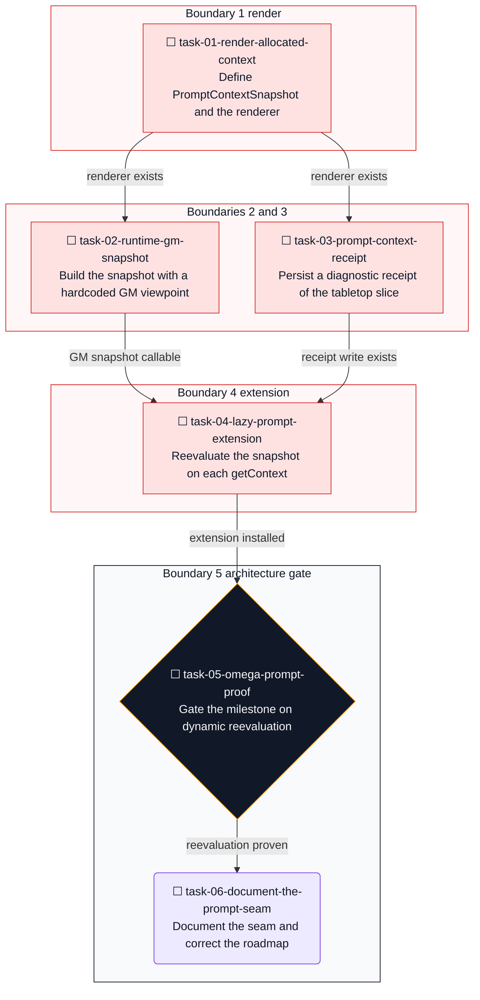
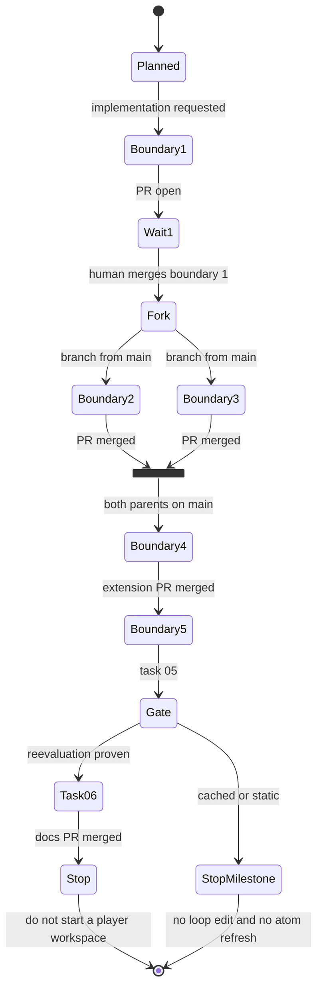
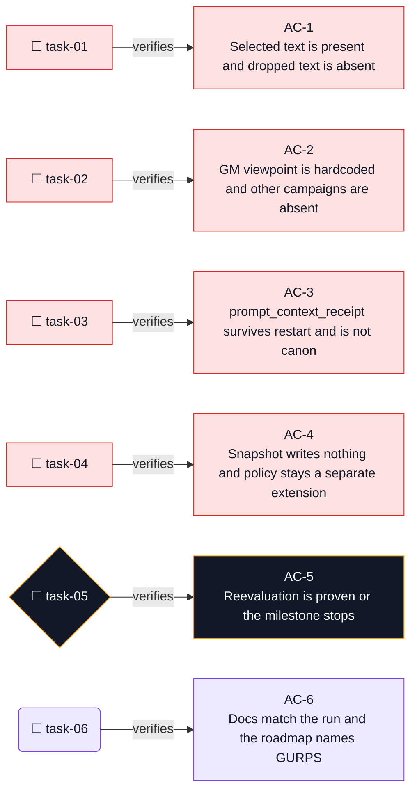

# Live allocated prompt context

**Goal:** Make the model prompt Omega already builds include the tabletop context `build_context` allocates, and record that tabletop slice, without taking over Omega's agent loop.

**Architecture:** Omega keeps `src/loop.metta`. Each iteration already calls `getContext`, which joins every `(prompt-extension ...)` atom, then appends the human message and calls `llmProviderChat`. Today the tabletop plugin registers one extension at load time, the static text of `plugins/tabletop/prompt.md`. This plan adds a second extension whose value is recomputed from SQLite through `build_context` whenever `getPromptExtensions` runs. The renderer reads, allocates, and returns text. It writes nothing. A separate `prompt_context_receipt` records that pre-message snapshot after the text is known. Receipt failure cannot block the text. The runtime supplies the GM viewpoint through `build_context`. The model never passes a viewpoint, a campaign id, or a budget. Provider, model, token, and cost telemetry stay in Omega.

**Tech Stack:** Python 3.11, pytest, SQLite, the existing `tabletop` package, `plugins/tabletop/tabletop.metta`, and the Omega loop in `src/loop.metta` left unchanged. Docker integration is opt-in through `GAMEMASTER_RUN_DOCKER=1`.

## Audit

Recorded 2026-09-22 from `/Users/spenceratgraybox/Work/_Personal/gamemaster` after `git fetch origin` and `git pull --ff-only`.

The session brief named `2e1a79a9a2307470ec73cecd0a6b3b54d23a6f7f` as `main`. That commit is an ancestor. `origin/main` has since fast-forwarded through the rest of the cleanup. This plan uses the newer tip.

```text
Requested baseline: 2e1a79a9a2307470ec73cecd0a6b3b54d23a6f7f
  fix: seal copied plugin and library trees
Actual HEAD and origin/main:
  abb97386fa0b23499d090d976d22f6363a32d83d
Commits after the requested baseline:
  71107ba docs: close the post-first-draft hardening record
  209975a ci: expand tabletop integration triggers
  abb9738 ci: install pytest before the integration contract
Working tree: clean
Branch: main
```

Tests run on that HEAD:

```text
python3.11 -m pytest tests/tabletop -q
  633 passed in 5.33s
python3.11 -m pytest tests/ -q
  698 passed, 3 skipped in 5.52s
```

The three skips are the Docker image test, the Omega startup test, and the Docker opt-in marker test. They were not rerun. The previous phase already recorded a passing image contract, a passing Omega startup, sealed plugin and library copies, a writable campaigns copy, and a green GitHub integration run on this same SHA.

### How a user message becomes a tabletop action

`src/loop.metta` function `omega` is the agent loop. On the first iteration it calls `initPlugins`, which loads `plugins/tabletop/tabletop.metta` `loadOmegaPlugin`. That registers the workspace skill set once and adds the static prompt extension. Every iteration then does this, in order:

1. `(let $prompt (getContext)` builds the prompt, including `(getPromptExtensions)`.
2. `(receive)` reads the channel message into `$msgrcv`.
3. `$send` is `$prompt`, a separator, and the human message.
4. `(log INFO "loop" (CHARS_SENT: ... $send))` logs the exact string sent.
5. `(llmProviderChat $send ...)` calls the provider.
6. The model response is parsed as skill calls. `eval` runs them.
7. Tabletop skills enter `plugins/tabletop/omega_tabletop_adapter.py`, which calls `TabletopRuntime`. `resolve-action` reaches `play_turn` in `tabletop/orchestration/turn.py`.

`play_turn` calls `build_resolution_context` and `resolve_action`. It does not call `build_context`. By the time a skill runs, Omega has already completed the model call that chose the skill.

`getContext` runs before `receive` (see `src/loop.metta` around the `$prompt` binding and the later `$msgrcv` binding). A prompt extension therefore sees campaign state from SQLite. It does not see the human utterance that will be concatenated afterward. Query-dependent retrieval of that utterance stays on the existing `query-rules` and `get-chunk` skills.

### What the plugin can add to a prompt today

`loadOmegaPlugin` reads `plugins/tabletop/prompt.md` through `load_prompt_policy` and registers it with `(add-prompt-extension tabletop-runtime-policy $prompt)`. `add-prompt-extension` in `src/skills.metta` stores a ground atom `(= (prompt-extension $handle) $text)`. `getPromptExtensions` joins those atoms. The workflow plugin shows the update pattern: `remove-prompt-extension` then `add-prompt-extension`. Nothing in the tabletop plugin refreshes an extension after load.

`build_context` in `tabletop/orchestration/context.py` already gathers viewpoint-filtered records, applies campaign-over-setting precedence, allocates a budget, compacts entries that have a refetch tool, and returns `Context.entries` plus `Context.trace`. Call sites are the function itself and `tests/tabletop/`. The adapter does not call it.

`ContextDecision` records `action`, `reason`, and `estimated_tokens`. It does not name the entry. Compacted survivors are in `entries` with refetch text already in `content`. The trace built in `build_context` marks candidates `selected` or `dropped`. It does not have a separate `compacted` action.

### Skill registration and player identity

ADR 0009 is accepted. `add-skill` is process-global. `TABLETOP_WORKSPACE` is `setting` or `campaign`, chosen at startup, and `claim_skill_registration` refuses a second registration. `Workspace` in `tabletop/api/workspace.py` has only those two members. `docs/architecture.md` states the registered surface is GM-only and that a player workspace would have to omit GM operations.

`receive` returns a message string. This audit found no tabletop use of a per-conversation user id, party membership, or session-local skill registry. A `Workspace.PLAYER` would be a separate process under ADR 0009, and it still has no trusted identity source. This plan does not design it.

### Campaign and scene lifecycle

`CampaignStore.create_campaign` and `list_campaigns` exist. No skill creates, lists, archives, or deletes a campaign. `TABLETOP_CAMPAIGN` optionally selects the active campaign directory name at startup. ADR 0010 is `Accepted, not yet implemented`. There is no `archived_at` column.

`EventType.SCENE_OPENED` and `EventType.SCENE_CLOSED` are in `DECLARED_BUT_UNEMITTED` in `tests/tabletop/test_replay_contract.py`. Scene JSON still changes through `action.resolved`. Explicit scene writers are still premature.

Relationship writes and document-import entity inserts are still library paths without a registered skill. This plan does not make them model-facing, so it does not event-source them.

### Retrieval and game systems

`tests/tabletop/test_retrieval_benchmark.py` indexes 200 chunks and asserts lexical and brute-force vector search each finish in under 2 seconds. `docs/retrieval-benchmark.md` says this run does not replace either backend. There is no measurement that justifies a new vector store.

`systems/gurps` advertises `DICE`, `ACTION_RESOLUTION`, `OPPOSED_RESOLUTION`, `DAMAGE`, `HIT_LOCATIONS`, and `RESOURCE_TRACKING`, and resolves `skill_check`, `contest`, `attack`, `active_defense`, hit location, and fatigue. `docs/roadmap.md` milestone 6 still says no GURPS plugin has landed. That sentence is stale.

`systems/dnd5e` still returns `UNSUPPORTED` for `cast_spell`, `class_feature`, `monster_stat_block`, `feat`, and `multiclass`. A third system is not required to answer the prompt gap.

### Security boundaries that stay

Plugin and library copies inside the container are root-owned and not writable by uid 65534. The campaigns copy and the SQLite state volume stay writable. This plan does not change `entrypoint.sh`, Landlock, or compose mount flags. The new receipt writes to the existing state database, which uid 65534 already owns.

`turn_receipts` (`0015_turn_receipts.sql`) has nullable `retrieval_tier`, `provider`, `model`, `tokens_in`, and `tokens_out` columns. `play_turn` inserts NULL for all five. Do not copy those columns onto the new receipt, and do not migrate `turn_receipts` in this plan.

## Inherited invariants

Carry these unless an ADR in `docs/decisions/` changes one in the same boundary that changes the code. This plan does not change any of them.

1. Omega owns cognition, providers, channels, and the agent loop.
2. `tabletop/` does not import Omega or MeTTa.
3. Only `plugins/tabletop/` knows Omega.
4. Game-system plugins own mechanics.
5. Content packs are non-executable data.
6. SQLite is current state. Event logs are history. Mutation and its event commit atomically.
7. Persisted events are versioned. Historical events are immutable. This plan adds no event type and does not bump `event_schema_version`.
8. Retrieval is lookup, never truth.
9. Canon, knowledge, visibility, ownership, and temporal validity stay separate.
10. Setting state and campaign overlay stay separate. Promotion and reveal stay separate. Promotion and provenance detachment stay separate.
11. Model-created facts and rulings begin proposed and unrevealed.
12. Deterministic mechanics are not replaced by the model.
13. Forbidden operations stay absent from the skill surface. This plan adds no skill.
14. The registered workspace stays GM-oriented. A viewpoint argument does not make it a player surface.
15. The core stays system-agnostic.
16. Context compaction keeps a deterministic refetch where the entry already has one.
17. Extraction stays untrusted until deterministic import.
18. Campaign archival stays unimplemented.
19. One workspace per process, ADR 0009.
20. Docker integration stays out of the default fast suite.

## Already implemented

Do not rebuild these. The completed plan is `.agents/plans/2026-09-22_091051-post-first-draft-hardening.done.md`.

Replay for quests, rulings, sessions, setting events, and new campaign facts. Event schema generations and replay fidelity. `get-chunk` and `get-ruling`. Promotion and reveal skills. Owned-setting world-history reads. Explicit viewpoints on read libraries. Setting-over-campaign overlays. The visibility matrix. Context allocation traces. Mechanical turn receipts. The retrieval benchmark. The GURPS plugin. The Docker image contract, Omega startup, integration CI, and sealed plugin and library copies.

## Deliberately deferred

These were inspected and left out. They are not tasks in this file.

- **`Workspace.PLAYER`.** ADR 0009 requires a separate process, and no trusted per-conversation identity is wired from `receive` into tabletop. A viewpoint on the campaign workspace would still expose GM skills.
- **Campaign archival and restore.** ADR 0010 stays accepted and unimplemented.
- **Scene open and close writers.** Still declared and unemitted. Scene JSON still replays through `action.resolved`.
- **Relationship and document-import event sourcing.** No new skill writes those paths.
- **Provider routing metadata, advisory judges, OCR, UI, channel presentation, and disconnect-safe generation.** Omega still owns providers and channels. No new untrusted OCR surface.
- **A new vector backend.** The landed 200-chunk check is under 2 seconds and the benchmark doc says not to replace the backend.
- **More D&D coverage or a third game system.** They do not answer the prompt gap.
- **Editing `src/loop.metta`.** That includes moving `getContext` after `receive` and any other loop change. Task 05 is the architecture gate. If `(collapse (prompt-extension $_))` does not reevaluate the py-call on each `getPromptExtensions` run, stop the milestone. Do not modify `src/loop.metta` without a new ADR and human approval. Do not work around a static extension by periodically calling `remove-prompt-extension` or `add-prompt-extension`. This plan does not pre-authorize that ADR.
- **Changing `turn_receipts`.** The NULL provider columns stay as they landed.
- **Reopening** `.agents/plans/2026-09-22_091051-post-first-draft-hardening.done.md`.

## Chosen milestone

Wire allocated context into the prompt Omega already sends.

That is the coherent gap. Persistence, replay, retrieval, visibility, mechanical resolution, and container startup already exist. The model still receives a static policy file plus Omega's own history and skills. `build_context` is a library with tests and no production caller. Closing that gap does not require a player workspace, archival, or a new game system.

The intended prompt contract is fixed:

1. `getContext` builds a state snapshot through `build_context`.
2. Omega appends the current human utterance on its existing path, after the extensions.
3. Omega calls the provider.

The tabletop extension does not include the current utterance. That timing is the contract, not a defect to close inside this plan.

The milestone is done only when the definition of done at the end of this file is met from evidence. If task 05 finds that the extension is cached or static, the milestone stops there. Task 06 does not run, and `src/loop.metta` stays unchanged.

## Branch and PR rules

Use one branch per review boundary. Each branch starts from merged `main` after the parent boundary's PR is merged.

```bash
git switch main
git pull --ff-only
git status --short
git switch -c <branch>
```

Do not stack branches. Do not start boundary N+1 from the unmerged branch of boundary N.

No tracker ticket is in the request. Use the branch names below. If a ticket id appears before the first commit of a boundary, rename that branch to the ticket id and say which name changed.

The executing agent may create branches, commit, push, and open PRs. Never merge a pull request without explicit human approval in the current conversation. After each boundary's PR is open, stop that boundary and wait.

**Migration numbers are assigned at PR time.** Task 03 adds one migration. Before committing it, list `tabletop/storage/migrations/` and take the next free number. `0015_turn_receipts.sql` is the highest file on this HEAD. If that is still true, the file is `0016_prompt_context_receipts.sql`. Do not reuse a number. The `schema_migrations` checksum check catches a collision.

This plan adds no event payload and no `event_schema_version` change. Prompt receipts are not events. Do not put them in `events` or `setting_events`. Do not give them a foreign key to `events`.

## Review boundaries

| Boundary | Branch | Tasks | Opens when | Closes when |
|---|---|---|---|---|
| 1 Render | `allocated-context-render` | 01 | now, from `abb97386` or later `main` | task 01 |
| 2 GM snapshot | `prompt-gm-snapshot` | 02 | boundary 1 has merged | task 02 |
| 3 Receipt | `prompt-context-receipt` | 03 | boundary 1 has merged. May run in parallel with boundary 2 | task 03 |
| 4 Extension | `prompt-context-extension` | 04 | boundaries 2 and 3 have merged | task 04 |
| 5 Architecture gate | `prompt-context-startup-proof` | 05, then 06 only if 05 proves reevaluation | boundary 4 has merged | task 06, or an explicit stop at task 05 |

Boundaries 2 and 3 touch different files. Do not develop them on one branch. Boundary 4 needs both on `main`.

## Adaptive execution contract

Once implementation is authorized, repeat this loop until the milestone is verified or no in-scope action remains.

1. **Read and reconcile.** Read this plan. Compare the checkpoint with `git status`, `git rev-parse HEAD`, and the files the active task names. Preserve user edits. Start a task only when every dependency is `completed`. Mark it `in_progress`. Treat the approach as revisable. Preserve the goal and the inherited invariants.
2. **Check and record.** After each meaningful check, add a row to the evidence log before the next dependent action. Record the time, task, command, expected result, observation, and outcome (`pass`, `fail`, `inconclusive`, or `not applicable`). An expected failing test is a passed check when it fails for the reason named in the task. Record failures. Do not log every incidental read.
3. **Correct the plan.** When evidence contradicts a task, record the old assumption, the finding, the revised approach, the affected task ids, and the checks to rerun. Update the active instructions, dependencies, diagram, and checkpoint in the same edit. Do not erase the failed approach. Do not weaken an assertion to regain green. A revised plan cannot add a player workspace, archival, a loop edit, a periodic rewrite of prompt-extension atoms, a new skill, or a vector backend.
4. **Act within scope.** Make the smallest change the active task names. Routine test and implementation fixes inside that task do not need a new user request. Stop if the fix would edit `src/loop.metta`, `entrypoint.sh`, mount policy, or an accepted ADR.
5. **Revalidate.** Rerun the checks the correction affects. Reopen invalidated tasks. Keep earlier evidence and mark it superseded. Do not rerun the Docker suite for a pure library change.
6. **Checkpoint.** Save statuses, the diagram, and the checkpoint before stopping or handing off. Leave the exact next command.

If the same command fails twice with no new evidence, change the diagnosis. Do not repeat it unchanged. If task 05 shows the extension is cached or static, leave task 05 and task 06 pending, record the stop, and ask for a decision. Do not edit `src/loop.metta`. Do not refresh context by mutating global prompt-extension atoms.

A task may be `in_progress` or `completed` only when every dependency is `completed`. Keep task ids stable. Update the mermaid marks in the same edit as the YAML statuses.

## Execution checkpoint

| Field | Current state |
|---|---|
| Phase | Planning complete. Implementation not started. |
| Active task | None |
| Baseline | `main` at `abb97386fa0b23499d090d976d22f6363a32d83d`. Requested `2e1a79a` is an ancestor. |
| Last confirmed result | Default suite `698 passed, 3 skipped in 5.52s`. Tabletop suite `633 passed in 5.33s`. Docker suite not rerun. |
| Current approach | Side-effect-free `build_context` snapshot, separate `prompt_context_receipt`, second extension, task 05 architecture gate, no loop edit. |
| Blockers | None known. Implementation waits for an explicit request to start. |
| Next action | After that request, `git switch main`, `git pull --ff-only`, `git switch -c allocated-context-render`, then task 01. |

## Task dependency graph

The flowchart is the dependency authority. Companion charts later in this file do not add tasks or edges.



Authorization boundary. These states are not extra tasks.



## Boundary 1: Render

Branch `allocated-context-render` from merged `main`.

### Task 1: Define PromptContextSnapshot and render bounded prompt text from build_context entries

**Objective:** Land the frozen `PromptContextSnapshot` type and `render_allocated_context(context: Context) -> str`. The renderer includes refetch citations, stays under a fixed token ceiling, and never includes a dropped entry. It does not construct a snapshot.

**Why:** Boundaries 2 and 3 both branch from this boundary. They must share one record shape. `build_context` returns entries and a trace. Nothing serializes that result for a model. The live path must not grow inside `play_turn`, because that function runs after the model call.

**Files:**
- Create: `tabletop/orchestration/prompt_context.py`
- Create: `tests/tabletop/test_prompt_context.py`
- Modify: `tabletop/orchestration/context.py` only if the renderer cannot see compaction from `ContextEntry.compacted` and `content`. Do not change allocation order.

**Dependencies:** none.

**Tests written first:**

```python
def test_render_includes_selected_entries_and_omits_dropped_ones() -> None:
    """Selected content is in the string. A dropped candidate is not.

    A compacted selected entry contributes its compacted content, which
    already names the refetch tool and args. The string has no provider,
    model, or token-telemetry field.
    """
```

Build a `Context` with two selected entries and a trace that also records a dropped candidate whose content is a unique sentinel such as `SECRET-DROPPED-SENTINEL`. Assert the sentinel is absent. Assert each selected `content` value is present. For an entry with `refetch_tool="get-chunk"` and `refetch_args={"chunk_id": "c1"}`, assert both the tool name and `c1` appear. Repeat for `get-ruling`. An entry with `refetch_tool=None` still contributes `content` and does not invent a tool name.

Assert the render is deterministic for the same `Context`. Do not call a model. Do not read SQLite in this task. The function writes nothing.

Add `test_rendered_extension_stays_within_the_wrapper_ceiling`. `build_context` already bounds entry text. The renderer adds a header and any source labels around that allocation. Define `WRAPPER_TOKEN_CAP = 64` next to `render_allocated_context`. `estimate_tokens` is the existing four-byte estimator in `tabletop/orchestration/context.py`. Assert `estimate_tokens(rendered) <= context.budget + WRAPPER_TOKEN_CAP` for a normal context and for a context with one entry per `ContextSource`. Assert the header text itself satisfies `estimate_tokens(header) <= WRAPPER_TOKEN_CAP`. A renderer that appends an unbounded label per entry fails this test. If the header would exceed the cap, use one fixed header line that fits. Do not drop a selected entry and do not add a dropped entry to make the string shorter.

**Step 2:** `python3.11 -m pytest tests/tabletop/test_prompt_context.py -q` fails because the module is missing.

**Step 3:** In `prompt_context.py`, define this frozen type and do not add fields later without editing this task's contract:

```python
@dataclass(frozen=True, slots=True)
class PromptContextSnapshot:
    text: str
    campaign_id: str | None
    workspace: str
    context_budget: int
    considered_count: int
    selected_count: int
    compacted_count: int
    dropped_count: int
    estimated_tokens: int
    source_kinds: tuple[str, ...]
    context_sha256: str
```

`render_allocated_context(context: Context) -> str` walks `context.entries` only. Do not walk the trace to find content. The trace has no entry identity. Put a short header that states the text is allocated tabletop context, that it is a snapshot from before the current human message, and that it is not campaign truth. Keep the static policy file untouched. The header is the only wrapper. Do not add a second visibility pass or a SQL read here.

`context_sha256` is the SHA-256 hex digest of `text`. Task 01 defines the class and tests `render_allocated_context`. It does not construct a `PromptContextSnapshot`. A zero-filled instance would look like a real snapshot. Task 02's `build_prompt_context_snapshot` is the first code that builds a complete one. Task 03's `record_prompt_context_receipt` persists that object and does not declare a second type.

**Invariants:** Retrieval text in the string is still lookup. Dropped entries stay dropped. Compaction text stays the refetch label `build_context` already produced. No skill is registered.

**Implementation constraints:** Do not import Omega or MeTTa. Do not call `build_context` from `play_turn`. Do not add a viewpoint parameter to the renderer. The renderer does not decide visibility. Its caller does. Do not add a helper that returns a `PromptContextSnapshot` with placeholder counts.

**Verification:**

```bash
python3.11 -m pytest tests/tabletop/test_prompt_context.py tests/tabletop/test_context_trace.py tests/tabletop/test_context_budget.py -q
```

Expected: PASS.

**Commit:** `feat: define the prompt snapshot contract and renderer`.

**PR:** this commit closes boundary 1. Open the PR and stop for human merge approval.

## Boundary 2: GM snapshot

Branch `prompt-gm-snapshot` from merged `main` after boundary 1.

### Task 2: Build that prompt from the active runtime with a hardcoded GM viewpoint and no model arguments

**Objective:** `build_prompt_context_snapshot` returns a complete `PromptContextSnapshot` for the active workspace, always with the GM viewpoint, writes nothing, and refuses to accept a caller-supplied viewpoint. It is the first constructor of that type.

**Why:** `build_context` requires a `Viewpoint`, and `ContextRequest` raises `TypeError` if the viewpoint is omitted. The production caller must be the runtime, not the model. The campaign workspace also raises if `campaign_id` is missing, so an empty `TABLETOP_CAMPAIGN` needs an explicit fallback instead of a thrown exception inside Omega's prompt path.

**Files:**
- Modify: `tabletop/orchestration/prompt_context.py`
- Modify: `tabletop/runtime.py` only to expose a method that delegates to that module, or keep the function in `prompt_context.py` and pass the runtime's connection, workspace, and campaign id in. Prefer the pure module plus a thin runtime method so tests need not boot the adapter.
- Create or extend: `tests/tabletop/test_prompt_context.py`
- Do not expect `tests/tabletop/test_library_viewpoints.py` to notice the new function. `test_gm_viewpoint_is_constructed_in_one_function` only forbids `parse_scope("GM")` inside `tabletop/runtime.py` and checks that `gm_viewpoint` is defined once. Call `gm_viewpoint()` from `prompt_context.py`. Keep `parse_scope("GM")` out of `runtime.py`. Put the signature assertion in `tests/tabletop/test_prompt_context.py`.

**Dependencies:** task 01.

**Tests written first:**

- Campaign workspace, active campaign, one GM-visible fact and one fact in another campaign. The snapshot contains the active fact and not the other campaign's sentinel.
- The same database, built through `build_context` with `gm_viewpoint()`, matches the snapshot's included fact text. The snapshot function does not take a viewpoint argument. A test inspects the signature and fails if `viewpoint`, `scope`, or `character` is a parameter.
- A character viewpoint passed only inside a direct `build_context` call, in the same test module, omits an `unrevealed` fact and a `GM`-scoped fact that the GM snapshot includes. This proves the renderer did not bypass `build_context`.
- Campaign workspace with no active campaign returns a fixed sentence that no campaign is selected, does not query every campaign, and does not raise.
- Setting workspace returns setting sources only and does not require a campaign id.
- A secret whose visibility `build_context` would drop for the GM viewpoint is absent. Do not hide GM-visible proposed or unrevealed facts from the GM snapshot. The visibility matrix already allows the GM to see them. Hiding them here would change the GM workspace.
- The snapshot function performs no insert, update, or delete. A test counts rows in `events`, `setting_events`, and `prompt_context_receipts` before and after the call. If the receipt table does not exist yet on this branch, count `events` and `setting_events` only. The counts do not change.
- `prompt_context.py` contains no SQL string. Facts, entities, and relationships enter through `build_context` and the read APIs that function already uses. A second query path fails review.

**Step 2:** Expected FAIL, function missing.

**Step 3:** Implement `build_prompt_context_snapshot(...) -> PromptContextSnapshot`. Call `build_context` with `gm_viewpoint()` from `tabletop.api.visibility`, then `render_allocated_context` for `text`. Use the active campaign id from the runtime. Use a fixed budget constant documented next to the call. Do not add, rename, or retype fields. Compacted count is the number of returned entries with `compacted=True`. Selected count is the number of returned entries with `compacted=False`. Dropped count is the number of candidates that are not returned. Considered count is the sum of those three. `source_kinds` is the `ContextSource` values on returned entries, as strings, in a stable order. `context_sha256` is the digest of `text`. `context_budget` is the budget passed into `build_context`. This function writes nothing. No earlier task constructs this object.

Empty active campaign: return the fixed sentence inside that same snapshot shape, with zero counts. Do not catch `ContextRequest`'s missing-campaign error and then scan all campaigns. Do not include a human utterance field. There is no utterance at this layer.

**Invariants:** Viewpoint is runtime authority. The GM workspace keeps GM visibility, including proposed and unrevealed rows the GM may already read. Another campaign's rows stay out. No new skill. `tabletop/` still does not import Omega. The snapshot is not a second visibility implementation.

**Implementation constraints:** Do not add `TABLETOP_VIEWPOINT`. Do not add `Workspace.PLAYER`. Do not read the human message. Do not write the receipt here. Do not call the model or a provider. Do not open a raw SQL cursor for facts, entities, relationships, rulings, or chunks.

**Verification:**

```bash
python3.11 -m pytest tests/tabletop/test_prompt_context.py tests/tabletop/test_library_viewpoints.py tests/tabletop/test_visibility_matrix.py -q
```

Expected: PASS.

**Commit:** `feat: build the GM prompt snapshot from the active campaign`.

**PR:** this commit closes boundary 2. Open the PR and stop.

## Boundary 3: Receipt

Branch `prompt-context-receipt` from merged `main` after boundary 1. It may proceed in parallel with boundary 2. It must not edit the GM snapshot branch, and the snapshot branch must not edit this migration.

### Task 3: Persist a prompt_context_receipt for the pre-message snapshot, deduped, outside canon

**Objective:** Saving a snapshot writes one `prompt_context_receipt` when its digest changes, the row survives a reopen of the same database, and a failed insert does not raise.

**Why:** The mechanical `turn_receipts` row describes `play_turn`. It is not this snapshot. `getContext` runs before `receive`, so this row cannot claim to be the full prompt, the user utterance, or a turn. Name the table `prompt_context_receipts` and the writer `record_prompt_context_receipt`. Do not name it a turn prompt receipt.

**Files:**
- Create: the next free migration, expected `tabletop/storage/migrations/0016_prompt_context_receipts.sql` if `0015` is still highest
- Create: `tabletop/orchestration/prompt_receipt.py`
- Create: `tests/tabletop/test_prompt_receipt.py`

**Dependencies:** task 01, which owns `PromptContextSnapshot`. The writer accepts that type. It does not need task 02's runtime wrapper. That keeps this branch free of `runtime.py` edits. Do not declare a parallel dataclass with the same fields.

**Tests written first:**

- The migration creates `prompt_context_receipts` with `receipt_id`, `created_at`, `campaign_id` nullable, `workspace`, `context_budget`, `considered_count`, `selected_count`, `compacted_count`, `dropped_count`, `estimated_tokens`, `source_kinds`, and `context_sha256`.
- The table has no column for the user utterance, provider, model, actual prompt token count, response tokens, cost, `retrieval_tier`, or the rendered text. A hash identifies the text. The text itself stays in the prompt, not in this table.
- `source_kinds` is a deterministic JSON array.
- The table is not read by `project_campaign`. Inserting a receipt appends no `events` row and no `setting_events` row. Deleting a receipt is allowed. Deleting an event is still not.
- Dedup identity is `workspace` + `campaign_id` + the latest `context_sha256`. Two saves of the same workspace, campaign id, and digest write one row. A changed digest writes a second row. The same digest under a different workspace writes a second row. The same digest under a different campaign id writes a second row.
- A setting snapshot with `campaign_id is None` does not dedup against a campaign snapshot that also has `campaign_id is None`. SQL `campaign_id = NULL` matches nothing, so the lookup must not be written that way. Use `campaign_id IS NULL` when the bound value is None, or one predicate of the form `campaign_id = ? OR (campaign_id IS NULL AND ? IS NULL)` together with `workspace = ?`. A test with a NULL campaign id must observe the existing NULL row, not insert a duplicate.
- Close the connection, open the same database file, run `migrate`, and read the row back. Restart keeps the receipt. Replay of campaign events still does not produce it.
- An insert that raises is caught. `record_prompt_context_receipt` returns a failure flag and does not raise. The test observes that flag or a logged warning. A silent swallow with no signal fails the test. The caller that holds the rendered text still has that text.

**Step 2:** Expected FAIL, table missing.

**Step 3:** Dedup reads the latest row for that workspace and campaign id. NULL campaign ids are a group only inside one workspace. The lookup uses `IS NULL` for a null campaign id. The insert is its own transaction. It is not joined to a campaign mutation. There is no campaign mutation on this path. `record_prompt_context_receipt` takes a `PromptContextSnapshot`.

**Invariants:** The receipt is diagnostic. It is not canon, not an event, and not a retrieval document. It does not describe the current human message. Event immutability stays intact. Provider routing stays in Omega. A diagnostic failure cannot block prompt construction.

**Implementation constraints:** Do not alter `0015_turn_receipts.sql` or `_write_turn_receipt`. Do not add a foreign key to `events`. Do not register a skill. Do not store `CHARS_SENT` or the rendered context body. Do not call this function from `render_allocated_context`.

**Verification:**

```bash
python3.11 -m pytest tests/tabletop/test_prompt_receipt.py tests/tabletop/test_turn_receipt.py tests/tabletop/test_replay_contract.py -q
python3.11 -m pytest tests/tabletop -q
```

Expected: PASS.

**Commit:** `feat: store a prompt context receipt outside campaign canon`.

**PR:** this commit closes boundary 3. Open the PR and stop.

## Boundary 4: Extension

Branch `prompt-context-extension` from merged `main` after boundaries 2 and 3 have merged.

### Task 4: Register a prompt extension that reevaluates the snapshot on each Omega getContext

**Objective:** `loadOmegaPlugin` keeps the static policy extension and adds a second extension whose py-call returns the side-effect-free snapshot. A separate call records the receipt after that text exists.

**Why:** `add-prompt-extension` stores a ground string. Using it for the snapshot at plugin load would freeze campaign state. `getPromptExtensions` is `(join (newline) (collapse (prompt-extension $_)))`. A MeTTa rule whose right-hand side is a `py-call` is the extension point that can run again on each `getContext` without editing `src/loop.metta`. The required content order on the string Omega sends is the policy extension, then the allocated-context extension, then the Omega separator `:-:-:-:`, then the current human message. The separator sits between the extensions and the human message. It is not part of either extension.

**Files:**
- Modify: `plugins/tabletop/tabletop.metta`
- Modify: `plugins/tabletop/omega_tabletop_adapter.py`
- Modify: `tests/tabletop/test_prompt_extension.py`
- Modify: `tests/tabletop/test_phase5_adapter.py` if it asserts the exact extension list

**Dependencies:** tasks 02 and 03.

**Tests written first:**

- `tabletop.metta` still contains `(add-prompt-extension tabletop-runtime-policy $prompt)` and still loads `prompt.md` for that handle.
- It also defines `(prompt-extension tabletop-allocated-context)` as a `py-call` of the side-effect-free snapshot function. That function's name is not `record_prompt_context_receipt`.
- The MeTTa rule calls the receipt writer only after the snapshot text is bound, and the value of the extension expression is that text. A unit test forces the receipt writer to raise inside its own try, or to return the failure flag, and asserts the text is unchanged.
- Calling the snapshot function inserts no receipt row. Calling the receipt writer afterward inserts one. A second pair of calls with the same snapshot does not insert another row.
- Neither py-call takes arguments from MeTTa.
- A unit test of the two extension strings asserts the policy phrase `Tabletop Runtime is authoritative` is the policy extension, the snapshot header is the allocated-context extension, and neither string contains a stand-in for the human message. The container order check belongs to task 05, because `collapse` order is not something this unit test can see.
- `prompt.md` is unchanged. Its character budget test still passes.
- `tabletop/` still has no Omega import.

**Step 2:** Expected FAIL, the py-call rule is absent.

**Step 3:** Register the policy atom first and the dynamic rule second. Do not remove the policy extension. Do not call `add-skill`. If the runtime cannot start, the snapshot function returns a short fixed error sentence and writes nothing. Log the exception type. Do not put a traceback in the prompt text. The receipt writer swallows its own failures.

**Stop condition:** Do not treat a load-time `add-prompt-extension` of the snapshot string as success. Do not add a loop, timer, or skill that calls `remove-prompt-extension` or `add-prompt-extension` to refresh context. If a local evaluation already shows the py-call rule is inert, record that and leave the Omega proof to task 05. Do not edit `src/loop.metta` in this task.

**Invariants:** One workspace per process. Skills stay as they are. Policy text stays first in the tabletop contribution when order can be asserted. The dynamic text is the GM snapshot from `build_context`. No viewpoint crosses the MeTTa boundary. The renderer writes nothing.

**Implementation constraints:** Do not modify `src/loop.metta`, `src/skills.metta`, or `src/plugin.metta`. Do not fold the receipt insert into `render_allocated_context` or the snapshot function.

**Verification:**

```bash
python3.11 -m pytest tests/tabletop/test_prompt_extension.py tests/tabletop/test_prompt_context.py tests/tabletop/test_prompt_receipt.py tests/tabletop/test_phase5_adapter.py -q
python3.11 -m pytest tests/ -q
```

Expected: PASS. The three Docker tests stay skipped.

**Commit:** `feat: reevaluate allocated context on each Omega prompt`.

**PR:** this commit closes boundary 4. Open the PR and stop.

## Boundary 5: Architecture gate

Branch `prompt-context-startup-proof` from merged `main` after boundary 4.

### Task 5: Gate the milestone on proving the extension reevaluates, and stop if it is static

**Objective:** Decide, from the running Omega process, whether `(collapse (prompt-extension $_))` reevaluates the allocated-context py-call on each `getPromptExtensions` run.

**Why:** The rest of the milestone depends on that behavior. A unit test cannot see `collapse`. `CHARS_SENT` is the string `llmProviderChat` receives. This task is an architecture gate, not a polish pass.

**Files:**
- Create: `tests/integration/test_omega_prompt_context.py`
- Modify production code only when the failure is a wrong sentinel or a wrong order that a plugin-local rule can fix without the forbidden workarounds below. Do not weaken the assertion.

**Dependencies:** task 04.

**Gate:**

- If a later `CHARS_SENT` payload contains a fact that was written after plugin load, dynamic reevaluation is proven. Mark this task complete and continue to task 06.
- If the extension text is cached or static, stop the milestone. Leave this task and task 06 pending. Record the log window in the evidence log.
- Do not modify `src/loop.metta` unless a new ADR exists and a human has approved that ADR in the current conversation. This plan does not contain that ADR.
- Do not work around a static result by periodically calling `remove-prompt-extension` or `add-prompt-extension`, or by storing the latest context in a process-global atom that the loop rewrites.

**Tests written first:** Mark `docker` and `omega`. Skip unless `GAMEMASTER_RUN_DOCKER=1`. Reuse `docker-compose.integration.yml`, the Test provider, and the `test` channel. Set `TABLETOP_WORKSPACE=campaign` and `TABLETOP_CAMPAIGN` to a campaign that exists in the test database.

Before `compose up`, seed the state database through the normal tabletop write path, not a hand-rolled visibility bypass:

- campaign A, the active campaign, fact text `VISIBLE-ACTIVE-FACT`
- campaign B, fact text `OTHER-CAMPAIGN-SENTINEL`

Start compose. Wait until logs contain `tabletop-plugin`, `tabletop-prompt-extension`, and `CHARS_SENT`. Capture one complete `CHARS_SENT` log payload. The prompt may contain newlines, so do not require the markers to share one physical output line. Inside that payload, assert these indexes increase:

1. `Tabletop Runtime is authoritative`
2. the allocated-context header from task 01
3. `VISIBLE-ACTIVE-FACT`
4. the separator `:-:-:-:` that `src/loop.metta` places before the human message

Assert `OTHER-CAMPAIGN-SENTINEL` appears in no `CHARS_SENT` payload. A mention in test setup output does not fail the test. Assert the allocated-context text does not include a copy of the human message. Assert `Traceback` does not appear before `tabletop-prompt-extension`.

Then run a short Python command inside the already-running container as uid 65534. Connect to the same `TABLETOP_DATABASE_PATH` the Omega process is using. Call `tabletop.documents.importer.import_extraction` with one proposed campaign fact for campaign A whose value text is `VISIBLE-AFTER-START` and whose visibility `build_context` already shows to `gm_viewpoint()`. That function inserts the fact and appends `fact.proposed`. Do not call `CampaignStore.add_fact`, which writes the row without that event. Do not issue a raw `INSERT`. Do not import `plugins.tabletop.omega_tabletop_adapter`, do not call `claim_skill_registration`, do not load a second Omega plugin, and do not call a model. This second process is only an authoritative state writer.

`import_extraction` is the public campaign-fact creation path on this tree. If a later `main` no longer exposes it, discover the narrowest remaining authoritative writer before writing the test, and record that name in the evidence log. Do not add a skill to make the write convenient.

Poll until a later `CHARS_SENT` payload contains `VISIBLE-AFTER-START` and, inside that same payload, still orders the policy extension, the allocated-context extension, the `:-:-:-:` separator, and only then the human message. Bound the wait at 90 seconds. One retry of that bound is allowed. A second miss means the extension is static. Stop as the gate requires. Record the observed window. Do not lengthen the bound to hide a stale extension.

Also assert, as uid 65534, that a representative plugin file is still not writable and the campaigns tree or state database is writable.

`docker compose stop` exits 0.

**Step 2:** Without the env var, the test skips. With the env var, expected FAIL until the extension is live. A skip is not a pass.

**Step 3:** On a proven reevaluation, stop this task's code changes. On a static result, do not implement a fallback. On a leak or an order failure that is still inside the plugin rule, fix that rule and rerun once. If the remaining fix is a loop edit or an atom refresh, stop.

**Invariants:** Startup evidence comes from the container. The default suite does not boot Docker. The seal stays. The Test provider stays. No personal API key. The human message stays on Omega's append path.

**Implementation constraints:** Do not mount the Docker socket. Do not print the full `CHARS_SENT` body in assertion failures. Print a short window around the markers. The integration workflow already runs on `plugins/tabletop/**`, `tabletop/**`, and `tests/integration/**`. Do not edit `.github/workflows/integration.yml` unless a new path is outside those globs.

**Verification:**

```bash
GAMEMASTER_RUN_DOCKER=1 python3.11 -m pytest tests/integration/test_omega_prompt_context.py tests/integration/test_omega_startup.py -q
python3.11 -m pytest tests/ -q
```

Expected: both Docker tests passed when the daemon is available. The default suite still skips them. Record the pass line and the duration in the evidence log. Do not describe a skip as a pass.

**Commit:** `test: require Omega CHARS_SENT to carry allocated context`.

**PR:** does not close the boundary. Task 06 does.

### Task 6: Document the prompt seam and correct the stale roadmap claims this audit found

**Objective:** The architecture docs describe the prompt extension that task 05 observed, and the roadmap stops saying the GURPS plugin is absent.

**Why:** `docs/roadmap.md` milestone 4 says the play loop builds context. It does, in the library, and the model did not see it before this plan. Milestone 6 says no GURPS plugin has landed. `systems/gurps` is on `main`. Leaving either sentence in place makes the next audit false.

**Files:**
- Modify: `docs/architecture.md`
- Modify: `docs/plugin-api.md` if it describes the prompt extension or the GM-only surface
- Modify: `docs/roadmap.md` milestone 4 and milestone 6. Milestone 4 must say the play loop's allocated context enters Omega as a second prompt extension, recomputed at `getContext`, with the human message still appended by Omega afterward. Milestone 6 must say the GURPS plugin has landed. The sentence `No GURPS plugin has landed` is already false on this baseline and has to disappear in this task.
- Create: `docs/prompt-context.md` as the verification note for this milestone
- Do not modify `.agents/plans/2026-09-22_091051-post-first-draft-hardening.done.md`
- Do not rewrite `docs/second-draft-verification.md` historical timings. Add a pointer at the top to `docs/prompt-context.md` if that file is the place a reader would stop.

**Dependencies:** task 05, and only after the evidence log says reevaluation was proven. If task 05 stopped the milestone, do not write this document as if the extension were live. Record the stale GURPS roadmap sentence in the checkpoint as a separate doc defect. Do not mix that one-line correction into a prompt-success claim.

**When the gate passed:** write the container result from the evidence log.

**Tests written first:** No new behavior test. The checks are textual.

**Content the verification note must mark MET or NOT MET from a command:**

- `build_context` has a production caller, and that caller is the tabletop prompt extension.
- Dynamic context is recomputed for every Omega context build. Evidence: task 05.
- Policy text, allocated context, and `:-:-:-:` occur in that order inside one `CHARS_SENT` payload. The assertion does not require one physical log line.
- The current human text stays on Omega's append path and is absent from the extension body.
- The renderer calls `build_context` and writes nothing. No provider call runs inside it.
- The receipt is a `prompt_context_receipt`, survives a database reopen, and is absent from event replay.
- Receipt failure does not block the returned text.
- Another campaign's fact is absent from `CHARS_SENT`.
- `src/loop.metta` has no diff in this plan's commits.
- No new skill was added.
- Plugin and library copies stay sealed.
- Campaign archival remains NOT MET.
- `docs/roadmap.md` describes the landed GURPS plugin and this prompt contract.
- Default suite count, recorded from the command, not copied from 698 if it changed.

**Implementation constraints:** Do not mark the Docker item MET from a unit test. Do not change ADR 0009, 0010, or 0011.

**Verification:**

```bash
python3.11 -m pytest tests/tabletop -q
python3.11 -m pytest tests/ -q
rg -n "No GURPS plugin has landed" docs/roadmap.md
```

Expected: both pytest commands pass. The `rg` prints nothing.

**Commit:** `docs: record the allocated prompt context seam`.

**PR:** this commit closes boundary 5 and the plan's implementation sequence. Open the PR and stop. Do not start archival, a player workspace, or a loop edit.

## Definition of done

The plan is done only when `docs/prompt-context.md` exists and each line below is marked from evidence. If task 05 stops the milestone, this list is not met, and that stop is the result.

- `build_context` has a production caller.
- That caller is the tabletop prompt extension.
- Dynamic context is recomputed for every Omega context build.
- Static policy and dynamic context order is deterministic on the sent string: policy extension, allocated-context extension, Omega separator `:-:-:-:`, current human message.
- The current human text remains on Omega's append path.
- The renderer uses `build_context` and the existing visibility and overlay rules. It has no raw-SQL fast path.
- No model or provider call occurs inside the renderer.
- The renderer writes nothing.
- The receipt is a `prompt_context_receipt`: diagnostic, non-authoritative, restart-persistent, and outside event replay.
- The receipt does not claim to contain the user utterance, provider identity, model identity, actual prompt tokens, response tokens, or cost.
- Receipt failure cannot block inference.
- Container startup proves the dynamic context changes when authoritative state changes between two `getContext` evaluations.
- The rendered extension stays within `context.budget + WRAPPER_TOKEN_CAP`.
- No `src/loop.metta` change was required.
- If `src/loop.metta` must change, the milestone has stopped for an ADR and human review, and this list is not met.
- The full suite and the Omega integration test pass.
- The roadmap states that GURPS has landed and describes this live prompt contract.

## Security and visibility

This milestone adds no skill and no model-controlled argument. The snapshot reaches facts only through `build_context`. A GM-scoped workspace is not permission to add a raw SQL read of secrets. The disclosure tests are the other-campaign sentinel, the character-viewpoint library test, and the container log. The GM snapshot includes rows `build_context` already shows a GM, including proposed and unrevealed facts. That is the current GM workspace, not a new leak.

OCR, a UI, and filesystem paths are out of scope. The receipt stores counts and a hash, not the rendered fact text.

Docker and Landlock stay as they are. Task 05 rechecks the seal so a prompt-path change cannot quietly `chown` the plugin tree.

## Risks

- `(collapse (prompt-extension $_))` may not evaluate a `py-call` rule, or may evaluate it once. Task 05 is the architecture gate. A static result stops the milestone. It does not become a loop patch or a periodic `add-prompt-extension` refresh.
- `collapse` may also join the two extension atoms in an unstable order. The `CHARS_SENT` order assertion is part of the same gate. An order failure is not fixed by rewriting atoms each iteration.
- `getContext` runs on idle iterations. Receipt dedup exists so those iterations do not fill the table. If the digest check itself becomes a write, the dedup test has failed.
- Prompt construction now reads SQLite on the model path. A locked database must not kill the loop. The adapter's fixed error sentence is the failure mode.
- `CHARS_SENT` includes the full Omega prompt. Assertion failures must not dump secrets from `.env`. The test database uses sentinels only.
- The integration job clones PeTTa and can take longer on a cold runner than the local startup test. The local bound is 90 seconds for the log wait. If CI is slower, record the time and raise that bound once. Do not raise it to hide a stale extension.
- Boundaries 2 and 3 can merge in either order. Boundary 4 rebases onto both. Do not stack them.

## Assumptions

- Implementation starts from current `origin/main`, which is `abb97386fa0b23499d090d976d22f6363a32d83d` at planning time. If `main` moves before boundary 1 opens, start from the new `main` and record the SHA in the evidence log.
- No tracker ticket exists. Branch names in the review-boundary table are the names to use.
- Docker is available when boundary 5 runs. Boundary 1 through 4 do not need it.
- The GM workspace is the live prompt viewpoint for this entire plan.
- The human utterance remains Omega's responsibility to append. The extension is a state snapshot at `getContext` time. This plan does not put the current utterance into the tabletop extension.
- `0015_turn_receipts.sql` stays the latest migration until task 03 lists the directory again.

## Evidence and decisions log

| When | Task / environment | Expected vs observed | Outcome / evidence | Correction or next action |
|---|---|---|---|---|
| 2026-09-22 planning | git, repo root | Requested `2e1a79a` is `main` | `HEAD` and `origin/main` are `abb97386`. `2e1a79a` is an ancestor. Three later commits are the docs closeout, integration path filters, and pytest install. Working tree clean. | Plan against `abb97386`. |
| 2026-09-22 planning | `python3.11 -m pytest tests/tabletop -q` | Record the count, do not force 633 | `633 passed in 5.33s` | Use as the pre-implementation baseline. |
| 2026-09-22 planning | `python3.11 -m pytest tests/ -q` | Record the count, do not force 698 | `698 passed, 3 skipped in 5.52s` | Docker tests not rerun. |
| 2026-09-22 planning | `src/loop.metta`, `plugins/tabletop/tabletop.metta`, `tabletop/orchestration/context.py` | Find whether `build_context` is on the model path | `getContext` joins prompt extensions before `receive`. Tabletop registers only `prompt.md` at load. `build_context` has no production caller. `play_turn` calls `build_resolution_context` only. | Milestone is the lazy extension. Do not call `build_context` from `play_turn`. |

Decision: player workspace, archival, scene writers, retrieval replacement, and an Omega loop edit stay deferred. Evidence is ADR 0009, ADR 0010, `DECLARED_BUT_UNEMITTED`, `docs/retrieval-benchmark.md`, and the `getContext` order above. Affected tasks: none of those ideas are tasks. Checks to rerun: none until implementation starts.

Decision, 2026-09-22 plan review: task 05 is an architecture gate. The snapshot function writes nothing. `record_prompt_context_receipt` runs only after the text exists and cannot block that text. The receipt identifies the pre-message snapshot by counts and `context_sha256`, not by utterance or provider telemetry. The renderer has `WRAPPER_TOKEN_CAP`. The sent string orders the policy extension, the allocated-context extension, the Omega separator `:-:-:-:`, and then the current human message. A static `collapse` result stops the milestone. Periodic prompt-extension atom rewrites are forbidden. Affected tasks: 01, 02, 03, 04, 05, 06, and the definition of done. Branch names and the dependency graph stay. Checks to rerun: none until implementation starts.

Decision, 2026-09-22 plan review: `PromptContextSnapshot` is defined in task 01 so boundaries 2 and 3 do not invent two shapes. Receipt dedup is `workspace` + `campaign_id` + latest `context_sha256`, with `IS NULL` for a null campaign id. The post-start write in task 05 calls `import_extraction` in a second process and does not touch the Omega skill registry. Affected tasks: 01, 02, 03, 05. Checks to rerun: none until implementation starts.

Decision, 2026-09-22 plan review: task 01 does not construct a snapshot. `build_prompt_context_snapshot` in task 02 is the first constructor. Task 05 asserts marker order inside one `CHARS_SENT` payload, not on one physical line, and looks for the other-campaign sentinel only in those payloads. Affected tasks: 01, 02, 05. Checks to rerun: none until implementation starts.

## Acceptance trace

These edges are not task dependencies.


