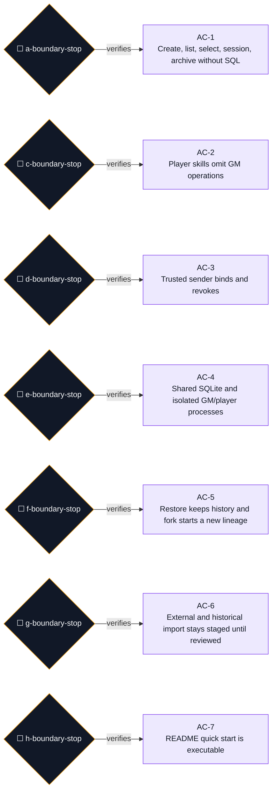
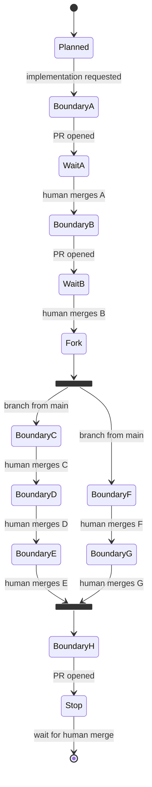

# User-ready campaign lifecycle

## Executor binding

This file is the execution record. Before any code change, and again before stopping, update three places in this file:

1. The active task `status` in the frontmatter. Allowed values are `pending`, `in_progress`, `waiting_for_human_merge`, and `completed`.
2. The Execution checkpoint table.
3. A new row in the Evidence and decisions log for every check.

A session todo list does not replace those three writes.

If a message says not to edit this file, stop before writing code and ask which of these writes to keep. Do not implement against a frozen checkpoint. Do not rewrite the goal, security gates, or task definitions under that message. The "Correct the plan" step is the only path that changes a decision, and it still writes the evidence row first.

Execute one eligible task at a time. A task is eligible only when every dependency is `completed`. `waiting_for_human_merge` is not `completed`. Do not hand the remaining graph to one worker with instructions to finish every task. At each `*-boundary-stop`, open the pull request, set that task to `waiting_for_human_merge`, write the checkpoint, and stop. The next boundary stays ineligible until a human merge is confirmed on `main`.

**Goal:** A person can install Gamemaster, install or develop a game-system plugin, create or import a campaign, configure participants, launch one GM process and isolated player processes (one player process per participant), play through a supported Omega channel, stop, and resume the same campaign without SQL or knowledge of the internal schema.

**Architecture:** Keep Omega as the agent loop and channel host. Keep SQLite as the campaign authority and the append-only event log as history. Add an operator CLI in front of the existing tabletop library. Add `Workspace.PLAYER` as a third process-scoped skill surface under ADR 0009. Bind play to a trusted channel principal. Export and import a versioned native package by copying authoritative rows and immutable events. Import older notes as proposals through the existing extraction boundary. Do not rebuild prompt allocation, retrieval, plugins, or the Omega provider layer.

**Tech Stack:** Python 3.11, SQLite WAL, existing `tabletop` library, Omega channels, Docker Compose, pytest. The CLI uses the standard library `argparse`. No Click, Typer, or web frontend.

---

## Baseline

Recorded 2026-09-22 after `git fetch origin`, `git switch main`, and `git pull --ff-only`.

| Item | Value |
|---|---|
| Branch | `main`, clean working tree, up to date with `origin/main` |
| HEAD | `501944d05b0611e9965628c35340db48a7ac0535` |
| Known commit | That SHA is the current tip, not only an ancestor |
| Tip subject | `Merge pull request #10 from spencerthayer/allocated-context-render` |
| `python3.11 -m pytest tests/tabletop -q` | `643 passed in 7.43s` |
| `python3.11 -m pytest tests/ -q` | `709 passed, 4 skipped in 5.76s` |
| Prior plans | `.agents/plans/2026-09-22_091051-post-first-draft-hardening.done.md`, `.agents/plans/2026-09-22_140213-live-prompt-context.done.md` |
| Latest migration | `tabletop/storage/migrations/0016_prompt_context_receipts.sql` |

Do not copy older suite counts into execution notes. Re-run the suite at each boundary and record the new count.

## Audit

These answers were checked against the tree at the baseline SHA. If a later `main` disagrees, record the conflict and revise the affected tasks before coding.

1. Campaign creation is `CampaignStore.create_campaign` in `tabletop/campaign/store.py`. `TabletopRuntime` has no create method. No Omega skill creates a campaign. Callers pass the id.
2. Plugin selection is the required `system_id` argument on that insert. `campaigns.system_id` in `0001_core.sql` is the association. There is no later update API.
3. `campaigns.setting_id` optionally references `settings`. Setting rows are inserted today inside `TabletopRuntime.edit_setting`.
4. Omega does not pass a sender identity into skills. `src/loop.metta` receives a string from `receive` and appends `HUMAN-MSG:`. Telegram authenticates `user.id` and then enqueues `"{display_name}: {text}"`, dropping the id (`channels/telegram.py`). Slack, Mattermost, and IRC filter on a platform user id and also return text. WebSocket authenticates a bearer token, not a per-message user.
5. One process cannot expose different skill sets to different users. `add-skill` is process-global. `claim_skill_registration` is one-shot.
6. ADR 0009 requires one workspace per process. It names `setting` and `campaign` only. A player surface needs its own process and an ADR that adds the token. It does not require one process per human.
7. Multiple processes may open the same SQLite file. `connect` sets `journal_mode=WAL` and `busy_timeout=5000`, and `transaction` uses `BEGIN IMMEDIATE`. The prompt-context integration test already writes from a second process. There is no multi-writer concurrency test, and `migrate` has no cross-process lock beyond that transaction.
8. WAL and the 5000 ms busy timeout are already enabled in `tabletop/storage/sqlite.py`.
9. Participant membership does not exist. `sessions.participants` is an opaque JSON column that `start_session` always writes as `[]`.
10. Character ownership does not exist. `Viewpoint` can name a character scope, and `can_see` honors it, but nothing persists who controls which entity.
11. `Workspace.PLAYER` does not exist. The registered campaign and setting skills are GM-oriented. These names must be absent from the player surface: `read-campaign-secret`, `mutate-quest`, `record-ruling`, `promote-ruling`, `promote-fact`, `promote-world-fact`, `reveal-fact`, `reveal-world-fact`, `end-session`, `start-session`, `edit-setting`, `upsert-world-entity`, `record-world-history`. Also omit `current-scene` (it returns `_unavailable`), `get-party-state`, and `get-open-threads` (they expose unfiltered `system_state`).
12. Player skills to register: `query-campaign`, `query-rules`, `query-setting`, `query-world-history`, `get-chunk`, `get-world-entity`, `get-entity`, `get-fact`, `get-relationships`, `get-ruling`, `resolve-action`, `roll`, `current-campaign`, `read-session`.
13. `resolve-action` already reaches deterministic plugin resolution. It accepts any `actor` id. The player workspace must reject an actor the sender does not control. The GM campaign workspace stays unrestricted.
14. The authoritative export boundary is the SQLite rows for one campaign plus its immutable `events` and `setting_events` for the owned setting, not the YAML projections.
15. `write_projection` writes generated YAML under a campaign directory. It is a view. Scene open and close events are no-ops there. Generation-0 fact payloads are partial. Do not use projections as the package.
16. Replay reports whether reconstruction is complete. It is not the import mechanism. Native import copies rows and events.
17. Generation-0 events are copied verbatim. `replay_fidelity` already sets complete reconstruction only when the generation-0 count is zero. The import report includes that result. Payloads are not upgraded.
18. The document intermediate representation is `ProposedExtraction` in `tabletop/documents/extraction.py`.
19. Historical notes can reuse ingest plus that extraction type. A structured campaign file needs a separate normalized import record because `ProposedExtraction` is one document slice, not a campaign.
20. `import_extraction` inserts `CanonState.PROPOSED` and `KnowledgeState.UNREVEALED` and appends `fact.proposed`. That is the right proposal semantic. Promotion stays a separate operation. `import_extraction` remains the authoritative proposal writer, but boundary G calls it only during reviewed apply, not initial staging.
21. `tabletop/campaign/contradictions.py` compares a claim with confirmed canon and can record `canon.contradiction_detected`. The candidate stays unresolved. Projection ignores that event type.
22. Resume needs the open or latest session, confirmed entities and facts, rulings, controls, unresolved proposals, and unresolved contradictions. In-world date and current scene have no authoritative columns. `current_scene` is still the phase-11 stub.
23. Deterministic resume data is whatever is already confirmed in SQLite. Counts of proposed rows are also deterministic.
24. Extracted facts, entities, relationships, participants, and any guessed location or date stay staged until review. The resume snapshot labels them unknown or proposed. It does not invent them.
25. There is no product CLI. `scripts/omega` is the Docker launcher (`start`, `stop`, `clean`). `replay_fidelity.py` has a small `argparse` main. `pyproject.toml` has no console scripts. `requirements.txt` has no Click or Typer.
26. Reuse `scripts/omega` for process start and stop. Do not reimplement image build, channels, or providers.
27. A clean checkout can run the CLI against a temporary `TABLETOP_DATABASE_PATH` with the built-in `freeform` plugin and no provider key. Channel play still needs the existing Docker path and credentials. The smoke test covers the CLI path. The compose test covers the GM process plus one player process per participant.
28. README says the tree is a first draft, cites two reference plugins, and its quick start only runs pytest. `systems/gurps` exists. Archival, player access, import, and export are absent, so those README sentences will be true only after this plan lands. The rewrite is the last boundary so it describes the commands that exist.
29. Keep `docs/architecture.md`, `docs/campaign-model.md`, `docs/plugin-api.md`, `docs/security.md`, `docs/reference-configuration.md`, and `docs/roadmap.md`. The README links to them. It does not become a second copy of each.
30. ADR 0009 stays. ADR 0012 adds the `player` token. ADR 0010 is implemented, not replaced. ADR 0013 records the sender principal. ADR 0005 and ADR 0011 stay in force for import and event history.

## Inherited invariants

- Omega owns the loop, providers, channels, and memory. This phase does not replace them.
- SQLite is authoritative. Projections are generated views.
- Events are append-only. Triggers reject update and delete. Native import does not rewrite payload JSON.
- State mutations that face the model stay in one transaction with their event. `tests/tabletop/test_replay_contract.py` classifies every `EventType` in exactly one of `REPLAY_REQUIRED`, `AUDIT_ONLY`, or `DECLARED_BUT_UNEMITTED`.
- `build_prompt_context_snapshot` keeps a hardcoded GM viewpoint and no viewpoint parameter. Player context is a new function.
- Receipt failure cannot block prompt text. Player receipts reuse `prompt_context_receipts` with `workspace=player`.
- Visibility stays `tabletop/api/visibility.py` and `tabletop/campaign/visibility.py`. There is no second engine.
- Plugins remain trusted Python. Content packs and import packages remain data. YAML uses `yaml.safe_load`.
- `scene.opened` and `scene.closed` stay declared and unemitted. This phase does not invent a current scene.
- Import staging and authoritative apply are separate consistency domains. Before `campaign import-apply`, import data may affect only import staging, document storage, and retrieval metadata; at and after apply, changes to campaign truth go through the same authoritative domain APIs and event rules as manually entered campaign state. Staging can describe, compare against, and warn about campaign truth; it cannot change campaign truth or campaign history.
- OCR, advisory judges, routing metadata, a new vector backend, more D&D coverage, and Dying Earth stay deferred.
- One workspace per process. Forbidden skills are absent from `add-skill`, not hidden by a prompt.

## Product decisions

**Surface.** The operator uses `python -m tabletop.cli`, also exposed as `scripts/gamemaster`. Play uses Omega channels. Import review is a CLI report plus an explicit apply. A browser UI is not required for this phase.

**Roles.**

| Role | Where it lives | What it can do |
|---|---|---|
| Operator | The OS user who can run the CLI and read the database file | Create, import, export, archive, restore, validate, assign participants, start and stop processes |
| GM | A `participants.role = gm` row, and the `campaign` workspace process | GM facts, rulings, promotion, reveal, sessions, quests, secrets, setting edits on the setting workspace |
| Player | A `participants.role = player` row, and that participant's own `player` workspace process | Permitted reads, dice, and actions for controlled entities |

The operator is not a campaign role. A channel principal has one role in a campaign. A GM-controlled character is a `character_controls` row with control `gm`, not a second role on the player.

**Topology.** After identity lands:

```text
operator CLI
    |
    +-- SQLite file (WAL)
            ^
            |
     omega (GM)                 omega-player-<participant>  (one per player)
     TABLETOP_WORKSPACE=campaign
     TABLETOP_PARTICIPANT=<gm>  TABLETOP_WORKSPACE=player
                                TABLETOP_PARTICIPANT=<that player>
     same TABLETOP_DATABASE_PATH
     same read-only plugin and library mounts
     separate Omega memory volumes
     separate channel credentials
```

The Compose service stays named `omega`. That service is the GM. Player services are added as `omega-player-<participant-id>`. Do not rename `omega` to `omega-gm`.

One Omega process serves one participant. `getContext` runs before `receive` in `src/loop.metta`, and Omega history plus `LAST_SKILL_USE_RESULTS` are process-wide. A shared player process would attach the previous player's private prompt to the next player's message. This phase does not build a multi-user Omega session model. A single bot for a whole table is a later ADR, not part of boundary D.

Each player process has a fixed campaign, a fixed participant, its own memory and history, and its own channel credential or routed endpoint. The inbound principal is an authentication check against that fixed participant. It does not choose which private prompt to build. Prompt construction reads `TABLETOP_PARTICIPANT`. The operator or start command resolves the participant's bound principal for the configured channel and places the opaque expected sender in the process environment before the channel starts; the channel never queries tabletop state itself.

One process for both the GM workspace and a player workspace remains forbidden by ADR 0009.

**Selection.** `TABLETOP_CAMPAIGN` matches `campaigns.campaign_id`. Directory discovery stops being the selector. When the env var is unset, the runtime reads one campaign id from `<database parent>/active-campaign`. The env var wins. `campaign select` writes that file. It does not rewrite `.env`.

**Archive.** Implement ADR 0010. `archived_at` excludes the campaign from default list and from play. Rows, events, and FTS data stay. Archive fails while a session is open. The operator ends the session first. There is no delete command.

**Identity.** `TABLETOP_PARTICIPANT` is fixed when the process starts. `getContext` builds that participant's prompt from it. The deployment contract produces the expected sender before the channel starts: the operator or start command resolves the campaign, `TABLETOP_PARTICIPANT`, the configured channel, and `participant_principals`, and emits the process environment (`TABLETOP_PARTICIPANT=p1`, `OMEGA_EXPECTED_SENDER=42`, and always `TABLETOP_CAMPAIGN=<id>`). Omega and the channel start with that configuration in place, so the expected sender exists from the first inbound event and there is no window in which a message can be queued before the gate is configured. Every participant-bound tabletop process — GM or player — that is reachable from a channel applies the same chain. Authorization for a channel-originated human turn is:

platform authentication -> generic channel expected-sender gate -> tabletop active-binding check against the campaign's SQLite -> return the human turn to Omega -> model -> skill-time ContextVar check.

There is a single structurally distinct trusted-local path: operator-local CLI/runtime calls bypass channel-origin authorization only through an explicit local invocation path (a local shell or mounted CLI used by operator commands and current tests). `current_sender()` being `None` does not by itself grant operator trust; a missing sender fails closed on any configured channel, including the GM process. Inside that chain there are three controls.

First, the generic channel expected-sender gate: when the expected sender is configured, the channel accepts inbound human messages only when `authenticated_sender == expected_sender`. Where the platform permits, the check runs before enqueue in the platform callback, so a mismatch is discarded and `receive` never sees an unauthorized payload; where the platform queues first (for example WebSocket), the same reject-before-return rule applies on dequeue. Configuring the gate is a deployment decision: the generic channel preserves its existing authentication behavior when `OMEGA_EXPECTED_SENDER` is unset, while a participant-bound tabletop process with an externally reachable channel and no expected-sender value refuses startup (D3) and fails readiness (H1), so tabletop stays fail-closed without changing the generic channel contract for standalone Omega. The generic channel stays DB-agnostic: it never queries tabletop and has no campaign knowledge beyond the expected-sender environment. A message that does not match the gate can never initiate a model interaction against the participant's private prompt. "Return an empty string" is not the same as "do not initiate this human turn"; a rejected payload must not become an empty human message. The GM process does not rely on skill-time rejection alone: an externally reachable GM channel carries `TABLETOP_PARTICIPANT=<gm>` and `OMEGA_EXPECTED_SENDER=<gm principal>` and drops every other human before the model, because letting a player's message reach the GM private prompt is the same leak fixed for players.

Second, the tabletop active-binding check: immediately before the accepted human payload becomes a `receive` result, the tabletop wrapper verifies against the campaign SQLite database that the participant row still exists in the selected campaign and that the authenticated principal is still the active binding for the configured channel. This check is owned by tabletop, not the generic channel, and is what makes removal or unbinding take effect on the next inbound turn before model execution, because the static expected-sender environment alone would still name sender `42` after `participant.removed`. If the participant row is gone or the principal is no longer the active binding, the payload is rejected with the `participant_not_active` or binding-missing result and no model interaction is initiated.

Third, skill-time verification: a `contextvars.ContextVar` set inside the channel `receive` implementation carries the authenticated platform user id into a later skill `py-call` on the same interpreter, and the skill path verifies it again as defense in depth. A rejected sender does not replace the stored principal. An empty `receive` does not clear it, because Omega keeps iterating after a human message with no new inbound message. Message text is not parsed for identity. `src/loop.metta` stays unchanged unless the same-thread check fails. If it fails, stop and revise ADR 0013. Do not ship a loop edit inside the same task.

Rebinding is an explicit operational rule: a deactivated binding `42` is rejected by the active-binding check from the next inbound turn onward without a process restart, while the static expected-sender environment still names `42`, so a new sender `43` is rejected too until the process is restarted or its service configuration is regenerated with the new expected sender. The GM process follows the same rule; there is no out-of-band trust for a new principal. The fork copies no `participant_principals` rows, so a forked campaign names no principals until the operator explicitly binds them.

WebSocket authenticates a connection token, not a per-message human. One authenticated WebSocket connection is one principal. A player workspace with no `WS_TOKEN` is a readiness error. Multiplexing several humans over one connection is unsupported in this phase.

Two processes must not long-poll the same bot token. Each Compose service has its own channel environment. `OMEGA_COMMCHANNEL` is not one global value shared by `omega` and every `omega-player-*` service.

**Import classes.**

| Class | Meaning | Confirmation |
|---|---|---|
| Native restore | Same campaign id, same events, same payloads | Lossless continuation. Fails if that id already has history |
| Native fork | Current rows only, new campaign id, new history | Provenance event names the source. Old events are not remapped |
| Structured external | One JSON adapter behind an importer interface | Every proposal arrives `pending_review` in staging; authoritative facts are `proposed` / `unrevealed` only after apply |
| Historical documents | Existing ingest/extraction into import staging | Extracted claims remain `pending_review`; `import_extraction` runs only on explicit apply |

Import vocabulary is fixed here so G1, G2, G3, readiness, and the definition of done use one meaning:
- **Staged proposal:** an `import_items` row that has not entered campaign state.
- **Authoritative proposed fact:** a row in `facts` with `canon_state=proposed`. Boundary G creates this only transiently inside reviewed fact apply before promotion, or leaves it only if an existing authoritative contradiction workflow explicitly requires that state.
- **Confirmed fact:** authoritative canon after successful promotion.

Foundry, Roll20, and Fantasy Grounds adapters are not part of this phase. The interface is. Game-specific interpretation calls the active plugin. The core wizard has no class, race, armor class, spell slot, or hit point fields.

**Resume snapshot.** A read model. Confirmed session, entities, facts, rulings, and controls are listed as known. Staged proposals and authoritative unresolved contradictions are listed separately. In-world date and scene are `unknown`. The snapshot does not write. It does not infer a clock from note filenames, transcript timestamps, phrases such as "the next morning", real-world session dates, or document order. Those details may be stored later as proposed facts. They do not initialize an authoritative campaign clock.

## Membership and lifecycle model

Campaign id is an explicit slug, `^[a-z0-9][a-z0-9-]{0,63}$`, supplied by the operator. The CLI does not invent one. Create fails if the id exists, the slug is invalid, or the named plugin is not installed and API-compatible. A plugin that is installed and lacks a capability still creates the campaign. The validator later reports that capability as a warning.

`system_version` is copied from the manifest at create time. A later mismatch is a warning. An incompatible `api_version` is an error.

Tables, added by migrations whose numbers are chosen at implementation time from the next free file after the highest `00NN_*.sql` present:

- `campaigns.archived_at TEXT NULL`
- `campaigns.system_version TEXT NULL`
- `participants(participant_id, campaign_id, display_name, role, created_at)` with `role` in `gm` or `player`, `PRIMARY KEY (campaign_id, participant_id)`, and a partial unique index `CREATE UNIQUE INDEX ux_participants_one_gm ON participants(campaign_id) WHERE role = 'gm'` enforcing at most one GM per campaign
- `participant_principals(principal_id, campaign_id, participant_id, channel, external_id)` with `principal_id PRIMARY KEY`, `UNIQUE(campaign_id, channel, external_id)`, `UNIQUE(campaign_id, participant_id, channel)`, and a foreign key `(campaign_id, participant_id)` to `participants` on `ON DELETE CASCADE`
- `character_controls(control_id, campaign_id, participant_id, entity_id, control, created_at, ended_at)` with `PRIMARY KEY (campaign_id, control_id)`, `control` in `owner`, `shared`, `gm`, `temporary`, and a foreign key `(campaign_id, participant_id)` to `participants`

Identifier policy for these tables is settled here, not while writing the migration, because fork depends on it: `participant_id` and `control_id` are campaign-scoped natural ids — they are part of the operator's model, so `ada` may name an independent participant in two campaigns and the same id is legal in both — while `principal_id`, `import_id`, and `item_id` are deliberately globally unique opaque generated row ids that carry no user meaning and never collide across campaigns. `participant_id` has the same slug syntax contract as the campaign id (`^[a-z0-9][a-z0-9-]{0,63}$`), because it becomes a Compose service name (`omega-player-<participant-id>`) in E2; the CLI and the store reject any other form in B1/B2.
- `import_batches(import_id, campaign_id, kind, report_json, created_at)` with `import_id PRIMARY KEY`
- `import_items(item_id, import_id, kind, proposed_key, payload_json, provenance_json, review_json, review_state, applied_target_id, error_json)` with `item_id PRIMARY KEY`, a foreign key `import_id REFERENCES import_batches(import_id)` on `ON DELETE CASCADE`, and `review_state` in `pending_review`, `applied`, `rejected`, `unapplyable`

SQLite cannot enforce uniqueness of `(campaign_id, channel, external_id)` through a join, so `campaign_id` is a real column on `participant_principals`. Principal uniqueness is enforced by real declared constraints, not triggers: both `UNIQUE(campaign_id, channel, external_id)` and `UNIQUE(campaign_id, participant_id, channel)` are in the schema, so a second principal for the same participant and channel in a campaign — and a second binding of the same `external_id` to a different participant in the same campaign — both fail with `IntegrityError`. A trigger aborts a principal whose participant row belongs to a different campaign. At most one GM per campaign is enforced by the partial unique index on `participants`, and readiness (H1) requires exactly one GM before any channel launch. `entities` uniqueness for campaign rows is a partial index, which SQLite will not use as a foreign-key parent, so a trigger aborts a control whose participant or entity belongs to another campaign. Tests insert those cross-campaign rows directly and require `IntegrityError`. Service checks are not the only guard. Delete behavior is explicit, not the SQLite default: deleting a participant cascades to its `participant_principals` and `character_controls` rows, and deleting an `import_batches` row cascades to its `import_items`.

Batch status is derived from item rows, never stored: `pending_review` when no item is applied and at least one item is still pending, `partially_applied` when at least one item is applied and at least one item is still pending, and `complete` when no item remains pending. `complete` is the neutral final state: items end as `applied`, `rejected`, or `unapplyable`, and the status report prints the counts (applied, rejected, unapplyable, pending) so a batch of ten rejected items is `complete`, never `applied`. An apply failure is an operation result, not a batch state: the command exits non-zero, the error is reported, the authoritative transaction rolls back, the item stays `pending_review`, and the derived batch status is unchanged. Do not store a batch status that can disagree with the items. `review_state=rejected` records a deliberate operator reject of one proposal. `review_state=unapplyable` records the operator's explicit judgment that the proposal can never be applied; it is never written by a rolled-back transaction and never chosen automatically by the code. Fact `canon_state` stays separate from item `review_state`.

`import_items` is staging, not an authoritative campaign table. No imported proposal may mutate authoritative campaign tables or authoritative campaign history before review — not facts, entities, relationships, participants, controls, and not contradiction events. Every imported item — entities, participants, controls, relationships, and facts alike — lives only in `payload_json` with `review_state=pending_review` until apply copies it through the domain-specific authoritative API and records `applied_target_id`. Facts are not an exception: `ProposedExtraction` is retained as the normalized fact representation and provenance contract, but the initial staging step does not call `import_extraction`, so an unreviewed import never writes a row into the authoritative `facts` table and cannot reach a GM prompt even while an Omega process is already running. Staging may describe campaign truth, compare against campaign truth, and warn about campaign truth, but it cannot change campaign truth or campaign history. Because the authoritative tables cannot contain unreviewed import rows, prompt contamination does not depend on whether Omega happens to be running; the `campaign start` gate (boundary H) remains as an additional workflow guard: it unconditionally behaves as `--require-reviewed`, refusing to launch while any import item is `pending_review` or any batch is `partially_applied`, with no `--allow-unreviewed-imports` override. `campaign validate` reports pending import proposals as a warning by default and as an error with `--require-reviewed`.

Staging and apply are separate consistency domains. The divide is explicit: before `campaign import-apply`, import data may affect only import staging, document storage, and retrieval metadata; at and after `campaign import-apply`, changes to campaign truth go through the same authoritative domain APIs and event rules as manually entered campaign state.

`import_items` column contract: `payload_json` is what is proposed; `provenance_json` is where it came from; `review_json` is advisory analysis generated before authoritative apply, including staging conflicts; `review_state` is what the operator decided about the proposal; `applied_target_id` is the authoritative object created or affected by successful apply; `error_json` is the most recent failed apply attempt, if any. The invariant mirrors the column split: `review_json` is non-authoritative analysis whose contents may change as canon, extraction logic, or review tooling changes; `payload_json` and `provenance_json` describe the proposal and its source; `error_json` describes an unsuccessful apply operation. None of those fields are campaign canon. A structured conflict list inside `review_json` is enough for this phase; no `import_conflicts` table is added.

Staging conflict analysis covers two comparisons, both advisory: staged proposal vs confirmed authoritative canon, and staged proposal vs another staged proposal in the same import batch. A conflict between two staged proposals remains entirely within `review_json`; it does not create a campaign contradiction event and does not select a winner. Staging conflict metadata is advisory and recomputable; it is not replay state and it is not included in the campaign event log.

Authoritative contradiction handling runs only during reviewed apply (G3). Apply first performs authoritative conflict preflight that writes nothing; if review is still required, the authoritative transaction rolls back completely and a separate staging-metadata transaction records the refreshed conflict or error while the item stays `pending_review`. Any authoritative contradiction recording happens only after an accepted resolution, inside the same transaction as the resulting authoritative state changes.

A participant may control many entities. An entity may have many controllers. Nothing in these tables assumes one character, a party, or a humanoid body. `Viewpoint` grows `character_ids` in boundary C so those controls are visible without inventing a `GROUP` scope.

New event types, each classified in `tests/tabletop/test_replay_contract.py` and handled by `event_domain` with `assert_never`:

| Event | Class | Why |
|---|---|---|
| `campaign.archived`, `campaign.restored` | `REPLAY_REQUIRED` | They change whether the campaign is active |
| `participant.added`, `participant.removed` | `REPLAY_REQUIRED` | Membership is authoritative play state |
| `character_control.granted`, `character_control.ended` | `REPLAY_REQUIRED` | Control is authoritative play state |
| `campaign.forked` | `AUDIT_ONLY` | A fork starts a new lineage from a copied current-state baseline. The event records lineage and provenance; it does not reconstruct the baseline (see fork replay semantics) |

Each of those writes happens in the same `transaction` as its row change. `CURRENT_EVENT_SCHEMA_VERSION` stays 1 unless a payload for an existing type changes. New types ship at generation 1. Do not edit historical payloads.

### Fork replay semantics

A fork begins from an imported current-state baseline. The copied rows are generation-zero baseline state for the new campaign and are not reconstructible from the new campaign's event log alone: replaying `campaign.forked`, the first event in the new log, cannot rebuild the entities, facts, relationships, memberships, controls, and sessions that were copied. `campaign.forked` records lineage and provenance — `forked_from_campaign_id`, `setting_id`, `package_digest` — and does not claim to reconstruct the copied baseline. For that reason it is classified `AUDIT_ONLY`, not `REPLAY_REQUIRED`: authoritative campaign state in a fork is the copied baseline plus every later event, and the baseline is what the package format represents, not a single event. A replay-fidelity report that said a fork was completely reconstructed from its own event log alone would be false. The replay-fidelity report for a fork therefore reports incomplete reconstruction unless a future snapshot/replay mechanism represents that baseline explicitly. Nothing in this section claims the copied baseline is reconstructible; it is the opposite. Boundary F appends `campaign.forked` only on the new campaign.

`import_batches` is operator metadata. Applying a reviewed fact uses the existing promote path and `fact.promoted`. Do not add a parallel confirm event.

`sessions.participants` stays the attendance column `start_session` already writes as `[]`. It is not the membership authority. Do not change the `session.started` payload in this phase.

## Package format

Directory `gamemaster-campaign/v1`:

```text
manifest.json
tables/<table>.jsonl
events.jsonl
setting-events.jsonl
documents/<relative path>    # only with --with-documents, the default
```

`manifest.json` records `format`, `package_digest`, `schema_migrations` filenames and checksums, `event_schema_version`, `system_id`, `system_version`, `api_version`, content-pack ids, document hashes, the source `campaign_id`, and the setting dependency. The setting dependency is explicit: `setting_id` is either null or the shared setting the campaign overlays, plus `setting_digest`. `setting_digest` is the SHA-256, over UTF-8, of one canonical JSON object: `{"setting": <the setting row>, "entities": <the setting-owned entities>, "facts": <the setting-owned facts>, "setting_events": <the setting events in stored sequence order>}`. As a verified schema invariant, those four table types are the complete set of setting-authoritative tables: settings own only the setting row, setting-owned entities, setting-owned facts, and `setting_events`, and no other authoritative table type (relationships, sessions, rulings, participants, controls, campaigns, events) is setting-owned; a test enumerates the setting-authoritative table types and asserts this set, so introducing a new setting-owned table type without extending `setting_digest` and its test fails. `package_digest` is computed literally, with no self-reference:

- `manifest_hash` = SHA-256 over UTF-8 of canonical_json(manifest with the `package_digest` member omitted)
- for every other package-relative file, `file_hash` = SHA-256 of that file's raw bytes
- `package_digest` = SHA-256 over UTF-8 of canonical_json({"manifest.json": <manifest_hash>, <every remaining path with its file hash in sorted path order>})

Raw-byte hashing is deterministic only because every exported JSON/JSONL file — the manifest plus every `tables/*.jsonl`, `events.jsonl`, and `setting-events.jsonl` — is itself written in canonical serialization before it is hashed: sorted object keys, fixed separators, no insignificant whitespace, and JSONL rows ordered by primary key. Filesystem mtimes, permissions, directory entry order, and archive-container metadata are not inputs. Events keep the stored `sequence` order. Canonical JSON means sorted object keys, fixed separators with no insignificant whitespace, deterministic JSON serialization, and rows ordered by primary key. Two exports of the same world therefore hash identically regardless of SQL row insertion order, JSON key order, or serializer whitespace. This promise is canonical emission, not whitespace-insensitive hashing: changing a file's whitespace changes its raw bytes and therefore changes `package_digest`. Unknown members are rejected. Paths must stay inside the package. Symlinks are rejected. No plugin code, no credentials, no pickle, no YAML object tags. JSON only, parsed with the standard library.

### Package compatibility

For every migration named by the package that is also known by the destination, the checksum must match. A package requiring a migration unknown to the destination is rejected as `package_schema_too_new`. A destination may contain additional later migrations not listed by an older package, provided the current package-format importer explicitly supports importing `gamemaster-campaign/v1` into that schema. A checksum mismatch for the same migration filename is an error and aborts before any write.

A package whose `event_schema_version` is greater than the highest version the package importer supports is rejected as `event_schema_too_new` before any write, analogous to `package_schema_too_new`; a package at or below the supported version proceeds subject to the other checks. `event_schema_version` stays recorded in the manifest precisely so this rule can run before any write.

A setting is a shared world. `docs/campaign-model.md` already says a setting outlives any one campaign, and more than one campaign may overlay it. The package does not treat the setting as private to the campaign.

When `setting_id` is null, the package contains no setting files. When it is set, the package also contains that setting row, the setting-owned entities and facts, and `setting-events.jsonl`.

`campaign restore-package <dir>` is the default continuation. It inserts the exported campaign id, campaign rows, and campaign events unchanged. Payload JSON is not rewritten, and `campaign_id` columns are not remapped. A campaign id may be reused by `restore-package` only when it is a pristine shell: the campaign row exists, but it has no campaign-scoped authoritative child rows, no membership rows, no import staging, and no campaign events. The pristine shell is an ID reservation, not a metadata half-state: restore atomically replaces the shell's campaign metadata with the package metadata, and there is no second shell-fill rule and no requirement that the shell metadata match first. Any existing authoritative child state (or any existing event) causes the restore to fail atomically. Restore fails when that campaign id already has events. There is no mode that keeps the old payloads while changing the row id.

Setting restore is part of the same transaction:

- The destination has no row for that `setting_id`: insert the setting row, setting-owned entities, setting-owned facts, and setting events unchanged.
- The destination already has that `setting_id` and `setting_digest` matches: reuse the existing setting. Do not insert or rewrite setting rows or setting events.
- The destination already has that `setting_id` and the digest differs: fail the whole restore and write nothing. Do not overwrite a shared setting that other campaigns may already use.

`campaign fork <dir> --id <new-id>` copies current campaign rows into a new campaign and does not copy the source campaign event log. It keeps the same `setting_id`. It does not create a new setting lineage and does not copy setting events onto a new setting. It does not copy `participant_principals`: a fork is a new lineage and names no principals until the operator explicitly binds them. If the destination lacks that setting, fork uses the same insert-if-absent and fail-if-different rule as restore, so the new campaign still overlays that shared world. The new campaign log starts with `campaign.forked`, whose payload records `forked_from_campaign_id`, `setting_id`, and `package_digest`. The event is `AUDIT_ONLY`: a fork starts from a copied generation-zero baseline that no single event reconstructs (fork replay semantics). The fork is a new campaign lineage. It is not the same immutable campaign history under another name.

## Security gates

- Player skill registration omits every forbidden name. Tests read `Workspace.PLAYER.skills` and the `player` branch of `plugins/tabletop/tabletop.metta`.
- Player methods do not call `gm_viewpoint()`.
- A player prompt fixture includes a public fact and excludes a GM-only fact, an unrevealed fact, another campaign's fact, and another participant's character-private fact.
- `resolve-action` on the player workspace rejects an actor id the principal does not control, including an id that exists.
- A principal whose role row is gone fails the next call.
- Import rejects path traversal, package members outside the directory, executable plugin manifests, credential-shaped keys, and YAML tags.
- Historical import cannot set `knowledge_state` to `known` or `canon_state` to `confirmed`.
- Contradiction detection during import staging is advisory metadata only. Staging cannot append `canon.contradiction_detected` or any other authoritative campaign event. Authoritative conflict handling occurs only during reviewed apply.
- Archive and an open session cannot succeed together. Two connections racing archive and `start_session` leave one winner and a consistent row.
- The player process prompt is built for `TABLETOP_PARTICIPANT` before `receive`. The operator or start command resolves the expected sender before the channel starts and places it in the process environment, and always emits `TABLETOP_CAMPAIGN`. When the expected-sender gate is configured, the channel rejects any sender that does not match it before enqueue (or before returning a value from `receive` where the platform queues first); when it is unset, the generic channel keeps its existing behavior and a participant-bound tabletop process refuses startup without it. Immediately before an accepted payload becomes a `receive` result, the tabletop active-binding check re-verifies against SQLite that the participant exists and the principal is still the active binding. The same-thread ContextVar check re-verifies the accepted principal at skill time.
- `character_ids` on the viewpoint, not a fabricated `GROUP` scope, grants `CHARACTER` visibility.
- Direct SQL that binds a participant in campaign A to an entity or principal in campaign B fails in the database.
- Player workspace plus WebSocket plus a missing `WS_TOKEN` is a readiness error.
- A participant-bound channel process requires `TABLETOP_CAMPAIGN` in its environment; the launcher always emits it and D3 fails startup for a participant-bound channel process without it, so the `active-campaign` file is operator-local convenience only and never silently re-targets an externally reachable process.
- A campaign has at most one GM participant, enforced by a partial unique index; readiness requires exactly one GM before any channel launch, so zero GMs or an attempted second GM prevents launch.
- Two services configured with the same bot token fail validation.
- The player process consumes and discards an inbound message whose platform sender does not match the opaque expected sender published for its fixed `TABLETOP_PARTICIPANT`; the rejected payload never reaches `receive` or the model. The GM process applies the same gates when its channel is externally reachable: `TABLETOP_PARTICIPANT=<gm>` plus `OMEGA_EXPECTED_SENDER=<gm principal>` drops every other human before the model, so a player message cannot be built against the GM private prompt, and the tabletop active-binding check re-verifies every inbound turn against SQLite before the payload becomes a `receive` result. A missing sender fails closed on any configured channel, including the GM process; `current_sender()` being `None` never grants operator trust. Channel-origin authorization is bypassed only through the explicit local invocation path (operator CLI/shell and current tests). The player process rejects a missing sender on the human turn that starts a skill call. It does not clear the accepted principal when `receive` is empty.

## Migration and event strategy

At the start of each schema task, list `tabletop/storage/migrations/` and allocate the next integer. Do not hard-code `0017` in this plan. Parallel branches must not both add a migration. The graph puts schema changes on A, then B, then G, which are sequential. C, D, and E add no tables. F adds no table. It adds the `campaign.forked` event type. G adds `import_batches` and `import_items` only after F has merged, so the number cannot collide with B.

If `main` gains a migration from outside this plan, take the new next number and record it in the evidence log. Do not renumber a merged file.

## Branch and merge rules

No ticket id was present in the planning session. Use these branch names unless a ticket id arrives before the first commit of that branch:

| Boundary | Branch | Opens from |
|---|---|---|
| A lifecycle | `user-ready-a-campaign-lifecycle` | current `main` |
| B membership | `user-ready-b-participants` | `main` after A merges |
| C player workspace | `user-ready-c-player-workspace` | `main` after B merges |
| D sender identity | `user-ready-d-sender-identity` | `main` after C merges |
| F native package | `user-ready-f-native-export` | `main` after B merges |
| E process topology | `user-ready-e-process-topology` | `main` after D merges |
| G historical import | `user-ready-g-historical-import` | `main` after F merges |
| H README | `user-ready-h-readme-and-readiness` | `main` after E and G merge |

C and F may both be open after B merges. They touch different files. Do not stack them. Do not open D before C merges, or G before F merges, or H before both E and G merge.

Each `*-boundary-stop` task opens the PR and stops. Opening the PR moves the boundary-stop task into `waiting_for_human_merge`, not `completed`. It becomes `completed` only after an explicit human merge instruction in the execution conversation and after the executor verifies on `main` that the merged boundary is present (the boundary's commits are on `main`, confirmed against the merged branch state). No downstream dependency is satisfied merely because the PR exists: while a boundary-stop task is `waiting_for_human_merge`, every task that depends on it stays ineligible, and a boundary closes only when its merged result is confirmed on `main`. Do not enable auto-merge. Do not commit during this planning session.

An execution launch for this plan must not contradict this section. Instructions such as "do not edit the plan file itself" and "finish every todo without stopping" are void when given to an executor for this plan: writing an item's status, the evidence rows, and the checkpoint is execution work, not plan authoring, and a boundary-stop task that opens a PR stops in `waiting_for_human_merge` no matter how many of its own or downstream todos remain. Read this plan, reconcile it with `git status`, `HEAD`, and the migration directory, and record the first check before the first commit. A boundary branch is opened from merged `main` after its predecessor boundary merges; a PR cut from another boundary's unmerged tip is not a substitute. If earlier-phase work was already stacked or run before a boundary merged, recover by merging in the dependency order below, verifying each boundary's merged result on `main` before the next, and recording each evidence row as it lands.

## Adaptive execution contract

The Executor binding at the top of this plan is the same rule as this loop; read the binding first and treat both as one contract.

Once implementation is authorized, repeat this loop:

1. **Read and reconcile.** Read this plan. Compare the checkpoint with `git status`, `HEAD`, and the migration directory. Preserve user edits. Start a task only when every dependency is `completed`.
2. **Check and record.** After each meaningful check, append expectation, observation, outcome (`pass`, `fail`, `inconclusive`, or `not applicable`), environment, and evidence to the log before the next dependent step. An expected failing test is a pass when it fails for the missing behavior. An import error is not that pass.
3. **Correct the plan.** When evidence contradicts a decision, record the old assumption, the finding, the revised approach, the affected task ids, and the checks to rerun. Update tasks, dependencies, and the flowchart in the same edit. Keep the product goal and the security gates.
4. **Act within scope.** Make the smallest change the active task names. A rewritten plan does not authorize a new product surface, a loop rewrite, or a merge.
5. **Revalidate.** Rerun the checks the change affects. Reopen a task whose evidence is stale. Keep historical log rows and mark them superseded.
6. **Checkpoint.** Before stopping, write the next action and any blocker into the checkpoint table.

If the same command fails twice with no new evidence, change the diagnosis. If a prerequisite is missing, record it, continue any task whose dependencies are satisfied, and ask only for the missing input. A failed plan-file save blocks further mutations until the plan can be updated.

### Empirical proof rule

Three claims in this plan are empirical, not derived from reading the code: the ContextVar sender survives Omega's `receive` to `eval` to `py-call` path (`d-sender-principal`), concurrent SQLite processes behave as designed (`e-concurrency-proof`), and the authoritative contradiction machinery composes into a single import-apply transaction (`g-review-and-resume`). Each must be discharged by evidence before it can be used as a foundation:

1. Design the experiment before writing the production code it licenses.
2. Record the observation: command, environment (Python version, Omega commit SHA where relevant, process count), raw result, and the measured values the stop condition depends on.
3. On success, record the evidence row and proceed.
4. On failure, record the evidence row, stop the dependent task, and revise this plan — do not work around the failure inside the implementation.
5. Never treat "the test passed once" or "the existing code looks correct" as proof when the task names a measurement.

## Execution checkpoint

| Field | Current state |
|---|---|
| Phase | Execution ran without the adaptive loop. All eight boundary branches and PRs (#11–#18) are open on base `main` and none is merged. Recovery in progress. See the 2026-09-23 twelfth review entry |
| Active task | None started under the plan loop. Waiting on the first explicit human merge instruction before `a-boundary-stop` can leave `waiting_for_human_merge` |
| Last confirmed result | `main` and `origin/main` still `f49247ddeb26ba5de7d8eeca38bbab2975e3a630`; nothing merged. The plan file was never updated during execution because the executor was told not to modify it: every task still `pending`, no evidence or checkpoint rows written. PRs are #11 A, #12 B, #13 C, #14 D (`partial` in its own title, D3 blocked on the unrecorded `contextvar_survives` gate), #15 F, #16 E, #17 G, #18 H |
| Current approach | Recover the intended gates: merge boundaries in dependency order (A, then B, then C and F, then D and G, then E and G, then H), verifying each merged result on `main` and recording its evidence row before the next. The three empirical gates still apply before their boundary may be marked complete |
| Blockers / open decisions | The adaptive loop was skipped under contradicting launch instructions (see branch rules). D's D2/D3 evidence row is unrecorded and D's PR self-declares `partial`. The three empirical gates must still produce their rows before D/E/G complete. H is staged on unmerged G |
| Next action | On explicit human instruction, review PR #11 (A), merge it after its checks pass, verify A's commits on `main`, record the evidence row, then continue in dependency order |

## Remaining empirical gates

Before implementation of the dependent surface begins, three gates must be discharged with recorded evidence:

- `d-sender-principal` — proof that the accepted sender ContextVar survives Omega's real `receive -> src/loop.metta -> eval -> py-call` path. Fixed invariants: one process per participant; pre-model expected-sender rejection; `src/loop.metta` is not edited; a failure reopens ADR 0013 rather than being worked around.
- `e-concurrency-proof` — measured multi-process SQLite behavior on the existing lock design. Fixed invariants: SQLite stays embedded; no second application-level lock is introduced without failed evidence that the existing design is insufficient; no `busy_timeout` is lowered.
- the contradiction-integration portion of `g-review-and-resume` — proof that the authoritative contradiction API composes into the apply transaction. Fixed invariants: staging stays side-effect free; apply stays non-trusting; no domain SQL or policy is duplicated inside the importer; no `--force` or invented resolution mode.

## Task dependency graph

The flowchart is the dependency authority. Companion charts later do not add tasks or edges.

C and F both start after B. That fork is in this chart. E, G, and H continue in the next chart so the crossing edges stay readable. The repeated nodes use the same mark, shape, and class.

```mermaid
flowchart TD
  subgraph boundaryA [Boundary A lifecycle]
    a_cli_entry(["☐ a-cli-entry<br/>Add the operator CLI entry point over the existing tabletop library"])
    a_create_campaign{{"☐ a-create-campaign<br/>Create a campaign from the CLI with an explicit id and installed system plugin"}}
    a_list_inspect["☐ a-list-inspect<br/>List and inspect campaigns from SQLite"]
    a_system_plugins["☐ a-system-plugins<br/>List and inspect installed system plugins and add the generic validate_entity_state hook"]
    a_select_resume["☐ a-select-resume<br/>Select a campaign in SQLite and resume it on the next process start"]
    a_session_commands["☐ a-session-commands<br/>Start, inspect, and end sessions through the existing session lifecycle"]
    a_archive_restore{{"☐ a-archive-restore<br/>Archive and restore a campaign under ADR 0010"}}
    a_entity_create{{"☐ a-entity-create<br/>Create a generic campaign entity and consume the plugin's validate_entity_state hook"}}
    a_campaign_state{{"☐ a-campaign-state<br/>Validate and apply opaque campaign system state through the active plugin"}}
    a_library_commands["☐ a-library-commands<br/>Ingest documents and validate content packs from the operator CLI"]
    a_boundary_stop{"☐ a-boundary-stop<br/>Open the lifecycle PR and stop for a human merge"}
  end
  subgraph boundaryB [Boundary B membership]
    b_membership_model{{"☐ b-membership-model<br/>Persist participants, principals, and character control with cross-campaign constraints"}}
    b_membership_commands["☐ b-membership-commands<br/>Add CLI commands for participants and character control"]
    b_boundary_stop{"☐ b-boundary-stop<br/>Open the membership PR and stop for a human merge"}
  end
  subgraph boundaryC [Boundary C player workspace]
    c_adr_0012("☐ c-adr-0012<br/>Accept ADR 0012 for one player workspace process per participant")
    c_viewpoint_characters{{"☐ c-viewpoint-characters<br/>Let a viewpoint see every character id that participant controls"}}
    c_player_skills{{"☐ c-player-skills<br/>Register Workspace.PLAYER with GM-only skills physically absent"}}
    c_player_reads_and_actions{{"☐ c-player-reads-and-actions<br/>Serve player reads and owned-character resolution through the player workspace"}}
    c_player_prompt{{"☐ c-player-prompt<br/>Build a player prompt snapshot without changing the GM snapshot contract"}}
    c_boundary_stop{"☐ c-boundary-stop<br/>Open the player workspace PR and stop for a human merge"}
  end
  subgraph boundaryD [Boundary D sender]
    d_adr_0013("☐ d-adr-0013<br/>Accept ADR 0013 for a fixed participant per player process")
    d_sender_principal{{"☐ d-sender-principal<br/>Prove the sender reaches skill execution inside one participant process"}}
    d_bind_and_revoke{{"☐ d-bind-and-revoke<br/>Reject a channel principal that is not the process participant"}}
    d_boundary_stop{"☐ d-boundary-stop<br/>Open the sender identity PR and stop for a human merge"}
  end
  subgraph boundaryF [Boundary F native package]
    f_native_package{{"☐ f-native-package<br/>Define the versioned native campaign package and its safety checks"}}
    f_round_trip(["☐ f-round-trip<br/>Restore a native package without remapping campaign id or event payloads"])
    f_fork{{"☐ f-fork<br/>Fork current state into a new campaign without copying immutable history"}}
    f_boundary_stop{"☐ f-boundary-stop<br/>Open the native export PR and stop for a human merge"}
  end
  a_cli_entry -->|CLI exists| a_create_campaign
  a_cli_entry -->|CLI exists| a_system_plugins
  a_create_campaign -->|row can be inserted| a_list_inspect
  a_list_inspect -->|rows can be read| a_select_resume
  a_select_resume -->|selection file written| a_session_commands
  a_session_commands -->|session commands wrap runtime| a_archive_restore
  a_create_campaign -->|campaign exists| a_entity_create
  a_system_plugins -->|plugin can validate| a_entity_create
  a_create_campaign -->|campaign exists| a_campaign_state
  a_system_plugins -->|plugin can validate| a_campaign_state
  a_create_campaign -->|campaign exists| a_library_commands
  a_archive_restore -->|archive behavior landed| a_boundary_stop
  a_system_plugins -->|plugin listing landed| a_boundary_stop
  a_entity_create -->|entity command exists| a_boundary_stop
  a_campaign_state -->|state command exists| a_boundary_stop
  a_library_commands -->|ingest commands exist| a_boundary_stop
  a_boundary_stop -->|A merged to main| b_membership_model
  b_membership_model -->|tables and events exist| b_membership_commands
  b_membership_commands -->|CLI assigns people| b_boundary_stop
  b_boundary_stop -->|B merged to main| c_adr_0012
  b_boundary_stop -->|B merged to main| f_native_package
  c_adr_0012 -->|ADR accepted| c_viewpoint_characters
  c_adr_0012 -->|ADR accepted| c_player_skills
  c_viewpoint_characters -->|character_ids honored| c_player_reads_and_actions
  c_player_skills -->|player skills registered| c_player_reads_and_actions
  c_player_reads_and_actions -->|viewpoint enforced| c_player_prompt
  c_player_prompt -->|player snapshot separate| c_boundary_stop
  c_boundary_stop -->|C merged to main| d_adr_0013
  d_adr_0013 -->|ADR accepted| d_sender_principal
  d_sender_principal -->|principal available| d_bind_and_revoke
  d_bind_and_revoke -->|revocation tested| d_boundary_stop
  f_native_package -->|package rejected when unsafe| f_round_trip
  f_native_package -->|package rejected when unsafe| f_fork
  f_round_trip -->|restore keeps ids| f_boundary_stop
  f_fork -->|fork starts new history| f_boundary_stop
  classDef evidence fill:#ede9fe,stroke:#7c3aed,color:#111827
  classDef data fill:#fee2e2,stroke:#dc2626,color:#111827
  classDef runtime fill:#ffedd5,stroke:#ea580c,color:#111827
  classDef gate fill:#111827,stroke:#f59e0b,color:#f8fafc
  class c_adr_0012,d_adr_0013 evidence
  class a_create_campaign,a_archive_restore,a_entity_create,a_campaign_state,b_membership_model,c_viewpoint_characters,c_player_skills,c_player_reads_and_actions,c_player_prompt,d_sender_principal,d_bind_and_revoke,f_native_package,f_fork data
  class a_cli_entry,f_round_trip runtime
  class a_boundary_stop,b_boundary_stop,c_boundary_stop,d_boundary_stop,f_boundary_stop gate
  style boundaryA fill:#f5f3ff,stroke:#7c3aed,color:#111827
  style boundaryB fill:#fff7f7,stroke:#dc2626,color:#111827
  style boundaryC fill:#f5f3ff,stroke:#7c3aed,color:#111827
  style boundaryD fill:#fff7f7,stroke:#dc2626,color:#111827
  style boundaryF fill:#fff7f7,stroke:#dc2626,color:#111827
```

```mermaid
flowchart TD
  subgraph boundaryD2 [Boundary D already closed]
    d_boundary_stop{"☐ d-boundary-stop<br/>Open the sender identity PR and stop for a human merge"}
  end
  subgraph boundaryF2 [Boundary F already closed]
    f_boundary_stop{"☐ f-boundary-stop<br/>Open the native export PR and stop for a human merge"}
  end
  subgraph boundaryE [Boundary E topology]
    e_concurrency_proof(["☐ e-concurrency-proof<br/>Prove the existing BEGIN IMMEDIATE migration lock across two processes"])
    e_compose_topology(["☐ e-compose-topology<br/>Keep the omega GM service and add one player service per participant"])
    e_boundary_stop{"☐ e-boundary-stop<br/>Open the process topology PR and stop for a human merge"}
  end
  subgraph boundaryG [Boundary G historical import]
    g_structured_import{{"☐ g-structured-import<br/>Import a structured external campaign as proposals"}}
    g_historical_import{{"☐ g-historical-import<br/>Import notes and transcripts as proposed provenance-bearing material"}}
    g_review_and_resume["☐ g-review-and-resume<br/>Review import proposals and show an honest resume snapshot"]
    g_boundary_stop{"☐ g-boundary-stop<br/>Open the historical import PR and stop for a human merge"}
  end
  subgraph boundaryH [Boundary H readiness and README]
    h_readiness["☐ h-readiness<br/>Add the campaign readiness report with errors, warnings, and notices"]
    h_readme("☐ h-readme<br/>Rewrite the README as the user-facing acceptance document")
    h_smoke_and_docs(["☐ h-smoke-and-docs<br/>Run the documented quick start and align the linked docs"])
    h_boundary_stop{"☐ h-boundary-stop<br/>Open the README PR and stop for a human merge"}
  end
  d_boundary_stop -->|D merged to main| e_concurrency_proof
  e_concurrency_proof -->|shared file tested| e_compose_topology
  e_compose_topology -->|three services isolated| e_boundary_stop
  f_boundary_stop -->|F merged to main| g_structured_import
  g_structured_import -->|structured proposals stored| g_historical_import
  g_historical_import -->|documents stay staged| g_review_and_resume
  g_review_and_resume -->|resume snapshot is honest| g_boundary_stop
  e_boundary_stop -->|E merged to main| h_readiness
  g_boundary_stop -->|G merged to main| h_readiness
  h_readiness -->|validator output stable| h_readme
  h_readme -->|commands match the CLI| h_smoke_and_docs
  h_smoke_and_docs -->|smoke and docs agree| h_boundary_stop
  classDef evidence fill:#ede9fe,stroke:#7c3aed,color:#111827
  classDef data fill:#fee2e2,stroke:#dc2626,color:#111827
  classDef runtime fill:#ffedd5,stroke:#ea580c,color:#111827
  classDef gate fill:#111827,stroke:#f59e0b,color:#f8fafc
  class h_readme evidence
  class g_structured_import,g_historical_import data
  class e_concurrency_proof,e_compose_topology,h_smoke_and_docs runtime
  class d_boundary_stop,f_boundary_stop,e_boundary_stop,g_boundary_stop,h_boundary_stop gate
  style boundaryD2 fill:#f8fafc,stroke:#111827,color:#111827
  style boundaryF2 fill:#f8fafc,stroke:#111827,color:#111827
  style boundaryE fill:#fff7f7,stroke:#dc2626,color:#111827
  style boundaryG fill:#fff7f7,stroke:#dc2626,color:#111827
  style boundaryH fill:#f8fafc,stroke:#111827,color:#111827
```





## Files likely to change

| Path | Boundaries |
|---|---|
| `tabletop/cli/` | A, B, F, G, H |
| `scripts/gamemaster` | A |
| `tabletop/campaign/store.py` | A, B |
| `tabletop/api/plugin.py` | A |
| `tabletop/runtime.py` | A, C, D |
| `tabletop/api/workspace.py` | C |
| `tabletop/api/visibility.py` | C |
| `tests/integration/test_omega_startup.py`, `tests/integration/test_omega_prompt_context.py`, `docker-compose.integration.yml` | E |
| `plugins/tabletop/tabletop.metta` | C |
| `plugins/tabletop/omega_tabletop_adapter.py` | C, D |
| `tabletop/orchestration/prompt_context.py` | C, new function only |
| `tabletop/campaign/event_store.py` | A, B |
| `tabletop/storage/migrations/` | A, B, G |
| `channels/sender.py` | D |
| `channels/telegram.py`, `channels/slack.py`, `channels/mattermost.py`, `channels/irc.py`, `channels/wschat.py` | D |
| `tabletop/export/` | F |
| `tabletop/importing/` | G |
| `docker-compose.yml`, `.env.example` | E |
| `README.md`, `docs/campaign-model.md`, `docs/security.md`, `docs/architecture.md`, `docs/roadmap.md` | H |
| `docs/decisions/0012-player-workspace.md` | C |
| `docs/decisions/0013-trusted-sender-principal.md` | D |

`src/loop.metta` is not in this list. Task `d-sender-principal` stops if the sender cannot cross into the skill call without that edit.

---

### Task A1: `a-cli-entry`

**Objective:** `python -m tabletop.cli --help` prints the operator commands and exits 0.

**Gap:** There is no product CLI. Users currently call Python APIs or pytest.

**Why it matters:** Every later user-facing command needs one entry point that is not `scripts/omega` and not a test.

**Files:**
- Create: `tabletop/cli/__init__.py`, `tabletop/cli/__main__.py`, `tabletop/cli/parser.py`, `scripts/gamemaster`
- Test: `tests/tabletop/test_cli_entry.py`

**Dependencies:** none.

**Tests first:** Assert `python -m tabletop.cli --help` exits 0 and names `campaign` and `system`. Assert an unknown command exits non-zero. Assert `scripts/gamemaster --help` delegates to the same module.

**Expected failing state:** `ModuleNotFoundError` for `tabletop.cli`.

**Implementation:** `argparse` with subparsers only. The database path comes from `TABLETOP_DATABASE_PATH`. When it is missing, commands that need a database exit 2 with that variable name in the message. Do not open a hidden default file.

**Security:** The CLI does not shell out except later tasks that call `scripts/omega`. This task does not.

**Verification:**

```bash
python3.11 -m pytest tests/tabletop/test_cli_entry.py -q
```

Expected: pass.

**Commit boundary:** CLI skeleton only. **PR boundary:** A, `user-ready-a-campaign-lifecycle`.

**Stop condition:** Help text works with and without `TABLETOP_DATABASE_PATH`.

**Invariant:** No campaign row is written.

### Task A2: `a-create-campaign`

**Objective:** `campaign create --id <slug> --name <name> --system <plugin-id>` inserts one row through `CampaignStore.create_campaign`.

**Gap:** Creation is a store method used by tests. A missing plugin is not checked at insert time.

**Why it matters:** This is the first user path that creates a campaign without SQL.

**Files:**
- Modify: `tabletop/cli/parser.py`, `tabletop/campaign/store.py` only if a thin existence helper is missing
- Test: `tests/tabletop/test_cli_campaign_create.py`

**Dependencies:** `a-cli-entry`.

**Tests first:** On a temporary database, create with `freeform` and assert `get_campaign` returns that id, name, and `system_id`. A second create with the same id exits non-zero and leaves one row. An unknown system id exits non-zero and leaves zero rows. A slug with spaces or uppercase exits non-zero.

**Expected failing state:** The create subcommand is unrecognized, or it does not insert.

**Implementation:** Load plugins the same way `TabletopRuntime._load_plugins` does, from `<repo>/systems` plus `TABLETOP_PLUGIN_PATH`. Call `create_campaign` only after `PluginRegistry.get` succeeds and `is_compatible_api_version` passes. Store `system_version` from the manifest in a real `campaigns.system_version` column: this task allocates the next migration and adds the nullable column. Do not stash infrastructure metadata in the opaque `system_state` blob even temporarily; the same PR would only have to undo it. Record the chosen migration filename in the evidence log.

**Security:** Reject a system id that is not a loaded plugin. Do not install plugins from the command arguments.

**Verification:**

```bash
python3.11 -m pytest tests/tabletop/test_cli_campaign_create.py tests/tabletop/test_campaign_store.py -q
```

Expected: pass.

**Commit boundary:** create command and its migration if one was required. **PR boundary:** A.

**Stop condition:** A user can create a freeform campaign with the CLI and read it back with `CampaignStore.get_campaign`.

**Invariant:** `system_id` remains the only plugin association. No D&D fields are added to the core insert.

### Task A3: `a-list-inspect`

**Objective:** `campaign list` and `campaign inspect <id>` print SQLite campaigns.

**Gap:** `CampaignStore.list_campaigns` exists and is not exposed. `current_campaign` still lists discovered directories.

**Why it matters:** The user has to see which campaigns exist before selecting one.

**Files:**
- Modify: `tabletop/cli/parser.py`
- Test: `tests/tabletop/test_cli_campaign_list.py`

**Dependencies:** `a-create-campaign`.

**Tests first:** After two creates, `list` exits 0 and contains both ids. `inspect` for a missing id exits non-zero. `inspect` includes `system_id` and name.

**Expected failing state:** Subcommand missing.

**Implementation:** Call `list_campaigns` and `get_campaign`. Do not scan `campaigns/` or `examples/campaigns/` for this output.

**Security:** Inspect prints metadata, not GM-only fact bodies.

**Verification:**

```bash
python3.11 -m pytest tests/tabletop/test_cli_campaign_list.py -q
```

Expected: pass.

**Commit boundary:** list and inspect. **PR boundary:** A.

**Stop condition:** List output matches `list_campaigns` and does not depend on a directory name.

**Invariant:** SQLite remains the list authority.

### Task A4: `a-system-plugins`

**Objective:** `system list` and `system inspect <id>` show manifest metadata, `capabilities()`, and the existing schema hooks, and this task owns the generic `validate_entity_state(entity_type, state)` plugin API extension that `a-entity-create` consumes.

**Gap:** Plugin discovery is a Python API. The manifest has no setup schema, and capabilities are not in `plugin.yaml`.

**Why it matters:** A user must pick a plugin without reading `systems/*/plugin.yaml` by hand, and the core flow must stay system-neutral.

**Files:**
- Modify: `tabletop/cli/parser.py`, `tabletop/api/plugin.py`
- Test: `tests/tabletop/test_cli_system.py`, `tests/tabletop/test_plugin_api.py`

**Dependencies:** `a-cli-entry`. This task may proceed beside `a-create-campaign`.

**Tests first:** `system list` contains `freeform`, `dnd5e`, and `gurps`. `system inspect freeform` contains the id, version, `api_version`, and at least one capability name from `capabilities()`. `system inspect missing` exits non-zero. A test plugin whose `state_schema()` returns a custom key prints that key without the CLI prompting for game-specific setup fields; proving that an installed, API-compatible plugin can be selected during creation stays with `a-create-campaign`. The plugin API change is proven here: all built-in plugins still load and their existing overrides still work, a test plugin overrides the default `validate_entity_state` and `system inspect` reports that entity validation is available, and a plugin that does not override the hook still accepts any entity payload through the compatibility-preserving default.

**Expected failing state:** `system` subcommand missing.

**Implementation:** Use `PluginManifest` plus the instantiated plugin. Print `character_schema()`, `entity_schema` is not enumerated for every type here. Print `state_schema()` and `validate_state` issues when the operator passes `--state <json>`. Add the generic hook `validate_entity_state(entity_type: str, state: Mapping[str, object]) -> ValidationResult` to the base plugin API in `tabletop/api/plugin.py`, defaulting to accept, so existing plugins keep working, and surface in `system inspect` that entity validation is available. This task owns the plugin API extension: `a-system-plugins` defines the contract and `a-entity-create` only consumes it, so the dependency points the right way. Do not add a game-specific validator such as a character-only hook. Do not put class, race, or hit points in the CLI.

**Security:** Inspect does not import an arbitrary path outside the configured plugin roots. Entry points stay on the existing `module:ClassName` pattern.

**Verification:**

```bash
python3.11 -m pytest tests/tabletop/test_cli_system.py tests/tabletop/test_plugin_discovery.py -q
```

Expected: pass.

**Commit boundary:** system commands. **PR boundary:** A.

**Stop condition:** All three built-in plugins list, an unknown id fails, and a test plugin that overrides `validate_entity_state` is exercised through `system inspect`.

**Invariant:** Capabilities still come from `capabilities()`, not from the manifest.

### Task A5: `a-select-resume`

**Objective:** `campaign select <id>` writes the active id, and the next runtime resolves that id from SQLite.

**Gap:** `TABLETOP_CAMPAIGN` matches a directory name. A directory can exist with no row, and a row can exist with no directory. There is no last-selected file.

**Why it matters:** Resume has to find the same campaign after a stop without a manual id lookup.

**Files:**
- Modify: `tabletop/runtime.py` `from_environment` and `current_campaign`
- Modify: `tests/tabletop/test_phase5_adapter.py` where it asserts directory discovery
- Test: `tests/tabletop/test_cli_campaign_select.py`

**Dependencies:** `a-list-inspect`.

**Tests first:** Select writes `<db parent>/active-campaign` containing the id. A runtime with that database path and no `TABLETOP_CAMPAIGN` reports that id. `TABLETOP_CAMPAIGN` overrides the file. A selected id with no row returns `campaign_not_found`. A directory that is not a row is not returned as the current campaign.

**Expected failing state:** `current_campaign` still returns discovered directory names. The existing phase-5 tests fail once the assertion changes. Update those tests in the same task so they describe SQLite selection. Do not delete coverage of "none configured" and "explicit selection required" when several campaigns exist.

**Implementation:** Precedence is env, then the one-line file, then an error when more than one campaign exists, then the sole campaign id when exactly one exists. Selection of an archived campaign is added in the next task. This task treats every row as active.

**Security:** The file must be a single slug. Reject path separators and extra lines.

**Verification:**

```bash
python3.11 -m pytest tests/tabletop/test_cli_campaign_select.py tests/tabletop/test_phase5_adapter.py -q
```

Expected: pass.

**Commit boundary:** selection behavior and the updated discovery tests. **PR boundary:** A.

**Stop condition:** Restarting the runtime without the env var returns the selected campaign id.

**Invariant:** `TABLETOP_CAMPAIGN` still forces the id when set. Docker compose can keep passing it.

### Task A6: `a-session-commands`

**Objective:** The CLI can start, inspect, and end a session by calling the existing runtime methods.

**Gap:** Session APIs exist on `TabletopRuntime` and are GM skills. There is no operator command. `start_session` already enforces one open session through `uq_sessions_one_open_per_campaign`.

**Why it matters:** Play needs an explicit session, and resume must show whether one is already open.

**Files:**
- Modify: `tabletop/cli/parser.py`
- Test: `tests/tabletop/test_cli_session.py`

**Dependencies:** `a-select-resume`.

**Tests first:** `campaign session start --session-id s1` opens a row. A second start fails and leaves one open row. `campaign session inspect` shows `s1`. `campaign session end` completes the existing checklist. After a process restart the open row is still open until end. End is idempotent in the sense the current checklist resume already allows: a failed checklist continues, a finished session is not reopened.

**Expected failing state:** Session subcommands missing.

**Implementation:** Construct `TabletopRuntime` with the selected campaign and `Workspace.CAMPAIGN` for these operator calls, or call `SessionLifecycle` directly if the runtime constructor pulls in Omega. Prefer the runtime methods `start_session`, `read_session`, and `end_session` so the checklist stays the one in `tabletop/orchestration/session.py`. Do not add a second session table. Do not change the `session.started` payload.

**Security:** These commands are operator-local. They are not added to `Workspace.PLAYER`.

**Verification:**

```bash
python3.11 -m pytest tests/tabletop/test_cli_session.py tests/tabletop/test_session_model.py -q
```

Expected: pass.

**Commit boundary:** session CLI. **PR boundary:** A.

**Stop condition:** One open session per campaign still holds, and the CLI uses the existing end checklist.

**Invariant:** `END_SESSION_CHECKLIST` is unchanged.

### Task A7: `a-archive-restore`

**Objective:** `campaign archive` and `campaign restore` implement ADR 0010.

**Gap:** ADR 0010 is accepted and unimplemented. No `archived_at`, no filter, no command.

**Why it matters:** Users need a way to retire a campaign without deleting history.

**Files:**
- Create: the next migration file in `tabletop/storage/migrations/`
- Modify: `tabletop/campaign/store.py`, `tabletop/campaign/event_store.py`, `tabletop/runtime.py`, `tabletop/cli/parser.py`
- Modify: `tests/tabletop/test_replay_contract.py`
- Test: `tests/tabletop/test_campaign_archive.py`

**Dependencies:** `a-session-commands`.

**Tests first:** Archive sets `archived_at` and appends `campaign.archived` in one transaction. A second archive fails. Default `campaign list` hides it. `campaign list --all` shows it. `start_session` and `resolve_action` return `campaign_archived`. Archive while a session is open returns `open_session` and does not set `archived_at`. Restore clears `archived_at`, appends `campaign.restored`, and allows a new session. Events from before the archive are still readable. FTS rows for the campaign still exist after archive and are not served by an active-campaign play call.

**Expected failing state:** `archived_at` column missing, event type missing.

**Implementation:** Add the `archived_at` column in its own migration. A2 owns `system_version`; do not add it here. Register both event types as `REPLAY_REQUIRED`. Extend `event_domain` so `assert_never` stays exhaustive. Replay or projection must show `archived_at`. Do not delete child rows. Do not add a delete command.

**Security:** Archive and session start share the `BEGIN IMMEDIATE` transaction so one of the two races wins. Add a test with two connections.

**Verification:**

```bash
python3.11 -m pytest tests/tabletop/test_campaign_archive.py tests/tabletop/test_replay_contract.py -q
```

Expected: pass.

**Commit boundary:** archive, restore, migration, events. **PR boundary:** A.

**Stop condition:** ADR 0010's unimplemented consequences that this phase owns are covered: column, filter, commands, tests. Storage is retained.

**Invariant:** No campaign delete path.

### Task A8: `a-entity-create`

**Objective:** `campaign entity create` inserts a campaign entity through `CampaignStore.upsert_entity` and fails if the id already exists; `campaign entity update` (or `create --replace`) changes an existing entity; both are validated by consuming the active plugin's generic `validate_entity_state` hook that `a-system-plugins` adds to the plugin API.

**Gap:** The plan can bind a participant to an entity, and nothing in the operator CLI creates that entity.

**Why it matters:** "Add players and characters" is false if the only characters are ones a test inserted.

**Files:**
- Modify: `tabletop/cli/parser.py`
- Test: `tests/tabletop/test_cli_entity.py`

**Dependencies:** `a-create-campaign`, `a-system-plugins`.

**Tests first:** Create campaign `freeform`. `campaign entity create --id ada --kind character --name Ada --state character.json` inserts one campaign-scoped entity. The payload is validated against the plugin's `validate_entity_state("character", payload)` result and rejected when that result is invalid. The same hook is exercised for a second kind (for example `companion`) whose validation rejects an invalid payload, proving the hook is generic rather than character-shaped. `character_schema()` is descriptive and does not, by itself, reject a payload. The CLI has no `--class`, `--level`, `--hp`, or `--armor-class` flag. A second create with the same id fails and leaves the existing row unchanged; `campaign entity update --id ada` and `create --replace` succeed through `upsert_entity`, and a create-then-update pair stays one row. The CLI verb never silently upserts.

**Expected failing state:** The entity subcommand is absent.

**Implementation:** Consume the generic `validate_entity_state(entity_type, state) -> ValidationResult` hook that `a-system-plugins` adds to the base plugin API in `tabletop/api/plugin.py`; this task defines no plugin API, it calls the hook. `campaign entity create` validates the payload with `plugin.validate_entity_state(<entity_type>, <payload>)` before writing. The store may keep `upsert_entity` as the primitive, but the CLI verb honors user expectations: `create` fails if the entity exists, `update` changes an existing one, and `create --replace` is the explicit overwrite; a silent redefinition on `create` is not acceptable because participant controls may already point at the entity. Do not overload campaign-level `validate_state()` for entity payloads; campaign state and entity state are different contracts. `character_schema()` stays a descriptive convenience. Do not append a new event type. Entity inserts are already outside the event log, and export copies the `entities` table. `entity_type` stores the `--kind` string. Character-shaped mechanics stay inside `system_state`.

**Security:** `--state` is a file path inside the working directory. Contain it with resolved paths, not a lexical check: resolve the argument with the same resolution rules as the rest of the program, including symlink resolution, and require the resolved path to stay inside the resolved working directory. Rejecting `..` path segments alone is not sufficient because an absolute path or a symlink can still escape; use the resolved path for the read so containment and reading agree. Parse JSON with the standard library. Entity validation uses the generic `validate_entity_state(entity_type, state)` hook, added in `a-system-plugins` because the phase goal is "a user can install or develop an arbitrary game-system plugin"; the hook is deliberately generic so a `vehicle`, `faction`, `ship`, `companion`, or `organization` kind validates without a core change. Record the hook's landed name in the evidence log if implementation names it differently.

**Verification:**

```bash
python3.11 -m pytest tests/tabletop/test_cli_entity.py tests/tabletop/test_campaign_store.py -q
```

Expected: pass.

**Commit boundary:** entity create. **PR boundary:** A.

**Stop condition:** A freeform character exists and can be named by a later `character grant`.

**Invariant:** Core campaign creation still has no game-system fields.

### Task A9: `a-campaign-state`

**Objective:** `campaign state validate` and `campaign state apply` run the active plugin's `validate_state` against opaque JSON and store the accepted object on `campaigns.system_state`.

**Gap:** `state_schema()` can be printed and cannot be written by a user.

**Why it matters:** A new system plugin needs a place for opening mechanical state without a core change.

**Files:**
- Modify: `tabletop/cli/parser.py`
- Test: `tests/tabletop/test_cli_campaign_state.py`

**Dependencies:** `a-create-campaign`, `a-system-plugins`.

**Tests first:** A plugin whose `validate_state` rejects `{"hp": -1}` makes `validate` exit non-zero and leaves `system_state` unchanged. A valid object makes `apply` replace `system_state` and exit 0. The command does not accept core flags for class, level, or armor class. A test asserts replay does not currently claim to reconstruct `campaigns.system_state`; if replay does claim that authority, this task stops and the event-sourcing contract is revised before `state apply` merges.

**Expected failing state:** The state subcommand is absent.

**Implementation:** Read the campaign's `system_id`, load that plugin, and call `validate_state`. On success, update `campaigns.system_state` in one transaction. Documented exception: `campaigns.system_state` is existing snapshot authority outside the campaign event reconstruction contract; this phase preserves that contract rather than partially event-sourcing it, so do not add `campaign.state_applied`. If replay currently claims to reconstruct `system_state`, stop and revise this task.

**Security:** Invalid state is not written. The JSON file is read as data.

**Verification:**

```bash
python3.11 -m pytest tests/tabletop/test_cli_campaign_state.py -q
```

Expected: pass.

**Commit boundary:** state validate and apply. **PR boundary:** A.

**Stop condition:** A third plugin can set its own state document through the CLI.

**Invariant:** `system_state` remains opaque to the core.

### Task A10: `a-library-commands`

**Objective:** The CLI can ingest a document into a campaign and validate or ingest a content pack through the existing document APIs.

**Gap:** Ingest and `load_content_pack` exist as Python APIs. There is no enable bit and no operator command. Historical import is a different path.

**Why it matters:** Sourcebooks are part of the user workflow, and the README cannot point at a private function.

**Files:**
- Modify: `tabletop/cli/parser.py`
- Test: `tests/tabletop/test_cli_library.py`

**Dependencies:** `a-create-campaign`.

**Tests first:** `library ingest notes.md --campaign <id>` stores a document through the existing markdown ingestor and does not confirm a fact. `campaign document add notes.md` is the campaign-scoped form of that ingest. `content-pack validate <dir>` calls `load_content_pack` and fails on an unknown field. `content-pack list` prints pack ids discovered under the configured pack root. `content-pack ingest <dir> --campaign <id>` ingests the pack's declared data files and records `content_pack_id` the way ingest already does. There is no `content-pack enable` command, because no enable row exists.

**Expected failing state:** The library and content-pack subcommands are absent.

**Implementation:** Reuse `tabletop/documents/ingest.py` and `load_content_pack`. Do not add a pack-enable table. Do not treat ingestion as canon.

**Security:** Reject paths outside the configured library or pack root. Packs stay data-only.

**Verification:**

```bash
python3.11 -m pytest tests/tabletop/test_cli_library.py tests/tabletop/test_content_packs.py tests/tabletop/test_document_library.py -q
```

Expected: pass.

**Commit boundary:** library and content-pack CLI. **PR boundary:** A.

**Stop condition:** A markdown note and a valid content pack can be ingested without calling the Python API by hand.

**Invariant:** Retrieval of an ingested file is still not campaign truth.

### Task A11: `a-boundary-stop`

**Objective:** Open the lifecycle PR from `user-ready-a-campaign-lifecycle` and stop.

**Gap:** The branch is not reviewable until the CLI lifecycle is one PR.

**Why it matters:** Later boundaries start from merged `main`.

**Files:** none beyond the plan checkpoint.

**Dependencies:** `a-archive-restore`, `a-system-plugins`, `a-entity-create`, `a-campaign-state`, `a-library-commands`.

**Tests first:** Not a behavior test. Run:

```bash
python3.11 -m pytest tests/tabletop -q
python3.11 -m pytest tests/ -q
```

Record both counts in the evidence log.

**Expected failing state:** Any failure here blocks the PR. Fix it on this branch before opening the PR.

**Implementation:** Push the branch and open the PR. Describe create, list, inspect, select, session, archive, restore, and system list. State that player separation and import are later PRs.

**Security:** The PR body notes that this CLI is operator-trusted and is not the player surface.

**Verification:** PR URL recorded in the checkpoint. CI is watched. Merge waits for a human instruction.

**Commit boundary:** plan checkpoint only if the plan file is updated. **PR boundary:** this is the A PR.

**Stop condition:** PR is open. This task becomes `waiting_for_human_merge`, not `completed`. It is `completed` only after an explicit human merge instruction and after the executor verifies that `main` contains the merged A boundary.

**Invariant:** `main` is unchanged until a human merges. B's tasks may not start while `a-boundary-stop` is `waiting_for_human_merge`.

### Task B1: `b-membership-model`

**Objective:** Persist participants, channel principals, and character controls, with events.

**Gap:** No membership tables. `Viewpoint` has nowhere to load a controller from. `sessions.participants` is always `[]`.

**Why it matters:** Player authorization needs a stored link from a person to a role and to entities.

**Files:**
- Create: the next migration
- Modify: `tabletop/campaign/store.py` or a new `tabletop/campaign/membership.py`, `tabletop/campaign/event_store.py`
- Modify: `tests/tabletop/test_replay_contract.py`
- Test: `tests/tabletop/test_membership.py`

**Dependencies:** `a-boundary-stop` `completed`, meaning A is merged and verified on `main` and this branch was cut from that `main`. A PR that is merely open does not satisfy this dependency.

**Tests first:** Add a GM and two players. Grant two entities to one player. Grant the same entity to two players with control `shared`. Grant a `temporary` control and end it. Grant a `gm` control to the GM participant. Reject a second principal with the same `(campaign_id, channel, external_id)`, and reject a second principal with the same `(campaign_id, participant_id, channel)`. Reject a role outside `gm` and `player`. Inserting a second GM participant for the same campaign raises `IntegrityError` from the partial unique index, while a campaign with zero GM rows is legal at the store level. A participant id outside the slug syntax contract (`^[a-z0-9][a-z0-9-]{0,63}$`) is rejected by the store. Assert the core tables have no class, level, race, or hit-point columns. Removing a participant ends their active controls in the same transaction and appends `participant.removed` plus `character_control.ended`. A direct insert of a principal whose `campaign_id` does not match the participant's campaign raises `IntegrityError`. A direct insert of a control whose entity belongs to another campaign raises `IntegrityError`. These two failures happen with the store methods bypassed.

**Expected failing state:** Tables and event types do not exist.

**Implementation:** Follow the model in this plan, including `campaign_id` on `participant_principals`, both unique constraints, the partial GM index, slug validation, and the cross-campaign triggers. New event types are `REPLAY_REQUIRED`. Do not write membership into `session.started`. Do not overload `sessions.participants`. Do not enforce the campaign match only in Python.

**Security:** Principals are opaque strings from the channel, not display names. The store does not accept a role from message text. The database rejects a cross-campaign principal or control even if a caller skips the store.

**Verification:**

```bash
python3.11 -m pytest tests/tabletop/test_membership.py tests/tabletop/test_replay_contract.py -q
```

Expected: pass.

**Commit boundary:** schema, store, events. **PR boundary:** B, `user-ready-b-participants`.

**Stop condition:** The many-to-many cases above pass, including shared and temporary control.

**Invariant:** Game-system plugins own the semantics and validation of opaque mechanical state. Campaign-wide mechanical state remains in `campaigns.system_state`; entity-specific mechanical state remains in the entity's existing state payload. Core membership tables contain no game-system mechanics. The generic `validate_entity_state(entity_type, state)` hook enforces validation; `character_schema()` stays descriptive.

### Task B2: `b-membership-commands`

**Objective:** The CLI can add a participant, bind or unbind a principal, grant control, and revoke it.

**Gap:** The store from B1 is not reachable by a user.

**Why it matters:** Configuring players is part of the minimum product.

**Files:**
- Modify: `tabletop/cli/parser.py`
- Test: `tests/tabletop/test_cli_membership.py`

**Dependencies:** `b-membership-model`.

**Tests first:** `campaign participant add --id p1 --name Ada --role player` then `campaign participant bind --participant p1 --channel telegram --external-id 42` then `campaign character grant --participant p1 --entity e1 --control owner`. Inspect shows the binding. A duplicate bind exits non-zero. `campaign participant unbind --participant p1 --channel telegram` removes the binding and inspect no longer shows it; binding the same external id again then succeeds. `campaign character revoke` sets `ended_at`. `campaign participant add --id 'P 1'` fails the slug contract, and `campaign participant add --id p2 --role gm` in the same campaign as p1 exits non-zero (second GM).

**Expected failing state:** Subcommands missing.

**Implementation:** Command names live under `campaign participant` and `campaign character`. Do not invent per-system flags. `campaign participant add`, `bind`, and `unbind` validate the participant id slug exactly as the store does.

**Security:** Bind stores the external id the operator typed. It does not trust a display name as the id. Later, channel code must present the same external id the operator bound.

**Verification:**

```bash
python3.11 -m pytest tests/tabletop/test_cli_membership.py -q
```

Expected: pass.

**Commit boundary:** membership CLI. **PR boundary:** B.

**Stop condition:** Inspect shows role, principal, and controls for a campaign created by the CLI.

**Invariant:** One principal maps to one participant in a campaign, per channel: `UNIQUE(campaign_id, participant_id, channel)` and `UNIQUE(campaign_id, channel, external_id)` mean a participant has at most one binding per channel and a channel id binds at most one participant per campaign.

### Task B3: `b-boundary-stop`

**Objective:** Open the membership PR and stop for a human merge.

**Gap:** C and F both need these tables on `main`.

**Why it matters:** Stacking C or F on the unmerged B branch is forbidden.

**Files:** plan checkpoint only.

**Dependencies:** `b-membership-commands`.

**Tests first:** Full `tests/tabletop` and `tests/` runs. Record counts.

**Expected failing state:** Suite failure blocks the PR.

**Implementation:** Push `user-ready-b-participants` and open the PR.

**Security:** PR body states that binding a principal does not yet enforce it on a channel. That is boundary D.

**Verification:** PR URL in the checkpoint. No merge.

**Commit boundary:** none required. **PR boundary:** B.

**Stop condition:** PR open — this task becomes `waiting_for_human_merge`, not `completed`. It is `completed` only after an explicit human merge instruction and after the executor verifies that `main` contains this boundary's merged commits; downstream tasks stay ineligible until then.

**Invariant:** C and F are not started from this branch.

### Task C1: `c-adr-0012`

**Objective:** Add `docs/decisions/0012-player-workspace.md` and leave the code unchanged in this task.

**Gap:** ADR 0009 names only `setting` and `campaign`. A shared player process would also hide a second decision: Omega history is process-wide and `getContext` runs before `receive`.

**Why it matters:** The player process is an architectural boundary, not a flag on the GM tool list.

**Files:**
- Create: `docs/decisions/0012-player-workspace.md`
- Modify: `docs/decisions/0009-one-workspace-per-process.md` status note that 0012 extends the token list and does not revoke the one-process rule

**Dependencies:** `b-boundary-stop`.

**Tests first:** A doc test is unnecessary. A reviewer checklist in the PR is the check. The decision text must say: `TABLETOP_WORKSPACE=player` is chosen at startup, skills register once, the process cannot switch to `campaign`, and a viewpoint argument on the campaign workspace is not a substitute. It must also say each player participant gets a separate process because prompt context and Omega history are process-wide. One shared player process for every participant is rejected for this phase.

**Expected failing state:** The file is absent before the task.

**Implementation:** Status `Accepted`. Point at ADR 0009 as still in force. Reject per-session skill registries for this phase.

**Security:** The ADR states forbidden operations are absent from the player `add-skill` list.

**Verification:** The file exists and 0009's decision paragraph still says one workspace per process.

**Commit boundary:** ADR only. **PR boundary:** C, `user-ready-c-player-workspace`.

**Stop condition:** The ADR is on the branch before skill code.

**Invariant:** ADR 0009 is not revoked.

### Task C2: `c-viewpoint-characters`

**Objective:** `Viewpoint.character_ids` makes `CHARACTER:<id>` visible when that id is one of the viewer's controlled characters.

**Gap:** `can_see` grants `CHARACTER:x` only when the viewpoint's single `scope` is that exact character. A participant who controls two characters cannot see both. A `GROUP` scope is not the same permission.

**Why it matters:** Troupe play and shared control are part of the membership model. The player prompt and player reads need one visibility rule for every controlled character.

**Files:**
- Modify: `tabletop/api/visibility.py`
- Test: `tests/tabletop/test_viewpoint_characters.py`
- Existing: `tests/tabletop/test_visibility_matrix.py` must still pass with the default empty set

**Dependencies:** `c-adr-0012`. This task may proceed beside `c-player-skills`.

**Tests first:** A viewpoint whose `scope` is `PUBLIC` and whose `character_ids` are `{ada, bo}` can see `CHARACTER:ada` and `CHARACTER:bo` and cannot see `CHARACTER:cy`. A viewpoint with an empty `character_ids` and scope `CHARACTER:ada` still sees only `ada`, which is the current rule. A `GROUP:ada` scope does not reveal `CHARACTER:ada`. `gm_viewpoint()` still sees every scope. Existing `Viewpoint(...)` constructors keep working because `character_ids` defaults to an empty frozenset.

**Expected failing state:** `Viewpoint` has no `character_ids` field, so the new test fails at construction.

**Implementation:** Add the field next to `faction_ids` and `group_ids`. In `can_see`, the `CHARACTER` branch is true when the primary scope matches or the target is in `character_ids`. Do not change `NPC`, `FACTION`, `GROUP`, or `PARTY`. Do not invent a group id to stand in for characters.

**Security:** Character visibility is an explicit set loaded from active `character_controls` for the process participant. It is not inferred from a name in the message.

**Verification:**

```bash
python3.11 -m pytest tests/tabletop/test_viewpoint_characters.py tests/tabletop/test_visibility_matrix.py tests/tabletop/test_visibility_filter.py -q
```

Expected: pass.

**Commit boundary:** viewpoint contract only. **PR boundary:** C.

**Stop condition:** Two character ids are visible together, and a group scope does not unlock them.

**Invariant:** `gm_viewpoint()` remains the only GM constructor. The GM snapshot function still does not take a viewpoint parameter.

### Task C3: `c-player-skills`

**Objective:** `Workspace.PLAYER` registers only the allowed skills, in Python and in MeTTa.

**Gap:** The enum has two values. `tabletop.metta` matches `setting` and `campaign` only. `parse_workspace` rejects `player`.

**Why it matters:** A player process that registered the campaign list would expose secrets even if later code checked a viewpoint.

**Files:**
- Modify: `tabletop/api/workspace.py`, `plugins/tabletop/tabletop.metta`, `plugins/tabletop/omega_tabletop_adapter.py` comments
- Test: `tests/tabletop/test_player_workspace.py`

**Dependencies:** `c-adr-0012`.

**Tests first:** `parse_workspace("player")` returns `Workspace.PLAYER`. The skill name set equals the allowlist in the Audit section. The forbidden names are absent. `assert_never` still covers the enum. A test reads `plugins/tabletop/tabletop.metta` and asserts the `player` rule's `add-skill` names equal that set and contain none of the forbidden names. `claim_skill_registration` is documented to return the workspace value, so a player runtime returns `player`.

**Expected failing state:** `parse_workspace("player")` fails closed, which is the current correct behavior, and the new test shows the missing enum.

**Implementation:** Add `_PLAYER_SKILLS` and the enum member. Add the MeTTa rule `(= (register-workspace-skills "player") ...)`. Do not register player skills inside the campaign rule. Keep the one-shot guard.

**Security:** Absence is the control. Do not add a runtime check that leaves the skill registered.

**Verification:**

```bash
python3.11 -m pytest tests/tabletop/test_player_workspace.py tests/tabletop/test_workspace_skills.py -q
```

Expected: pass.

**Commit boundary:** registration only. Methods may return a clear `player_skill_unwired` until the next task if the MeTTa rule would call a missing adapter function. Prefer wiring the adapter names in the next task and keeping this task's MeTTa rule in the same commit as the adapter stubs only if an import of the plugin would otherwise crash. If a stub is required, it must fail closed.

**PR boundary:** C.

**Stop condition:** The forbidden-name test passes against both Python and the MeTTa source.

**Invariant:** Campaign and setting skill tuples are unchanged.

### Task C4: `c-player-reads-and-actions`

**Objective:** Player reads use a non-GM viewpoint, and player `resolve-action` requires character control.

**Gap:** Runtime reads call `gm_viewpoint()`. `resolve-action` accepts any actor. `get_facts` already filters by viewpoint.

**Why it matters:** Registration without viewpoint filtering would still leak GM rows through the allowed read skills.

**Files:**
- Modify: `tabletop/runtime.py` methods used by the player allowlist
- Test: `tests/tabletop/test_player_visibility.py`, `tests/tabletop/test_player_actions.py`

**Dependencies:** `c-player-skills`, `c-viewpoint-characters`.

**Tests first:** Build a campaign with a public confirmed fact, a player-visible fact, a character-scoped fact, a GM-only fact, an unrevealed fact, a proposed fact, a setting fact, a campaign override, an expired relationship, an entity that also exists in another campaign, and a character controlled by someone else. The player viewpoint sees only what `can_see` and the non-GM SQL filter already allow. The GM snapshot path still sees GM rows. `resolve-action` for a controlled entity reaches the plugin. The same action for another entity returns `actor_not_controlled` and writes no event. The campaign workspace still resolves that other entity.

**Expected failing state:** Player reads match GM reads, or the actor check does not exist.

**Implementation:** Add an internal viewpoint argument used only by the player workspace methods. Do not add that argument to Omega skill parameters. Load active controls for the participant id the caller supplies and put those entity ids in `Viewpoint.character_ids`. This task may pass the participant id from the test directly. Boundary D checks that the channel sender matches `TABLETOP_PARTICIPANT`. It does not choose a different viewpoint per message. Expired controls do not authorize. Do not call `gm_viewpoint()` from the player branch. Do not encode multiple characters as a `GROUP` scope.

**Security:** Guessed entity ids and guessed campaign ids return not-found or not-visible. They do not return the hidden body.

**Verification:**

```bash
python3.11 -m pytest tests/tabletop/test_player_visibility.py tests/tabletop/test_player_actions.py tests/tabletop/test_visibility_matrix.py -q
```

Expected: pass.

**Commit boundary:** player read and action behavior. **PR boundary:** C.

**Stop condition:** The matrix cases in the test list pass, and the GM workspace tests still pass.

**Invariant:** C4 does not further alter visibility semantics. It uses the `character_ids` extension landed in C2. GM visibility and all non-CHARACTER scope semantics remain unchanged. The GM campaign workspace does not start requiring control.

### Task C5: `c-player-prompt`

**Objective:** The player workspace prompt uses a player viewpoint. The GM function signature stays as landed.

**Gap:** `build_prompt_context_snapshot` always calls `gm_viewpoint()` and rejects a viewpoint parameter. `allocated_context_text` always uses that function.

**Why it matters:** A player process that reused the GM snapshot would put secrets in the model prompt even with a clean skill list.

**Files:**
- Modify: `tabletop/orchestration/prompt_context.py`, `plugins/tabletop/omega_tabletop_adapter.py`
- Test: `tests/tabletop/test_player_prompt.py`
- Existing: `tests/tabletop/test_prompt_context.py` must still forbid a viewpoint parameter on the GM function

**Dependencies:** `c-player-reads-and-actions`.

**Tests first:** `inspect.signature(build_prompt_context_snapshot)` has no `viewpoint`, `scope`, or `character` parameter. A new `build_player_prompt_context_snapshot` takes the process participant's viewpoint, which already contains that participant's `character_ids`. It omits a GM-only fact and an unrevealed fact that the GM snapshot includes, and includes a public confirmed fact plus a fact scoped to either controlled character. The player call writes no campaign event. Adapter code chooses the player builder only when `workspace is Workspace.PLAYER`, and it builds the viewpoint from `TABLETOP_PARTICIPANT`, not from the ContextVar. Two player participants, Ada and Bo, receiving identical public-only prompt text produce distinguishable receipts: the test proves the participant cannot be misattributed and the receipts are not collapsed into one, while the GM receipt contract is unchanged.

**Expected failing state:** The player builder does not exist, and the adapter always calls the GM builder.

**Implementation:** Call the existing `build_context` with the supplied viewpoint and the same budget constants. Reuse `render_allocated_context`. Store receipts with `workspace=player` through the existing receipt writer, but only after auditing receipt identity: inspect `prompt_context_receipts` and its unique/deduplication key and prove that receipts from two player participants with the same campaign, workspace, and rendered digest cannot be misattributed or incorrectly deduplicated. If participant identity is already represented indirectly and unambiguously, keep the schema unchanged. If the audit shows that receipt identity requires a schema migration, stop the task, record the finding in the evidence log, and revise the branch/migration graph before creating it. Per the migration strategy, C adds no tables or schema, so no C migration may be invented ad hoc inside this task: the discriminator, if needed, lands on the branch the revised graph assigns (which also avoids a number collision with G's `import_batches`/`import_items`). Do not change the GM receipt contract unnecessarily.

**Security:** The player builder refuses `gm_viewpoint()` as its viewpoint argument.

**Verification:**

```bash
python3.11 -m pytest tests/tabletop/test_player_prompt.py tests/tabletop/test_prompt_context.py tests/tabletop/test_prompt_receipt.py -q
```

Expected: pass.

**Commit boundary:** player snapshot and adapter branch. **PR boundary:** C.

**Stop condition:** GM signature test still fails the build if a viewpoint parameter is added, and the player omission test passes.

**Invariant:** Landed GM prompt allocation is not reopened.

### Task C6: `c-boundary-stop`

**Objective:** Open the player workspace PR and stop for a human merge.

**Gap:** Identity wiring must sit on a merged skill surface.

**Why it matters:** D changes channels. It should not also invent the skill list.

**Files:** plan checkpoint.

**Dependencies:** `c-player-prompt`.

**Tests first:** Full suite. Record counts.

**Expected failing state:** Suite failure blocks the PR.

**Implementation:** Push `user-ready-c-player-workspace`. PR body lists the allowlist and the forbidden names.

**Security:** Note that sender binding is the next PR, and until it merges the player workspace is not safe to expose on a shared channel.

**Verification:** PR URL recorded. No merge.

**Commit boundary:** none required. **PR boundary:** C.

**Stop condition:** PR open. This task becomes `waiting_for_human_merge`, not `completed`; `completed` requires an explicit human merge instruction and an executor verification that `main` contains this boundary's merged commits. Downstream tasks stay ineligible until then.

**Invariant:** F may already be in review. Do not rebase C onto F's unmerged branch.

### Task D1: `d-adr-0013`

**Objective:** Write `docs/decisions/0013-trusted-sender-principal.md` before changing channels.

**Gap:** Channels know a user id and then discard it. The loop only sees text.

**Why it matters:** Parsing `display_name` from `HUMAN-MSG` would authorize whoever can type a name.

**Files:**
- Create: `docs/decisions/0013-trusted-sender-principal.md`

**Dependencies:** `c-boundary-stop`.

**Tests first:** The ADR must state two independent controls. Pre-model channel authorization: the process participant is fixed at startup, prompt context is built from `TABLETOP_PARTICIPANT` during `getContext`, and the deployment contract puts the expected sender in place before the channel starts — the operator or start command resolves the campaign, `TABLETOP_PARTICIPANT`, the configured channel, and `participant_principals` and emits the process environment (`TABLETOP_PARTICIPANT`, `OMEGA_EXPECTED_SENDER`) before Omega and the channel start, so the gate exists from the first inbound event. The channel accepts an inbound message only when `authenticated_sender == expected_sender`, checks that before enqueue where the platform supports it, and preserves existing generic channel behavior when the expected sender is unset — fail-closed enforcement for tabletop lives in the participant-bound process (D3 refuses startup) and readiness (H1), not in the generic channel, so standalone Omega use is not broken. Consistent with the third requirement below, it extends the gate to the GM process: every participant-bound tabletop process — GM or player — that is reachable from a channel carries `TABLETOP_PARTICIPANT` and a matching expected sender, and the senderless operator path is the only exception. Skill-time verification: the ContextVar re-checks that a skill call on the same thread came from that already-authorized principal. The ADR must assign the boundary explicitly: the channel checks only the opaque expected sender and never queries tabletop or the database, while tabletop owns participant and campaign authorization. It must reject a shared player process for this phase, name the channel principal each supported channel can supply, state that one WebSocket connection is one principal, and keep the stop rule for `src/loop.metta`. A multi-user Omega session is named as a rejected alternative, not as follow-on work inside this boundary.

**Expected failing state:** File absent.

**Implementation:** Status `Accepted`. Reject a new account system. Reject display-name parsing.

**Security:** The principal is the id the channel used for `authenticate_channel_user` or the equivalent allow check, not the string shown to the model.

**Verification:** The ADR is on the branch before channel edits.

**Commit boundary:** ADR only. **PR boundary:** D, `user-ready-d-sender-identity`.

**Stop condition:** The stop rule for a loop edit is explicit.

**Invariant:** ADR 0001 stays. Omega remains the channel host.

### Task D2: `d-sender-principal`

**Objective:** Prove that the accepted sender ContextVar survives Omega's real `receive -> src/loop.metta -> eval -> py-call` path, then use that proof to build the channel gate: each supported channel compares the authenticated sender with a configured opaque expected-sender value, rejects a mismatch before enqueue where the platform supports it (otherwise before returning a value from `receive`), carries the accepted sender into `receive`, and preserves its existing generic behavior when the expected sender is unset.

**Gap:** Telegram's `_enqueue_message` stores display name and text. The other channels similarly return a string from `receive`. It is unproven that the id survives into the Python skill call.

**Why it matters:** Tabletop cannot authorize a player until this id survives into the Python skill call. If it does not survive, the one-process-per-participant topology needs a changed transport, not a workaround.

**Files:**
- Test: `tests/test_sender_principal.py`
- Test: `tests/integration/test_omega_sender_principal.py` (real Omega bridge)

**Dependencies:** `d-adr-0013`.

**Tests first:** Three layers, in this order, so the failing step names the assumption:

1. **Pure Python ContextVar control test.** A mock channel queues `(expected_sender, external_id, text)`. When the queued external id equals the opaque expected sender, `receive` returns the text and `current_sender()` returns the id. The text `Bob: hello` does not set the sender to Bob when the queued id is `99`. When the queued external id differs from the opaque expected sender, the channel consumes and discards the message: `receive` never returns that payload as a received message, no later `receive` call hands it out either, Omega cannot initiate a model interaction from it, and the ContextVar never becomes an accepted participant for it. The mock proves the distinction by asserting that a discarded payload does not come back as an empty human message. A channel started with no expected-sender value keeps its existing authentication behavior: `receive` returns messages exactly as it does today, so standalone Omega is not changed by this task. Where the mock platform exposes a pre-enqueue callback, the mismatch is discarded at the callback and the queue never contains it, so `receive` has no unauthorized payload to reason about. An empty `receive` leaves the previous sender in place. A direct call of a tabletop adapter skill in the same thread sees the accepted id. The channel reads the expected-sender value only from its own configuration; it does not open the tabletop database. This layer never asks the ContextVar to choose between two players in one process. It parameterizes the consume-and-discard, empty-turn, and retained-sender assertions over every adapter in the channel matrix — Telegram, Slack, Mattermost, and IRC as a platform user id, WebSocket as the connection token hash — so the gate is proven wired identically in each adapter rather than asserted for a generic mock plus one bridge, with each parameter exercising the reject rule that adapter exposes (pre-enqueue where the platform offers a callback, otherwise before-return).
2. **Omega bridge integration test** (real bridge, not the mock): send a message through the real Omega bridge with an opaque sender that does not equal the participant's display identity — for example external id `42` while the prompt display identity is `Bob` — and assert that the tabletop adapter's `py-call` reads `current_sender() == "42"` and that the model-privileged path matches the external id, not the display identity. This test must fail for the right reason if the transport drops the value: no trace of the accepted sender reaching `py-call`.
3. **Turn-boundary test.** An accepted turn, an empty `receive`, then a second turn: the first turn's sender is attributed to the skill call after the empty `receive`, and a discarded payload never returns as an empty human message at any later `receive` call.

If layer 2 demonstrates that MeTTa `receive` and the later `py-call` do not share the context var, record the evidence and stop this task. Do not edit `src/loop.metta`, do not thread a global sender object, do not weaken the `current_sender()` interface, and do not encode the sender into prompt text as a substitute. The barrier is binary: either `current_sender()` returns the accepted opaque id at `py-call` time, or the plan is revised.

**Expected failing state:** `current_sender` does not exist, or Telegram still drops `user_id`.

**Implementation:** Write the three layers as tests first. Only after the pure Python layer passes and the integration test passes with a real bridge crossing `src/loop.metta` may the gate be added: read the opaque expected-sender value from the channel's own configuration (for example `OMEGA_EXPECTED_SENDER`), which the operator or start command placed in the process environment before the channel started. When the value is set, run the gate: where the platform exposes a callback, check before enqueue, so the queue and `receive` never contain an unauthorized payload; otherwise run the check before returning a value from `receive`. A mismatch is consumed and discarded; it must not become an empty human message, because returning an empty string still hands the loop a turn. When the value is unset, preserve the existing generic behavior — the channel does not decide that a tabletop process is misconfigured; `d-bind-and-revoke` refuses startup and readiness reports the gap. The channel never decides on its own to require the gate for non-tabletop use. Set the context var inside `receive` when an accepted message arrives. Do not clear it when the queue is empty. Wire the shared gate in every supported channel — Telegram, Slack, Mattermost, and IRC compare the authenticated platform user id, WebSocket compares the connection token hash — because proving the gate on one bridge does not prove the others. WebSocket sets the principal from the connection token hash already used for export gating. Do not put the id in the prompt string. Prompt text continues to be built from `TABLETOP_PARTICIPANT` in the later binding task. The channel never queries the tabletop database and knows nothing about tabletop tables.

**Security:** Group messages carry the sender of that message. The channel owner id is not substituted for a group member. A group member who is not the process participant is dropped by the channel gate once the process environment carries the expected sender that `d-bind-and-revoke` verifies; it is not served as a second player.

**Verification:**

```bash
python3.11 -m pytest tests/test_sender_principal.py tests/integration/test_omega_sender_principal.py tests/test_auth_standalone.py -q
```

Expected: pass, or an explicit stop with recorded evidence that the context var does not cross the real bridge.

**Commit boundary:** sender slot and channel queue changes. **PR boundary:** D.

**Stop condition:** Binary: `contextvar_survives` is `true` (the integration test reads the accepted opaque id at `py-call`) or `false` (evidence recorded, ADR 0013 reopened, this task and D3 blocked). There is no third state.

**Invariant:** Existing auth still has a single owner gate. This task adds a principal to the message. It does not make every group member an owner. `src/loop.metta` has no diff.

**Evidence record for D2:** after the integration test, record Python version, Omega commit SHA, channel used, thread and asyncio task boundaries crossed, the opaque sender value applied at `receive`, the value observed at `current_sender()` in the `py-call`, and the result `contextvar_survives` / `does_not_survive`. File the row in the evidence log before D3 or E proceed.

### Task D3: `d-bind-and-revoke`

**Objective:** Every participant-bound tabletop process, GM or player, pre-authorizes inbound channel messages against its fixed expected principal before they enter the channel receive queue, the runtime verifies the supplied expected sender against the authoritative binding, and the tabletop wrapper re-verifies the participant and active binding against SQLite immediately before every accepted human payload becomes a `receive` result; ContextVar verification remains defense in depth.

**Gap:** Task C still accepts a participant id from the caller. Prompt isolation depends on the process, not on switching viewpoints after `receive`.

**Why it matters:** This is the authentication check for the process. It is not a multi-user session router.

**Files:**
- Modify: `plugins/tabletop/omega_tabletop_adapter.py`, `tabletop/runtime.py`
- Test: `tests/tabletop/test_sender_binding.py`

**Dependencies:** `d-sender-principal`.

**Precondition:** Starts only when D2's evidence row records `contextvar_survives`. If D2 recorded `does_not_survive`, D3 stays blocked until ADR 0013 is reopened and this task is revised. The D2 evidence row is a dependency of this task.

**Tests first:** Configure the runtime with `TABLETOP_PARTICIPANT=p1` bound to telegram id `42` and entity `e1`. At startup the runtime verifies the process environment's opaque expected-sender value (`OMEGA_EXPECTED_SENDER=42`) against `participant_principals` and hands it to the channel gate before the channel accepts messages. A skill call with sender `42` resolves `e1` and does not resolve an entity `p1` does not control. The channel gate consumes and discards a message whose sender is not `42` before it reaches the loop, and the test asserts that payload is never returned as a received message; the skill-time `sender_mismatch` path still exists as defense in depth and is exercised by a call that bypasses the gate, returning `sender_mismatch` and not changing the prompt participant. A startup in which the configured expected sender does not agree with the authoritative `participant_principals` binding fails closed, as does a startup whose externally reachable channel has no expected-sender value at all, and a participant-bound channel process whose environment lacks `TABLETOP_CAMPAIGN` fails startup even when the active-campaign file names the campaign. Immediately before an accepted payload becomes a `receive` result, the tabletop active-binding check verifies against SQLite that the participant row exists and that the authenticated principal is still the active binding for the configured channel; a turn whose check fails is rejected with `participant_not_active` or the binding-missing result before any model interaction. Rebinding `42 -> 43` rejects sender `42` from the next inbound turn onward without a restart, and sender `43` is rejected too until the process is restarted with the regenerated expected-sender value. A human turn with no sender returns `sender_required` and writes nothing. An empty follow-up `receive` still attributes the skill call to `42`. After `participant.removed`, the next call returns `participant_not_active`. A GM process with an externally reachable channel configures `TABLETOP_PARTICIPANT=<gm>` and `OMEGA_EXPECTED_SENDER=<gm principal>`; a message from a player's sender is dropped at the gate before it reaches the loop and is never returned as a received message, so a player message cannot be built against the GM private prompt. A player sender that bypasses the GM gate reaches the skill path, which returns `gm_required` as defense in depth and does not change the prompt participant. A GM process call with no sender over a configured channel fails closed (`sender_required`); the trusted-local path runs only through the explicit local invocation path (operator CLI/shell). The same active-binding check applies to the GM process, so a player turn whose principal is gone or unbound is rejected before the model. A second participant requires a second process in the topology test, not a second viewpoint in this one.

**Expected failing state:** The adapter ignores `current_sender()`.

**Implementation:** The process refuses to start as `Workspace.PLAYER` unless `TABLETOP_PARTICIPANT` names one player in the selected campaign and that participant has a `participant_principals` binding for the configured channel. Prompt construction uses that row's active controls as `character_ids`. Before Omega and the channel start, the launcher (the start command, `scripts/omega`, or compose generation — built out in E and H) resolves the expected external sender from that binding and emits `TABLETOP_PARTICIPANT` and the opaque expected sender (for example `OMEGA_EXPECTED_SENDER`) into the process environment. This task verifies that the environment value agrees with the authoritative binding and refuses startup when they disagree or when the value is absent for an externally reachable process; it never resolves the value by opening the database from inside the channel. The channel itself never queries tabletop. Between the channel gate and the payload becoming a `receive` result, the tabletop wrapper checks against SQLite that the participant row exists and that the authenticated principal is still the active binding for the configured channel; only a payload that passes becomes a `receive` result and returns the human turn to Omega. After `receive`, accept the turn only when the ContextVar principal matches that participant. A mismatch that reaches the skill path returns `sender_mismatch` as defense in depth and does not change `TABLETOP_PARTICIPANT`. The GM process binds the same way when its channel is externally reachable: `TABLETOP_PARTICIPANT=<gm>` and `OMEGA_EXPECTED_SENDER=<gm principal>`, so a player message is dropped before the model rather than waiting for skill-time `gm_required`; a player sender that bypasses the gate gets `gm_required` and never changes the prompt participant. Channel-origin authorization is bypassed only through the explicit local invocation path (operator CLI/shell and tests); `current_sender()` being `None` never grants operator trust. A participant-bound channel process without `TABLETOP_CAMPAIGN` in its environment refuses startup, and the launcher (E2, H1) always emits it. Do not default `party_member` to true. Do not use a `GROUP` scope as a substitute for `character_ids`. Include a channel matrix in the ADR or in `docs/security.md` on this branch: Telegram, Slack, Mattermost, and IRC supply a platform user id. WebSocket supplies the connection token hash and requires `WS_TOKEN` for a player process. Two services must not share one bot token.

**Security:** Stale authorization is the removal test. A guessed campaign id on the player process still uses the process's selected campaign, not an id in the message.

**Verification:**

```bash
python3.11 -m pytest tests/tabletop/test_sender_binding.py tests/tabletop/test_player_actions.py -q
```

Expected: pass.

**Commit boundary:** binding and revocation. **PR boundary:** D.

**Stop condition:** Removal or unbinding takes effect on the next inbound turn, before model execution, without a process restart; the active-binding check rejects the stale sender, and a newly bound sender is rejected until the process restarts with the regenerated expected-sender value.

**Invariant:** The player skill list is unchanged. ContextVar verification in this task is defense in depth; the pre-model controls are the generic channel expected-sender gate (`d-sender-principal`), this task's startup verification, and the per-turn tabletop active-binding check, and no skill-time check substitutes for a startup or a turn that fails closed.

### Task D4: `d-boundary-stop`

**Objective:** Open the sender PR and stop for a human merge.

**Gap:** Compose topology should test the merged binding.

**Why it matters:** E's container test is the first place both processes run.

**Files:** plan checkpoint.

**Dependencies:** `d-bind-and-revoke`.

**Tests first:** Full suite. Record counts.

**Expected failing state:** Suite failure blocks the PR.

**Implementation:** Push `user-ready-d-sender-identity`.

**Security:** PR body names the WebSocket one-principal limit.

**Verification:** PR URL recorded. No merge.

**Commit boundary:** none required. **PR boundary:** D.

**Stop condition:** PR open. This task becomes `waiting_for_human_merge`, not `completed`; `completed` requires an explicit human merge instruction and an executor verification that `main` contains this boundary's merged commits. Downstream tasks stay ineligible until then.

**Invariant:** `src/loop.metta` has no diff in the PR. If it does, the PR is wrong. The PR also does not add a shared player process.

### Task F1: `f-native-package`

**Objective:** Define `gamemaster-campaign/v1` and reject unsafe packages before any row is written.

**Gap:** There is no campaign package. Projections are not a dump. `scripts/omega` memory export is unrelated.

**Why it matters:** A user who cannot export is stuck on one install, and a hostile file must not become a campaign.

**Files:**
- Create: `tabletop/export/manifest.py`, `tabletop/export/package.py`
- Test: `tests/tabletop/test_campaign_package.py`

**Dependencies:** `b-boundary-stop`. This branch is cut from `main` after B, beside C.

**Tests first:** A package with `../secrets` in a document path is rejected and creates no campaign. A symlink member is rejected. A `plugin.yaml` member is rejected. A key named `api_key` or `token` in the manifest is rejected. `yaml.load` is not used. Exporting the same campaign and setting twice yields the identical `setting_digest` and `package_digest`. Exporting identical logical contents into two directories yields the same `package_digest`; changing one byte of one JSONL file changes `package_digest`; changing filesystem mtimes does not change `package_digest`; reordering directory creation does not change `package_digest`. Exported JSON/JSONL files are canonical before hashing (sorted keys, fixed separators, no insignificant whitespace), and `package_digest` is computed from those canonical files' raw bytes, so editing a file's whitespace changes `package_digest`. A test enumerates the setting-authoritative table types and asserts the `setting_digest` set is complete (setting row, setting-owned entities, setting-owned facts, `setting_events`), so introducing a setting-owned table type without extending `setting_digest` fails. A valid empty-document manifest for a real campaign passes validation and writes nothing until import is called.

**Expected failing state:** The package module does not exist.

**Implementation:** JSON only. Hash every included file with SHA-256. Compute `package_digest` literally as defined in the package format section: `manifest_hash` over the manifest with `package_digest` omitted, every other file's raw-byte hash, then the digest over the sorted canonical object that includes `manifest.json`. Emit every exported JSON/JSONL file in canonical serialization before hashing. Record migration filenames and checksums from `schema_migrations`. Record plugin id, version, and API version from the campaign row and the installed manifest. Record `setting_id` and `setting_digest` as specified in the package format section. A campaign with a setting and a manifest that omits the setting dependency fails validation.

**Security:** This task is the gate for traversal, executable content, and credential import. Import in the next task calls this validator first.

**Verification:**

```bash
python3.11 -m pytest tests/tabletop/test_campaign_package.py -q
```

Expected: pass.

**Commit boundary:** format and rejection tests. **PR boundary:** F, `user-ready-f-native-export`.

**Stop condition:** Unsafe fixtures create zero rows.

**Invariant:** Event payloads are not rewritten by the validator.

### Task F2: `f-round-trip`

**Objective:** `campaign restore-package` copies a native package into an empty database with the same campaign id, the same rows, and the same event payloads.

**Gap:** Even a safe manifest does not yet copy rows. Remapping the campaign id would split row ids from immutable payloads.

**Why it matters:** Continuing a campaign is a restore, not a new identity.

**Files:**
- Modify: `tabletop/export/package.py`, `tabletop/cli/parser.py`
- Test: `tests/tabletop/test_campaign_round_trip.py`

**Dependencies:** `f-native-package`.

**Tests first:** Create a campaign linked to one setting. Add a campaign fact, a ruling, a session start and end, a participant, a character control, one setting-owned fact, and one setting event. Export. Restore into a new empty database. The campaign id and setting id are unchanged. Compare campaign metadata, entities, facts, relationships, sessions, rulings, participants, controls, and event payloads byte for byte, including any `campaign_id` string inside a payload. The setting row, the setting-owned fact, and the setting event match the source. A generation-0 event remains byte-for-byte, and the report says reconstruction is incomplete. Restore onto a campaign id that already has events fails and leaves those events unchanged. A pristine shell (campaign row only — no campaign-scoped authoritative child rows, no membership rows, no import staging, no events) is an ID reservation: restore replaces the shell's campaign metadata with the package metadata atomically, and there is no conditional shell-fill rule. A shell that already has an entity, participant, control, session, ruling, fact, or relationship fails atomically and writes nothing. If a package's globally unique preserved id — `fact_id`, `relationship_id`, `ruling_id`, `session_id`, `principal_id`, or another preserved restore identifier — already belongs to another campaign in the destination database, restore fails atomically; native restore never remaps those ids. An older package importing into a current destination passes, and a package requiring an unknown future migration is rejected as `package_schema_too_new`, each asserting no row is written; a package whose `event_schema_version` is too new is rejected as `event_schema_too_new` before any write; a checksum mismatch for the same migration filename aborts before any write. A second database that already has the same `setting_id` and the same `setting_digest` accepts the campaign and does not rewrite the setting. A database whose existing setting digest differs rejects the restore and writes nothing. A logically identical setting inserted in a different row order before export produces the identical `setting_digest`; changing one setting-owned fact produces a different digest. There is no remap flag.

**Expected failing state:** Export command missing.

**Implementation:** Copy campaign-scoped tables, and the setting payload when the digest rule says to insert it, in foreign-key order inside one transaction. The id reuse rule is the pristine shell defined in the product decisions: a campaign row with no campaign-scoped authoritative child rows, no membership rows, no import staging, and no campaign events; anything else fails atomically. Before copying, verify that no preserved globally unique identifier (`fact_id`, `relationship_id`, `ruling_id`, `session_id`, `principal_id`, or another preserved restore identifier) collides with a row owned by a different campaign, and fail atomically on collision; native restore never remaps those ids. For every migration named by the package also known by the destination, verify that checksums match and abort before any write on mismatch; reject `package_schema_too_new` for a package requiring an unknown future migration, while an older package may import into a destination with additional later migrations. Do not remap `campaign_id` columns or payload text. Do not rewrite an existing setting. Include documents by default when they live under the configured library or campaign roots. Refuse a document path outside those roots. CLI commands: `campaign export <id> --out <dir>` and `campaign restore-package <dir>`.

**Security:** A failed import rolls back the transaction. No partial campaign remains.

**Verification:**

```bash
python3.11 -m pytest tests/tabletop/test_campaign_round_trip.py tests/tabletop/test_replay_fidelity.py -q
```

Expected: pass.

**Commit boundary:** export, import, CLI. **PR boundary:** F.

**Stop condition:** The comparison test passes on a clean database, the campaign id matches the package, and the generation-0 report is explicit.

**Invariant:** Immutability triggers remain. Restore inserts. It does not update `events`.

### Task F3: `f-fork`

**Objective:** `campaign fork <dir> --id <new-id>` copies current rows into a new campaign and starts a new event log with `campaign.forked`.

**Gap:** A user who wants a new campaign from an old package cannot restore over the original id, and must not receive a remapped copy of immutable history.

**Why it matters:** Fork and restore are different promises. Only restore claims to be the same campaign.

**Files:**
- Modify: `tabletop/export/package.py`, `tabletop/cli/parser.py`, `tabletop/campaign/event_store.py`
- Modify: `tests/tabletop/test_replay_contract.py`
- Test: `tests/tabletop/test_campaign_fork.py`

**Dependencies:** `f-native-package`. This task may proceed beside `f-round-trip`.

**Tests first:** Forking a package into `new-id` creates the current campaign entities, facts, participants, and controls. The new campaign keeps the source `setting_id` and does not receive a new setting id. The new event log contains `campaign.forked` and does not contain the source campaign's prior event payloads. Setting events stay on the setting. The fork payload includes `forked_from_campaign_id`, `setting_id`, and `package_digest`. The source database is unchanged. Forking onto an existing campaign id fails. Forking into a database whose existing setting digest differs fails and writes nothing. Forking into a database where the source campaign already exists (the case most likely to expose accidental id scoping) proves both halves of the row-identity rule: campaign-scoped identifiers survive unchanged (source entity `ada` -> fork entity `ada`, source participant `p1` -> fork participant `p1`, source control `pc-main` -> fork control `pc-main`), and globally primary-keyed ids are regenerated (source `fact_id` `f123` -> a different fork `fact_id`, and likewise `relationship_id` `r123`, `ruling_id` `ru123`, `session_id` `s123`), with the test asserting no generated id collides between source and fork. A fork-identity policy map is exhaustive and covers three dispositions: for every table export copies into the fork, the map names exactly one policy of preserve, regenerate, or omit, and a test asserts that adding a campaign-scoped table to export without a fork identity policy is an error, mirroring the `EventType` classification test in `test_replay_contract.py`. The fork copies participants and controls but omits `participant_principals`: the fork names no bound principals and has zero principal rows, binding a principal in the fork afterwards works, and `campaign start --participant` for the fork fails until a principal is explicitly bound. The fork copies no pending import staging. A fork's replay-fidelity result is explicitly incomplete because its copied current-state baseline is not represented by source history; the test must not report complete reconstruction merely because the new event log contains only generation-1 events.

**Expected failing state:** The fork command is absent.

**Implementation:** Insert current campaign rows under the new id, applying a schema-driven fork identity rule: preserve an identifier whose uniqueness is scoped by `campaign_id` and regenerate an identifier whose database identity is globally unique. The implementation explicitly maps every copied table to exactly one of three dispositions — preserve: `entities.entity_id` (the `UNIQUE(campaign_id, entity_id)` on campaign-scoped rows), `participants.participant_id`, `character_controls.control_id`; regenerate: `fact_id`, `relationship_id`, `ruling_id`, `session_id`, `scene_id`, and other globally keyed generated ids; omit: `participant_principals`, because a fork is a new lineage and copies no bound principals until the operator explicitly re-binds them — so existing current-state references such as `fact.subject_id`, `relationship.source_id`/`target_id`, and `character_controls.entity_id` survive fork unchanged and need no semantic remapping. Rewrite foreign-key or identifier references among regenerated rows through an explicit old-to-new map; references to preserved campaign-scoped entity ids stay unchanged. Adding a campaign-scoped table to export without adding a fork identity policy is an error, verified by the exhaustiveness test. The fork copies no source event payload and no pending import staging. Apply the setting insert-if-absent and fail-if-different rule. Do not insert the source campaign `events.jsonl` rows and do not copy setting events onto a new setting. Append `campaign.forked` in the same transaction as the row copy. Classify it `AUDIT_ONLY` per the fork replay semantics section: `campaign.forked` records lineage and provenance and does not claim to reconstruct the copied baseline. This is the one new event type in boundary F. It does not require a new table.

**Security:** The source package still passes the validator from `f-native-package` before any insert. A failed fork rolls back.

**Verification:**

```bash
python3.11 -m pytest tests/tabletop/test_campaign_fork.py tests/tabletop/test_replay_contract.py -q
```

Expected: pass.

**Commit boundary:** fork command and `campaign.forked`. **PR boundary:** F.

**Stop condition:** The new campaign's event sequence does not include the source history, campaign-scoped ids including `entity_id` are preserved, and no globally primary-keyed id is reused between source and fork.

**Invariant:** Restore still preserves the original id and the original events.

### Task F4: `f-boundary-stop`

**Objective:** Open the native export PR and stop for a human merge.

**Gap:** Historical import should reuse the package safety helpers from merged `main`.

**Why it matters:** G's structured adapter is a different format and should not fork the safety code.

**Files:** plan checkpoint.

**Dependencies:** `f-round-trip`, `f-fork`.

**Tests first:** Full suite. Record counts.

**Expected failing state:** Suite failure blocks the PR.

**Implementation:** Push `user-ready-f-native-export`.

**Security:** PR body states historical files are not accepted by this importer.

**Verification:** PR URL recorded. No merge.

**Commit boundary:** none required. **PR boundary:** F.

**Stop condition:** PR open. This task becomes `waiting_for_human_merge`, not `completed`; `completed` requires an explicit human merge instruction and an executor verification that `main` contains this boundary's merged commits. Downstream tasks stay ineligible until then.

**Invariant:** C and D are not merged into this branch to make the PR look complete.

### Task E1: `e-concurrency-proof`

**Objective:** Measure that two processes calling `migrate` serialize on the existing `BEGIN IMMEDIATE` transaction, and measure the read/write behavior of concurrent player and GM processes against one shared file, using separate OS processes — threads are insufficient for this proof.

**Gap:** WAL and `busy_timeout` are set, and a second process already appears in the prompt-context integration test, but no test covers two migrators, and no test measures busy-window behavior under real process contention.

**Why it matters:** The GM process and every player process open the same file. The lock design is already in `migrate`. This task measures whether that design holds rather than assuming it from reading the code.

**Files:**
- Test: `tests/tabletop/test_sqlite_concurrency.py`
- Modify: `tabletop/storage/sqlite.py` only if the measurement shows migrate or busy handling is insufficient

**Dependencies:** `d-boundary-stop`.

**Tests first:** Run seven scenarios, each with separate OS processes (`multiprocessing` spawning real processes, not threads) against one temp file, and record a measurement for each:

1. **Concurrent startup migration:** two processes call `migrate` simultaneously, repeated 20 times. Every repetition finishes with identical `schema_migrations` rows and a schema that can insert a campaign; no repetition leaves a half-applied schema.
2. **Existing-schema migration:** two processes call `migrate` against a database that is already at the current schema. Both succeed, one performs no DDL, and neither reports a lock error.
3. **Writer vs player read:** a player-context read concurrent with a GM fact insert completes within the configured `busy_timeout` (5000 ms) and sees either the pre-insert or post-insert state, never `database is locked`.
4. **Writer vs writer inside the busy window:** two writer connections begin work inside one busy window; the second waits, completes, and observes the first writer's commit.
5. **Busy-window exhaustion:** process A acquires the write lock with `BEGIN IMMEDIATE` and deliberately holds it for longer than 5000 ms; process B attempts another authoritative write. Process B must wait approximately the configured busy window and then return the expected classified SQLite busy/locked failure without partial writes or an unhandled crash. With WAL, an ordinary reader does not block a writer, so this scenario pins the writer-versus-writer case that actually exercises `busy_timeout`.
6. **Archive vs session start:** archive on one connection concurrent with `start_session` on the other; exactly one wins the single-winner rule (repeating the rule from A if that test was process-local only).
7. **Concurrent process startup:** process A and process B begin the normal tabletop startup sequence simultaneously. Each opens the database, runs `migrate`, and only after its own `migrate` returns performs the startup reads required to construct its runtime. Both processes must reach a usable runtime against the completed schema without either observing a partially migrated schema. This is the product-level contract — every process migrates before use — rather than an unsupported "read without migration while someone else migrates" race.

Assert `journal_mode` is `wal` in scenario 1. Measure and record the observed wait time (max and median in ms) and outcome for each scenario; a run that passes once with unmeasured timing does not satisfy this task.

**Expected failing state:** The test file is absent. A failure after it exists is a real defect, not the desired red step. The red step is only the missing test module's first import of a helper if one is added. Write the test against current `connect` and `migrate` first.

**Implementation:** Only after all seven scenarios are measured may any production change be made. If the current code passes all seven with measurements inside the busy window, record the evidence and do not change `sqlite.py`. If a scenario fails, classify the cause before changing anything: (a) transaction longer than the 5000 ms busy timeout, (b) connection-setup race, (c) unexpected DDL, (d) timeout too small, (e) lock ordering defect, (f) WAL checkpoint contention, (g) busy handler not installed, or (h) an unclassified outcome that requires reopening this task's diagnosis. Fix the classified cause only. Do not add a `schema_lock` row or a second application-level migration lock as the automatic response; `BEGIN IMMEDIATE` is already the migration lock, and a second lock is introduced only if scenario 1 or 2 fails after the diagnosis above and the plan is revised first.

**Security:** The test includes archive versus `start_session` on two connections (scenario 6), repeating the single-winner rule from A if that test was process-local only.

**Verification:**

```bash
python3.11 -m pytest tests/tabletop/test_sqlite_concurrency.py tests/tabletop/test_storage_sqlite.py -q
```

Expected: pass, with the evidence table below filled in from the recorded measurements.

### SQLite concurrency evidence

| Scenario | Processes | Expected | Observed | Max wait | Result |
|---|---|---|---|---|---|
| 1. Concurrent startup migration × 20 | 2 migrators | identical `schema_migrations`, usable schema | _tbd_ | _tbd_ | _tbd_ |
| 2. Existing-schema migration | 2 migrators | both succeed, no DDL, no lock error | _tbd_ | _tbd_ | _tbd_ |
| 3. Writer vs player read | 1 writer, 1 reader | read completes within 5000 ms, consistent snapshot | _tbd_ | _tbd_ | _tbd_ |
| 4. Writer vs writer in busy window | 2 writers | second waits, completes, sees first commit | _tbd_ | _tbd_ | _tbd_ |
| 5. Busy-window exhaustion | 1 long writer, 1 waiting writer | second writer waits about 5000 ms, then returns classified timeout failure with no partial write | _tbd_ | _tbd_ | _tbd_ |
| 6. Archive vs session start | 1 archiver, 1 starter | exactly one winner | _tbd_ | _tbd_ | _tbd_ |
| 7. Concurrent process startup | 2 starting processes | both reach a usable runtime on the completed schema, no partial schema observed | _tbd_ | _tbd_ | _tbd_ |

Record Python version, OS, filesystem type, `busy_timeout`, and the `sqlite.py` SHA alongside the table.

**Commit boundary:** concurrency tests and any lock fix. **PR boundary:** E, `user-ready-e-process-topology`.

**Stop condition:** All seven scenarios are measured and recorded — not "passed once", but each scenario run with its wait times and outcome written into the evidence table — and scenario 1 or 2 has failed only after the classification above, in which case the plan is revised before any locking design changes.

**Invariant:** SQLite stays embedded. This task does not introduce a network database, does not lower `busy_timeout`, and does not add a second application-level migration lock without failed evidence from the seven-scenario measurement.

### Task E2: `e-compose-topology`

**Objective:** Compose boots the GM service and two player services, and those player services isolate participant identity, memory, credentials, and character-private facts.

**Gap:** `docker-compose.yml` defines one `omega` service. `TABLETOP_WORKSPACE` is a single value.

**Why it matters:** ADR 0009's deployment has to be runnable, not only described.

**Files:**
- Modify: `docker-compose.yml`, `.env.example`
- Test: `tests/integration/test_omega_player_workspace.py`
- Modify: `scripts/omega` only if start/stop cannot target a service name. Prefer `docker compose up` service names over a second launcher.

**Dependencies:** `e-concurrency-proof`.

**Precondition:** Starts only after E1's evidence table is complete (all seven scenarios measured). E2 must preserve whatever deployment-level limitation E1 measured — for example a documented busy-timeout ceiling — by enforcing or documenting it explicitly rather than hiding it in Compose configuration.

**Tests first:** `docker compose config` still contains a service named `omega` with `TABLETOP_WORKSPACE=campaign`. It also contains `omega-player-ada` and `omega-player-bo`. Every participant-bound service, GM and player, sets `TABLETOP_CAMPAIGN` to the selected campaign id, plus `TABLETOP_PARTICIPANT` and its own opaque expected sender (for example `OMEGA_EXPECTED_SENDER`) matching its bound principal, so all three gates exist before their channels accept messages: `TABLETOP_PARTICIPANT` names the GM participant on `omega`, Ada on `omega-player-ada`, and Bo on `omega-player-bo`. Ada and Bo have different `TABLETOP_PARTICIPANT` values, different Omega memory volumes, and different channel credentials. None of those credentials equals another service's token. All three share the state volume and the database path. Plugin and library mounts stay read-only. `tests/integration/test_omega_startup.py` and `tests/integration/test_omega_prompt_context.py` request `docker compose ps -q omega` rather than the first id from `docker compose ps -q`. The integration test, marked `docker` and `omega`, boots `omega`, `omega-player-ada`, and `omega-player-bo` when `GAMEMASTER_RUN_DOCKER=1` is set. The GM log registered `read-campaign-secret`. Neither player log did. All three see the same campaign id. Ada's context includes `CHARACTER:ada-private` and excludes `CHARACTER:bo-private` and the GM-only fact. Bo's context is the reverse: it includes `CHARACTER:bo-private` and excludes `CHARACTER:ada-private` and the GM-only fact. `omega`'s context includes the GM-only fact and also `CHARACTER:ada-private` and `CHARACTER:bo-private`, because `gm_viewpoint()` still sees every scope — character-private material is hidden from the other player, not from the GM, so this assertion distinguishes visibility from participant control. Stopping `omega-player-ada` leaves `omega` and `omega-player-bo` running.

**Expected failing state:** Compose has one service. The integration test is skipped in the default suite, matching the existing marker policy. The default suite still collects it.

**Implementation:** Keep the service name `omega` for the GM. Add player services without renaming it. Generate — not merely document — a per-participant Compose override and runtime environment: `campaign start <campaign-id> --participant <participant-id>` and `campaign start <campaign-id> --gm` generate the configuration for that one service, and `campaign stop <campaign-id> --participant <participant-id>` and `campaign stop <campaign-id> --gm` stop it. Each generated service resolves the participant row and `participant_principals` before that channel starts and carries its own `TABLETOP_CAMPAIGN=<campaign-id>`, `TABLETOP_PARTICIPANT`, `OMEGA_EXPECTED_SENDER`, `OMEGA_COMMCHANNEL` value, its own token, and its own memory volume; the GM service is bound to the GM participant the same way, with the explicit local invocation path (operator CLI/shell) staying available over the mounted CLI. Per-participant overrides are produced from participant rows, not hard-coded: Ada and Bo remain fixtures, and any participant added by B2's CLI is startable by the same generation. Two Telegram services require two bot tokens. `campaign start`/`campaign stop` shell out to `scripts/omega` or compose with an explicit service name and do not reimplement Docker. Update `docker-compose.integration.yml` only as far as the existing `omega` service needs an explicit compose project service argument. Do not point the existing startup test at "the first container".

**Security:** The player containers' registered skill logs are the structural check. A prompt-only denial is not enough. The Ada and Bo context assertions are the isolation proof for separate processes.

**Verification:**

```bash
python3.11 -m pytest tests/integration/test_omega_player_workspace.py -q
docker compose config
```

Expected: the pytest command skips unless `GAMEMASTER_RUN_DOCKER=1`. With the flag, the assertions pass. `docker compose config` succeeds without the flag.

**Commit boundary:** compose and the integration test. **PR boundary:** E.

**Stop condition:** Config renders `omega`, `omega-player-ada`, and `omega-player-bo`, the isolation assertions are in the test, and a Docker run was either observed or recorded as blocked by the missing daemon flag.

**Invariant:** The service name `omega` remains the GM service. `scripts/omega` commands that stop or log `omega` still refer to that service.

### Task E3: `e-boundary-stop`

**Objective:** Open the topology PR and stop for a human merge.

**Gap:** H's smoke test should describe the compose file that is on `main`.

**Why it matters:** README commands must match the merged service names.

**Files:** plan checkpoint.

**Dependencies:** `e-compose-topology`.

**Tests first:** Full suite. Record counts. Record whether the Docker marker was executed.

**Expected failing state:** Suite failure blocks the PR.

**Implementation:** Push `user-ready-e-process-topology`.

**Security:** PR body states the shared-file result from `e-concurrency-proof`.

**Verification:** PR URL recorded. No merge.

**Commit boundary:** none required. **PR boundary:** E.

**Stop condition:** PR open. This task becomes `waiting_for_human_merge`, not `completed`; `completed` requires an explicit human merge instruction and an executor verification that `main` contains this boundary's merged commits. Downstream tasks stay ineligible until then.

**Invariant:** H is not started from this branch unless G has also merged.

### Task G1: `g-structured-import`

**Objective:** A structured JSON adapter produces proposed campaign material through an importer interface.

**Gap:** `import_extraction` understands a document slice, not a campaign file from another tool.

**Why it matters:** Continuing an old campaign starts with structured sheets and notes, and those statements are not yet canon.

**Files:**
- Create: `tabletop/importing/interface.py`, `tabletop/importing/normalize.py`, `tabletop/importing/json_adapter.py`
- Create: the next migration for `import_batches` if the batch row is stored in SQLite
- Test: `tests/tabletop/test_structured_import.py`
- Fixture: `tests/tabletop/fixtures/external-campaign.json`

**Dependencies:** `f-boundary-stop`.

**Tests first:** The fixture contains two characters, one shared control, and three facts. Import creates an `import_batches` row and one `import_items` row per proposal, each `pending_review`. Derived batch status is `pending_review`. Every proposal — entities, relationships, participants, controls, and facts alike — exists only as an `import_items` row with `payload_json` and `provenance_json`; none of them is a row in `entities`, `participants`, `character_controls`, or `facts` until apply, and the test asserts no authoritative fact row appears while the batch is pending. `ProposedExtraction` stays the normalized fact representation and provenance contract on the staged fact item. None are `confirmed`. A plugin-specific key such as `level` stays inside opaque `system_state` or is reported as unsupported. It is not a core column. Validation reports a missing plugin as an error and does not apply. A note filename, a transcript timestamp, and the phrase "the next morning" do not write an in-world clock. A structured-import purity assertion computes an authoritative-state digest before and after staging the structured JSON fixture and requires the digest to remain unchanged. The digest covers campaign-authoritative rows and history that import must never mutate during staging: `campaigns`, `sessions`, `scenes`, `entities`, `facts`, `relationships`, `rulings`, `participants`, `participant_principals`, `character_controls`, `events`, and any setting-authoritative rows or `setting_events` reachable from the campaign when the importer supports setting proposals. The comprehensive cross-format purity proof — which adds historical notes and contradictory claims — is built in `g-historical-import`, not here.

**Expected failing state:** Importer package missing.

**Implementation:** `CampaignImporter` returns a normalized structure of proposed entities, facts, relationships, participants, and controls. The JSON adapter is the only in-tree external format. Its format id is `gamemaster-external/v1`. Apply is not this task. This task only stores proposals and the batch report. Staging is explicit: every proposal — entities, relationships, participants, controls, and facts alike — is stored only in an `import_items` row (`kind`, `payload_json`, `provenance_json`, `review_json`) and never in an authoritative table until apply. Facts are not an exception: `ProposedExtraction` is retained as the normalized fact representation and provenance contract, but the initial staging step does not call `import_extraction`; the authoritative `facts` row is created only when the operator applies the proposal (G3). Reuse `ProposedFact` rules where they fit. Do not call `promote_fact`.

**Security:** JSON parsed by the standard library. No `eval`. No plugin installation from the file.

**Verification:**

```bash
python3.11 -m pytest tests/tabletop/test_structured_import.py tests/tabletop/test_proposed_extraction.py -q
```

Expected: pass.

**Commit boundary:** interface, JSON adapter, batch row. **PR boundary:** G, `user-ready-g-historical-import`.

**Stop condition:** The fixture's proposals are staged with no authoritative `facts` row until apply, and canon confirmed-count is unchanged except for rows the test created on purpose before import.

**Invariant:** ADR 0005. Extraction and import stay separate, and import does not confirm.

### Task G2: `g-historical-import`

**Objective:** Markdown, text, and text-layer PDFs are ingested and staged as proposed fact proposals in the import batch, with provenance, without writing authoritative fact rows until review.

**Gap:** Document ingest can store chunks and proposals. It does not open an import batch or a review report for an old campaign.

**Why it matters:** Many campaigns exist only as notes, transcripts, and sheets.

**Files:**
- Modify: `tabletop/importing/`, `tabletop/documents/importer.py` only if a batch id cannot be attached without a change
- Test: `tests/tabletop/test_historical_import.py`
- Fixture: `tests/tabletop/fixtures/session-notes.md`

**Dependencies:** `g-structured-import`.

**Tests first:** Importing the notes fixture creates proposals tied to the source path and hash, staged as `import_items` rows only; the authoritative `facts` table has no row for them until apply. A sentence in the notes is not a confirmed fact. A second document that contradicts a confirmed fact records a staging conflict candidate in `review_json` and does not write `canon.contradiction_detected`, modify the confirmed fact, or otherwise mutate authoritative campaign history; the authoritative contradiction path is exercised only if the operator later applies that staged proposal. A document that contradicts another staged proposal in the same batch records a staged-vs-staged conflict in `review_json`; it creates no campaign contradiction event, selects no winner, and leaves both proposals `pending_review`; when authoritative canon is empty, a disagreement between two staged notes is still the same staged-vs-staged conflict — detection is not repurposed into an authoritative judgment just because there is no confirmed canon to compare against. A PDF with no text layer follows the current unsupported OCR behavior and is reported, not given a guessed transcription. A path outside the import root is rejected.

**Expected failing state:** There is no campaign-level historical command.

**Implementation:** Call the existing ingestor to chunk and extract; stage each extracted `ProposedExtraction` in the import batch (`import_items`). Compare staged claims both against confirmed authoritative canon and against other staged proposals in the same batch, storing detected conflicts only in `review_json`. Do not call the authoritative contradiction writer during staging. Do not call `import_extraction`, `promote_fact`, or any campaign event writer before apply. Attach the source path and hash to the batch report's provenance. Do not add an OCR engine. Do not auto-promote and do not write authoritative fact rows during staging.

### Staging purity proof

`test_import_staging_has_no_authoritative_side_effects` is the cross-import security boundary test, and it lives here because historical import is a dependency of the full proof. It computes an authoritative-state digest covering `campaigns`, `sessions`, `scenes`, `entities`, `facts`, `relationships`, `rulings`, `participants`, `participant_principals`, `character_controls`, `events`, and any setting-authoritative rows or `setting_events` reachable from the campaign when the importer supports setting proposals — `participant_principals` included because it is security-authoritative. The test then:

1. stages the structured JSON fixture;
2. stages historical notes;
3. stages a claim that conflicts with confirmed canon;
4. stages two mutually conflicting claims;
5. runs `campaign import-status`.

The authoritative digest must be identical after every step. Only `import_batches`, `import_items`, non-authoritative document storage, and the retrieval indexes associated with those documents are allowed to differ.

**Security:** Treat the text as untrusted. Provenance points at the source. `knowledge_state` stays `unrevealed` even if the note says the players know it. Revealing stays a GM action after review.

**Verification:**

```bash
python3.11 -m pytest tests/tabletop/test_historical_import.py tests/tabletop/test_importer.py tests/tabletop/test_contradictions.py -q
```

Expected: pass.

**Commit boundary:** historical path. **PR boundary:** G.

**Stop condition:** A conflicting note leaves confirmed canon and authoritative event history unchanged, a conflict between two staged notes selects no winner, and the staging report identifies both conflicts for review.

**Invariant:** Retrieval of the note does not make it canon.

### Task G3: `g-review-and-resume`

**Objective:** The operator can inspect proposals, reject or mark proposals unapplyable, explicitly accept proposals by applying them, resolve conflicts using only modes supported by the authoritative contradiction domain, and read a resume snapshot that leaves gaps unknown.

**Gap:** Promotion exists per fact. There is no batch review and no resume read model.

**Why it matters:** Import is not continuation until a person can see what will become true and what is still unknown.

**Files:**
- Modify: `tabletop/cli/parser.py`, `tabletop/importing/`
- Test: `tests/tabletop/test_import_review.py`

**Dependencies:** `g-historical-import`.

**Tests first:** `campaign import-status` reports counts for entities, facts, relationships, and staged conflicts, the latter reported separately from authoritative unresolved contradictions, plus the derived batch status with item counts (applied, rejected, unapplyable, pending); in JSON the split is `{"staging": {"conflicts": 3}, "campaign": {"unresolved_contradictions": 1}}`. `campaign import-apply --only <fact-id>` runs the staged `ProposedExtraction` through `import_extraction` to create the authoritative `proposed` fact, promotes it through `promote_fact`, leaves the other items `pending_review`, and reports the batch as `partially_applied`; the same transaction records `applied_target_id` and the item's transition to `applied`, and the test asserts a pending staging row never coexists with its promoted fact. A second apply of the remaining items reports `complete`. Applying a staged participant item copies its `payload_json` through the membership API from B and records `applied_target_id`. A failure inside apply rolls back the authoritative transaction, leaves the item `pending_review`, leaves the derived batch status exactly where it was, and never writes `review_state=unapplyable`; a forced failure after an authoritative fact insert but before item completion asserts the authoritative insert is absent, the item stays `pending_review`, and the error persists in `error_json`, because the attempt error is written in a separate staging-metadata transaction after the rollback; the test asserts a batch whose only non-pending items are `rejected` or `unapplyable` reports `complete`, never `applied`. Staging a conflicting fact does not increase the authoritative event count, creates no `canon.contradiction_detected`, and leaves confirmed canon unchanged; `campaign import-status` identifies the staged conflict. Apply reruns contradiction detection against the authoritative transaction snapshot and ignores `review_json` as an authorization input: an item whose staging report conflicts, but where canon later changed so the conflict is gone, applies successfully. Applying a genuinely conflicting item after the operator has chosen an existing supported resolution succeeds without duplicate events; applying a conflicting item with no resolution chosen invokes no authoritative write, leaves the item `pending_review`, and exits non-zero, so retrying after operator resolution can succeed without duplicate contradiction events. `campaign import-review <item-id> --reject` and `--mark-unapplyable` record explicit operator decisions that the proposal will not be applied; positive acceptance is `campaign import-apply <item-id>` itself, and there is no separate `accepted` staging state. `campaign import-apply <item-id> --conflict-resolution <mode>` runs only for modes the existing contradiction domain already supports, and where the existing model exposes no safe resolution the item remains `pending_review` until handled through an existing GM canon operation. `campaign resume <id>` includes the latest session when one exists, lists authoritative unresolved contradictions separately from pending import items that carry advisory staging conflicts, and sets `in_world_date` and `scene` to `unknown`. The command writes nothing. A fixture that mentions "the next morning" or carries a transcript timestamp still reports `in_world_date` as `unknown`. In text output `campaign import-status` shows the same split as two labeled groups — `Staging: 3 staged conflicts` and `Campaign: 1 unresolved contradiction` — never one number. `campaign resume` reports `authoritative_contradictions`, `pending_imports`, and `pending_import_conflicts` as separate counts so a player process can summarize current truth without inventing an answer for gaps. Five idempotency tests guard re-entry: applying the same item twice produces exactly one authoritative fact, one promotion, and one item transition; applying an already-rejected or already-unapplyable item is refused and changes nothing; `campaign import-review --reject` twice converges on one `rejected` state and writes no duplicate review metadata or authoritative state; simulate a failure after the authoritative transaction has rolled back but before the separate staging `error_json` transaction completes — rerunning apply safely repeats preflight and converges without authoritative duplicates; and re-running `campaign resume` writes nothing. Process loss after a successful apply commit is meaningful only because `review_state=applied` and `applied_target_id` are written in that same authoritative transaction: on rerun, apply observes `applied` and returns `already_applied` without duplicating anything.

**Expected failing state:** Review commands missing.

**Implementation:** `campaign import-apply` means "accept this staged item into authoritative campaign state", not merely move it from staging into the domain proposal queue. For a fact, successful apply therefore ends with the fact confirmed unless an existing contradiction workflow deliberately produces another authoritative state. Apply of a staged fact runs its `ProposedExtraction` through `import_extraction` (creating the authoritative `proposed` fact), then runs authoritative conflict resolution, then promotes via `promote_fact`, recording `applied_target_id`; the fact write, any authorized contradiction handling, the promotion, and the item's transition to `applied` share one transaction (or a transaction-aware orchestration method), so a confirmed fact never coexists with a pending staging row.

Apply is three phases inside one operation: (1) load the staged proposal and perform authoritative conflict preflight against the current transaction snapshot — preflight itself writes nothing; (2) if policy requires operator resolution, perform no authoritative mutation, roll the authoritative transaction back completely, update `review_json` in staging metadata, and exit non-zero with the item `pending_review`; a staging conflict never blocks apply by itself, and apply never trusts staging conflict analysis as an authorization decision — it reruns detection against the authoritative database state inside the apply transaction, so `review_json` is informational only; (3) when no conflict blocks the apply, materialize the proposal through the domain API and append the domain events in the same transaction. Any authoritative contradiction recording (for example `canon.contradiction_detected`) runs only after an accepted resolution has been chosen and only inside that transaction. A contradiction discovered during staging is not treated as authoritative until this apply path runs.

Apply of a staged entity, relationship, participant, or control copies its `payload_json` through the domain-specific authoritative API for that kind and records `applied_target_id`; a participant uses the membership API from B rather than a raw insert.

A failed apply uses two transactions: the authoritative apply transaction rolls back completely (or deliberately aborts because review is still required); then a separate staging-metadata transaction records `error_json` and any refreshed `review_json`. The second transaction never mutates campaign-authoritative tables and never appends campaign events, and it leaves `review_state` and the derived batch status unchanged; it never writes `review_state=unapplyable`, which is set only by the operator's explicit `campaign import-review <item-id> --mark-unapplyable`. `campaign import-status` prints the derived status (`pending_review`, `partially_applied`, `complete`) with item counts, and reports staged conflicts separately from authoritative unresolved contradictions. Participants parsed from a transcript stay staged until apply. CLI names: `campaign import`, `campaign import-status`, `campaign import-review` (`--reject`, `--mark-unapplyable`), `campaign import-apply` (`--conflict-resolution <mode>` where the existing contradiction model supports it), `campaign resume`. The review state machine has no intermediate `accepted` state: `pending_review -> applied` only via the `import-apply` transaction, `pending_review -> rejected` via `import-review --reject`, and `pending_review -> unapplyable` via `import-review --mark-unapplyable`. An item is never `applied` except by apply's own transaction, so readiness never has to ask whether an accepted-but-unapplied item is allowed.

### G3 contradiction API audit

Before any resolution binding is coded, audit the existing contradiction API and record the answers in the evidence log: which functions append contradiction events; which participate in transactions and which open their own; which callers already pass a connection or transaction; which existing operations count as "resolution" and what they return; which writes are authoritative versus advisory; where partial-write risk exists today; which functions are already transaction-aware; which are safe to call inside another transaction; what the single-contradiction event ordering contract is; and which resolution modes are safe to expose on the CLI with the existing model. Expose only what the audit supports. No invented generic overwrite, no `--force`.

### G3 transaction adaptation rule

The contradiction API must compose into the apply transaction or the design must change before apply is built. The atomic boundary is:

1. Contradiction detection runs inside the apply transaction against the live authoritative snapshot.
2. Every authoritative writer it touches — detection, recording, resolution, promotion — must accept the apply transaction or a transaction-aware orchestration method.
3. If a required API opens its own transaction and cannot join, stop and refactor the domain layer into transaction-aware internals.
4. The importer calls domain functions only; it never wraps raw SQL.
5. Duplicating domain SQL or policy inside the importer is an error.
6. The apply transaction stays bounded by the two-transaction failure path.
7. No half-materialized authoritative state may exist between rollback and staging-metadata write.
8. A resolution mode the audit could not map onto a real, transaction-aware domain call is not exposed.

If step 3 is ever needed, the empirical gate for the contradiction-integration portion of this task has failed and this plan is revised rather than worked around.

### Contradictory apply outcomes

Apply ends in exactly one of two classes:

- **Apply can proceed:** no blocking conflict, or a conflict the operator has already resolved through an existing supported mode. The apply transaction runs to completion, records its domain events and `applied_target_id`, and transitions the item to `applied`.
- **Further human resolution required:** the preflight finds a conflict with no chosen resolution. No authoritative write, no event, the authoritative transaction rolls back, the item stays `pending_review`, and the command exits non-zero.

There is no third class, and no partial state between class (A) and class (B). The rollback tests in this task are the guard against half-materialization.

### Idempotency tests

Re-entry is a supported operation, not an error path. Five named tests in `tests/tabletop/test_import_review.py` guard it:

1. `test_apply_double_import_is_single_fact` — applying the same item twice produces exactly one authoritative fact, one promotion, and one item transition.
2. `test_apply_rejected_item_refused` — applying an already-rejected or already-unapplyable item is refused and changes nothing.
3. `test_review_reject_is_single_judgment` — rejecting the same pending item twice converges on one `rejected` state and writes no duplicate review metadata or authoritative state.
4. `test_failed_apply_metadata_rerun_converges` — simulate a failure after the authoritative transaction has rolled back but before the separate staging `error_json` transaction completes; rerunning apply safely repeats preflight and converges without authoritative duplicates.
5. `test_resume_report_is_read_only` — re-running `campaign resume` writes nothing.

Process loss after a successful apply commit is handled separately and only because `review_state=applied` and `applied_target_id` are written in that same authoritative transaction: on rerun, apply observes `applied` and returns `already_applied` without duplicating anything. A successful authoritative commit with an unapplied staging row is the exact state these tests prove impossible.

**Security:** Apply refuses a batch whose plugin is missing. Review output marks GM-only proposals so a player process is not the reviewer. Review is an operator command. Apply performs no authoritative write and appends no event when review is required.

**Verification:**

```bash
python3.11 -m pytest tests/tabletop/test_import_review.py -q
```

Expected: pass.

**Commit boundary:** review, apply, resume. **PR boundary:** G.

**Stop condition:** Partial apply works, rollback works, a conflict that requires operator resolution blocks apply without any authoritative write or event, and the snapshot does not fill unknown fields.

**Invariant:** `current_scene` may stay unavailable. Resume does not pretend otherwise.

### Task G4: `g-boundary-stop`

**Objective:** Open the historical import PR and stop for a human merge.

**Gap:** The readiness validator needs the batch statuses this PR adds.

**Why it matters:** H is the join point.

**Files:** plan checkpoint.

**Dependencies:** `g-review-and-resume`.

**Tests first:** Full suite. Record counts. The cross-format staging-purity test `test_import_staging_has_no_authoritative_side_effects` (defined in `g-historical-import`) passes.

**Expected failing state:** Suite failure blocks the PR.

**Implementation:** Push `user-ready-g-historical-import`.

**Security:** PR body repeats that imported facts stay staged until reviewed, with `canon_state=proposed` created only on explicit apply.

**Verification:** PR URL recorded. No merge.

**Commit boundary:** none required. **PR boundary:** G.

**Stop condition:** PR open. This task becomes `waiting_for_human_merge`, not `completed`; `completed` requires an explicit human merge instruction and an executor verification that `main` contains this boundary's merged commits. Downstream tasks stay ineligible until then.

**Invariant:** Native import behavior from F still passes.

### Task H1: `h-readiness`

**Objective:** `campaign validate <id>` prints errors, warnings, and notices, and exits non-zero only for errors.

**Gap:** Individual commands fail for missing plugins and bad ids. There is no single readiness report.

**Why it matters:** A user should see whether a campaign can launch before starting Omega.

**Files:**
- Create: `tabletop/campaign/readiness.py`
- Modify: `tabletop/cli/parser.py`
- Test: `tests/tabletop/test_readiness.py`

**Dependencies:** `e-boundary-stop` and `g-boundary-stop`.

**Tests first:** Errors: missing plugin, incompatible API version, database not migrated, duplicate principal, archived campaign, import batch still `pending_review` or `partially_applied` when `--require-reviewed` is set, campaign id missing, a campaign with no GM participant (readiness requires exactly one GM before any channel launch), player workspace with WebSocket and no `WS_TOKEN`, two services sharing one bot token, an externally reachable participant-bound channel binding whose process would start without an expected-sender value. Warnings: capability the plugin does not advertise, generation-0 fidelity, authoritative unresolved contradiction (reported separately from advisory staging conflicts, which appear under the pending-import-proposals warning), missing optional document path, plugin version mismatch, and pending import proposals (any item `pending_review` or any batch `partially_applied` with an `unapplyable`/`rejected`/`applied` count breakdown) when `--require-reviewed` is not set. Notices: no players yet, no open session. A campaign with pending import proposals and a clean plugin exits 0 with the warning under `campaign validate`, exits non-zero under `campaign validate --require-reviewed`, and `campaign start` refuses to launch it even without the flag. A clean freeform campaign with one GM, no pending imports, exits 0 and may still print notices.

**Expected failing state:** The validate command is absent or only checks the plugin.

**Implementation:** Structured JSON on `--format json` and a short text report by default. Warnings do not change the exit code. `campaign validate --require-reviewed` reports pending import proposals as errors. The staging change from G (imported proposals are not in authoritative tables until apply) is the primary guarantee that unreviewed imports cannot reach a running GM prompt; the launch gate is an additional workflow guard. `campaign start` resolves the participant bindings, emits `TABLETOP_PARTICIPANT` and `OMEGA_EXPECTED_SENDER` into the target service environment, refuses to launch an externally reachable participant-bound service whose environment lacks the expected-sender value, and unconditionally runs the readiness check as `--require-reviewed`: any `pending_review` import item or `partially_applied` batch blocks launch, with no `--allow-unreviewed-imports` escape hatch. Launch uses the E2 grammar: `campaign start <campaign-id> --gm` and `campaign start <campaign-id> --participant <participant-id>` (and the matching `campaign stop` forms). Start then delegates to `scripts/omega` or compose for the named service. Stop delegates the same way. Do not embed Docker client logic. Readiness requires exactly one GM participant before any channel launch: a campaign with zero GM rows is an error, and a player service cannot launch in a campaign with no GM even when the campaign's other checks pass.

**Security:** Validate does not print secret fact bodies. It may count GM-only rows.

**Verification:**

```bash
python3.11 -m pytest tests/tabletop/test_readiness.py -q
```

Expected: pass.

**Commit boundary:** validator and start/stop delegation. **PR boundary:** H, `user-ready-h-readme-and-readiness`.

**Stop condition:** The error and warning fixtures match the exit-code rule.

**Invariant:** Validate is read-only except for `campaign start`, which only launches after a clean report.

### Task H2: `h-readme`

**Objective:** Replace `README.md` with a user-first document whose commands exist.

**Gap:** The current README leads with architecture, calls the project a first draft, omits GURPS, and tells a new user to run pytest.

**Why it matters:** The phase is unfinished if a new person cannot follow the README without reading the runtime.

**Files:**
- Modify: `README.md`

**Dependencies:** `h-readiness`.

**Tests first:** A docstring or pytest check can wait for the next task. This task's check is a heading review against the list below before the smoke test runs.

**Expected failing state:** The old quick start is still the pytest block.

**Implementation:** Rewrite the README with these sections, in this order:

1. Gamemaster: what it is, what it does, what Omega provides, what system plugins provide
2. What you can do: new campaigns, imported campaigns, GM and player access, sourcebooks, sessions, rulings, plugins
3. Requirements: Docker or local Python, provider credentials, channels, Python 3.11 for the CLI and tests
4. Quick start: clone, `.env`, a distinct provider and channel for the GM and for each player process, `system list`, `campaign create`, `campaign entity create`, participant commands, `campaign validate`, `campaign start`
5. Choose or install a game system: freeform, partial dnd5e, minimal GURPS, third-party roots, validation
6. Create a campaign
7. Import an existing campaign: `restore-package` for the same id, `fork` for a new lineage, the shared-setting digest rule, structured JSON, historical notes, proposal review (proposals stay staged until explicitly applied)
8. Add players and characters
9. Start the GM
10. Start the player surface: one `omega-player-<participant>` process per participant, with its own channel credential. WebSocket is one authenticated connection per principal, and it requires `WS_TOKEN`
11. Connect a channel, linking `docs/reference-configuration.md`
12. Add sourcebooks and documents, including the OCR limit
13. Resume a campaign
14. Archive, restore, export
15. Write a game-system plugin
16. Write a content pack
17. Security model in plain language
18. Architecture, after the usage sections
19. Current limitations that are still true

Use the command names from this plan. Do not document a web UI. Do not say archival or player access are missing after they have merged. Keep the plugin and content-pack sections short and point at `docs/plugin-api.md`.

**Security:** The security section states the three roles, the separate processes, and that staging an import never changes campaign canon. Only an explicit reviewed `campaign import-apply` may create or confirm authoritative state.

**Verification:** Every fenced command in Quick start is one of the CLI commands, `scripts/omega`, `docker compose`, or the documented env setup. The next task executes the CLI ones.

**Commit boundary:** README. **PR boundary:** H.

**Stop condition:** The section list is present and no fenced command is a raw SQL statement.

**Invariant:** Architecture remains available later in the file.

### Task H3: `h-smoke-and-docs`

**Objective:** A test runs the documented CLI quick start from a temporary database, and the linked docs match the new behavior.

**Gap:** README commands are not executed. `docs/campaign-model.md`, `docs/security.md`, `docs/architecture.md`, and `docs/roadmap.md` still describe directory selection, two workspaces, and unimplemented archival.

**Why it matters:** This is the acceptance check for the phase.

**Files:**
- Create: `tests/tabletop/test_readme_smoke.py`
- Modify: `docs/campaign-model.md`, `docs/security.md`, `docs/architecture.md`, `docs/roadmap.md`, `docs/reference-configuration.md` where a sentence would make the README false

**Dependencies:** `h-readme`.

**Tests first:** The smoke test copies nothing from the developer's home directory. It sets `TABLETOP_DATABASE_PATH` to a temp file, runs `system list`, `campaign create`, `campaign entity create`, `campaign participant add`, `campaign validate`, `campaign export`, and `campaign restore-package` as subprocesses, then asserts the restored campaign id matches the exported id. A second temp database runs `campaign fork` on that package and asserts the new id differs and the fork event exists. The smoke test does not invoke a native command named `campaign import`. `campaign import` remains the external and historical command only. The test does not call a model provider. It does not require Docker. A separate assertion reads `README.md` and checks that each quick-start CLI line also appears as a command the test runs or as a command explicitly marked as needing a configured channel. The native-package section of the README names `campaign export`, `campaign restore-package`, and `campaign fork`, and it does not name `campaign import` for that package.

**Expected failing state:** The smoke test fails if the README drifts from the CLI.

**Implementation:** Update the docs that describe selection, workspaces, archival, and import. Leave retrieval, prompt-context, and plugin API documents in place except where a sentence says the player workspace does not exist. Record deferred limits: no OCR, no per-message WebSocket user, no Foundry adapter, `current_scene` still unavailable, scene events still unemitted.

**Security:** The smoke test uses a temp directory and refuses to read a database path outside that directory.

**Verification:**

```bash
python3.11 -m pytest tests/tabletop/test_readme_smoke.py tests/tabletop -q
python3.11 -m pytest tests/ -q
```

Expected: pass. Record both counts. Run the Docker topology test when the daemon flag is available and record that result separately.

**Commit boundary:** smoke test and doc alignment. **PR boundary:** H.

**Stop condition:** The smoke test passes from the README commands, and the full suite passes.

**Invariant:** Docs do not claim a feature this phase left deferred.

### Task H4: `h-boundary-stop`

**Objective:** Open the README PR and stop. The phase is ready for human review, not self-merged.

**Gap:** The definition of done is a human merge plus the evidence log, not an agent declaration.

**Why it matters:** This is the last join.

**Files:** plan checkpoint.

**Dependencies:** `h-smoke-and-docs`.

**Tests first:** The counts from H3 are the evidence. Do not rerun unless the tree changed.

**Expected failing state:** A missing DoD row blocks the PR body.

**Implementation:** Push `user-ready-h-readme-and-readiness`. The PR body maps each definition-of-done item to a test or command. Items that are still unknown stay listed as limits.

**Security:** The PR does not claim the player process is safe on a channel whose sender test was skipped.

**Verification:** PR URL recorded. No merge.

**Commit boundary:** none required. **PR boundary:** H.

**Stop condition:** PR open. This task becomes `waiting_for_human_merge`, not `completed`; `completed` requires an explicit human merge instruction and an executor verification that `main` contains this boundary's merged commits. Downstream tasks stay ineligible until then. Implementation of this plan stops.

**Invariant:** Merging still requires an explicit human instruction.

## Definition of done

The phase is done when a human has merged H and the evidence log shows:

1. `campaign create` works without SQL.
2. `campaign list` and `campaign select` work.
3. `campaign session start` and `campaign session end` work.
4. A new process resumes the selected campaign.
5. Archive and restore work, and ADR 0010 is no longer "not yet implemented" without a replacement decision.
6. `Workspace.PLAYER` exists.
7. Forbidden skills are absent from the player Python list and the player MeTTa rule.
8. Each player process is bound to one participant, and a mismatched channel principal is rejected.
9. Character control rows persist, including shared and temporary control.
10. GM and player reads of one campaign differ on a GM-only fact.
11. The concurrency test passed for a shared SQLite file.
12. `campaign export` writes `gamemaster-campaign/v1`.
13. `campaign restore-package` into a clean database keeps the campaign id and matches event payloads; a non-shell existing campaign id or a preserved global-id collision fails atomically, and package migration compatibility (checksum-match-or-abort, `package_schema_too_new`) is enforced before any write. `campaign fork` creates a new id and does not copy the source event log, and fork replay fidelity is reported incomplete because the copied generation-zero baseline is not in the new event log.
14. A generation-0 fixture is reported and not rewritten.
15. The structured JSON fixture imports into staging.
16. The notes fixture imports into staging with provenance.
17. No imported fact exists in the authoritative `facts` table before review and apply.
18. `import-review` shows the staged fact proposal before apply, and successful apply leaves the authoritative fact confirmed with the staging item marked `applied`.
19. Historical and structured imports that contradict confirmed canon can be staged and reviewed without changing authoritative facts or event history. The authoritative contradiction machinery runs only when the operator explicitly applies the proposal.
20. `campaign resume` returns a snapshot with unknown date and scene on that fixture.
21. `campaign validate` reports a missing plugin, a bad principal, and an open import as specified.
22. Create and validate have no core D&D fields.
23. A test plugin with only `state_schema` participates without a core change.
24. README usage sections precede the architecture section.
25. The smoke test runs the quick-start CLI commands.
26. README explains campaign creation.
27. README explains plugin installation and the built-in plugins.
28. README explains player setup and the player process.
29. README explains native, structured, and historical import.
30. README explains resume.
31. README explains archive and export.
32. The smoke test starts from a temp database rather than a developer database.
33. The full Python suite passes, with the count recorded.
34. The three-service compose test passes (`omega` plus `omega-player-ada` and `omega-player-bo`) or the Docker gap is recorded as not run, and the phase is not called container-proven in that case.
35. The player omission and sender-binding tests pass.
36. No documented user step tells the operator to open SQLite.
37. The D2 evidence row records `contextvar_survives` with the Omega commit SHA and sender value applied at `receive` observed at `py-call`; or the plan records `does_not_survive` and ADR 0013 reopened instead.
38. The D2 integration test crossed the real `src/loop.metta` bridge — the mock tests alone do not satisfy item 37.
39. E1's seven-scenario measurement is recorded (row per scenario with max wait and result), and no scenario needed `busy_timeout` to be lowered.
40. E1 added no second application-level migration lock unless scenario 1 or 2 failed and the plan was revised first.
41. G3 records the contradiction API audit answers, and no resolution mode beyond what the audit supported was exposed on the CLI.
42. G3's apply transaction composes the contradiction API (unit tests pass; the empirical gate is recorded), and no domain SQL or policy is duplicated inside the importer.
43. The import-status text output and JSON both report staged conflicts separately from authoritative unresolved contradictions, and re-running apply or review is idempotent per the five idempotency tests.

## Risks

- The same-thread context var may not survive MeTTa's `receive` to `eval` path. This is an empirical gate, not a code-review opinion: the integration test either reads the accepted opaque id at `py-call` or it does not. Failure stops D, records the evidence, and reopens ADR 0013; `src/loop.metta` is not silently edited.
- Two migrators could still expose a defect in the existing serialization or timeout behavior under real process contention. E1 measures all seven scenarios across separate OS processes and writes wait times into the evidence table before any production change. A second application-level lock is added only if the measurement fails and this plan is revised first; `busy_timeout` is never lowered.
- The authoritative contradiction machinery may not compose into a single apply transaction. This is the contradiction-integration empirical gate in G3: the API audit and the transaction adaptation rule must pass before apply is built, and the importer must never duplicate domain SQL or policy as a workaround.
- The Compose service name `omega` stays the GM service. Player services are `omega-player-<participant>`. Startup tests must select `omega` explicitly.
- Import apply of a large note file can create many proposals. The review command must page or summarize counts. It does not dump every fact into the README.
- Player prompt receipts increase write traffic from the player process. Dedup by the existing digest rule. A failing receipt still must not block text.
- `start_session` ignoring payload participants is easy to "fix" by expanding the event. That would bump event schema generation. This plan leaves the payload alone.
- One process per participant costs an Omega runtime and a channel credential per player. That cost is accepted. A shared player process is not a fallback.
- `entities` cannot be a foreign-key parent for campaign controls because uniqueness is a partial index. The trigger is the database guard. If a later SQLite allows a declared unique constraint that covers the same rows, the trigger can be replaced only after the cross-campaign tests still fail closed.

## Assumptions

- No tracker ticket exists. The branch names in the table are the names to use.
- Docker may be unavailable during H. The default suite's Docker skip remains valid. The phase's container claim follows the flag.
- The operator is the OS user. This phase does not add operator accounts.
- WebSocket play is one participant per connection.
- In-world time and scene stay unknown unless future work emits scene events or a plugin stores a confirmed clock.
- Third-party VTT adapters wait until the importer interface is on `main`.
- Implementation began 2026-09-23 without the plan loop: the executor was launched with instructions that contradict the adaptive contract, the plan file was never updated, and eight stacked PRs opened before any boundary merged. Corrected in the checkpoint and the 2026-09-23 twelfth review entry; recovery merges boundaries in dependency order.
- An in-world clock is deferred product semantics, not an open design question. Resume reports the date as unknown until a later feature stores one on purpose.
- One WebSocket connection maps to one principal. Multiplexing humans on one connection is unsupported in this phase.

## Evidence and decisions log

| When | Task / environment | Expected vs observed | Outcome / evidence | Correction or next action |
|---|---|---|---|---|
| 2026-09-22 planning | `git fetch`, `git pull --ff-only`, `git status`, `git rev-parse HEAD` | Confirm tip after fetch | `main` clean, HEAD and `origin/main` are `501944d05b0611e9965628c35340db48a7ac0535` | Use this SHA as the baseline |
| 2026-09-22 planning | `python3.11 -m pytest tests/tabletop -q` | Record the live count | `643 passed in 7.43s`, exit 0 | Do not reuse older tabletop counts |
| 2026-09-22 planning | `python3.11 -m pytest tests/ -q` | Record the live count | `709 passed, 4 skipped in 5.76s`, exit 0 | Docker tests were not forced |
| 2026-09-22 planning | Code audit of store, workspace, channels, sqlite, importer, README, ADRs 0009-0011 | Answer the 30 planning questions from current code | Findings are the Audit section | Product decisions in this file follow those findings |

Decision, 2026-09-22: campaign lifecycle and player separation are in this phase, not deferred. ADR 0010 is implemented. ADR 0009 stays, with ADR 0012 adding `player`. ADR 0013 adds a sender principal without a new account system. Historical import stays proposed. The README is the last boundary and is an acceptance test. Affected tasks: all. Checks to rerun: none until implementation starts.

Decision, 2026-09-22 second revision, before implementation: C headings run C1 through C6 with no duplicate C3. E2 boots `omega`, `omega-player-ada`, and `omega-player-bo` and checks character-private isolation. A setting is shared. Restore inserts it when absent, reuses it when `setting_digest` matches, and fails when the digest differs. Fork keeps the same `setting_id`. The README smoke test runs `campaign export`, `campaign restore-package`, and `campaign fork`, and does not use `campaign import` for a native package. Affected tasks: `e-compose-topology`, `f-native-package`, `f-round-trip`, `f-fork`, `h-smoke-and-docs`. Checks to rerun: none until implementation starts.

Decision, 2026-09-23 sender-identity review, before implementation: sender rejection becomes a pre-model channel gate. A player process drops an inbound message whose platform sender is not the principal bound to its fixed `TABLETOP_PARTICIPANT` before `receive` returns text, so an unauthorized sender can never initiate a model interaction against the private prompt. The skill-time ContextVar check is defense in depth and is re-verified on the accepted principal. The channel learns the expected principal from the participant's principal row. `setting_digest` is defined over canonical UTF-8 JSON with sorted object keys, fixed separators, no insignificant whitespace, and rows ordered by primary key, with determinism tests for repeat export, different insertion order, and any changed fact. C4's invariant no longer claims `can_see` is unchanged; it states C4 uses the C2 `character_ids` extension. The compose DoD and the acceptance trace name three services. A8 names `validate_state` as the character JSON validator because it is the only validator the plugin API exposes; `character_schema()` is descriptive only. Affected tasks: `d-adr-0013`, `d-sender-principal`, `d-bind-and-revoke`, `f-native-package`, `f-round-trip`, `c-player-reads-and-actions`, `a-entity-create`, `e-compose-topology`. Checks to rerun: none until implementation starts. Superseded by the 2026-09-23 third review for the channel-gate decoupling (opaque expected sender, channel never queries tabletop) and for A8 validation (generic `validate_entity_state` hook replaces the `validate_state` reuse).

Decision, 2026-09-23 third review, before implementation: the channel gate is decoupled from tabletop persistence. At player-process startup the tabletop adapter resolves the expected external sender from `participant_principals` for the configured channel and publishes one opaque expected-sender value (for example `OMEGA_EXPECTED_SENDER`) to the generic channel. The channel only checks `authenticated_sender == expected_sender`, never opens the database, and consumes and discards a mismatch inside the channel implementation so the rejected payload is never returned as a received message (an empty string hand-off is not "no turn"). D3 verifies the configured expected sender agrees with the binding and refuses startup otherwise. `import_items` becomes a staging record (`proposed_key`, `payload_json`, `provenance_json`, `review_state`, `applied_target_id`, `error_json`); entities, relationships, participants, and controls have no domain proposal state and live only in `payload_json` until apply copies them through domain APIs and records `applied_target_id`, while facts may additionally be inserted as `canon_state=proposed` immediately. `failed` is removed from the derived batch lifecycle; an apply failure is an operation result that leaves review state and derived status unchanged. `validate_state` is not overloaded for entities; `a-entity-create` adds the generic `validate_entity_state(entity_type, state)` hook that validates any entity kind. A2 owns `campaigns.system_version` in its own migration; the `system_state` stopgap is removed. Affected tasks: A2, A4, A7, A8, B1, D1, D2, D3, E2, G1, G3. Checks to rerun: none until implementation starts. Superseded by the 2026-09-23 fourth review for the expected-sender deployment contract (value in the process environment before the channel accepts messages, GM gate included, reject-before-enqueue), for the A4-owned plugin hook, for the unconditional `campaign start` import gate, and for the `complete`/`unapplyable` status naming.

Decision, 2026-09-23 fourth review, before implementation: the expected sender is produced before the channel starts. The operator or start command resolves the campaign, `TABLETOP_PARTICIPANT`, the configured channel, and `participant_principals` and emits the process environment (`TABLETOP_PARTICIPANT=<gm|p1>`, `OMEGA_EXPECTED_SENDER=<principal id>`) before Omega and the channel start, so there is no window in which an unauthorized message can be queued before the gate exists. Every participant-bound process, GM or player, pre-authorizes inbound channel messages against that expected principal before they enter the receive queue; the channel rejects a mismatch before enqueue where the platform supports it, is configured fail-closed, and never queries tabletop. The GM gate removes the same private-prompt leak for players; the senderless path remains only for the local operator and tests. The generic `validate_entity_state(entity_type, state) -> ValidationResult` hook is owned by `a-system-plugins` (which defines the plugin contract) and consumed by `a-entity-create`, resolving the A4/A8 dependency. Unreviewed imports cannot reach a live GM prompt: `campaign start` unconditionally behaves as `--require-reviewed` with no `--allow-unreviewed-imports` override, while `campaign validate` warns by default and errors with `--require-reviewed`. Derived batch statuses become `pending_review`, `partially_applied`, `complete` (counts explain applied/rejected/unapplyable/pending), and `review_state=failed` is renamed `unapplyable`, an operator judgment never written by rollback. Affected tasks: A4, A8, D1, D2, D3, E2, G1, G3, H1. Checks to rerun: none until implementation starts. Superseded by the 2026-09-23 fifth review for three points: the generic channel contract (the gate is optional there, existing behavior is preserved when `OMEGA_EXPECTED_SENDER` is unset, and fail-closed enforcement lives in D3/H1), the E2 GM context assertion (`gm_viewpoint()` sees character-private facts), and the A4 creation-test swap (creation proof stays with A2). The fact-insert clause ("while facts may additionally be inserted as `canon_state=proposed` immediately") is superseded by the 2026-09-23 sixth review, along with the membership key and fork identity policies.

Decision, 2026-09-23 fifth review, before implementation: the expected-sender gate is optional in the generic `channels/*` layer and mandatory for tabletop deployment. With `OMEGA_EXPECTED_SENDER` set, the channel authenticates, compares, discards a mismatch before enqueue where the platform supports it, and returns only accepted senders with the ContextVar set; with it unset, the channel preserves its existing generic Omega behavior so standalone Omega is not broken. Fail-closed enforcement moves one layer up: a participant-bound tabletop process with an externally reachable channel and no expected-sender value refuses startup (`d-bind-and-revoke`) and fails readiness (`h-readiness`). E2 asserts `gm_viewpoint()` visibility: the GM context includes the GM-only fact and both character-private facts, so the test distinguishes visibility from participant control. A4 stops exercising campaign creation; `a-create-campaign` proves that an installed, API-compatible plugin can be selected during creation, so A4 stays parallel beside A2. Affected tasks: A4, D2, D3, E2, H1. Checks to rerun: none until implementation starts.

Decision, 2026-09-23 sixth review, before implementation: imported facts are no longer the staging exception. Every imported proposal — entities, participants, controls, relationships, and facts alike — lives only in `import_items` while `pending_review`; the staging step does not call `import_extraction`, so no authoritative `facts` row is written before apply and an unreviewed import cannot reach a GM prompt even while an Omega process is running. Fact apply runs the staged `ProposedExtraction` through `import_extraction` and then through `promote_fact`, recording `applied_target_id`, with the fact write, the promotion, and the item transition to `applied` in one transaction. The `campaign start` `--require-reviewed` gate remains as a workflow guard, not the sole protection. Membership keys become explicit and campaign-scoped: `participants` uses `PRIMARY KEY (campaign_id, participant_id)` and `character_controls` uses `PRIMARY KEY (campaign_id, control_id)`, so `ada` may name an independent participant in two campaigns and fork preserves both; `principal_id`, `import_id`, and `item_id` stay deliberately globally unique opaque generated ids. Fork adopts the row-identity rule: campaign-scoped identifiers survive, globally unique row identifiers are regenerated, references between copied current-state rows are rewritten through an explicit old-to-new id map, no event payload is rewritten or copied, and no pending import staging is copied; the fork test runs in a database where the source campaign already exists. Affected tasks: B membership model, F3, G1, G2, G3, H1. Checks to rerun: none until implementation starts. The fork clause on which row ids regenerate is corrected by the 2026-09-23 seventh review: `entity_id` is campaign-scoped (`UNIQUE(campaign_id, entity_id)` on `entities`) and is preserved, not regenerated; only globally primary-keyed ids regenerate.

Decision, 2026-09-23 seventh review, before implementation: the fork row-identity rule is corrected by the existing schema. `entity_id` is campaign-scoped (`UNIQUE(campaign_id, entity_id)` on `entities`), so `entity_id` joins `participant_id` and `control_id` in the preserved set and current-state references such as `fact.subject_id`, `relationship.source_id`/`target_id`, and `character_controls.entity_id` survive fork unchanged; regenerated ids are only those backed by globally unique primary keys (`fact_id`, `relationship_id`, `ruling_id`, `session_id`, `scene_id`, `principal_id`), with references among regenerated rows rewritten through an explicit old-to-new map. Import staging is completely side-effect free with respect to campaign truth and campaign history: contradiction checks during staging are advisory review metadata stored in `import_items.error_json`, `provenance_json`, or the batch `report_json`; staging appends no `canon.contradiction_detected` event and runs no campaign event writer; the authoritative contradiction machinery runs only inside reviewed apply (G3), in the same apply transaction, and if a conflict blocks apply the transaction rolls back, the item stays `pending_review`, and the conflict is reported. `import_extraction` remains the authoritative proposal writer but is called only during reviewed apply, never initial staging; DoD, AC-6, and the import-classes table now say "staged" instead of asserting `canon_state=proposed` before apply. Affected tasks: B membership model, F3, G1, G2, G3, H1. Checks to rerun: none until implementation starts. Extended by the 2026-09-23 eighth review: the staging-conflict storage clause is replaced by the new `review_json` column; conflict analysis becomes staged-vs-canon plus staged-vs-staged with no winner selection; apply becomes three-phase and non-trusting with a two-transaction rollback; and resolution verbs are bounded by the existing contradiction domain.

Decision, 2026-09-23 eighth review, before implementation: import staging and authoritative apply are separate consistency domains. `import_items` gains `review_json`; `payload_json` stores the normalized proposal, `provenance_json` stores origin, `review_json` stores recomputable advisory analysis including staged-vs-canon and staged-vs-staged conflicts, and `error_json` stores failed apply attempts. Staging may ingest documents and build retrieval metadata but may not mutate campaign-authoritative tables or append campaign events. `campaign import-status` distinguishes advisory staging conflicts from authoritative unresolved contradictions. Apply reruns contradiction detection against the current authoritative transaction snapshot rather than trusting staging analysis. If review is still required, the authoritative transaction rolls back completely; a separate staging-metadata transaction records the refreshed conflict/error while the item remains `pending_review`. Only an explicitly reviewed apply may invoke authoritative contradiction recording. Successful fact apply means acceptance into canon and performs `import_extraction`, any required contradiction handling, `promote_fact`, and the item transition to `applied` atomically. This review also splits `campaign entity create` from an explicit `update`/`--replace` (A8), documents `campaigns.system_state` as snapshot authority outside the replay reconstruction contract with a stop-and-revise check (A9), rewrites B1's mechanical-state invariant to separate `campaigns.system_state` from entity state payloads, and makes F3's fork identity rule schema-driven with an exhaustive per-table policy map. Affected tasks: G1, G2, G3, H1, H2, H3. Checks to rerun: none until implementation starts.

Decision, 2026-09-23 ninth review, before implementation: D2, E1, and the G3 contradiction-integration claim become empirical proof gates; D3 and E2 gain preconditions on that evidence. The empirical proof rule paragraph after the adaptive execution contract governs all three. D2 rebuilds as three layers — pure Python ContextVar control test, integration test across the real Omega `receive -> src/loop.metta -> eval -> py-call` bridge with an opaque sender (`42`) versus display identity (`Bob`), and a turn-boundary test — with a binary stop condition: `contextvar_survives` and D3/E proceed, or `does_not_survive` with recorded evidence and ADR 0013 reopened, no `src/loop.metta` edit, no process-global sender, no sender injected into prompt text. D3 starts only when the D2 evidence row records `contextvar_survives`, and its skill-time check is defense in depth behind the pre-model channel gate. E1 becomes a measurement task: seven scenarios run with separate OS processes (concurrent startup migration × 20, existing-schema migration, writer vs player read, writer vs writer in the busy window, busy-window exhaustion, archive vs session start, migration vs startup read), recorded per row in the "SQLite concurrency evidence" table (scenario, processes, expected, observed, max wait, result), with a classified failure cause required before any `sqlite.py` change and no second application-level lock and no lowered `busy_timeout` without a plan revision. E2 starts only when the E1 table is complete and preserves documented limitations instead of hiding them in Compose. The G3 implementation gains the contradiction API audit (ten questions), the transaction adaptation rule (the eight-step atomic boundary; if a required API cannot join the apply transaction, stop and refactor the domain layer rather than duplicating SQL in the importer), the contradictory apply outcomes (apply can proceed / further human resolution required, with no partial state), and the five idempotency tests. `campaign import-status` reports staged conflicts separately from authoritative unresolved contradictions in text and JSON. `campaign resume` reports `authoritative_contradictions`, `pending_imports`, and `pending_import_conflicts` separately. Definition of done appends items 37 through 43. The Risks section names the three empirical risks. The Resolved questions table marks the first three questions as unknown until measured. A "Remaining empirical gates" section sits after the Execution checkpoint with fixed invariants. Affected tasks: D2, D3, E1, E2, G1, G2, G3, H1. Checks to rerun: none until implementation starts.

Decision, 2026-09-23 tenth review, before implementation: the review state machine loses the undefined `accepted` state. `pending_review -> applied` happens only via `campaign import-apply`; `campaign import-review` performs only terminal non-apply decisions (`--reject`, `--mark-unapplyable`), so readiness never has to consider an accepted-but-unapplied item. The cross-format staging-purity proof `test_import_staging_has_no_authoritative_side_effects` moves from `g-structured-import` (which keeps a narrower structured-import digest assertion) to `g-historical-import`, with the digest set expanded to include `participant_principals` and setting-authoritative rows. E1 scenario 5 pins writer-versus-writer busy-timeout behavior — one long writer holding `BEGIN IMMEDIATE` beyond 5000 ms, the second writer returning the classified busy/locked failure after about the busy window — because with WAL an ordinary reader does not block a writer, and scenario 7 becomes concurrent process startup with migrate-before-read as the product contract. `campaign.forked` is reclassified `AUDIT_ONLY`; fork replay semantics document that a fork starts from a copied generation-zero baseline that is not reconstructible from the new event log alone, and a replay-fidelity test must report incomplete reconstruction. The package format defines `package_digest` over a canonical path-to-file-hash object (sorted paths, canonical UTF-8 JSON, no filesystem metadata inputs) and adds a package compatibility rule: checksum match or abort before any write, `package_schema_too_new` for an unknown future migration, older packages importable into a current destination. Restore defines the pristine shell (campaign row only — no child rows, no memberships, no import staging, no events) as the only reusable campaign id, fails atomically on any existing authoritative child state and on preserved global-id collisions, and never remaps preserved ids. C5 audits receipt identity before reusing the receipt writer, with an Ada/Bo identical-prompt test, and may add the smallest participant discriminator the audit requires. The G3 idempotency suite distinguishes failed-metadata rerun convergence (`test_failed_apply_metadata_rerun_converges`) from post-commit `already_applied`, and `test_review_reject_is_single_judgment` replaces the removed accept judgment test. H2 security wording and the goal align with one-process-per-participant and apply-confirms semantics. Affected tasks: F1, F2, F3, C5, E1, G1, G2, G3, G4, H2. Checks to rerun: none until implementation starts.

Decision, 2026-09-22 revision, before implementation: one shared player process is rejected. `getContext` runs before `receive`, and Omega history is process-wide, so each participant gets a dedicated player process. The ContextVar only proves that a skill call in that process sees the authenticated sender. It does not select the prompt. Concurrent `migrate` is treated as already serialized by `BEGIN IMMEDIATE`. `e-concurrency-proof` proves that design and does not add a `schema_lock`. The Compose service `omega` stays the GM service. In-world date stays unknown. WebSocket stays one principal per authenticated connection, and a missing `WS_TOKEN` on a player workspace is an error. `participant_principals` stores `campaign_id` and the database rejects cross-campaign controls. `Viewpoint.character_ids` is the multi-character visibility rule. Native continuation is `restore-package` with ids unchanged. `fork` starts a new event log. Import review state is per item, and batch status is derived. Boundary A also creates entities, applies opaque system state, and ingests documents and content packs. Affected tasks: A, B, C, D, E, F, G, H. Supersedes the earlier "one player process serves every player" decision and the remap-on-import decision. Checks to rerun: none until implementation starts.

Decision, 2026-09-22: no web UI. The operator surface is `python -m tabletop.cli`. Play stays on Omega channels. Affected tasks: A, H. Checks to rerun: README smoke test when H runs.

Decision, 2026-09-22: `build_prompt_context_snapshot` is not given a viewpoint parameter. Player context is a sibling function. Affected tasks: `c-player-prompt`. Checks to rerun: `tests/tabletop/test_prompt_context.py`.

Decision, 2026-09-23 eleventh review, before implementation: a `*-boundary-stop` task that opens a PR moves to `waiting_for_human_merge`, not `completed`; it becomes `completed` only after an explicit human merge instruction and an executor verification that `main` contains the merged boundary, and no downstream dependency is satisfied because the PR exists. Membership schema is hardened: `participant_principals` gains `principal_id PRIMARY KEY` plus `UNIQUE(campaign_id, participant_id, channel)` beside the existing `UNIQUE(campaign_id, channel, external_id)`; `import_batches(import_id PRIMARY KEY)` and `import_items(item_id PRIMARY KEY, import_id REFERENCES import_batches ON DELETE CASCADE)`; deletes cascade explicitly; at most one GM per campaign via a partial unique index, with readiness requiring exactly one GM before any channel launch. Channel authorization for a channel-originated turn is a five-stage chain — platform authentication, generic channel expected-sender gate (DB-agnostic), tabletop active-binding check against SQLite before the payload becomes a `receive` result, return of the human turn to Omega, model, skill-time ContextVar check — so removal or unbinding takes effect on the next inbound turn before model execution; the trusted-local path is structurally distinct (explicit operator CLI/shell invocation), a `None` sender never grants operator trust including on the GM process, and rebinding `42 -> 43` rejects `42` from the next turn but requires a restart for `43` to be accepted. D2's sender-gate assertions are parameterized over the full channel matrix (Telegram, Slack, Mattermost, IRC, WebSocket). C5 must not invent a C migration: a receipt-identity schema need stops the task and revises the migration graph first. `participant_id` is a slug (`omega-player-<participant-id>` service names). E2 generates per-participant Compose overrides from participant rows with `campaign start/stop <id> --gm|--participant <id>`, always emits `TABLETOP_CAMPAIGN`, and D3 fails startup for a participant-bound channel process without it. Fork omits `participant_principals` (the fork policy map gains the omit disposition beside preserve and regenerate) and requires explicit re-binding; restore treats the pristine shell as an ID reservation and atomically replaces shell campaign metadata with package metadata, with no second shell-fill rule. `package_digest` is defined literally (manifest_hash over the manifest without `package_digest`, raw-byte file hashes, sorted canonical object) with canonical serialization required for every exported JSON/JSONL file before hashing; `setting_digest`'s table set is asserted as a complete schema invariant; `event_schema_too_new` pre-write rule added alongside `package_schema_too_new`. A8 uses resolved-path containment, not a lexical `..` rejection. Affected tasks: A8, B1, B2, B3, C5, C6, D1, D2, D3, D4, E2, F1, F2, F3, F4, H1. Checks to rerun: greps for the absence of stale `accepted` state, senderless operator-trust phrasings, and `shell-fill` / "either match" wording, and the presence of the new constraints.

Decision, 2026-09-23 twelfth review, during execution (recovery): the executor did not run the adaptive loop. It was launched without reading this plan first and was given instructions that contradict the adaptive execution contract — "do not edit the plan file itself" (read as a ban on the status, evidence, and checkpoint writes that are execution work) and "finish every todo without stopping" (read as never pausing at boundary stops). Old assumption: each `*-boundary-stop` would open one PR and stop in `waiting_for_human_merge` until an explicit human merge, and the plan file would record every status, evidence row, and checkpoint. Finding (evidence): the plan file was never updated — every task still `pending`, the checkpoint still said implementation has not started — while the executor committed all eight boundaries on stacked branches and opened eight PRs (#11 A, #12 B, #13 C, #14 D self-labeled `partial` with D3 blocked pending the unrecorded `d-sender-principal` evidence row, #15 F, #16 E, #17 G, #18 H) on base `main`, with `main` and `origin/main` still `f49247d`. Branch topology is a fork at B: B→C→D→E and B→F→G→H, cut from unmerged tips, so later-phase work exists before its predecessors merged (G before F merged, H before E and G merged). Revised approach: such launch instructions are void for this plan; status/evidence/checkpoint writes are execution, and the first act of an executor is to read this plan and reconcile. Recovery: merge the eight PRs in dependency order — A, then B, then C and F, then D (needs C) and G (needs F), then E (needs D) and H (needs both E and G) — verifying each boundary's merged commits on `main` and recording the evidence row before the next merge; base `main` can stay put because the PRs are already cut from their predecessors, so each merge lands the boundary's own commits on top of the previous. D's PR is not merge-eligible as-is: its DoD requires the D2 evidence row recording `contextvar_survives` first, then bind-and-revoke, or the PR is reworked. No boundary is completed by its PR existing; `completed` is recorded only after the explicit human merge instruction and the verified merge on `main`. Affected tasks: all A–H tasks, every boundary-stop, and the three empirical gates. Checks to rerun: `gh pr list` bases; `git log main..<branch>` per boundary after each merge; the D2 gate before D merges; the E1 table and G3 audit before E/G complete.

## Acceptance trace

These edges are not task dependencies. They map definition-of-done groups to the boundary that demonstrates them.



## Authorization boundary

This chart does not add tasks or dependency edges.



## Resolved questions

| Question | Resolution |
|---|---|
| Does a ContextVar survive `receive` into a later `py-call`? | Unknown until measured. The mock and integration tests in `d-sender-principal` prove it; the evidence row is `contextvar_survives` or `does_not_survive`, and a failure reopens ADR 0013. That proof shows skill-call identity. It does not make one shared player process safe, because `getContext` runs before `receive` and Omega history is process-wide. |
| Are concurrent migrations safe? | Unproven until measured with separate OS processes. `e-concurrency-proof` runs all seven scenarios and records wait times per row. A second application lock is not the planned fix unless the measurement fails and the plan is revised. |
| Does the contradiction API compose into one apply transaction? | Unknown until the G3 audit answers the ten questions. Apply exposes only resolution modes the audit maps onto real, transaction-aware domain calls. |
| Rename Compose service `omega`? | No. `omega` stays the GM service. Player services are `omega-player-<participant>`. Startup tests select `omega` explicitly. |
| In-world clock? | Deferred. Resume reports unknown. Filenames, transcript times, prose, session dates, and document order do not create one. |
| Several humans on one WebSocket? | Unsupported. One authenticated connection is one principal. A player workspace without `WS_TOKEN` is a readiness error. |

## Explicitly deferred product semantics

- No authoritative in-world clock in this phase.
- No multi-user Omega session, and no one-bot-for-the-whole-table mode.
- No Foundry, Roll20, or Fantasy Grounds adapter.
- `current_scene` stays unavailable. `scene.opened` and `scene.closed` stay unemitted.
- OCR stays unsupported.
- There is no content-pack enable flag. Ingest is the operator action that exists today.
