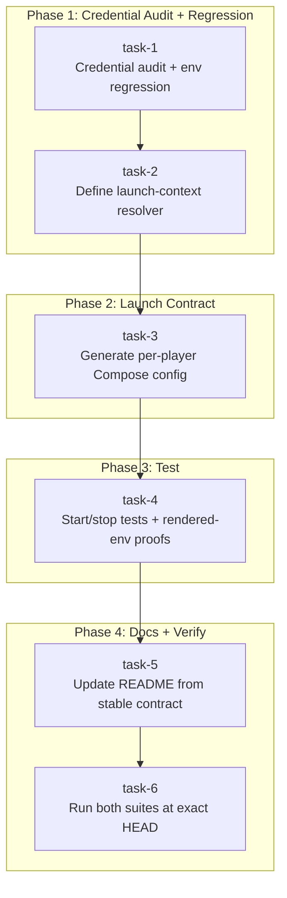

## Goal

Fix the deployment/security seam between the CLI, campaign membership state, and Docker Compose so that `campaign start` and `campaign stop` produce correctly configured, participant-bound Omega processes. Every launch must pass the readiness gate, derive identity from the campaign database via the existing sender-binding domain API, require an explicit authoritative channel, pass `TABLETOP_CAMPAIGN` through to the subprocess, resolve participant-specific credentials into generic environment names, and generate deterministic Compose configuration without persisting secrets. Stop must never be blocked by readiness, binding, credential state, or participant removal.

## Current Context and Assumptions

- Repo root: `/Users/spenceratgraybox/Work/_Personal/gamemaster`
- Current HEAD: `a8a01dd` ("fix(cli): wire campaign start/stop to Compose service commands")
- The implementation has substantial breadth; remaining issues are in the final seam between CLI, campaign membership state, and Compose
- Python 3.11 is the test runtime (`python3.11 -m pytest`)
- `TABLETOP_LOCAL_OPERATOR` exists in `sender_binding.py` but no CLI path sets it. Preserve existing local invocation path; do not invent a new authentication contract.
- `.env.example` uses per-participant credential variable names. No `.env` file exists.
- `.env.example` is the current candidate reference for credential variable names; Task 1 determines the runtime configuration contract.
- The codebase already has an atomic-write pattern: `tempfile.NamedTemporaryFile` + `os.fsync()` + `os.replace()` in `projections.py:577-591`.

### Bug 1: `_run_compose()` discards TABLETOP_CAMPAIGN

`env=env` missing from `subprocess.run()`. The variable is discarded at runtime.

### Bug 2: Arbitrary participants have no Compose service

`docker-compose.yml` only defines `omega-player-ada` and `omega-player-bo`. Running `campaign start night --participant ada-player` resolves to `omega-player-ada-player` which does not exist.

### Bug 3: Sender binding not derived in start path

`cmd_campaign_start()` does not use the `sender_binding` domain API.

### Bug 4: GM path contradicts identity model

`--gm` does not resolve the sole GM participant or emit `TABLETOP_PARTICIPANT`, `OMEGA_EXPECTED_SENDER`, or `OMEGA_COMMCHANNEL`.

### Bug 5: README stale

`README.md:50-52` says `campaign start` prints a launch delegation.

### Bug 6: .env.example runtime usage unaudited

`_run_compose()` uses `--env-file .env.example`. The audit must establish the interpolation source and whether it is intentional.

### Bug 7: TABLETOP_LOCAL_OPERATOR has no CLI setter

Preserve the existing local invocation path and do not invent a new authentication contract. Add an explicit deny rule to every Compose launch environment so an ambient `TABLETOP_LOCAL_OPERATOR=1` cannot cross the externally reachable campaign-start boundary.

## Proposed Approach

### Start vs. Stop Flow Split

**Start** flow:
```
campaign lookup -> persisted-state readiness -> participant/binding -> candidate launch env -> deployment readiness (if readiness has environment-dependent checks) -> verify_startup_binding -> Compose up
```

**Readiness ordering audit**: Task 1 or Task 2 must audit whether `readiness_report()` inspects process/channel environment or only persisted campaign state. If it is persistence-only, call it before participant resolution. If it includes deployment checks, split or parameterize it and evaluate those checks only against the candidate launch environment. Never run a deployment check against ambient `os.environ`.

**Stop** flow:
```
campaign identity -> service identity -> structural compose environment -> Compose stop
```

stop never calls readiness. Stop does NOT call readiness, sender-binding verification, credential validation, or principal lookup. A campaign can become archived, gain pending imports, lose its GM, or lose a binding while its container is running. None of those conditions should prevent shutdown.

- `campaign stop <id> --gm` service identity is simply `omega`. It does not need a GM participant row.
- `campaign stop <id> --participant <id>` should reconstruct `omega-player-<validated-slug>` even if the participant row has been removed. Deleting a participant while their process is running should not create another shutdown failure mode.

### CLI Interface

```
campaign start <campaign_id> --gm --channel <channel>
campaign start <campaign_id> --participant <id> --channel <channel>
campaign stop <campaign_id> --gm
campaign stop <campaign_id> --participant <id>
```

`--channel` is required for `start` only. `stop` does NOT require `--channel`.

### Canonical Runtime Configuration Resolver

Define `build_launch_env()` with one explicit signature. `participant_id` and `role` are optional because GM stop has neither a participant row nor a participant role. Start requires both, while player stop supplies a validated participant slug and GM stop supplies neither:

```python
def build_launch_env(*, campaign_id: str, participant_id: str | None, role: str | None, channel: str | None, expected_sender: str | None, action: Literal["start", "stop"], container_database_path: str) -> dict[str, str]:
    if action == "start":
        assert participant_id is not None
        assert role is not None
        assert channel is not None
        assert expected_sender is not None
        base = parse_runtime_env_file(RUNTIME_ENV_FILE)
        base.update(os.environ)
        credentials = resolve_channel_credentials(base, participant_id, role, channel, expected_sender)
        launch_env = sanitize_compose_process_env(base)
        launch_env.update(credentials)
        for source_name in all_participant_credential_source_names(base):
            launch_env.pop(source_name, None)
        selected_slots = credential_slot_names(channel, role)
        for name in all_credential_slot_names():
            if name not in selected_slots:
                launch_env.pop(name, None)
    else:
        launch_env = {
            "PATH": os.environ.get("PATH", ""),
            "TABLETOP_CAMPAIGN": campaign_id,
            "TABLETOP_DATABASE_PATH": container_database_path,
        }
        if participant_id is not None:
            launch_env["TABLETOP_PARTICIPANT"] = participant_id
    launch_env["TABLETOP_CAMPAIGN"] = campaign_id
    launch_env["TABLETOP_DATABASE_PATH"] = container_database_path
    if action == "start":
        launch_env["OMEGA_EXPECTED_SENDER"] = expected_sender
        launch_env["OMEGA_COMMCHANNEL"] = channel
    else:
        launch_env.pop("OMEGA_EXPECTED_SENDER", None)
        launch_env.pop("OMEGA_COMMCHANNEL", None)
        for name in all_credential_slot_names():
            launch_env.pop(name, None)
    launch_env.pop("TABLETOP_LOCAL_OPERATOR", None)
    return launch_env
```

`sanitize_compose_process_env(base)` removes universally forbidden process-environment entries such as `TABLETOP_LOCAL_OPERATOR`; it does not own participant credential-source removal. `all_participant_credential_source_names(base)` is the separate, non-overlapping scrub for participant- and role-scoped source names such as `WS_TOKEN_ADA_PLAYER` and `OMEGA_AUTH_SECRET_ADA_PLAYER`. The source scrub runs after selected generic credentials are resolved, so those source secrets cannot survive into the subprocess environment. The final explicit `TABLETOP_LOCAL_OPERATOR` removal is a deny invariant for every GM and player Compose launch, including stop.

`all_credential_slot_names()` and `credential_slot_names(channel, role)` are derived from the Task 1 channel contract. All supported generic slots exist structurally in the generated service, but only the selected channel's required generic slots may be populated in the launch process environment. Presence of a slot in YAML does not imply that its value is present in `launch_env`.

`RUNTIME_ENV_FILE` remains directly visible to Compose through `--env-file`. If it contains participant-scoped source names such as `WS_TOKEN_ADA_PLAYER` or `OMEGA_AUTH_SECRET_ADA_PLAYER`, those values remain readable by Compose interpolation even though source scrubbing removed them from `env=env`. The security contract is narrower: service definitions must contain no interpolation references to participant-scoped source names, and source scrubbing prevents accidental generic inheritance in the subprocess environment. It does not make source values unavailable to Compose while the shared env file is supplied.

`TABLETOP_DATABASE_PATH` is an authoritative final assignment for both actions. The stop branch is a whitelist, not a filtered copy of the merged environment. The subprocess process environment, the Compose `--env-file` interpolation source, and the generated service environment are separate inputs. Stop does not copy credentials from ambient `os.environ`; the shared runtime env file may still contain deployment credentials for Compose interpolation.

The generated player service is channel-neutral. It contains optional slots for every channel credential name established by Task 1, such as `${TELEGRAM_TOKEN:-}`, `${WS_TOKEN:-}`, `${SLACK_TOKEN:-}`, `${MATTERMOST_TOKEN:-}`, and any required IRC slot. Start populates only the selected channel's slot. Stop populates none. This keeps the generated YAML identical in shape for start and stop without a channel.

### Static Player Service Policy (omega-player-ada, omega-player-bo)

`docker-compose.yml` already defines `omega-player-ada` and `omega-player-bo` as static services. The generator must settle how these interact with dynamically generated `omega-player-<slug>` services **before** Task 3 begins.

**Chosen contract**:
- Task 1 audits the current static player services and does not remove them.
- Task 3 introduces `tabletop/cli/player_service_spec.py`, generates an arbitrary player override from it, and verifies that rendering succeeds.
- Only after the generated path is proven does Task 3 remove `omega-player-ada` and `omega-player-bo` from `docker-compose.yml`.
- `omega` remains statically defined; all `omega-player-*` services are generated.
- The migration is one behavioral change: the repository keeps runnable player services until the generated replacement is available.

**Regression coverage for base topology**: Task 3 must assert that the base `docker-compose.yml` contains `omega` but no `omega-player-*` services, then add one generated override and assert that rendering contains exactly `omega` plus the requested player service. Task 4 keeps this as a regression test.

### Host vs Container Database Path Separation

`TABLETOP_DATABASE_PATH` is an environment value prepared for Compose/container interpolation. The CLI opens SQLite at `host_database_path` while the container sees `container_database_path`. These are **not** the same namespace.

The plan must distinguish:
- `host_database_path`: The path the CLI uses to open SQLite on start. It is not required for stop.
- `container_database_path`: The path inside the container (rendered into Compose environment).
- `runtime_compose_dir`: The explicit host-side output directory for generated overrides, resolved from deployment configuration. It is not inferred from `TABLETOP_DATABASE_PATH`.

`_resolve_launch_context()` receives explicit deployment configuration for `container_database_path` and `runtime_compose_dir`. For start, `host_database_path` is the path used to open SQLite and is carried for diagnostics. `runtime_compose_dir` is the host-side output directory established by the runtime configuration contract. Stop does not open SQLite and therefore does not require `host_database_path`; it still receives `runtime_compose_dir` and `container_database_path` from deployment configuration. `container_database_path` is passed to `build_launch_env()` and carried by `LaunchContext`. Task 3 passes the structural `runtime_compose_dir` value directly to `_generate_compose_override()`; the generator never infers a path from `TABLETOP_DATABASE_PATH`.

**Test**: A runtime whose `host_database_path` differs from `container_database_path` must write the override under the configured `runtime_compose_dir` and render `container_database_path` into the service environment. A stop runtime with no database file must still write the same deterministic override path from `runtime_compose_dir`.

`LaunchContext` represents both start and stop without inventing a GM participant:

```python
@dataclass(frozen=True)
class LaunchContext:
    action: Literal["start", "stop"]
    service_name: str
    env: dict[str, str]
    host_database_path: Path | None
    container_database_path: str
    runtime_compose_dir: Path
    participant_id: str | None
    workspace: Workspace | None
```

Start requires `host_database_path`, `participant_id`, and `workspace`. Player stop has a validated `participant_id` but no database row. GM stop has `participant_id=None` and `workspace=None`; `TABLETOP_PARTICIPANT` is absent from its environment and its service is `omega`.

### Channel Credential Contract

`--channel` is authoritative. `launch_env["OMEGA_COMMCHANNEL"] = channel`. Participant configuration may be used to locate credentials for that channel or reject incompatible configuration, but it must never silently replace the requested channel.

**Channel identifiers must be validated, not merely required.** The parser or resolver must reject any `--channel` value not in a canonical set. The audit must produce:

```python
CHANNELS = {
    "telegram": ...,
    "slack": ...,
    "mattermost": ...,
    "irc": ...,
    "websocket": ...,
}
```

Values such as `Telegram`, `channels.telegram`, or `foobar` must be rejected before credential resolution. The channel audit must produce the `CHANNELS` mapping and the parser or resolver validation must enforce it.

The audit must also produce a channel credential contract classifying each channel's authentication shape:
     - channel name
     - authenticated sender source
     - required runtime credential slots
     - whether credential must be participant-unique
     - whether WS_TOKEN applies
     - which generated env slots are launch-required (must be non-empty for start)

```
telegram  -> required credential variables ...
slack     -> required credential variables ...
mattermost -> required credential variables ...
irc       -> required credential variables ...
websocket -> WS_TOKEN
```

Start resolves credentials for the explicitly selected channel and fails before Compose if required credentials are absent. This is stronger than merely copying `WS_TOKEN_<participant>` and gives arbitrary participants a complete channel configuration.

`credential_suffix()` is a pure naming function: it replaces `-` with `_` and uppercases (e.g., `credential_suffix("ada-player") == "ADA_PLAYER"`). It produces no secrets and performs no lookups. The Task 1 audit can reject this convention if existing deployment variables establish a different rule (e.g., `WS_TOKEN_ADA_PLAYER` vs `WS_TOKEN_ADA`), and must record whichever rule is chosen. Three credential cases must be distinguished:

- participant-scoped credential: `WS_TOKEN_<SUFFIX>`, `OMEGA_AUTH_SECRET_<SUFFIX>`
- role-scoped GM credential: potentially `OMEGA_COMMCHANNEL_GM`, `WS_TOKEN_GM` (not `WS_TOKEN_GM1` when the GM participant ID is `gm1`)
- global credential: `ASI_API_KEY`, `OMEGA_PROVIDER`

The audit must also produce `all_participant_credential_source_names(config)`, the source-variable names that must be removed from the Compose subprocess environment after generic credential resolution. This list is separate from `all_credential_slot_names()`, which describes generated container slots. `resolve_channel_credentials()` returns only generic container slot names; it never returns participant-scoped source names.

For the GM case, existing configuration uses `_GM` suffixes while the actual GM participant ID may be `gm1`. Do not assume `WS_TOKEN_GM1` when the current deployment contract says `WS_TOKEN_GM`.

### _run_compose() Signature

Pure process execution, no identity policy:

```python
def _run_compose(
    service: str,
    action: Literal["start", "stop"],
    *,
    env: Mapping[str, str],
    compose_files: Sequence[Path] = (),
) -> int:
```

The resolver owns identity, policy, and credential mapping. `_run_compose()` owns only process execution. Execution and validation share `_compose_base_command()` for project directory, env file, and Compose file ordering; only execution appends a service-targeted domain action. `env=env` supplies Compose's interpolation environment. The generated service's `environment:` entries then place the selected interpolated values into the container.

### Readiness Gate Preservation

`cmd_campaign_start()` must run the audited persisted-state readiness gate before identity resolution. Task 1 or Task 2 must first determine whether `readiness_report()` inspects process/channel environment or only persisted campaign state. If it is persistence-only, call it before participant resolution. If it mixes deployment checks, split or parameterize it and run deployment checks only after `build_launch_env()` against the candidate environment. Never evaluate deployment readiness against ambient `os.environ`. The tests must include a fixture showing neither GM nor player Compose execution occurs for:
- Pending import items
- Archived campaigns
- Other existing readiness errors

### Stop-Time Interpolation Settled

Generate the same full service definition for start and stop. The service schema is channel-neutral and uses optional interpolation for every launch-only identity and credential slot:

```yaml
OMEGA_EXPECTED_SENDER: ${OMEGA_EXPECTED_SENDER:-}
OMEGA_COMMCHANNEL: ${OMEGA_COMMCHANNEL:-}
TABLETOP_PARTICIPANT: ${TABLETOP_PARTICIPANT}
WS_TOKEN: ${WS_TOKEN:-}
TELEGRAM_TOKEN: ${TELEGRAM_TOKEN:-}
SLACK_TOKEN: ${SLACK_TOKEN:-}
MATTERMOST_TOKEN: ${MATTERMOST_TOKEN:-}
```

Add any additional channel slot established by Task 1 using the same optional form. Start populates only the selected channel's slot and fails closed before Compose when required. Stop resolves no channel and populates none of these credential or sender slots. Player stop still supplies `TABLETOP_PARTICIPANT`; GM stop uses the static `omega` service and its optional participant identity. One generator, one output format.

### TABLETOP_WORKSPACE

Use literal `player` in generated YAML, not `${TABLETOP_WORKSPACE}`.

### Atomic Write for Generated Config

Use the existing codebase pattern from `projections.py:577-591`:
1. Write to a 0600 temporary file in the `compose/` directory
2. `os.fsync(temporary.fileno())` if the surrounding codebase uses that standard
3. `os.replace()` the deterministic target

This prevents two rapid start/stop invocations from observing a partially written YAML file.
   - Add an atomic replacement test: write the same participant override twice using tempfile + os.fsync() + os.replace(), and assert the final file is exactly one complete YAML document and never a mixed/partial document. Assert no orphan temporary files remain in the `compose/` directory after the successful writes. The `compose/` directory mode is `0700`, generated file mode is `0600`.

### Compose Validation Tests Reproduce Actual Invocation

Tests must use the same command-building helper for validation as for execution, with:
- `cwd = repo root`
- `process env = launch_env`
- `--env-file = RUNTIME_ENV_FILE`
- `-f = absolute base compose path`
- `-f = absolute generated override path`

The GM sentinel test uses this exact mechanism. A test omitting those inputs can pass while the real invocation renders differently.

### Canonical Invariant Comparison Uses Semantic Roles

The mandatory comparison test establishes equivalence such as "has a sender slot," "has a channel slot," "has the required credential slot for the selected channel," rather than forcing obsolete Ada-specific variable names into the generator. The test should compare semantic environment roles against the canonical specification, not against a deleted service.

### Revised Task Dependency Diagram



## Step-by-Step Tasks

### Task 1: Audit credential conventions and .env.example; add env forwarding regression test

**Files to change**: `tests/tabletop/test_cli_compose_start.py` (new), audit of `.env.example`, `docker-compose.yml`, `scripts/`, `tabletop/cli/handlers.py`

**Step 1a**: Audit credential conventions:
- Check `.env.example` for per-participant credential variable names and patterns
- Check `docker-compose.yml` for `${VAR}` expansion in `environment:` blocks
- Record the current `omega-player-ada` and `omega-player-bo` service definitions and base topology. Do not remove them in Task 1.
- Check `scripts/` for `.env` loading or credential references
- Document the exact per-participant variable naming convention
- Establish `RUNTIME_ENV_FILE` and the explicit host-side `runtime_compose_dir` source
- Choose an existing Compose-compatible env-file parser or add compatibility fixtures for the syntax used by `RUNTIME_ENV_FILE`. Cover quoting, empty values, escaped characters, and interpolation so authorization and Compose rendering see identical effective values
- Produce the channel credential contract and the channel-neutral credential slot set
- **Gate**: If `.env.example` is the runtime interpolation baseline and that is not intentional, revise `_run_compose()` to use the actual runtime source before proceeding
- `.env.example` is the current candidate reference for credential variable names; Task 1 determines the runtime configuration contract

**Step 1b**: Add a regression test for the final execution-helper contract. Mock `subprocess.run` and assert that `_run_compose(service, action, *, env, compose_files)` forwards the exact env mapping through `env=env`, including `TABLETOP_CAMPAIGN`. The test is expected to fail before the final helper implementation.

**Step 1c**: Implement the stable execution helper and keep the tree runnable:
```python
def _run_compose(
    service: str,
    action: Literal["start", "stop"],
    *,
    env: Mapping[str, str],
    compose_files: Sequence[Path] = (),
) -> int:
```
Pass `env=env` to `subprocess.run()`. Add the separately named compatibility wrapper `_run_compose_legacy(service, action, campaign_id)` and mechanically adapt the existing callers so Task 1 does not leave the repository uncompilable. The wrapper is temporary and is deleted in Task 2. `_run_compose()` has one signature; there is no overloaded legacy signature.

**Verification**:
```bash
python3.11 -m pytest tests/tabletop/test_cli_compose_start.py -q -k "test_run_compose_forwards_env"
```

### Task 2: Implement launch policy on the stable _run_compose() primitive

**Files to change**: `tabletop/cli/handlers.py`, `tabletop/cli/parser.py`

**Changes**:

**Responsibility model**: `_resolve_launch_context()` owns start-path SQLite authorization, participant/binding lookup, sender binding, and readiness gating. Stop does not open SQLite. `build_launch_env()` owns deterministic configuration assembly and performs NO database lookup. `_run_compose()` owns process execution and performs NO policy.

1. **`tabletop/cli/parser.py`**: Add `--channel` argument to `start` subparser (`required=True`). Add `--participant` and `--gm` arguments to `stop` subparser (mutually exclusive, `required=True`). Exactly one of `--gm` / `--participant` must be given for both `start` and `stop`.

2. **`tabletop/cli/handlers.py`**: Keep `_run_compose()` as the stable execution primitive established in Task 1:
   - Resolve `RUNTIME_ENV_FILE` and the repo root absolutely
   - Build the execution command with `_compose_execution_command()` using the shared `_compose_base_command()` prefix and `--project-directory <repo-root>`
   - Set `cwd=<repo root>` for project identity
   - Command prefix: `docker compose --project-directory <repo-root> --env-file <RUNTIME_ENV_FILE> -f <absolute repo-root/docker-compose.yml> -f <absolute generated override> <operation>`
   - Pass `env=env` to `subprocess.run()`
   - Does NOT construct identity policy and does NOT query the database
    - **Command builders**: Keep the shared Compose prefix separate from service actions:
      ```python
      def _compose_base_command(
          *,
          compose_files: Sequence[Path],
          runtime_env_file: Path,
      ) -> list[str]:
          ...
      ```
      `_compose_base_command()` contains `docker compose`, `--project-directory`, `--env-file`, and the ordered `-f` arguments. It has no `service` or domain `action` parameter.
      ```python
      def _compose_execution_command(
          service: str,
          action: Literal["start", "stop"],
          *,
          compose_files: Sequence[Path],
          runtime_env_file: Path,
      ) -> list[str]:
          command = _compose_base_command(
              compose_files=compose_files,
              runtime_env_file=runtime_env_file,
          )
          if action == "start":
              return [*command, "up", "-d", service]
          if action == "stop":
              return [*command, "stop", service]
          raise ValueError(f"unsupported Compose action: {action}")
      ```
      `docker compose config` tests use `[*_compose_base_command(...), "config"]`; they do not pass a domain action.
   - **Domain action vs Compose operation**: `LaunchContext.action` and `build_launch_env(action=...)` use only `"start"` and `"stop"`. `_run_compose()` translates them to Compose operations (`"start"` -> `up -d`, `"stop"` -> `stop`).
   - **Execution contract**:
     - `start` runs: `docker compose ... up -d <service>` (detached)
     - `stop` runs: `docker compose ... stop <service>`
     - `<service>` is the final positional argument, not `-d`
     - Tests must assert both the operation and final service argument
   - The process environment, `--env-file` interpolation source, and generated service environment are separate. Stop's process environment is a structural whitelist; the shared env file may still contain deployment credentials.

3. **`tabletop/cli/handlers.py`**: Implement `build_launch_env()` with this exact signature:
   ```python
   def build_launch_env(
       *,
       campaign_id: str,
       participant_id: str | None,
       role: str | None,
       channel: str | None,
       expected_sender: str | None,
        action: Literal["start", "stop"],
        container_database_path: str,
   ) -> dict[str, str]:
   ```
   - For start, require `participant_id`, `role`, `channel`, and `expected_sender`; merge `RUNTIME_ENV_FILE`, then `os.environ`, resolve credentials from that base, apply universal process-env sanitization, remove participant/role source credentials, add only selected generic credentials, then write authoritative identity values last.
   - Implement non-overlapping `sanitize_compose_process_env(base)` and `all_participant_credential_source_names(base)` contracts from the Task 1 audit. The former removes universally forbidden process entries; the latter removes participant- and role-scoped source names such as `WS_TOKEN_ADA_PLAYER` and `OMEGA_AUTH_SECRET_ADA_PLAYER`.
   - For stop, skip `resolve_channel_credentials()` and `bound_external_id()` entirely; build only the audited structural process-environment whitelist. `participant_id` is present for player stop and absent for GM stop.
   - Always write `TABLETOP_DATABASE_PATH = container_database_path` as the final authoritative value. Never expose the host SQLite path to the container.
   - Explicitly remove `TABLETOP_LOCAL_OPERATOR` for every GM and player Compose launch, including stop.
   - The same string-only rule applies to all optional identity and credential keys: omit them rather than assigning `None`.
   - `build_launch_env()` performs no database lookup. `_resolve_launch_context()` resolves start authorization and passes the resolved values in.

4. **`tabletop/cli/handlers.py`**: Implement `_resolve_launch_context(action: Literal["start", "stop"], ..., container_database_path: str, runtime_compose_dir: Path) -> LaunchContext`. The deployment path arguments come from explicit runtime configuration, never from SQLite lookup during stop.

   - **For start**:
     - Opens the database at `host_database_path`.
     - Audits `readiness_report()` before fixing the ordering. Persisted-state readiness runs before identity resolution. Environment-dependent deployment checks run only after `build_launch_env()` and use the candidate environment.
     - If `readiness_report()` is persistence-only, call it before participant resolution. If it mixes deployment checks, split or parameterize it into `campaign_readiness_report(conn, campaign_id, require_reviewed=True)` and `deployment_readiness_report(conn, campaign_id, environ=candidate_env)`. Do not call the mixed function against ambient `os.environ`.
     - Resolve campaign and participant data from `CampaignStore` and `MembershipStore`.
     - Validate the requested GM or player selector and participant role.
     - Resolve the sender binding with `sender_binding.bound_external_id()`.
     - Build the candidate environment with `build_launch_env(..., container_database_path=container_database_path)`.
     - Run any deployment readiness check against `candidate_env`, then call `sender_binding.verify_startup_binding(conn, ..., environ=candidate_env)`.
     - Return `LaunchContext` with `action="start"`, service name, candidate env, `host_database_path`, `container_database_path`, `runtime_compose_dir`, and participant/workspace metadata.

   - **For stop**:
     - Does not open SQLite or call readiness, sender-binding verification, credential resolution, or principal lookup.
     - Receives `runtime_compose_dir` and `container_database_path` from deployment configuration.
     - Validates the player slug when `--participant` is selected. GM stop uses `participant_id=None`, `role=None`, service `omega`, and no `TABLETOP_PARTICIPANT` key.
     - Builds the structural stop environment through the whitelist branch of `build_launch_env()`.
     - Returns `LaunchContext` with `action="stop"`, service name, structural env, `host_database_path=None`, `container_database_path`, `runtime_compose_dir`, and optional participant metadata.

   `compose_files=()` is explicit throughout Task 2. Task 3 adds the generated override only for player start and player stop; GM start and GM stop continue to use `compose_files=()`.

5. **`tabletop/cli/handlers.py`**: Update `cmd_campaign_start()`:
   - Parse `--channel` from args
   - Call `_resolve_launch_context(action="start", ...)`
    - Pass `launch_context.env` to `_run_compose(service, action, env=launch_context.env, compose_files=())`

6. **`tabletop/cli/handlers.py`**: Update `cmd_campaign_stop()`:
   - Parse `--participant` or `--gm` from args (no `--channel`)
   - Call `_resolve_launch_context(action="stop", ...)`
    - Pass `launch_context.env` to `_run_compose(service, action, env=launch_context.env, compose_files=())`
   - Stop does not resolve, validate, or depend on participant credentials. The stop process-environment overlay contains no synthesized participant credential values. The shared runtime env file may still contain deployment credentials for Compose interpolation.

**Verification**:
```bash
python3.11 -m pytest tests/tabletop/test_sender_binding.py tests/tabletop/test_readiness.py tests/tabletop/test_cli_membership.py -q
```

### Task 3: Generate deterministic per-player Compose configuration

**File to change**: `tabletop/cli/handlers.py`, `tabletop/cli/player_service_spec.py`, `docker-compose.yml`

**Changes**:

1. Introduce `tabletop/cli/player_service_spec.py` as the canonical Python specification. It defines the player image, init, restart, security options, command structure, mount roles, fixed environment roles, channel-neutral credential slots, and named-volume pattern.
2. Implement `_generate_compose_override(*, participant_id: str, runtime_compose_dir: Path) -> Path`:
   - Validate `participant_id` with `validate_participant_id()`.
   - Write to `runtime_compose_dir / f"docker-compose.override-{participant_id}.yml"`.
   - The generator receives structural inputs only. It must not receive `LaunchContext`, sender state, credentials, channel, expected sender, or authorization state.
   - Create the output directory with mode `0700`; write with mode `0600` using `tempfile`, `os.fsync()`, and `os.replace()`.
   - Generate the service and top-level named-volume declaration from `player_service_spec.py`.
   - Keep the command channel-neutral: use `commchannel=${OMEGA_COMMCHANNEL:-}` with no Telegram or other channel default.
   - Include a channel-neutral environment schema. Every supported channel credential slot uses optional interpolation, including `${TELEGRAM_TOKEN:-}`, `${WS_TOKEN:-}`, `${SLACK_TOKEN:-}`, `${MATTERMOST_TOKEN:-}`, and any IRC slot established by Task 1. Start populates only the selected channel's slot. Stop populates none.
   - Use `${TABLETOP_PARTICIPANT}` because player start and player stop both provide a validated participant identity. GM stop uses the static `omega` service, not this generated player service.
   - Use `${TABLETOP_DATABASE_PATH}` for the container path. Never interpolate the host SQLite path.
   - Structural invariant: neither the generated player service nor the static `omega` service contains `TABLETOP_LOCAL_OPERATOR` or any participant-scoped source-name interpolation reference.
3. Update the static `omega` service to consume the generic identity contract: `TABLETOP_CAMPAIGN`, generic `TABLETOP_PARTICIPANT`, `OMEGA_EXPECTED_SENDER`, and `OMEGA_COMMCHANNEL`. Remove identity dependence on `TABLETOP_PARTICIPANT_GM`, `OMEGA_EXPECTED_SENDER_GM`, and `OMEGA_COMMCHANNEL_GM`; retain role-scoped credentials only where the Task 1 audit requires them. Prove the rendered `omega` service receives the candidate launch values.
4. Prove an arbitrary generated player service renders before changing the base topology. Run `docker compose config` with `[*_compose_base_command(...), "config"]` and assert the rendered service has the canonical infrastructure fields and no literal secrets.
5. After that proof, remove `omega-player-ada` and `omega-player-bo` from `docker-compose.yml`.
6. Add the topology regression: base Compose contains `omega` and no `omega-player-*` services; adding one generated override renders exactly `omega` plus the requested player service.
7. Keep the invariant test against `player_service_spec.py`, not against a deleted static service. It must assert:
   - every supported generic credential slot exists structurally in the generated service
   - only the selected channel's required generic slots are populated in the launch process environment
   - infrastructure fields match the canonical specification
   - no `TABLETOP_LOCAL_OPERATOR` or participant-scoped source-name interpolation reference exists
8. Update player command paths after generation: `override = _generate_compose_override(participant_id=..., runtime_compose_dir=...)`, then call `_run_compose(..., compose_files=(override,))` for player start and player stop. GM start and GM stop continue to call `_run_compose(..., compose_files=())`.
9. Player start and player stop use the generated schema; neither path needs sender or channel values in the generator.

**Verification**:
```bash
python3.11 -m pytest tests/tabletop/test_cli_compose_start.py -q -k "override or topology or gm_identity"
```

### Task 4: Add player and GM start/stop tests, negative cases, and rendered-environment proofs

**New file**: `tests/tabletop/test_cli_compose_start.py`

**Test coverage**:

1. **Static-to-generated migration test**: After `docker-compose.yml` no longer contains `omega-player-ada` or `omega-player-bo`, assert the base file contains `omega` and no `omega-player-*` services. Then add one generated override for a requested player and assert `docker compose config` renders exactly `omega` plus that one player service. This directly proves the chosen topology.

2. **Env forwarding regression**: Mock `subprocess.run`, assert `env=env` is forwarded exactly

3. **Ambient credential leakage test**: Populate `os.environ` with obvious secrets such as `WS_TOKEN=DO_NOT_COPY`, `ASI_API_KEY=DO_NOT_COPY`, and `OMEGA_AUTH_SECRET=DO_NOT_COPY`. Build a stop environment. Assert none of those keys appear in the resulting env dict. This directly proves the stop whitelist.

4. **Wrong channel credential isolation test**: Give a participant valid Telegram credentials but invoke `--channel websocket`. Start must fail before Compose rather than silently reusing Telegram configuration. This proves the per-channel credential contract from Task 1.

5. **Player launch test**:
   - Setup campaign with participant `ada-player` and binding on `telegram` with external_id `12345`
   - Call `campaign start night --participant ada-player --channel telegram`
   - Assert service `omega-player-ada-player`, env has `TABLETOP_CAMPAIGN=night`, `TABLETOP_PARTICIPANT=ada-player`, `OMEGA_EXPECTED_SENDER=12345`, `OMEGA_COMMCHANNEL=telegram`
   - **Credential uniqueness test**: Ada and Bo do not receive the same bot credential where the channel requires distinct credentials

6. **Host and container database path test**:
   - Set different host and container database paths and an explicit `runtime_compose_dir`
   - Generate an override and assert the file is under `runtime_compose_dir`
   - Assert the rendered service receives the container path, never the host path

7. **GM launch with rendered-environment proof**:
   - Setup campaign with GM participant `gm1` and binding on `irc`
   - Call `campaign start night --gm --channel irc`
   - Use `[*_compose_base_command(...), "config"]` with `cwd=repo root`, `process env=launch_env`, `--env-file=RUNTIME_ENV_FILE`, and absolute paths
   - Render the static `omega` service with sentinel values
   - Verify `TABLETOP_CAMPAIGN`, generic `TABLETOP_PARTICIPANT`, `OMEGA_EXPECTED_SENDER`, and `OMEGA_COMMCHANNEL` appear in the rendered container configuration
   - Assert the rendered service does not depend on `TABLETOP_PARTICIPANT_GM`, `OMEGA_EXPECTED_SENDER_GM`, or `OMEGA_COMMCHANNEL_GM` for identity
   - Assert service is `omega`

8. **Stop without binding test**:
   - Unbind the participant's principal
   - Call `campaign stop night --participant ada-player`
   - Assert stop succeeds (does not fail due to missing binding)
   - Stop env contains no synthesized participant credential values

9. **Stop with deleted vars test**:
   - Delete the binding and delete all sender/channel/credential variables from parent environment
   - Call `campaign stop night --participant ada-player`
   - Assert stop invokes Compose successfully (proves optional interpolation works)

10. **Stop with deleted participant row test**:
    - Remove the participant row from the database
    - Call `campaign stop night --participant ada-player`
    - Assert stop succeeds, reconstructing `omega-player-ada-player` from the slug

11. **No-database stop control-flow test**: Monkeypatch or spy on the database-opening function so any call raises or records a failure. Call `campaign stop night --participant ada-player` and assert the database opener was never called and Compose was reached. If a host database path is separately configurable, set it to a nonexistent path as an additional fixture; do not use `TABLETOP_DATABASE_PATH` as a host-path assertion because it is the container interpolation value.

12. **GM stop without participant row test**:
    - Call `campaign stop night --gm`
    - Assert stop succeeds, targeting service `omega`, no GM participant row needed
    - Assert the stop env has no `TABLETOP_PARTICIPANT` key

13. **Stale binding defense-in-depth test**:
    - Resolve authoritative binding `42`
    - Mutate candidate environment to `43`
    - Assert `verify_startup_binding()` rejects before Compose

14. **Readiness gate preservation test**:
    - Create a campaign with pending import items
    - Call `campaign start night --gm --channel irc`
    - Assert readiness errors prevent Compose execution for both GM and player
    - Test archived campaigns also prevent Compose execution

15. **Negative cases**:
    - No binding for selected channel → fail before Compose
    - Two or zero GMs → readiness/start failure
    - Revoked/unbound participant start → fail before Compose
    - Invalid participant id → cannot escape generated-config directory
    - `TABLETOP_CAMPAIGN` present in env even if parent shell lacks it
    - CLI invoked from different CWD → still produces same Compose service/project target

16. **Compose-config validation**:
    - Generate an override file
    - Use `[*_compose_base_command(compose_files=..., runtime_env_file=...), "config"]` with `cwd=repo root`, `process env=launch_env`, and absolute paths
    - Run `docker compose config` with sentinel values
    - Assert it succeeds and the rendered config includes the expected service definition
    - **Record as "not run"** if Docker CLI is unavailable

17. **Channel-neutral stop rendering test**:
    - Build the stop process environment and assert it contains no participant or channel launch credentials
    - Assert stop performs no credential resolution
    - Generate a player override with no channel or sender values and assert the channel-neutral schema renders when generic credential slots are absent from the process environment
    - Assert stop reaches `docker compose stop <service>` through `_compose_execution_command()`
    - Do not assert that the shared runtime env file cannot provide values for optional Compose interpolation slots

18. **Participant source-credential scrubbing test**:
    - Populate the runtime configuration with Ada and Bo source credentials such as `WS_TOKEN_ADA_PLAYER=secret-a`, `WS_TOKEN_BO=secret-b`, and `OMEGA_AUTH_SECRET_ADA_PLAYER=secret-c`
    - Launch Ada and assert the subprocess environment contains Ada's resolved generic values but none of Bo's source credentials or Ada's source credentials

19. **TABLETOP_LOCAL_OPERATOR deny test**:
    - Set `TABLETOP_LOCAL_OPERATOR=1` in the parent environment
    - Start both GM and player services
    - Assert the subprocess environment omits `TABLETOP_LOCAL_OPERATOR`
    - Assert rendered `omega` and generated player container environments omit it

20. **Runtime env parser compatibility test**:
    - Exercise the syntax actually used by `RUNTIME_ENV_FILE`, including quoting, empty values, escaped characters, and interpolation
    - Assert `build_launch_env()` and `docker compose config` derive identical effective values for those fixtures

21. **Source-name interpolation absence test**:
    - Put participant source names in `RUNTIME_ENV_FILE`
    - Render the static `omega` and generated player services
    - Assert neither service definition contains an interpolation reference to `WS_TOKEN_ADA_PLAYER`, `OMEGA_AUTH_SECRET_ADA_PLAYER`, or any other participant-scoped source name

22. **Generic/source credential precedence collision test**:
    - Set `WS_TOKEN=ambient-generic` and `WS_TOKEN_ADA_PLAYER=ada-secret` in the parent environment
    - Start Ada through the selected channel
    - Assert the launch environment contains exactly the credential selected by the audited precedence rule, not the stale ambient generic value

**Verification**:
```bash
python3.11 -m pytest tests/tabletop/test_cli_compose_start.py -q
```

### Task 5: Update README from the now-stable command contract

**File to change**: `README.md`, `tests/tabletop/test_readme_smoke.py`

**Changes**:
- Replace the old `campaign start night --gm` smoke test assertion with `campaign start night --gm --channel <channel>`
- Update the Quick Start section to show the new command contract with `--channel` for start, no `--channel` for stop
- Remove the stale "prints the launch delegation" language
- Update "Start the player surface" to show `campaign start night --participant ada-player --channel telegram`
- Document the `--channel` requirement for start and its absence for stop

**Verification**:
```bash
python3.11 -m pytest tests/tabletop/test_readme_smoke.py -q
```

### Task 6: Run both Python suites at exact HEAD and record Docker topology status

**Commands**:
```bash
python3.11 -m pytest tests/tabletop -q
python3.11 -m pytest tests/ -q
```

**Record**:
- Exact resulting HEAD commit hash
- `tests/tabletop` count: passed/skipped/failed
- `tests/` count: passed/skipped/failed
- Evidence status breakdown:
  - Python suites: proven
  - Generated YAML structural unit tests: proven
  - `docker compose config` validation: proven / not run
  - Docker topology test: proven / not run
  - Three-container topology: proven / not run
- If any failures, diagnose and fix per the adaptive execution loop

## Files Likely to Change

1. `tabletop/cli/handlers.py` - Fix `_run_compose()`, implement `build_launch_env()`, `_resolve_launch_context()`, add `_generate_compose_override()`, update `cmd_campaign_start()` and `cmd_campaign_stop()`
2. `tabletop/cli/player_service_spec.py` - Canonical Python player-service specification consumed by the generator
3. `tabletop/cli/parser.py` - Add `--channel` required argument to `start`, add `--participant`/`--gm` to `stop` (no `--channel`)
4. `README.md` - Update start command documentation
5. `tests/tabletop/test_cli_compose_start.py` - New integration test file
6. `tests/tabletop/test_readme_smoke.py` - Update smoke test assertions
7. `docker-compose.yml` - Changed in Task 3: static `omega-player-ada` and `omega-player-bo` removed after generated replacement is proven

## Tests and Validation

- **Env forwarding regression**: `tests/tabletop/test_cli_compose_start.py` - Test that `_run_compose()` forwards `env=env` exactly
- **Migration topology test**: Base Compose has `omega` and no static player services; one generated override adds exactly the requested player service
- **Integration tests**: `tests/tabletop/test_cli_compose_start.py` - Player launch, GM launch with rendered-env proof, stop without binding, stop with deleted vars, stop with deleted participant row, no-database stop, ambient credential leakage, participant source-credential scrubbing, `TABLETOP_LOCAL_OPERATOR` deny, source-name interpolation absence, generic/source precedence collision, wrong-channel isolation, GM stop without participant row, stale binding defense-in-depth, readiness gate preservation, negative cases
- **Runtime env compatibility test**: `tests/tabletop/test_cli_compose_start.py` - Quoting, empty values, escaped characters, and interpolation produce identical effective values in `build_launch_env()` and `docker compose config`
- **Credential uniqueness test**: Ada and Bo don't share credentials
- **Invariant comparison test**: Semantic env roles against `player_service_spec.py`, not literal Ada variable names
- **CWD test**: CLI from different CWD produces same Compose target
- **Compose-config validation**: Same command-building helper with cwd, env, --env-file, absolute paths
- **Smoke test**: `tests/tabletop/test_readme_smoke.py`
- **Sender binding test**: `tests/tabletop/test_sender_binding.py`
- **Readiness test**: `tests/tabletop/test_readiness.py`
- **Membership test**: `tests/tabletop/test_cli_membership.py`
- **Validation command**: `python3.11 -m pytest tests/tabletop -q`
- **Full validation command**: `python3.11 -m pytest tests/ -q`
- **Docker topology test**: Only with `GAMEMASTER_RUN_DOCKER=1`

## Risks, Tradeoffs, and Open Questions

1. **Credential mapping complexity**: The resolver uses the effective merged configuration (parse RUNTIME_ENV_FILE, overlay os.environ, resolve credentials from the merged base) to look up participant-specific variables. If the naming convention changes, the mapping must be updated. The audit in Task 1 establishes the concrete names and the credential_suffix rule.

2. **Compose serialization drift**: `player_service_spec.py` is the single player-service source consumed by the generator. The mandatory invariant test verifies that the generated YAML preserves its infrastructure and semantic environment roles.

3. **`docker compose config` test requires Docker CLI**: Records as "not run" if unavailable, distinct from "proven".

4. **Stop does not resolve a channel**: `--channel` is required for `start` only. `stop` does not require it. No silent defaults.

5. **Runtime directory permissions**: `0700` for directory, `0600` for files. Subject to normal platform limitations.

6. **No CI evidence for a8a01dd**: The full-suite evidence predates the latest commit.

7. **`TABLETOP_LOCAL_OPERATOR` has no CLI setter**: Preserve the existing local invocation path, but explicitly remove the variable from every GM and player Compose process environment.

8. **`RUNTIME_ENV_FILE` dependency**: The `--env-file` source is determined by the Task 1 audit. Tasks 2-4 reference `RUNTIME_ENV_FILE`.

9. **Task 2 has no generated override**: Task 2 calls `_run_compose(..., compose_files=())` for both start and stop. Task 3 adds the generated override only for player operations; GM operations remain on the base Compose file.

10. **Stop must not require database access**: If the stop path accidentally opens SQLite, it creates avoidable failure modes (database unavailable, schema damaged, permissions changed, migration mismatch, campaign row removed). The stop path must work without any database connection. This is critical for emergency shutdown.

## Execution Contract

The executing agent must repeat **read current state -> check -> record -> correct the plan -> act -> revalidate -> checkpoint** until its authorized objective is verified or no useful in-scope action remains.

### Current Execution Checkpoint

- **State**: Planning only. No implementation has started.
- **Next action**: Execute Task 1 (credential audit and env forwarding regression test).
- **Evidence**: None yet - all findings are based on code inspection at HEAD a8a01dd.
- **Assumptions**:
  - The `--channel` argument will be added to the CLI parser for start only
  - `stop` will use `--participant` or `--gm` without `--channel`
  - The `sender_binding` domain API (`bound_external_id()`, `verify_startup_binding()`) is stable and correct
  - Python 3.11 is available as `python3.11`
  - Docker CLI may or may not be available; tests that need it record as "not run"
  - `.env.example` is the current candidate reference for credential variable names; Task 1 determines the runtime configuration contract

### Evidence and Decisions Log

| Finding | Evidence | Decision |
|---------|----------|----------|
| `_run_compose` missing `env=env` | `tabletop/cli/handlers.py:384` | Fix by adding `env=env` to `subprocess.run()` |
| No per-participant Compose service | `docker-compose.yml` only has ada/bo | Generate arbitrary player services from the canonical specification, then remove static player services in Task 3 |
| No sender binding in start path | `cmd_campaign_start()` has no SQLite lookup | Use `sender_binding.bound_external_id()` and `verify_startup_binding()` |
| GM path has no participant env | `--gm` doesn't resolve GM participant or emit binding | GM must resolve sole GM and emit all env vars |
| Channel source unresolved | No `--channel` arg exists | Add required `--channel` for start; stop does not require it |
| stop requires active binding | Not implemented, but needed operationally | `stop` bypasses readiness, sender binding, and principal lookup entirely; GM stop needs no participant row; player stop works even if participant row removed |
| stop needs no GM participant row | GM service identity is `omega` | `campaign stop night --gm` does not need a GM participant row |
| README stale | `README.md:50-52` says "prints launch delegation" | Update after command contract stabilizes |
| No integration test for arbitrary participant | `test_readme_smoke.py` doesn't execute `campaign start` | Add `test_cli_compose_start.py` with regression first |
| `.env.example` runtime usage unaudited | `--env-file .env.example` in `_run_compose()` | Audit in Task 1 with explicit gate before proceeding |
| `TABLETOP_LOCAL_OPERATOR` has no CLI setter | `sender_binding.py` defines it but no setter exists | Preserve existing local invocation path; do not invent new contract |
| Stale binding test is tautological | `bound_external_id()` and verification use same value | Mutate candidate env to prove defense-in-depth |
| Generated config as second source of truth | The generator could drift from the canonical player specification | Consume `player_service_spec.py` directly and compare generated YAML against that same specification |
| Runtime directory path ambiguous | Host SQLite path and container path were conflated | `host_database_path` is start-only; `runtime_compose_dir` is explicit deployment configuration; `container_database_path` is always rendered into Compose |
| Docker CLI validation skip | `docker compose config` may not be available | Record as "not run" vs "proven" |
| `env=env` vs container env ambiguity | Subprocess env doesn't guarantee container env | "`env=env` supplies Compose's interpolation environment. The generated service's `environment:` entries then place the selected interpolated values into the container." |
| Stop requires launch-only vars | Stop generation needs no channel or sender | Use optional channel-neutral slots in the generated service; start populates selected values, stop populates none |
| TABLETOP_WORKSPACE inconsistency | Generated YAML says `${TABLETOP_WORKSPACE}` but should be `player` | Use literal `player` |
| CWD not fixed | `-f docker-compose.yml` is relative | `_run_compose()` uses `cwd=<repo root>` and absolute paths |
| Generated config permissions undefined | No permission specification | Directory `0700`, file `0600`, atomic write with fsync + os.replace() |
| Credential convention undefined | Per-participant vars in `.env.example` | Audit in Task 1; resolve participant-specific vars into generic env names |
| Ada/Bo credential uniqueness unproven | No test for shared credentials | Add credential uniqueness test |
| GM rendered env unproven | No proof GM gets identity vars | Add rendered-environment proof for GM service using same command-building helper |
| Readiness gate not explicitly preserved | cmd_campaign_start() rewritten | Audit `readiness_report()`, run its persisted-state portion before identity resolution, and run environment-dependent checks against the candidate launch env |
| .env.example hard-coded in Task 2 | `_run_compose()` uses `.env.example` unconditionally | Use `RUNTIME_ENV_FILE` variable established by audit |
| Bug 6 wording error | "if .env.example is the runtime baseline" | Fix to "if .env.example is the runtime baseline and that is not intentional" |
| --channel vs credential mapping compete | Both set OMEGA_COMMCHANNEL | `--channel` is authoritative; `launch_env["OMEGA_COMMCHANNEL"] = channel` |
| Runtime config precedence undefined | File vs env ambiguity | `build_launch_env()` with three-layer precedence: file -> os.environ -> authoritative values |
| Validation tests omit production inputs | `docker compose config` missing cwd, env, --env-file | Use same command-building helper for execution and validation |
| Invariant comparison uses literal Ada names | Test forces obsolete variable names | Compare semantic environment roles, not literal Ada variable names |
| Task 2 generates override prematurely | `_resolve_launch_context()` must not generate serialization output | Task 2 uses `compose_files=()`; Task 3 passes a generated override only for player operations |
| Atomic write not specified | No fsync/replace pattern | Use existing `projections.py:577-591` pattern: tempfile + fsync + os.replace() |
| Participant source credentials survive merged env | `launch_env = dict(base)` retained source names such as `WS_TOKEN_BO` | Resolve from base, sanitize source names, then add selected generic values |
| Ambient local-operator flag can cross launch boundary | `TABLETOP_LOCAL_OPERATOR` may exist in parent `os.environ` | Explicitly remove it from every GM and player Compose process environment |
| Shared Compose helper cannot represent config | Domain action is start/stop, config is neither | Split `_compose_base_command()` from `_compose_execution_command()` |
| Stop cannot guarantee env-file credential exclusion | Shared `--env-file` remains a Compose interpolation source | Narrow the claim to the process overlay; optional slots may still interpolate |
| Static GM service uses `_GM` identity aliases | Base `omega` service references `TABLETOP_PARTICIPANT_GM` and related names | Move omega identity to generic launch variables and test rendered output |
| Runtime env parser may diverge from Compose | Custom parser can disagree on quoting, empty values, escapes, or interpolation | Reuse a compatible parser or prove parity with fixtures |
| Generic slot can mask selected source credential | Ambient `WS_TOKEN` may collide with `WS_TOKEN_ADA_PLAYER` | Add a precedence collision test and define the authoritative source mapping |
| RUNTIME_ENV_FILE source names remain Compose-visible | `--env-file` supplies the same file to Compose even after process-env scrubbing | Assert service definitions never reference participant source names |

### Adaptive Execution Notes

- If `docker compose config` is not available, record as "not run" and continue with structural unit tests
- If the `.env.example` audit reveals it should not be used at runtime, fix that before proceeding to Task 2
- If the `sender_binding` domain API has bugs, fix them first and record the finding
- Preserve the existing `test_readme_smoke.py` assertions while updating README content to match
- Do NOT use hardcoded channel defaults. If channel resolution cannot be made deterministic, stop and revise the plan
- Do NOT use `docker compose config --set` or any similar mechanism
- If the full suite has pre-existing failures unrelated to these changes, record them and continue
- TABLETOP_CAMPAIGN must always be explicitly set in the launch environment
- Do NOT invent a new `TABLETOP_LOCAL_OPERATOR` setter. Preserve the existing local invocation path as-is
- The audited persisted-state portion of readiness must come before identity resolution. Environment-dependent readiness, if present, must run against the candidate launch environment after it is built. Stop must never call readiness.
- Task 2 uses `compose_files=()`; Task 3 adds the generated override only for player operations
