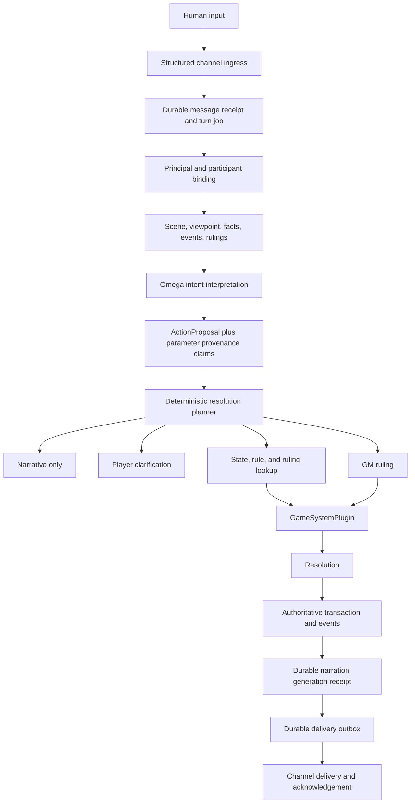
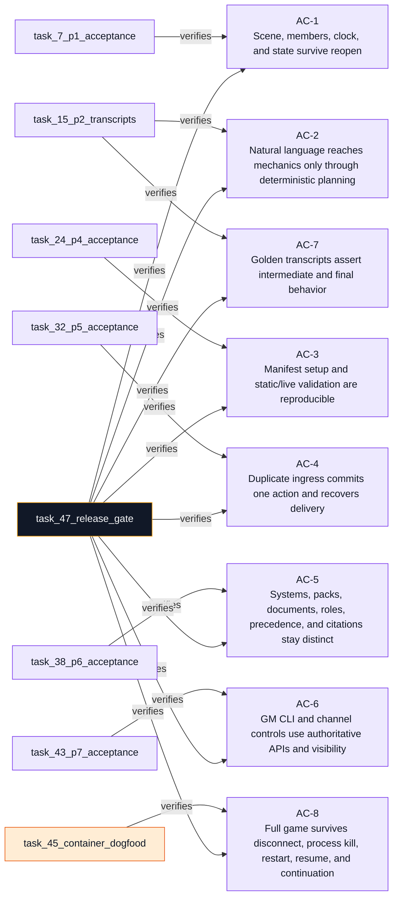

# Playability Hardening Milestone Implementation Plan

**Goal:** Let a real GM and players configure, validate, start, play, interrupt, inspect, resume, and continue an ordinary natural-language campaign without editing SQLite or relying on chat-history inference.

**Architecture:** SQLite plus immutable campaign events remain authoritative. Scene lifecycle becomes explicit; model output becomes an `ActionProposal`; deterministic planning supplies provenance and routes ambiguity before the existing `GameAction -> GameSystemPlugin -> Resolution -> authoritative commit` path. A durable turn job, linked to channel ingress, scene context, generations, action effects, and delivery outbox, becomes the orchestration record shared by channels, CLI, and GM controls.

**Tech Stack:** Python 3.11, SQLite with WAL and FTS5, dataclasses, `argparse`, PyYAML, pytest, Omega/MeTTa, existing Docker Compose topology, existing Telegram, Slack, Mattermost, IRC, WebSocket, and mock-provider adapters.

---

## Current Context and Assumptions

### Observed repository facts

- `tabletop/storage/migrations/0001_core.sql` already has `scenes`, but P1 lifecycle fields, one-open-scene enforcement, membership, and campaign clock do not exist.
- `tabletop/campaign/event_store.py` declares `scene.opened` and `scene.closed`, but `tabletop/campaign/projections.py` ignores them and `tests/tabletop/test_replay_contract.py` classifies both as declared but unemitted.
- `TabletopRuntime.current_scene()` in `tabletop/runtime.py` is still an unavailable phase-11 stub.
- `tabletop/campaign/resume.py` deliberately reports scene and in-world date as `unknown`; it never reads chat history.
- `tabletop/orchestration/turn.py` is the only supported mechanical path. It calls the active plugin and atomically applies `action.resolved` state changes, but it accepts a caller-built `GameAction` and writes only a diagnostic `turn_receipts` row afterward.
- `tabletop/orchestration/context.py` already defines current-scene, active-entity, recent-event, ruling, relationship, and visibility priorities. `tabletop/orchestration/prompt_context.py` currently collects facts only.
- `src/loop.metta` builds context before receiving a message, suppresses repeated text rather than duplicate message IDs, calls the model, evaluates skill calls, and sends text through process-local channel queues.
- Channel adapters retain useful native identities in memory, then discard most of them: Telegram has chat and message IDs, Slack has channel and timestamp, Mattermost has post IDs, WebSocket has sequence and acknowledgement IDs, and IRC can hash the raw protocol line.
- `tabletop/campaign/readiness.py` has useful static checks but returns string buckets and mixes persisted and environment concerns. `campaign validate --format json` exists, but stable check IDs and exit-code classes do not.
- `tabletop/documents/content_pack.py`, Markdown/PDF ingestors, lexical/vector retrieval, and `tabletop/retrieval/precedence.py` already establish non-executable content, provenance, and deterministic retrieval tiers. Ordinary CLI ingestion does not index chunks and does not honor pack type, system compatibility, or `gm_only` end to end.
- `tabletop/campaign/rulings.py`, `RulingStore`, and existing retrieval precedence already provide campaign precedent. This must be reused rather than replaced.
- `tabletop/api/workspace.py` and `plugins/tabletop/tabletop.metta` expose GM operations as skills, not as a slash-command language. The GM controls milestone must add one command router used by both CLI and channel control handling.
- `tests/integration/` already has opt-in Docker and Omega tests for startup, prompt context, sender principals, Compose topology, and SQLite persistence. `Autotests/mock_websocket/` and `Autotests/mock/` provide deterministic model and transport controls.

### Plan decisions

1. The setup manifest will be named `campaign.setup.yaml` by default. The existing `examples/campaigns/*/campaign.yaml` files are generated projections, so overloading that name would create two meanings in one directory. `campaign setup --from PATH` will still accept any explicit path, including a file named `campaign.yaml`.
2. Natural-language interpretation stays in Omega's existing model loop. The pure-Python runtime will not gain an LLM client. Omega will call a new `submit-action` skill with an `ActionProposal`; deterministic code decides whether and how it becomes a `GameAction`.
3. The existing `resolve-action` skill will be removed from model-facing registration after `submit-action` is proven. The Python runtime method and `play_turn()` remain internal deterministic seams for tests and trusted orchestration, not alternate model authority.
4. Scene rows will keep plugin-owned `system_state`; mutable narrative state remains in events, facts, relationships, and other existing campaign records.
5. Ending a session will close its current open scene before `session.ended`. Resume will return the latest scene even when closed, so scene B remains inspectable after restart.
6. The setup flow configures and validates. It will end with authoritative `campaign start` commands rather than silently starting external processes.
7. A channel can guarantee exactly-once remote delivery only when the remote protocol supplies stable idempotency and acknowledgement. WebSocket `client_seq` plus server acknowledgement is the release-gate exactly-once transport. Telegram, Slack, Mattermost, and IRC will use durable at-least-once delivery with stable delivery IDs and explicit ambiguous-delivery state; the system will never claim stronger semantics than the transport provides.
8. The turn effect ledger prevents duplicate authoritative mutations. Delivery retries never rerun an action.
9. `/gm retry-generation` retries only the current non-authoritative generation phase. `/gm retry-delivery` resends stored output. A committed mechanical action is never rerun by either command.
10. Tracker ID is `PLAYABILITY-1`; the implementation branch must be named exactly `PLAYABILITY-1`.

## Target turn architecture

This diagram describes runtime structure, not task dependencies.



## Adaptive execution contract

Once implementation is authorized, repeat this loop until the milestone is verified or no useful in-scope action remains:

1. **Read and reconcile.** Read this plan first. Compare its checkpoint with the actual workspace, branch, migrations, tests, containers, and any user changes. Preserve user work. Mark one ready task `in_progress`; never start a task with an incomplete dependency.
2. **Check and record.** Before dependent work, record the check time, task, environment or commit, expected result, observed result, outcome (`pass`, `fail`, `inconclusive`, or `not applicable`), and sanitized evidence reference. An expected red test is a pass only when it fails for the intended missing behavior.
3. **Correct the plan.** If evidence disproves a path, record the old assumption, finding, revised approach, affected task IDs, invalidated checks, and checks to reopen. Change the active task, dependencies, commands, files, and diagram together. Preserve superseded evidence.
4. **Act within scope.** Make the smallest evidence-supported change that satisfies the current task. Do not add speculative infrastructure, broaden authority, weaken validation, or turn a test gap into a pass.
5. **Revalidate.** Run the focused test, then the affected phase suite. Reopen dependent results when a correction invalidates them. Do not rerun unrelated checks without a reason.
6. **Checkpoint and continue.** After each meaningful check, update frontmatter statuses, dependency graph, task instructions, current checkpoint, and evidence log together. Before interruption, save an exact next action whose dependencies are satisfied.

If the same check fails again without new evidence, change the diagnostic method. If the workspace, provider, Docker daemon, or credentials are unavailable, record the precise gap and continue independent tasks. Never convert missing evidence into success.

## Current execution checkpoint

| Field | Current state |
|---|---|
| Phase | P1 through P5 complete. P6 Content Authority not started. |
| Active task | Task 33: content catalog schema |
| Last confirmed result | `python3.11 -m pytest tests/ -q` -> 1388 passed, 7 skipped at commit f9c0a25 (baseline was 885 passed, 7 skipped) |
| Current approach | P1 proved scene authority across a restart. P2 proved natural language reaches mechanics only through deterministic planning. P3 made setup reproducible. P4 made validation machine-readable. P5 made the turn durable: one effect per turn, receipt-first ingress, and delivery guarantees that do not overstate the transport. Continue with P6. |
| Blockers / open decisions | None. Docker is unavailable in this environment, so the P8 container gate (Tasks 45 and 47 step 3) will be recorded `inconclusive` rather than pass. |
| Next action | Task 21: add `tabletop/campaign/validation.py` with stable structured check IDs |

## Proposed pull-request slices

The tasks are smaller than review units. Keep these PR boundaries unless repository evidence requires a documented change.

| PR | Tasks | Deliverable |
|---|---|---|
| PR 1 | 1 through 3 | Scene schema, typed store, events, replay |
| PR 2 | 4 and 5 | Scene runtime, resume, prompt context |
| PR 3 | 6 and 7 | Scene CLI and restart proof |
| PR 4 | 8 and 9 | Proposal and provenance contracts |
| PR 5 | 10 and 11 | Planner, clarification, rule and ruling routing |
| PR 6 | 12 and 13 | Runtime and Omega clean cutover |
| PR 7 | 14 and 15 | Golden transcript harness and cases |
| PR 8 | 16 and 17 | Setup manifest, plan, dry run, apply |
| PR 9 | 18 through 20 | Wizard, starting scene, idempotency |
| PR 10 | 21 | Structured static validation |
| PR 11 | 22 through 24 | Live probes, JSON, exit codes |
| PR 12 | 25 through 27 | Durable turn schema and state machine |
| PR 13 | 28 and 29 | Structured ingress and loop integration |
| PR 14 | 30 through 32 | Action and delivery recovery |
| PR 15 | 33 and 34 | Content catalog and installation |
| PR 16 | 35 | Campaign attachment and document roles |
| PR 17 | 36 through 38 | Authority retrieval, citations, acceptance |
| PR 18 | 39 and 40 | GM status, inspection, scene, ruling, canon |
| PR 19 | 41 | Turn recovery and pause controls |
| PR 20 | 42 and 43 | GM explain and dual-surface acceptance |
| PR 21 | 44 through 47 | Full dogfood, cleanup, release gate |

Do not open or merge PRs unless separately authorized. Opening a PR does not authorize a merge.

## Task dependency graph

```mermaid
flowchart TD
  subgraph prepare["Prepare"]
    task_0_branch_baseline(["☐ task-0-branch-baseline<br/>Create PLAYABILITY-1 branch and baseline"])
  end
  subgraph p1["P1 Scene Lifecycle"]
    task_1_scene_schema{{"☐ task-1-scene-schema<br/>Add scene, membership, and clock schema"}}
    task_2_scene_store{{"☐ task-2-scene-store<br/>Implement typed scene persistence"}}
    task_3_scene_events{{"☐ task-3-scene-events<br/>Emit and replay scene events"}}
    task_4_scene_runtime{{"☐ task-4-scene-runtime<br/>Add scene runtime operations"}}
    task_5_scene_resume_context{{"☐ task-5-scene-resume-context<br/>Consume structured resume state"}}
    task_6_scene_cli{{"☐ task-6-scene-cli<br/>Add scene and time CLI"}}
    task_7_p1_acceptance(["☐ task-7-p1-acceptance<br/>Prove scene restart recovery"])
  end
  subgraph p2["P2 Natural Language"]
    task_8_proposal_contract{{"☐ task-8-proposal-contract<br/>Add ActionProposal contract"}}
    task_9_provenance_contract{{"☐ task-9-provenance-contract<br/>Add parameter provenance"}}
    task_10_planner_contract{{"☐ task-10-planner-contract<br/>Implement deterministic planner"}}
    task_11_clarification_routing{{"☐ task-11-clarification-routing<br/>Route clarification and lookup"}}
    task_12_proposal_runtime{{"☐ task-12-proposal-runtime<br/>Integrate plugin-only resolution"}}
    task_13_proposal_skill_cutover{{"☐ task-13-proposal-skill-cutover<br/>Cut Omega over to submit-action"}}
    task_14_transcript_harness(["☐ task-14-transcript-harness<br/>Build transcript runner"])
    task_15_p2_transcripts(["☐ task-15-p2-transcripts<br/>Add fourteen transcript cases"])
  end
  subgraph p34["P3 Setup and P4 Validation"]
    task_16_setup_manifest{{"☐ task-16-setup-manifest<br/>Define setup manifest"}}
    task_17_setup_planner{{"☐ task-17-setup-planner<br/>Add dry-run and idempotent apply"}}
    task_18_setup_wizard{{"☐ task-18-setup-wizard<br/>Add setup wizard CLI"}}
    task_19_setup_starting_scene{{"☐ task-19-setup-starting-scene<br/>Materialize starting scene"}}
    task_20_p3_acceptance(["☐ task-20-p3-acceptance<br/>Prove setup idempotency"])
    task_21_validation_model{{"☐ task-21-validation-model<br/>Add structured static validation"}}
    task_22_live_probes{{"☐ task-22-live-probes<br/>Add live environment probes"}}
    task_23_validation_cli{{"☐ task-23-validation-cli<br/>Add JSON and exit codes"}}
    task_24_p4_acceptance(["☐ task-24-p4-acceptance<br/>Prove validation behavior"])
  end
  subgraph p5["P5 Durable Turns"]
    task_25_turn_schema{{"☐ task-25-turn-schema<br/>Add turn and effect schema"}}
    task_26_generation_delivery_schema{{"☐ task-26-generation-delivery-schema<br/>Add generation and outbox schema"}}
    task_27_turn_state_machine{{"☐ task-27-turn-state-machine<br/>Implement turn state machine"}}
    task_28_structured_ingress{{"☐ task-28-structured-ingress<br/>Preserve channel message identity"}}
    task_29_loop_turn_integration{{"☐ task-29-loop-turn-integration<br/>Make Omega loop receipt-first"}}
    task_30_action_recovery{{"☐ task-30-action-recovery<br/>Commit action effects once"}}
    task_31_delivery_recovery{{"☐ task-31-delivery-recovery<br/>Recover delivery without replay"}}
    task_32_p5_acceptance(["☐ task-32-p5-acceptance<br/>Prove disconnect recovery"])
  end
  subgraph p6["P6 Content Authority"]
    task_33_content_schema{{"☐ task-33-content-schema<br/>Add content catalog schema"}}
    task_34_content_install{{"☐ task-34-content-install<br/>Add inspect, install, and list"}}
    task_35_content_attach{{"☐ task-35-content-attach<br/>Add campaign attachment and roles"}}
    task_36_authority_retrieval{{"☐ task-36-authority-retrieval<br/>Add authority-aware retrieval"}}
    task_37_rule_citations{{"☐ task-37-rule-citations<br/>Persist exact rule evidence"}}
    task_38_p6_acceptance(["☐ task-38-p6-acceptance<br/>Prove content trust and authority"])
  end
  subgraph p78["P7 GM and P8 Dogfood"]
    task_39_gm_router{{"☐ task-39-gm-router<br/>Build GM command router"}}
    task_40_gm_scene_canon{{"☐ task-40-gm-scene-canon<br/>Route scene and canon controls"}}
    task_41_gm_turn_pause{{"☐ task-41-gm-turn-pause<br/>Add turn recovery and pause"}}
    task_42_gm_explain{{"☐ task-42-gm-explain<br/>Implement turn explanation"}}
    task_43_p7_acceptance(["☐ task-43-p7-acceptance<br/>Prove GM surfaces"])
    task_44_deterministic_dogfood(["☐ task-44-deterministic-dogfood<br/>Add deterministic full dogfood"])
    task_45_container_dogfood(["☐ task-45-container-dogfood<br/>Add Compose restart dogfood"])
    task_46_dogfood_cleanup([["☐ task-46-dogfood-cleanup<br/>Remove obsolete paths and document"]])
    task_47_release_gate{"☐ task-47-release-gate<br/>Run and record release gate"}
  end

  task_0_branch_baseline -->|PLAYABILITY-1 and clean baseline| task_1_scene_schema
  task_1_scene_schema -->|schema accepted| task_2_scene_store
  task_2_scene_store -->|invariants pass| task_3_scene_events
  task_3_scene_events -->|replay complete| task_4_scene_runtime
  task_4_scene_runtime -->|runtime API works| task_5_scene_resume_context
  task_5_scene_resume_context -->|snapshot consumed| task_6_scene_cli
  task_6_scene_cli -->|CLI works| task_7_p1_acceptance
  task_7_p1_acceptance -->|scene foundation accepted| task_8_proposal_contract
  task_8_proposal_contract -->|proposal parses| task_9_provenance_contract
  task_9_provenance_contract -->|requirements declared| task_10_planner_contract
  task_10_planner_contract -->|dispositions deterministic| task_11_clarification_routing
  task_11_clarification_routing -->|ambiguity routed| task_12_proposal_runtime
  task_12_proposal_runtime -->|plugin guard preserved| task_13_proposal_skill_cutover
  task_13_proposal_skill_cutover -->|skill surface changed| task_14_transcript_harness
  task_14_transcript_harness -->|runner works| task_15_p2_transcripts

  task_7_p1_acceptance -->|scene services available| task_16_setup_manifest
  task_16_setup_manifest -->|strict manifest parses| task_17_setup_planner
  task_17_setup_planner -->|dry-run plan exists| task_18_setup_wizard
  task_18_setup_wizard -->|interactive paths work| task_19_setup_starting_scene
  task_4_scene_runtime -->|scene open API available| task_19_setup_starting_scene
  task_19_setup_starting_scene -->|setup complete| task_20_p3_acceptance
  task_20_p3_acceptance -->|configured campaign exists| task_21_validation_model
  task_21_validation_model -->|static report structured| task_22_live_probes
  task_22_live_probes -->|probes available| task_23_validation_cli
  task_23_validation_cli -->|exit contract implemented| task_24_p4_acceptance

  task_7_p1_acceptance -->|scene context available| task_25_turn_schema
  task_12_proposal_runtime -->|proposal phase known| task_25_turn_schema
  task_25_turn_schema -->|turn identity persisted| task_26_generation_delivery_schema
  task_26_generation_delivery_schema -->|receipts and outbox exist| task_27_turn_state_machine
  task_27_turn_state_machine -->|legal transitions exist| task_28_structured_ingress
  task_28_structured_ingress -->|native IDs preserved| task_29_loop_turn_integration
  task_13_proposal_skill_cutover -->|submit-action registered| task_29_loop_turn_integration
  task_29_loop_turn_integration -->|one loop owns one turn| task_30_action_recovery
  task_11_clarification_routing -->|clarification phases persisted| task_30_action_recovery
  task_30_action_recovery -->|effects commit once| task_31_delivery_recovery
  task_31_delivery_recovery -->|stored output retries| task_32_p5_acceptance

  task_20_p3_acceptance -->|setup content references available| task_33_content_schema
  task_7_p1_acceptance -->|campaign authority stable| task_33_content_schema
  task_33_content_schema -->|catalog constraints pass| task_34_content_install
  task_34_content_install -->|installed records exist| task_35_content_attach
  task_35_content_attach -->|bindings and roles exist| task_36_authority_retrieval
  task_11_clarification_routing -->|lookup interface fixed| task_36_authority_retrieval
  task_36_authority_retrieval -->|authority winner deterministic| task_37_rule_citations
  task_37_rule_citations -->|sources preserved| task_38_p6_acceptance

  task_32_p5_acceptance -->|turn APIs available| task_39_gm_router
  task_38_p6_acceptance -->|content evidence available| task_39_gm_router
  task_39_gm_router -->|inspection dispatch works| task_40_gm_scene_canon
  task_6_scene_cli -->|scene commands exist| task_40_gm_scene_canon
  task_40_gm_scene_canon -->|authority controls exist| task_41_gm_turn_pause
  task_27_turn_state_machine -->|recovery transitions known| task_41_gm_turn_pause
  task_41_gm_turn_pause -->|controls routed| task_42_gm_explain
  task_37_rule_citations -->|citation evidence stored| task_42_gm_explain
  task_42_gm_explain -->|explanation complete| task_43_p7_acceptance

  task_15_p2_transcripts -->|golden behavior available| task_44_deterministic_dogfood
  task_24_p4_acceptance -->|validation gate available| task_44_deterministic_dogfood
  task_32_p5_acceptance -->|durability gate available| task_44_deterministic_dogfood
  task_38_p6_acceptance -->|content gate available| task_44_deterministic_dogfood
  task_43_p7_acceptance -->|GM controls available| task_45_container_dogfood
  task_44_deterministic_dogfood -->|deterministic sequence passes| task_45_container_dogfood
  task_45_container_dogfood -->|real interfaces pass| task_46_dogfood_cleanup
  task_46_dogfood_cleanup -->|clean cutover complete| task_47_release_gate

  classDef evidence fill:#ede9fe,stroke:#7c3aed,color:#111827
  classDef data fill:#fee2e2,stroke:#dc2626,color:#111827
  classDef runtime fill:#ffedd5,stroke:#ea580c,color:#111827
  classDef gate fill:#111827,stroke:#f59e0b,color:#f8fafc
  class task_0_branch_baseline,task_7_p1_acceptance,task_14_transcript_harness,task_15_p2_transcripts,task_20_p3_acceptance,task_24_p4_acceptance,task_32_p5_acceptance,task_38_p6_acceptance,task_43_p7_acceptance,task_44_deterministic_dogfood,task_45_container_dogfood evidence
  class task_1_scene_schema,task_2_scene_store,task_3_scene_events,task_8_proposal_contract,task_9_provenance_contract,task_10_planner_contract,task_11_clarification_routing,task_12_proposal_runtime,task_16_setup_manifest,task_17_setup_planner,task_21_validation_model,task_25_turn_schema,task_26_generation_delivery_schema,task_28_structured_ingress,task_33_content_schema,task_34_content_install,task_35_content_attach,task_36_authority_retrieval,task_37_rule_citations data
  class task_4_scene_runtime,task_5_scene_resume_context,task_6_scene_cli,task_13_proposal_skill_cutover,task_18_setup_wizard,task_19_setup_starting_scene,task_22_live_probes,task_23_validation_cli,task_27_turn_state_machine,task_29_loop_turn_integration,task_30_action_recovery,task_31_delivery_recovery,task_39_gm_router,task_40_gm_scene_canon,task_41_gm_turn_pause,task_42_gm_explain runtime
  class task_46_dogfood_cleanup data
  class task_47_release_gate gate
  style prepare fill:#f5f3ff,stroke:#7c3aed,color:#111827
  style p1 fill:#fff7f7,stroke:#dc2626,color:#111827
  style p2 fill:#fff7f7,stroke:#dc2626,color:#111827
  style p34 fill:#f5f3ff,stroke:#7c3aed,color:#111827
  style p5 fill:#fff7f7,stroke:#dc2626,color:#111827
  style p6 fill:#fff7f7,stroke:#dc2626,color:#111827
  style p78 fill:#f8fafc,stroke:#111827,color:#111827
```

## Detailed tasks

### Task 0: Create `PLAYABILITY-1` branch and record baseline

**Objective:** Satisfy repository branch policy and establish a truthful starting point before code changes.

**Files:**
- Modify: `.agents/plans/2026-09-25_002000-playability-hardening.plan.md`
- No project code changes

**Steps:**
1. Create branch `PLAYABILITY-1` from the repository's current integration branch.
2. Do not create a second descriptive branch variant; the user assigned `PLAYABILITY-1` as the tracker ID.
3. Record branch, commit, Python version, SQLite version, and Docker availability in the evidence log.
4. Run: `python3.11 -m pytest tests/ -q`.
5. Expected: record the exact baseline result. A failure is a baseline fact, not permission to weaken or delete the test.

### Task 1: Add authoritative scene, membership, and clock schema

**Objective:** Replace the incomplete scene shape with the minimum authoritative P1 schema while preserving existing rows.

**Files:**
- Create: `tabletop/storage/migrations/0021_scene_lifecycle.sql`
- Modify: `tests/tabletop/test_schema_core.py`
- Test: `tests/tabletop/test_storage_sqlite.py`

**Steps:**
1. Write migration tests for legacy scene backfill, one open scene per session, presence types, and one campaign clock row.
2. Run: `python3.11 -m pytest tests/tabletop/test_schema_core.py -q`.
3. Expected: fail because migration `0021_scene_lifecycle.sql` and new columns/tables do not exist.
4. Implement an append-only migration that rebuilds or alters `scenes` to include `status`, `location_entity_id`, `in_world_started_at`, `in_world_ended_at`, `started_at`, and `ended_at`; add `scene_members`; add `campaign_clock`; add the partial unique open-scene index; add same-campaign triggers; preserve `system_state`.
5. Run the focused schema tests. Expected: pass, including migration from a database containing the existing 20 migrations.

### Task 2: Implement typed scene persistence

**Objective:** Add one store boundary for scene, presence, and game-time invariants.

**Files:**
- Create: `tabletop/campaign/scenes.py`
- Modify: `tabletop/campaign/models.py`
- Modify: `tabletop/campaign/__init__.py`
- Test: `tests/tabletop/test_scene_store.py`

**Steps:**
1. Write behavior tests for open, close, enter, exit, location change, time set, re-entry, invalid presence, archived campaign, closed session, and second open scene.
2. Run: `python3.11 -m pytest tests/tabletop/test_scene_store.py -q`.
3. Expected: fail because `SceneStore` and typed models are absent.
4. Implement frozen `Scene`, `SceneMember`, and `GameTime` models plus `SceneStore` transaction methods. Visibility must not be stored in presence.
5. Run the focused tests. Expected: pass and no method mutates SQLite outside its declared transaction.

### Task 3: Emit and replay scene events

**Objective:** Make scene state reconstructable from immutable events.

**Files:**
- Modify: `tabletop/campaign/event_store.py`
- Modify: `tabletop/campaign/projections.py`
- Modify: `tabletop/campaign/replay_fidelity.py`
- Modify: `tests/tabletop/test_replay_contract.py`
- Test: `tests/tabletop/test_scene_events.py`

**Steps:**
1. Write failing tests for `scene.opened`, `scene.closed`, `scene.entity_entered`, `scene.entity_exited`, `scene.location_changed`, and `scene.time_changed` payloads, transactional rollback, and replay equality.
2. Run: `python3.11 -m pytest tests/tabletop/test_scene_events.py tests/tabletop/test_replay_contract.py -q`.
3. Expected: fail because four event types are missing and scene events are ignored by replay.
4. Add typed event payloads and projection records for scene identity, lifecycle, members, location, and campaign clock. Move scene events from `DECLARED_BUT_UNEMITTED` to `REPLAY_REQUIRED`.
5. Run the focused tests. Expected: pass, with each required event changing replay and orphans rejected.

### Task 4: Add scene runtime operations and session-safe transitions

**Objective:** Expose one authoritative runtime API for scene lifecycle and make session end structurally safe.

**Files:**
- Modify: `tabletop/runtime.py`
- Modify: `tabletop/orchestration/session.py`
- Modify: `tabletop/orchestration/turn.py`
- Modify: `tabletop/api/workspace.py`
- Test: `tests/tabletop/test_scene_runtime.py`
- Modify: `tests/tabletop/test_session_model.py`
- Modify: `tests/tabletop/test_turn_loop.py`

**Steps:**
1. Write failing runtime tests for `open_scene`, `close_scene`, `transition_scene`, `get_current_scene`, `enter_scene`, `exit_scene`, `get_game_time`, and `set_game_time`.
2. Add tests proving `transition_scene` closes A and opens B in one transaction, `end_session` closes the current scene before `session.ended`, and turn effects default to the current scene.
3. Run: `python3.11 -m pytest tests/tabletop/test_scene_runtime.py tests/tabletop/test_session_model.py tests/tabletop/test_turn_loop.py -q`.
4. Expected: fail because the runtime methods are absent and turn results are not session/scene-bound.
5. Implement the methods by composing `SceneStore`, `EventStore`, campaign archive checks, and existing session authority. Do not add a second lifecycle service.
6. Run the focused tests. Expected: pass and failed transitions leave neither rows nor events.

### Task 5: Make resume and prompt context consume structured scene state

**Objective:** Remove scene inference and feed the same structured snapshot to operators and models.

**Files:**
- Modify: `tabletop/campaign/resume.py`
- Modify: `tabletop/orchestration/prompt_context.py`
- Modify: `tabletop/orchestration/context.py`
- Modify: `tabletop/campaign/visibility.py`
- Test: `tests/tabletop/test_import_review.py`
- Modify: `tests/tabletop/test_prompt_context.py`
- Test: `tests/tabletop/test_scene_resume.py`

**Steps:**
1. Write tests for the required JSON keys: `session`, `scene`, `present_entities`, `recent_events`, `active_rulings`, `relevant_facts`, and `pending_contradictions`, plus campaign identity and pending import diagnostics.
2. Write GM and player tests proving GM-only facts and private NPC data never enter a player snapshot.
3. Run: `python3.11 -m pytest tests/tabletop/test_scene_resume.py tests/tabletop/test_prompt_context.py -q`.
4. Expected: fail because resume returns `unknown` and the context provider reads only facts.
5. Implement one read-only structured snapshot function with an explicit viewpoint. Make both resume and `_LibraryContextSource` consume it; do not query chat history or summarize transcripts.
6. Run the focused tests. Expected: pass and context construction writes no campaign events.

### Task 6: Add scene and campaign-time CLI

**Objective:** Add the requested operator commands over runtime services.

**Files:**
- Modify: `tabletop/cli/parser.py`
- Modify: `tabletop/cli/handlers.py`
- Test: `tests/tabletop/test_cli_scene.py`
- Modify: `tests/tabletop/test_cli_entry.py`

**Steps:**
1. Write subprocess tests for `campaign scene show|open|close|transition|enter|exit` and `campaign time show|set`.
2. Run: `python3.11 -m pytest tests/tabletop/test_cli_scene.py -q`.
3. Expected: argparse rejects the missing subcommands.
4. Implement handlers that resolve campaign/session/scene once and call the P1 runtime methods. Return nonzero for invalid transitions and archived campaigns.
5. Run the focused CLI tests. Expected: pass with no direct scene SQL in `handlers.py`.

### Task 7: Prove P1 scene recovery

**Objective:** Satisfy the P1 definition of done through real CLI processes and a reopened database.

**Files:**
- Test: `tests/tabletop/test_p1_scene_restart.py`
- Modify: `docs/campaign-model.md`
- Modify: `docs/architecture.md`

**Steps:**
1. Write a subprocess scenario: create campaign, start session, open scene A, add PC/NPC presence, mutate world state, transition to B, end session, close all handles, reopen the database, and resume.
2. Put deliberately unrelated text in `memory/history.metta` and prove it is not read or echoed.
3. Run: `python3.11 -m pytest tests/tabletop/test_p1_scene_restart.py -q`.
4. Expected: fail until the full structured snapshot and close ordering work.
5. Update the canonical schema and architecture docs with the implemented events, invariants, clock, and resume contract.
6. Run: `python3.11 -m pytest tests/tabletop/test_scene_runtime.py tests/tabletop/test_scene_resume.py tests/tabletop/test_cli_scene.py tests/tabletop/test_p1_scene_restart.py -q`. Expected: pass.

### Task 8: Add the ActionProposal contract

**Objective:** Make model intent richer than `GameAction` while keeping mechanical authority downstream.

**Files:**
- Modify: `tabletop/api/actions.py`
- Modify: `tabletop/api/__init__.py`
- Modify: `tabletop/api/errors.py`
- Test: `tests/tabletop/test_action_proposal.py`

**Steps:**
1. Write contract tests for `actor_id`, `intent`, `proposed_action_type`, `target_refs`, `parameters`, `uncertainty`, and `needs_resolution`, including malformed and JSON-safe validation.
2. Run: `python3.11 -m pytest tests/tabletop/test_action_proposal.py -q`.
3. Expected: fail because `ActionProposal` is absent.
4. Implement a frozen `ActionProposal` and strict `parse_action_proposal()` beside `GameAction`. Do not add an LLM client or persistence here.
5. Run the focused tests. Expected: pass and proposal parsing cannot create authoritative state.

### Task 9: Add parameter provenance and plugin action requirements

**Objective:** Prevent a model-only value from authorizing a mechanical rules parameter.

**Files:**
- Modify: `tabletop/api/actions.py`
- Modify: `tabletop/api/plugin.py`
- Modify: `systems/freeform/__init__.py`
- Modify: `systems/dnd5e/__init__.py`
- Modify: `systems/gurps/__init__.py`
- Test: `tests/tabletop/test_parameter_provenance.py`
- Modify: `tests/tabletop/test_plugin_api.py`
- Modify: `tests/tabletop/test_dnd5e_system.py`
- Modify: `tests/tabletop/test_freeform_system.py`
- Modify: `tests/tabletop/test_gurps_system.py`

**Steps:**
1. Write tests for `MechanicalParameter(name, value, source, reference)`, closed source values, and rejection of unresolved authoritative parameters.
2. Add a default `GameSystemPlugin.action_requirements(action_type)` contract and require built-ins to declare parameters such as D&D `ability_check.dc`; do not add a second plugin interface version for a default method.
3. Run: `python3.11 -m pytest tests/tabletop/test_parameter_provenance.py tests/tabletop/test_plugin_api.py -q`.
4. Expected: fail because provenance and requirements are absent.
5. Implement the minimal contracts and built-in declarations. Model proposals default to source `model_proposal`, which cannot satisfy a rules-authoritative requirement.
6. Run the focused plugin tests. Expected: pass with existing resolvers still receiving ordinary parameter values.

### Task 10: Implement the deterministic resolution planner

**Objective:** Route every proposal to one explicit disposition without calling the model or mutating state.

**Files:**
- Create: `tabletop/orchestration/planner.py`
- Modify: `tabletop/orchestration/adjudication.py`
- Test: `tests/tabletop/test_resolution_planner.py`

**Steps:**
1. Write table-driven tests for `RESOLVE`, `NARRATIVE`, `PLAYER_CLARIFICATION`, `GM_RULING`, `RULE_LOOKUP`, `STATE_LOOKUP`, and `UNSUPPORTED`.
2. Include multiple targets, target not present, missing actor control, no proposed action type, unknown action type, authoritative DC present, and model-only DC absent.
3. Run: `python3.11 -m pytest tests/tabletop/test_resolution_planner.py -q`.
4. Expected: fail because no planner exists.
5. Implement `plan_resolution(proposal, plugin, context, state, rules, rulings)` as a pure decision function returning the next requirement or a sanitized `GameAction`. It must not persist, roll, retrieve by itself, or call a model.
6. Run the focused tests. Expected: pass and repeated calls return equal structured plans.

### Task 11: Route clarification, state, rules, and GM ruling

**Objective:** Resolve missing intent or mechanics in the required order without escalating player ambiguity to the GM.

**Files:**
- Create: `tabletop/orchestration/clarification.py`
- Modify: `tabletop/orchestration/planner.py`
- Modify: `tabletop/campaign/rulings.py`
- Modify: `tabletop/retrieval/precedence.py`
- Test: `tests/tabletop/test_clarification_routing.py`
- Modify: `tests/tabletop/test_rulings.py`
- Modify: `tests/tabletop/test_precedence.py`

**Steps:**
1. Write tests proving multiple present hostiles produce `PLAYER_CLARIFICATION`, not a GM question.
2. Write lookup-order tests: plugin/state, attached authoritative rules, current unsuperseded ruling, then GM ruling.
3. Write tests proving a model-proposed DC with no authoritative source cannot reach the plugin.
4. Run: `python3.11 -m pytest tests/tabletop/test_clarification_routing.py -q`.
5. Expected: fail because routing and reusable lookup inputs are missing.
6. Implement typed clarification requests, player answers that bind to one pending turn, and rule/ruling lookup adapters. Preserve citations and confirmed-ruling supersession.
7. Run focused planner, ruling, and precedence tests. Expected: pass and no lookup writes facts or rulings implicitly.

### Task 12: Integrate proposal submission with plugin-only resolution

**Objective:** Add the canonical runtime entry from proposal to existing mechanical resolution.

**Files:**
- Modify: `tabletop/orchestration/turn.py`
- Modify: `tabletop/runtime.py`
- Test: `tests/tabletop/test_turn_loop.py`
- Test: `tests/tabletop/test_proposal_runtime.py`

**Steps:**
1. Write tests for narrative-only, player clarification, rule-filled ability check, GM ruling retry, unsupported mechanic, and player actor control through `TabletopRuntime`.
2. Run: `python3.11 -m pytest tests/tabletop/test_proposal_runtime.py tests/tabletop/test_turn_loop.py -q`.
3. Expected: fail because runtime accepts only structured actions.
4. Implement `submit_action(proposal)` by planning, acquiring authoritative parameters, constructing `GameAction`, and calling the existing `play_turn()` unchanged at the mechanical boundary.
5. Run the focused tests. Expected: pass; only `GameSystemPlugin` produces rolls/outcomes/state changes.

### Task 13: Cut Omega over to `submit-action`

**Objective:** Remove the model-facing structured-action bypass and register the explicit interpretation stage.

**Files:**
- Modify: `tabletop/api/workspace.py`
- Modify: `plugins/tabletop/tabletop.metta`
- Modify: `plugins/tabletop/omega_tabletop_adapter.py`
- Modify: `plugins/tabletop/prompt.md`
- Modify: `tests/tabletop/test_workspace_skills.py`
- Modify: `tests/tabletop/test_phase5_adapter.py`
- Modify: `tests/integration/test_omega_startup.py`

**Steps:**
1. Write tests that campaign/player workspaces expose `submit-action` and no longer expose `resolve-action` to Omega.
2. Add prompt guidance that dialogue and description need no mechanical skill, while a mechanical proposal must include uncertainty and must not invent a DC.
3. Run: `python3.11 -m pytest tests/tabletop/test_workspace_skills.py tests/tabletop/test_phase5_adapter.py -q`.
4. Expected: fail because both action skills are still present.
5. Implement thin adapter and MeTTa wrappers. Delete the obsolete model-facing registration and skill definitions; keep no compatibility alias.
6. Run the focused tests and the existing action-resolution suite. Expected: pass and the Python plugin guard remains covered.

### Task 14: Build the golden transcript runner

**Objective:** Make model proposals, planner decisions, authority effects, and final response observable without prose equality.

**Files:**
- Create: `tests/play_transcripts/__init__.py`
- Create: `tests/play_transcripts/runner.py`
- Create: `tests/play_transcripts/schema.py`
- Test: `tests/play_transcripts/test_runner.py`

**Steps:**
1. Define a case format with input, scripted model proposal(s), expected plan disposition, expected authority calls, expected events/state, allowed response predicates, visibility expectations, and secret sentinels.
2. Write runner tests proving it asserts intermediate structure and semantic response predicates rather than exact prose.
3. Run: `python3.11 -m pytest tests/play_transcripts/test_runner.py -q`.
4. Expected: fail because the runner is absent.
5. Implement the smallest fixture runner around the real runtime and a scripted proposal source. Live model execution belongs in P8; P2 tests deterministic orchestration.
6. Run the runner tests. Expected: pass and failed intermediate assertions identify the exact phase.

### Task 15: Add the fourteen P2 transcript cases

**Objective:** Cover the required natural-language behavior and adversarial boundaries.

**Files:**
- Create: fourteen `tests/play_transcripts/cases/*.yaml` files
- Create: `tests/play_transcripts/test_cases.py`
- Modify: `docs/action-resolution.md`

**Steps:**
1. Add cases for obvious mechanical action, dialogue, description, ambiguous target, unknown DC, unsupported mechanic, multiple actions, conditional action, interrupted action, secret-dependent action, impossible action, GM override, player state assertion, and prompt injection. The last two extend the minimum list because they are explicit acceptance requirements.
2. Assert intermediate proposal and planner output plus final response predicates, events, state deltas, and hidden sentinels for every case.
3. Run: `python3.11 -m pytest tests/play_transcripts -q`.
4. Expected: fail until all required paths exist.
5. Document the proposal, provenance, clarification, and ruling contracts in `docs/action-resolution.md`.
6. Run the full P2 suite. Expected: pass without comparing final prose verbatim.

### Task 16: Define the declarative setup manifest

**Objective:** Add a strict, safe, reproducible campaign configuration format.

**Files:**
- Create: `tabletop/campaign/setup.py`
- Create: `examples/campaigns/setup/campaign.setup.yaml`
- Test: `tests/tabletop/test_setup_manifest.py`
- Modify: `tests/tabletop/test_security_boundaries.py`

**Steps:**
1. Write strict schema tests for campaign identity, system, participants, bindings, characters, content paths, starting state, starting scene, game time, and unknown-field rejection.
2. Write security tests for absolute paths, traversal, symlinks, YAML object tags, executable files, and credential-shaped keys.
3. Run: `python3.11 -m pytest tests/tabletop/test_setup_manifest.py tests/tabletop/test_security_boundaries.py -q`.
4. Expected: fail because the manifest loader is absent.
5. Implement `CampaignSetupManifest` with `yaml.safe_load`, path containment relative to the manifest, stable slugs, and no network or database writes.
6. Run focused tests. Expected: pass and inspection cannot execute campaign material.

### Task 17: Build dry-run planning and idempotent setup application

**Objective:** Turn a manifest into a reviewable plan and apply only missing or identical state.

**Files:**
- Modify: `tabletop/campaign/setup.py`
- Modify: `tabletop/campaign/store.py`
- Modify: `tabletop/campaign/membership.py`
- Test: `tests/tabletop/test_setup_apply.py`

**Steps:**
1. Write tests that produce `CREATE campaign`, `ADD participant`, `BIND principal`, `GRANT character`, `INSTALL content`, `APPLY starting state`, `START session`, and `OPEN scene` actions as applicable.
2. Write rerun tests proving no duplicate campaign, participant, principal, character, document, binding, session, or scene is created.
3. Write conflict tests proving an existing row with different authoritative data fails rather than silently overwriting it.
4. Run: `python3.11 -m pytest tests/tabletop/test_setup_apply.py -q`.
5. Expected: fail because no setup plan or idempotent service exists.
6. Implement plan and apply phases using existing stores and in-transaction primitives. Wrap the database-only portion in one `BEGIN IMMEDIATE`; ingestion may use its own resumable jobs but must be content-addressed.
7. Run focused tests. Expected: pass and dry-run performs zero writes.

### Task 18: Add the setup wizard and from-manifest CLI

**Objective:** Add interactive orchestration without creating a second command implementation.

**Files:**
- Modify: `tabletop/cli/parser.py`
- Modify: `tabletop/cli/handlers.py`
- Create: `tabletop/cli/setup_wizard.py`
- Test: `tests/tabletop/test_cli_setup.py`
- Modify: `tests/tabletop/test_cli_entry.py`

**Steps:**
1. Write subprocess and injected-input tests for the required wizard sequence and `campaign setup --from PATH [--dry-run]`.
2. Test cancel, invalid system, invalid participant, duplicate source, and noninteractive EOF behavior.
3. Run: `python3.11 -m pytest tests/tabletop/test_cli_setup.py -q`.
4. Expected: fail because `campaign setup` is absent.
5. Implement the wizard as prompts that build the same manifest object and call the same plan/apply service. Print the plan and require confirmation before apply.
6. End the wizard with exact `campaign start` commands. Do not launch Docker implicitly.
7. Run focused CLI tests. Expected: pass.

### Task 19: Materialize the configured starting state and scene

**Objective:** Ensure setup uses authoritative campaign, membership, plugin, session, and scene services.

**Files:**
- Modify: `tabletop/campaign/setup.py`
- Modify: `tabletop/campaign/store.py`
- Modify: `tests/tabletop/test_setup_apply.py`
- Test: `tests/tabletop/test_setup_starting_scene.py`

**Steps:**
1. Write tests for plugin state validation, entity creation, character ownership, one open session, one open scene, members, location, and game time.
2. Add a test that setup on an already active campaign updates only declarative configuration allowed before play and never creates a second session/scene.
3. Run: `python3.11 -m pytest tests/tabletop/test_setup_starting_scene.py -q`.
4. Expected: fail until setup composes the P1 services.
5. Implement the apply order: campaign, entities, participants, bindings, controls, content references, state, session, scene, members, time, validation.
6. Run P3 focused tests. Expected: pass and all mutations have their existing events where applicable.

### Task 20: Prove P3 setup idempotency

**Objective:** Establish setup as a reproducible operator interface.

**Files:**
- Test: `tests/tabletop/test_p3_setup_acceptance.py`
- Modify: `examples/campaigns/README.md`
- Create: `examples/campaigns/setup/README.md`

**Steps:**
1. Write a subprocess test that runs dry-run, applies, reruns, and compares authoritative row/event counts and generated manifest.
2. Assert the dry-run database digest is unchanged.
3. Run: `python3.11 -m pytest tests/tabletop/test_p3_setup_acceptance.py -q`.
4. Expected: fail until all setup paths are idempotent.
5. Document manifest, dry-run, apply, rerun, and launch commands.
6. Run the P3 suite. Expected: pass.

### Task 21: Add structured static validation

**Objective:** Replace readiness strings with stable machine-readable checks.

**Files:**
- Create: `tabletop/campaign/validation.py`
- Modify: `tabletop/campaign/readiness.py`
- Test: `tests/tabletop/test_validation.py`
- Modify: `tests/tabletop/test_readiness.py`

**Steps:**
1. Write tests for every required static check: campaign, archive, plugin, plugin state, one GM, identity uniqueness, ownership, imports, database writability, required source paths, current session, and current scene.
2. Assert stable IDs such as `campaign.exists`, `plugin.compatible`, `participant.gm.count`, `database.writable`, and `scene.structure`.
3. Run: `python3.11 -m pytest tests/tabletop/test_validation.py tests/tabletop/test_readiness.py -q`.
4. Expected: fail because checks are string buckets.
5. Implement `ValidationCheck` and `ValidationReport`. Database writability must use a transaction that is rolled back or a savepoint, never a persistent probe row.
6. Run the focused tests. Expected: pass and validation performs no campaign mutation.

### Task 22: Add live environment probes

**Objective:** Implement `--live` as bounded, injectable probes rather than hidden side effects.

**Files:**
- Create: `tabletop/campaign/live_probes.py`
- Modify: `tabletop/campaign/validation.py`
- Test: `tests/tabletop/test_live_probes.py`
- Modify: `tests/integration/test_omega_startup.py`
- Modify: `tests/integration/test_omega_prompt_context.py`

**Steps:**
1. Write fake-probe tests for Docker/Compose, image, Omega startup, provider credentials, model response, channel credentials, retrieval, document access, container SQLite, plugin load, and prompt assembly.
2. Mark actual delivery separately as `channel.probe.delivery` and run it only when requested.
3. Write tests that provider/channel secrets never appear in messages or JSON.
4. Run: `python3.11 -m pytest tests/tabletop/test_live_probes.py -q`.
5. Expected: fail because live checks are absent.
6. Implement explicit probe callables with timeouts and categorized `pass`, `fail`, `warn`, `skip`, and `not_applicable` results. Reuse existing integration setup and mock providers.
7. Run focused tests. Expected: pass without network or Docker access.

### Task 23: Add validation JSON and exit codes

**Objective:** Give operators and future UIs a stable validation contract.

**Files:**
- Modify: `tabletop/cli/parser.py`
- Modify: `tabletop/cli/handlers.py`
- Test: `tests/tabletop/test_cli_validate.py`
- Modify: `tabletop/cli/handlers.py` start-path caller

**Steps:**
1. Write tests for `campaign validate <id>`, `--live`, `--channel-probe`, and `--json` output containing `ready` and `checks`.
2. Assert exit `0` ready, `1` validation failure, `2` runtime/environment failure, and `3` invalid invocation.
3. Run: `python3.11 -m pytest tests/tabletop/test_cli_validate.py -q`.
4. Expected: current CLI cannot produce the requested codes and shape.
5. Implement a CLI argument-error path returning 3 while preserving help exit 0. Migrate `campaign start` to the structured static report.
6. Run the focused suite. Expected: pass.

### Task 24: Prove P4 validation

**Objective:** Verify static, live, JSON, and optional delivery behavior independently.

**Files:**
- Test: `tests/tabletop/test_p4_validation_acceptance.py`
- Modify: `README.md`
- Modify: `docs/architecture.md`

**Steps:**
1. Run fake live probes for every pass/fail/skip combination and assert precedence between validation and runtime exit classes.
2. Run the existing Docker startup and prompt tests under `GAMEMASTER_RUN_DOCKER=1` when the environment is available.
3. Document exact commands and required environment variables without secret values.
4. Run: `python3.11 -m pytest tests/tabletop/test_p4_validation_acceptance.py tests/tabletop/test_readiness.py -q`. Expected: pass.
5. If Docker is available, run: `GAMEMASTER_RUN_DOCKER=1 python3.11 -m pytest tests/integration/test_omega_startup.py tests/integration/test_omega_prompt_context.py -q`. Record actual output.

### Task 25: Add durable turn jobs and per-action effect claims

**Objective:** Make the turn the stable orchestration identity before changing the Omega loop.

**Files:**
- Create: `tabletop/storage/migrations/0022_turn_jobs.sql`
- Create: `tabletop/orchestration/turn_job.py`
- Test: `tests/tabletop/test_turn_job_schema.py`
- Test: `tests/tabletop/test_turn_job_store.py`

**Steps:**
1. Write schema tests for the requested turn fields and statuses plus `resumes_turn_id`, channel, conversation, and external message identity.
2. Enforce unique `(campaign_id, channel, conversation_id, external_message_id)` and unique `(turn_id, ordinal)` action claims.
3. Write store tests for legal transitions, stale leases, awaiting player/GM, and duplicate ingress.
4. Run: `python3.11 -m pytest tests/tabletop/test_turn_job_schema.py tests/tabletop/test_turn_job_store.py -q`.
5. Expected: fail because durable turn storage is absent.
6. Implement append-only migration and a `TurnJobStore`; keep `turn_receipts` for compatibility until Task 26 proves the new receipt cutover.
7. Run focused tests. Expected: pass and duplicate ingress returns the existing turn.

### Task 26: Add generation receipts and a durable delivery outbox

**Objective:** Extend existing receipts into turn-linked operational evidence.

**Files:**
- Create: `tabletop/storage/migrations/0023_generation_delivery.sql`
- Modify: `tabletop/orchestration/prompt_receipt.py`
- Create: `tabletop/orchestration/delivery.py`
- Test: `tests/tabletop/test_generation_receipts.py`
- Test: `tests/tabletop/test_delivery_outbox.py`
- Modify: `tests/tabletop/test_turn_receipt.py`
- Modify: `tests/tabletop/test_prompt_receipt.py`

**Steps:**
1. Write tests for one or more generation receipts per turn, prompt/response hashes, provider/model/token telemetry, output segments, stable delivery IDs, attempts, acknowledgement, and ambiguous state.
2. Run: `python3.11 -m pytest tests/tabletop/test_generation_receipts.py tests/tabletop/test_delivery_outbox.py -q`.
3. Expected: fail because the tables and store are absent.
4. Implement `generation_receipts` and `turn_deliveries`, add `turn_id` to prompt receipts, and migrate old `turn_receipts` rows into generation receipts or a documented legacy terminal state.
5. Run focused tests and existing receipt tests. Expected: pass; receipts remain diagnostic and do not become campaign canon.

### Task 27: Implement the durable turn state machine

**Objective:** Make recovery decisions explicit and deterministic for every requested status.

**Files:**
- Modify: `tabletop/orchestration/turn_job.py`
- Modify: `tabletop/orchestration/turn.py`
- Modify: `tabletop/orchestration/adjudication.py`
- Test: `tests/tabletop/test_turn_recovery_policy.py`

**Steps:**
1. Write a transition table test for `received`, `interpreting`, `awaiting_player`, `awaiting_gm`, `resolving`, `narrating`, `completed`, `delivery_pending`, `delivered`, `failed`, and `cancelled`.
2. Assert that authoritative event presence, not wall-clock age alone, decides whether resolution may be retried.
3. Run: `python3.11 -m pytest tests/tabletop/test_turn_recovery_policy.py -q`.
4. Expected: fail because recovery decisions are implicit.
5. Implement legal transitions, lease acquisition, retry classification, player/GM continuation links, and an `explain_turn()` read model.
6. Run the focused suite. Expected: pass and illegal transitions fail closed.

### Task 28: Preserve external message identity across channels

**Objective:** Replace rendered strings with structured ingress and durable routes.

**Files:**
- Create: `channels/message.py`
- Modify: `channels/telegram.py`
- Modify: `channels/slack.py`
- Modify: `channels/mattermost.py`
- Modify: `channels/irc.py`
- Modify: `channels/wschat.py`
- Modify: `channels/mockchannel.py`
- Modify: `src/channels.py`
- Modify: `channels/delivery_queue.py`
- Test: `tests/test_channel_messages.py`
- Modify: `tests/test_telegram_multichat.py`
- Modify: `tests/test_channel_auth_gating.py`
- Modify: `Autotests/mock_websocket/ws_driver.py`

**Steps:**
1. Define frozen `InboundMessage(channel, external_message_id, conversation_id, principal, text, reply_to, received_at, raw_route)` and `OutboundMessage(turn_id, delivery_id, route, text, segment)`.
2. Write tests for Telegram chat/message identity, Slack channel/ts, Mattermost post ID, WebSocket seq, IRC raw-line hash, principal preservation, literal ` | ` text, and one-message-at-a-time processing.
3. Write delivery tests for stable WebSocket `client_seq`, remote acknowledgement, ambiguous non-idempotent transport, and FIFO retry.
4. Run: `python3.11 -m pytest tests/test_channel_messages.py tests/test_telegram_multichat.py tests/test_channel_auth_gating.py -q`.
5. Expected: fail because adapters return plain strings and discard IDs.
6. Migrate every adapter and `CommChannel` boundary. Remove text-equality duplicate suppression; do not batch principals.
7. Run the focused channel suite. Expected: pass and unauthorized identities never become model input.

### Task 29: Make the Omega loop receipt-first

**Objective:** Bind each human message, context snapshot, model generation, tool call, and send to one durable turn.

**Files:**
- Create: `plugins/tabletop/turn_bridge.py`
- Modify: `src/loop.metta`
- Modify: `src/channels.py`
- Modify: `plugins/tabletop/omega_tabletop_adapter.py`
- Modify: `tabletop/runtime.py`
- Test: `tests/tabletop/test_turn_bridge.py`
- Modify: `tests/integration/test_omega_prompt_context.py`
- Modify: `tests/integration/test_omega_sender_principal.py`

**Steps:**
1. Write bridge tests for receive -> receipt -> principal binding -> scene/viewpoint context -> generation start -> proposal skill -> generation response -> send/outbox.
2. Write tests that duplicate ingress creates no second generation and equal text from a different message is processed.
3. Run: `python3.11 -m pytest tests/tabletop/test_turn_bridge.py -q`.
4. Expected: fail because context is built before receipt and send is not turn-bound.
5. Reorder `src/loop.metta`: receive structured input, persist/claim turn, build allocated context for that turn/viewpoint, call the provider through generation receipt hooks, evaluate skills in the same turn context, and enqueue output before channel delivery.
6. Run the focused bridge tests. Expected: pass and every model generation has a durable identifier.

### Task 30: Commit action effects once and recover crashes

**Objective:** Ensure replay cannot apply a state-changing action twice.

**Files:**
- Modify: `tabletop/campaign/event_store.py`
- Modify: `tabletop/orchestration/turn.py`
- Modify: `tabletop/orchestration/turn_job.py`
- Modify: `tabletop/storage/migrations/0022_turn_jobs.sql` only if execution evidence requires a schema correction
- Test: `tests/tabletop/test_action_recovery.py`

**Steps:**
1. Write fault-injection tests at each boundary: before plugin call, after plugin result, before transaction, during event insert, during state application, and after commit before turn update.
2. Assert the action claim, `action.resolved` event, state changes, and terminal effect status commit atomically.
3. Assert a committed effect is returned from storage on restart and never rerolled or reapplied.
4. Run: `python3.11 -m pytest tests/tabletop/test_action_recovery.py -q`.
5. Expected: fail because `play_turn()` and receipts commit separately.
6. Extend `apply_resolved_action()` with turn/action identity and caller-owned transaction support. Update `play_turn()` to commit the effect claim with the event and state.
7. Run focused tests. Expected: pass with exactly one authoritative event and state mutation.

### Task 31: Recover delivery without replaying actions

**Objective:** Make output delivery restart-safe and transport-honest.

**Files:**
- Modify: `tabletop/orchestration/delivery.py`
- Modify: `src/channels.py`
- Modify: `channels/wschat.py`
- Modify: `channels/telegram.py`
- Modify: `channels/slack.py`
- Modify: `channels/mattermost.py`
- Modify: `channels/irc.py`
- Test: `tests/tabletop/test_delivery_recovery.py`
- Modify: `Autotests/mock_websocket/test_wschat_unit.py`
- Modify: `Autotests/test_wschat.py`

**Steps:**
1. Write crash tests after enqueue, after send, after remote acceptance, before local acknowledgement, and during multi-segment delivery.
2. Assert WebSocket uses one stable `client_seq` per segment and marks delivered only after ack.
3. Assert non-idempotent channels transition to `ambiguous` after uncertain send; explicit retry may duplicate but never reruns the action.
4. Run: `python3.11 -m pytest tests/tabletop/test_delivery_recovery.py Autotests/mock_websocket/test_wschat_unit.py Autotests/test_wschat.py -q`.
5. Expected: fail until outbox and acknowledgements are connected.
6. Implement startup recovery, exponential retry with bounded attempts, per-turn ordering, and explicit delivery guarantees in status output.
7. Run the focused suite. Expected: pass and no delivery code calls `play_turn()`.

### Task 32: Prove P5 disconnect recovery

**Objective:** Satisfy durable turn requirements through duplicate, disconnect, and process-kill scenarios.

**Files:**
- Test: `tests/tabletop/test_p5_durability_acceptance.py`
- Modify: `docs/failure-modes.md`
- Modify: `docs/reference-channels.md`

**Steps:**
1. Feed the same native message identity twice and assert one turn, one action event, and one state mutation.
2. Kill the process after action commit and before output, restart, and assert stored output is delivered without rerolling.
3. Disconnect WebSocket, process another turn, reconnect, and assert ordered exactly-once server acceptance for stable delivery IDs.
4. Assert processing acknowledgement appears where supported and a completed response remains pending until delivery.
5. Run: `python3.11 -m pytest tests/tabletop/test_p5_durability_acceptance.py -q`. Expected: pass.
6. Document recovery states, guarantees, and operator actions.

### Task 33: Add content catalog and attachment schema

**Objective:** Keep systems, packs, and documents distinct and reusable.

**Files:**
- Create: `tabletop/storage/migrations/0024_content_catalog.sql`
- Create: `tabletop/documents/catalog.py`
- Test: `tests/tabletop/test_content_catalog.py`

**Steps:**
1. Write schema tests for installed packs, pack documents, campaign pack attachments, campaign document attachments, semantic roles, enabled state, manifest hash, and same-campaign constraints.
2. Use roles `rules`, `setting`, `adventure`, `character`, `notes`, and `reference`.
3. Allow one document to be attached to multiple campaigns and packs without duplicating bytes.
4. Run: `python3.11 -m pytest tests/tabletop/test_content_catalog.py -q`.
5. Expected: fail because catalog tables are absent.
6. Implement the migration and typed catalog records. Do not store authority in free-form labels alone.
7. Run focused tests. Expected: pass and installation is not campaign activation.

### Task 34: Add safe content inspect, install, and list

**Objective:** Classify arbitrary material and install only data/reference artifacts.

**Files:**
- Modify: `tabletop/cli/parser.py`
- Modify: `tabletop/cli/handlers.py`
- Modify: `tabletop/documents/content_pack.py`
- Modify: `tabletop/documents/importer.py`
- Modify: `tabletop/documents/markdown.py`
- Modify: `tabletop/documents/pdf.py`
- Test: `tests/tabletop/test_content_install.py`
- Modify: `tests/tabletop/test_cli_library.py`
- Modify: `tests/tabletop/test_security_boundaries.py`

**Steps:**
1. Write tests that inspect classifies `system plugin`, `content pack`, `document`, and `unsupported` without executing or writing.
2. Write install tests for PDF, Markdown, TXT, structured pack data, duplicate bytes, version changes, `gm_only`, system mismatch, traversal, symlink, and executable rejection.
3. Run: `python3.11 -m pytest tests/tabletop/test_content_install.py tests/tabletop/test_security_boundaries.py -q`.
4. Expected: fail because `content install|inspect|list` and durable catalog writes are absent.
5. Implement `gamemaster content install PATH`, `inspect PATH`, and `list`. Installation registers global data and indexes ingest results; it does not attach to a campaign.
6. Remove superseded `content-pack validate|list|ingest` and ambiguous `library ingest`/`campaign document add` commands only after their callers and tests migrate.
7. Run the focused suite. Expected: pass and only configured plugin roots can execute code.

### Task 35: Add campaign attachment and document roles

**Objective:** Separate installation from campaign activation and preserve semantic roles.

**Files:**
- Modify: `tabletop/documents/catalog.py`
- Modify: `tabletop/campaign/setup.py`
- Modify: `tabletop/cli/parser.py`
- Modify: `tabletop/cli/handlers.py`
- Test: `tests/tabletop/test_content_attach.py`
- Modify: `tests/tabletop/test_setup_apply.py`

**Steps:**
1. Write tests for `campaign content attach <campaign> <pack>` and `campaign document attach <campaign> <path> --role <role>`.
2. Test attach/detach, enabled state, duplicate attach, incompatible system, missing installed content, and setup manifest activation.
3. Run: `python3.11 -m pytest tests/tabletop/test_content_attach.py -q`.
4. Expected: fail because attachment commands and setup integration are absent.
5. Implement attachment services over catalog records. Keep source ownership and content hashes shared; role and visibility live on campaign attachment where needed.
6. Run focused tests. Expected: pass and installation alone cannot affect campaign retrieval.

### Task 36: Add authority-aware, viewpoint-safe retrieval

**Objective:** Use semantic roles and explicit precedence without letting score grant authority.

**Files:**
- Modify: `tabletop/retrieval/models.py`
- Modify: `tabletop/retrieval/lexical.py`
- Modify: `tabletop/retrieval/vector.py`
- Modify: `tabletop/retrieval/hybrid.py`
- Modify: `tabletop/retrieval/precedence.py`
- Modify: `tabletop/runtime.py`
- Test: `tests/tabletop/test_authority_retrieval.py`
- Modify: `tests/tabletop/test_retrieval_lexical.py`
- Modify: `tests/tabletop/test_retrieval_cascade.py`
- Modify: `tests/tabletop/test_precedence.py`

**Steps:**
1. Write tests proving a higher lexical score in notes cannot beat an attached rules document for a rules query.
2. Encode precedence: current GM ruling, campaign override, system plugin, authoritative rules document, content pack, campaign notes, general reference. Plugin mechanics remain authoritative for mechanics; retrieval only fills declared parameters.
3. Write player tests proving a caller cannot request GM visibility and attached content from another campaign cannot appear.
4. Ensure ingestion indexes every document chunk and vector metadata mirrors lexical metadata.
5. Run: `python3.11 -m pytest tests/tabletop/test_authority_retrieval.py tests/tabletop/test_precedence.py tests/tabletop/test_retrieval_cascade.py -q`.
6. Expected: fail because current FTS is not indexed by CLI ingestion and filters are optional rather than viewpoint-safe.
7. Implement role/tier/campaign filters and deterministic winner selection within each tier. Preserve lower-tier conflicts for GM inspection.
8. Run the focused retrieval suite. Expected: pass and score is used only inside one tier.

### Task 37: Persist exact rule evidence

**Objective:** Answer why a decision used a rule with a refetchable source.

**Files:**
- Modify: `tabletop/orchestration/planner.py`
- Modify: `tabletop/orchestration/turn_job.py`
- Modify: `tabletop/campaign/rulings.py`
- Modify: `tabletop/retrieval/references.py`
- Test: `tests/tabletop/test_rule_citations.py`
- Modify: `tests/tabletop/test_rule_references.py`
- Modify: `tabletop/export/package.py`
- Modify: `tabletop/export/manifest.py`
- Modify: `tests/tabletop/test_campaign_package.py`

**Steps:**
1. Write tests that store document, title, page/section, chunk, content hash, authority tier, parameter interpretation, and refetch recipe with a resolved mechanical decision.
2. Write tests for missing/purged source, wrong campaign, wrong system, and ambiguous citation rejection.
3. Write package tests for attached content dependencies and dangling citation detection.
4. Run: `python3.11 -m pytest tests/tabletop/test_rule_citations.py tests/tabletop/test_rule_references.py -q`.
5. Expected: fail because planner evidence is not persisted end to end.
6. Extend the action payload or turn action record with resolved `RuleReference` evidence and the model's rule interpretation separately from authority.
7. Update export manifests to enumerate required pack/document hashes; restore must verify installed dependencies or fail clearly.
8. Run the focused suite. Expected: pass and citations remain refetchable.

### Task 38: Prove P6 content trust and authority

**Objective:** Satisfy installation, activation, roles, precedence, and citation requirements.

**Files:**
- Test: `tests/tabletop/test_p6_content_acceptance.py`
- Modify: `docs/architecture.md`
- Modify: `docs/retrieval.md`
- Modify: `docs/security.md`
- Modify: `docs/campaign-model.md`

**Steps:**
1. Install a rules document, adventure pack, notes document, and malicious executable-looking file; attach only selected roles.
2. Query with adversarial lexical text and prove deterministic authority plus player secrecy.
3. Make a decision from a cited rule and prove exact source refetch and package dependency behavior.
4. Run: `python3.11 -m pytest tests/tabletop/test_p6_content_acceptance.py tests/tabletop/test_security_boundaries.py -q`. Expected: pass.
5. Update canonical docs and remove stale statements about ignored pack metadata and score-based authority.

### Task 39: Build one GM command router

**Objective:** Make CLI and channel GM controls clients of the same authoritative service.

**Files:**
- Create: `tabletop/orchestration/gm_commands.py`
- Create: `tabletop/cli/gm.py`
- Test: `tests/tabletop/test_gm_commands.py`
- Test: `tests/tabletop/test_gm_cli.py`

**Steps:**
1. Define a closed command enum and strict parser for `status`, `entity`, `facts`, `relationships`, `npc`, and `recent`.
2. Write tests for exact command parsing, unknown commands, argument limits, and GM workspace authorization.
3. Run: `python3.11 -m pytest tests/tabletop/test_gm_commands.py -q`.
4. Expected: fail because no shared router exists.
5. Implement the router by composing resume, entity, fact, relationship, NPC projection, and event APIs. Do not issue SQL in CLI or channel handlers.
6. Run the router and CLI tests. Expected: pass and GM data still passes through explicit viewpoint policy.

### Task 40: Route GM scene, ruling, and canon controls

**Objective:** Add the requested authority-changing GM controls without privileged database access.

**Files:**
- Modify: `tabletop/orchestration/gm_commands.py`
- Modify: `tabletop/runtime.py`
- Modify: `tabletop/campaign/event_store.py`
- Modify: `tabletop/campaign/projections.py`
- Modify: `tabletop/api/workspace.py`
- Modify: `plugins/tabletop/tabletop.metta`
- Test: `tests/tabletop/test_gm_authority_commands.py`
- Modify: `tests/tabletop/test_replay_contract.py`

**Steps:**
1. Write tests for scene show/open/close/transition, enter/exit, time, rule query, ruling record/promote, and propose/confirm/reject/reveal wrappers.
2. Assert every mutation calls the existing service and emits its event. Add `fact.rejected` and/or `ruling.rejected` only if no existing import-review or detach operation expresses rejection; `/gm reject` must never target arbitrary SQL.
3. Run: `python3.11 -m pytest tests/tabletop/test_gm_authority_commands.py -q`.
4. Expected: fail because the router does not yet cover mutations.
5. Implement command-to-runtime dispatch and event-producing wrappers. Add typed rejection events and replay handling where the requested canon lifecycle needs them. A new ruling defaults to proposed/unrevealed unless the GM explicitly confirms campaign precedent; recording and precedence remain separate.
6. Run focused tests. Expected: pass and player workspaces cannot register these commands.

### Task 41: Add explicit turn recovery and campaign pause

**Objective:** Give the GM safe operational controls with distinct retry semantics.

**Files:**
- Create: `tabletop/storage/migrations/0025_campaign_pause.sql`
- Modify: `tabletop/orchestration/gm_commands.py`
- Modify: `tabletop/orchestration/turn_job.py`
- Modify: `tabletop/runtime.py`
- Test: `tests/tabletop/test_gm_turn_controls.py`
- Test: `tests/tabletop/test_campaign_pause.py`

**Steps:**
1. Write tests for `pending`, `turn`, `retry-generation`, `retry-delivery`, and `cancel` before and after authoritative commit.
2. Write pause tests proving new player turns stop before interpretation, queued turns remain inspectable, GM inspection still works, and resume continues in order.
3. Add `campaign.paused` and `campaign.resumed` events or an equivalently auditable authoritative control record.
4. Run: `python3.11 -m pytest tests/tabletop/test_gm_turn_controls.py tests/tabletop/test_campaign_pause.py -q`.
5. Expected: fail because pause and operational commands are absent.
6. Implement explicit state checks. `retry-generation` must refuse once an action effect is committed; `retry-delivery` must reuse stored output and delivery ID; `cancel` must state whether authoritative effects were already committed.
7. Run the focused suite. Expected: pass.

### Task 42: Implement GM turn explanation

**Objective:** Make one turn auditable from input through delivery.

**Files:**
- Modify: `tabletop/orchestration/turn_job.py`
- Modify: `tabletop/orchestration/gm_commands.py`
- Test: `tests/tabletop/test_gm_explain.py`

**Steps:**
1. Write a full explanation test requiring input, proposal, retrieved sources, mechanical parameters and provenance, plugin invocation, rolls, resolution, state changes, rule references, rulings used, action effect claim, generation receipts, delivery attempts, and final output.
2. Test redaction and that a player cannot invoke the explanation command.
3. Run: `python3.11 -m pytest tests/tabletop/test_gm_explain.py -q`.
4. Expected: fail because explanation is partial.
5. Implement `explain_turn(turn_id)` as a read-only join over durable records and events. Mark unavailable evidence explicitly; never reconstruct it from chat history.
6. Run the focused suite. Expected: pass.

### Task 43: Prove GM CLI and channel surfaces

**Objective:** Verify both clients share authorization, parsing, APIs, and output.

**Files:**
- Create: `tests/tabletop/test_p7_gm_acceptance.py`
- Modify: `src/channels.py`
- Modify: `plugins/tabletop/omega_tabletop_adapter.py`
- Modify: `docs/reference-skills-communication.md`
- Modify: `docs/reference-channels.md`

**Steps:**
1. Write paired tests for every GM command through CLI and `/gm` channel input.
2. Assert player principals are rejected before the model, GM pause permits inspection, and visibility is identical.
3. Run: `python3.11 -m pytest tests/tabletop/test_p7_gm_acceptance.py -q`.
4. Expected: fail until the channel control handler registers the same router.
5. Route `/gm` control messages before generic model input. Do not expose the parser as a player skill.
6. Document command syntax and guarantees. Expected: both surfaces pass the same contract suite.

### Task 44: Add the complete deterministic dogfood campaign

**Objective:** Exercise the entire milestone in one game-like scenario without Docker or live credentials.

**Files:**
- Create: `tests/play_transcripts/cases/full-dogfood.yaml`
- Create: `tests/play_transcripts/test_full_dogfood.py`
- Create: `tests/play_transcripts/fixtures/black-company/`
- Create: `tests/play_transcripts/fixtures/rules/`

**Steps:**
1. Build a campaign setup manifest, rules pack, adventure document, two players, GM, characters, channels, starting state, and scene.
2. Script the full sequence: dialogue, uncertain action, rule retrieval, deterministic roll, hidden secret, ambiguous target, player clarification, novel GM ruling, precedence reuse, scene transition, disconnect, another turn, pending delivery, explanation, session end, close/reopen, resume, and continue.
3. Assert every state/event/visibility invariant at the step where it becomes true.
4. Run: `python3.11 -m pytest tests/play_transcripts/test_full_dogfood.py -q`.
5. Expected: fail until every earlier task is integrated.
6. Keep the test on public CLI/runtime services; direct SQL is allowed only in assertion helpers, never to perform scenario actions.

### Task 45: Add the Compose and two-player restart dogfood

**Objective:** Prove the release sequence through Omega, channel, Compose, and persistent SQLite interfaces.

**Files:**
- Create: `tests/integration/test_playability_dogfood.py`
- Create: `tests/integration/playability_manifest.yaml`
- Create: `tests/integration/playability_rules.md`
- Create: `tests/integration/playability_adventure.md`
- Modify: `Autotests/mock_websocket/ws_driver.py`
- Modify: `Autotests/mock/llm.py`

**Steps:**
1. Extend the WebSocket mock for multiple authenticated clients, targeted messages, stable delivery IDs, ack tracking, and disconnect/resume.
2. Start GM and two generated player services with isolated player workspaces but one shared campaign SQLite state.
3. Run CLI setup, content install/attach, `validate --live`, session/scene open, and ordinary channel messages.
4. Verify hidden GM fact, rule-filled roll, ambiguous action, GM ruling and later reuse, scene transition, player disconnect, second durable turn, reconnect, and exactly-once WebSocket result.
5. Run `/gm explain`, end session, kill every process, restart the stack, run `campaign resume`, and continue with a new action whose result depends on restored scene/state/ruling.
6. Run: `GAMEMASTER_RUN_DOCKER=1 python3.11 -m pytest tests/integration/test_playability_dogfood.py -q`.
7. Expected: pass. If Docker, model mock controller, or required environment is unavailable, record `inconclusive`; never convert a skip to release success.

### Task 46: Remove obsolete paths and update canonical docs

**Objective:** Finish with one convention rather than parallel legacy and milestone paths.

**Files:**
- Modify as needed: `tabletop/api/workspace.py`, `plugins/tabletop/tabletop.metta`, `tabletop/cli/parser.py`, `tabletop/cli/handlers.py`
- Modify: `README.md`
- Modify: `docs/architecture.md`
- Modify: `docs/campaign-model.md`
- Modify: `docs/action-resolution.md`
- Modify: `docs/retrieval.md`
- Modify: `docs/reference-channels.md`
- Modify: `docs/security.md`
- Modify: `docs/development/release-process.md` only if the release checklist needs the new gate

**Steps:**
1. Search for `resolve-action`, `content-pack ingest`, `library ingest`, `campaign document add`, unavailable `current-scene`, old validation JSON, and placeholder retrieval docs.
2. Delete every obsolete model-facing or operator command still reachable after migration. Keep internal Python names only when they are the documented deterministic seam.
3. Update the canonical turn diagram, setup manifest example, validation exit codes, content authority order, delivery guarantees, recovery states, and dogfood command.
4. Run all affected documentation smoke tests. Expected: pass and examples execute through current commands.
5. Record deleted paths and migration evidence. Do not retain aliases without an explicit compatibility requirement.

### Task 47: Run and record the release gate

**Objective:** Prove the complete milestone at the current head and leave an auditable checkpoint.

**Files:**
- Modify: `.agents/plans/2026-09-25_002000-playability-hardening.plan.md`
- Create only if needed for sanitized large output: `docs/evidence/playability-hardening-<head>.json`

**Steps:**
1. Run focused P1 through P8 suites and record counts.
2. Run: `python3.11 -m pytest tests/ -q`. Expected: all non-opt-in tests pass.
3. Run: `GAMEMASTER_RUN_DOCKER=1 python3.11 -m pytest tests/integration -q`. Expected: all enabled Docker/Omega tests pass.
4. Run the live validation command against the dogfood campaign with the selected provider and optional channel probe. Record missing credentials as a blocker, not a pass.
5. Run the full dogfood test at the exact head. Expected: all scenario assertions pass through the same GM/player interfaces.
6. Verify no secrets, generated databases, temporary Compose files, or test artifacts are staged. Record exact commit, commands, exit codes, environment, and evidence paths.
7. Mark tasks completed only when their dependency results remain valid. Leave any unavailable live criterion explicitly incomplete.

## Acceptance trace

These links show coverage; they are not task dependencies.



## Files likely to change

- Authoritative storage: `tabletop/storage/migrations/`, `tabletop/storage/sqlite.py`
- Campaign state: `tabletop/campaign/models.py`, `store.py`, `scenes.py`, `event_store.py`, `projections.py`, `resume.py`, `rulings.py`, `membership.py`, `validation.py`, `live_probes.py`
- Action and recovery orchestration: `tabletop/api/actions.py`, `plugin.py`, `tabletop/orchestration/planner.py`, `clarification.py`, `turn.py`, `turn_job.py`, `delivery.py`, `gm_commands.py`
- Runtime and skills: `tabletop/runtime.py`, `tabletop/api/workspace.py`, `plugins/tabletop/tabletop.metta`, `plugins/tabletop/omega_tabletop_adapter.py`, `plugins/tabletop/turn_bridge.py`
- Operator interface: `tabletop/cli/parser.py`, `handlers.py`, `setup_wizard.py`, `gm.py`
- Content and retrieval: `tabletop/documents/`, `tabletop/retrieval/`, `tabletop/export/`
- Channels and Omega loop: `channels/`, `src/channels.py`, `src/loop.metta`
- Tests: `tests/tabletop/`, `tests/integration/`, `tests/play_transcripts/`, `Autotests/mock_websocket/`
- Documentation: `README.md` and the canonical `docs/` pages listed in Task 46

## Test and validation strategy

- **Fast default gate:** `python3.11 -m pytest tests/ -q`.
- **Phase gate:** run the exact focused files listed in each task after its expected failure and again after implementation.
- **Architecture gate:** replay, schema, security, plugin-boundary, and writer-matrix tests must pass after every authority change.
- **Container gate:** `GAMEMASTER_RUN_DOCKER=1 python3.11 -m pytest tests/integration -q` on a machine with Docker.
- **Dogfood gate:** `GAMEMASTER_RUN_DOCKER=1 python3.11 -m pytest tests/integration/test_playability_dogfood.py -q`.
- **Live gate:** `gamemaster campaign validate <campaign-id> --live --json`, with `--channel-probe` only when an actual test message is intended.
- **Manual smoke:** start the GM and two players, play one ordinary action, inspect it with `/gm explain`, restart, resume, and continue through the WebSocket test server.

Tests must catch behavior, boundaries, precedence, transitions, persistence, visibility, and recovery. Do not add tautological source-text, wiring, or duplicate-row tests.

## Risks, tradeoffs, and open questions

1. **Tracker branch:** the user assigned `PLAYABILITY-1`; implementation must use that exact branch name.
2. **Remote exactly-once delivery:** WebSocket can prove it with stable `client_seq` and ack. Other listed channels do not expose a universal idempotency primitive, so their honest contract is durable at-least-once plus explicit ambiguity. The release dogfood will use WebSocket for exactly-once proof.
3. **Prompt reordering:** `src/loop.metta` currently builds context before receive. Receipt-first ordering is necessary but high risk; existing prompt and principal integration tests must move with it.
4. **Multiple actions and conditions:** the runtime will process one proposal at a time within a turn. A later proposal receives the committed result of an earlier one; it will not speculatively resolve all actions from one stale context.
5. **Rule extraction:** prose retrieval can supply a cited candidate, but only plugin requirements plus deterministic provenance validation can authorize a mechanical value. Unstructured prose without an authoritative binding or ruling escalates to the GM.
6. **Plugin API evolution:** add a default action-requirements method under `tabletop/v1`; do not fork plugin versions unless built-in or external compatibility evidence proves it necessary.
7. **Legacy data:** scene migration must backfill existing rows and event replay must reject incomplete generation-1 events. Do not rewrite old event rows.
8. **Content dedupe:** one content hash can have many pack/campaign attachments. Do not keep first-ingest metadata as the only role or authority.
9. **GM slash routing:** `/gm` must be handled as a control message before the model, otherwise the model can be asked to police its own privileged surface.
10. **Pause scope:** pause stops new player processing but permits GM inspection and explicit resume. It must not silently discard queued durable turns.
11. **Setup naming:** generated `campaign.yaml` projections remain projections; the default setup input is `campaign.setup.yaml`.
12. **Live evidence:** provider and channel checks are opt-in. A skipped live test cannot satisfy the final release gate.

## Evidence and decisions log

| When | Task / environment | Expected vs observed | Outcome / evidence | Correction or next action |
|---|---|---|---|---|
| 2026-09-25 | Planning, read-only repository inspection | Current architecture and gaps should be identified before planning | Observed P1 scene stubs/events, P2 structured-only action path, P3 readiness foundation without setup, P5 process-local channel orchestration, P6 partial content/retrieval foundation, P7 skill-based GM surface, and P8 opt-in integration harness. References: `tabletop/runtime.py:131-182,417-418,546-616`; `tabletop/orchestration/turn.py:124-204`; `src/loop.metta:67-119`; `tabletop/campaign/resume.py:13-75`; `tabletop/campaign/readiness.py:30-192`; `tabletop/retrieval/precedence.py:11-107`; `tests/integration/` | pass | Use the task DAG and preserve existing authority boundaries. |
| 2026-09-25 | Planning, tracker assignment | A tracker ID and exact branch were required before implementation | User instructed the assistant to name the tracker ID; assigned `PLAYABILITY-1` and branch `PLAYABILITY-1` | Task 0 will create the exact branch before code changes. |
| 2026-09-25 | Architecture decision | Setup input should not collide with generated projection output | Existing `examples/campaigns/*/campaign.yaml` is documented as generated; user requested a reproducible setup manifest | Default to `campaign.setup.yaml`; `--from PATH` remains explicit. |
| 2026-09-25 | Architecture decision | Model intent must not bypass deterministic mechanics | Current Omega model emits structured `resolve-action`, while the user requires an explicit proposal/planner stage | Add `ActionProposal`, deterministic planner, and `submit-action`; remove model-facing `resolve-action` after cutover. |
| 2026-09-25 | Architecture decision | Durable turn must be central | Existing turn and prompt receipts are diagnostic and disconnect from channel ingress, session, scene, generation, and delivery | Add turn jobs, action effect claims, generation receipts, and delivery outbox; keep receipts subordinate to the turn. |
| 2026-09-25 | Delivery decision | Exactly-once must reflect transport reality | WebSocket has stable `client_seq` and server ack; other inspected adapters lack a universal remote idempotency key | Use WebSocket for exactly-once release proof; report other transports as durable at-least-once with ambiguity. |
| 2026-09-25 | Planning, implementation checks | Implementation should not begin during a plan-only request | No code, migration, dependency, commit, branch, container, or test mutation was performed | Await implementation authorization, then execute Task 0. |
| 2026-09-25 | Task 0, branch `PLAYABILITY-1` at 2545ccd | Baseline recorded before any change | 885 passed, 7 skipped in 29.96s; Python 3.11.16, SQLite 3.53.4, Docker unavailable | Baseline is a fact, not a license to weaken a test. |
| 2026-09-25 | Task 1, scene lifecycle schema | Migration `0021_scene_lifecycle.sql` and its tests pass from a real 0001-0020 database | 17 passed; full suite 902 passed, 7 skipped | The plan's `location_entity_id` foreign key is not expressible: `entities` is unique per (owner scope, owner id), never by `entity_id` alone. Used same-campaign triggers and a delete-clearing trigger instead. Recorded as a plan correction, not a weakened invariant. |
| 2026-09-25 | Task 2, typed scene store | Scene, presence, and clock invariants hold and every method owns its transaction | 24 passed; full suite 926 passed, 7 skipped | Found that bounds were compared as text in both Python and the schema CHECK constraints, so `Z` and `+00:00` spellings of one instant could sort differently. Fixed by comparing parsed instants in Python and canonicalizing every written timestamp to one form. |
| 2026-09-25 | Task 3, scene events and replay | All six scene event types are emitted, classified replay-required, and orphans rejected | 26 passed in the focused pair; full suite 942 passed, 7 skipped | Fixtures that emitted scene events with empty payloads were updated: these events no longer tolerate a missing name or start time. `DECLARED_BUT_UNEMITTED` is now empty. |
| 2026-09-25 | Task 4, scene runtime operations | Every scene operation moves rows and events together, and a failed transition leaves neither | 37 passed across scene, session, and turn; full suite 960 passed, 7 skipped | Two real defects found and fixed: `end_session` indexed `campaign_roots[0]` unconditionally and raised IndexError with no root configured; the `current-scene` skill still pointed at the phase-11 stub. |
| 2026-09-25 | Task 5, structured scene snapshot | Resume and prompt context read one viewpoint-required snapshot and write no events | 17 passed in the focused pair; full suite 974 passed, 7 skipped | `RulingStore.search` filters by LIKE and cannot answer "what precedent currently applies", so added `list_active` rather than faking it with an empty pattern. |
| 2026-09-25 | Task 6, scene and time CLI | Every documented subcommand works through a real process and fails nonzero on invalid transitions | 16 passed; full suite 990 passed, 7 skipped | Handlers issue no scene SQL; they call the P1 runtime methods. |
| 2026-09-25 | Task 7, P1 restart acceptance | Scene B survives a process kill and database reopen; scene A stays inspectable; no presence outlives its scene; chat history is never read | 6 passed in the acceptance file, 54 in the P1 focused set, full suite 996 passed, 7 skipped | P1 acceptance criteria are met. Docker-dependent gates remain unavailable in this environment. |
| 2026-09-25 | Task 8, `ActionProposal` | Model intent is richer than `GameAction` without weakening it | 17 passed | `parse_action_proposal` rejects unknown fields on purpose: a model inventing `difficulty_class` is pushing a mechanical value through a side channel, and dropping it would hide the mistake this contract exists to catch. |
| 2026-09-25 | Task 9, parameter provenance | A model-only value cannot authorize a rules parameter | 14 passed in the focused pair; full suite 1024 passed, 7 skipped | `MODEL_PROPOSAL` is explicitly non-authoritative in a closed `ParameterSource` set. `action_requirements` defaults to empty, so no second plugin API version is needed. |
| 2026-09-25 | Task 10, deterministic planner | Every proposal routes to one explicit disposition and repeated calls agree | 17 passed; full suite 1041 passed, 7 skipped | Two defects fixed: an authoritative `dc` was stripped by the model-only filter because that filter ran after authoritative values merged in, and actor control trusted a permissive default flag so a caller could act as a character they did not own. |
| 2026-09-25 | Task 11, clarification routing | Lookups run rules, then ruling, then state, then GM, and write nothing | 12 passed; full suite 1053 passed, 7 skipped | A ruling decision is read as a number only when it says exactly one, matched by the ruling's own question or scope. Guessing a value out of a sentence is how a wrong number reaches a plugin. |
| 2026-09-25 | Task 12, proposal runtime | `submit_action` is the only path from a proposal to mechanics | 10 passed; full suite 1063 passed, 7 skipped | The existing `play_turn` guard is unchanged and remains the only route to a roll or a state change. |
| 2026-09-25 | Task 13, Omega cutover | The model submits proposals and cannot reach the plugin by guessing the old shape | full suite 1067 passed, 7 skipped | `resolve-action` removed with no compatibility alias. The Python `resolve_action` and `play_turn` remain as the internal deterministic seam, as the plan directs. |
| 2026-09-25 | Task 14, transcript runner | The runner asserts intermediate structure and semantic predicates, not prose | 12 passed | The sentinel check reads only the player snapshot; including the GM view would make every sentinel fail and prove nothing about visibility. |
| 2026-09-25 | Task 15, fourteen transcript cases | Every required behavior and both named adversarial cases pass | 35 passed in `tests/play_transcripts`; full suite 1102 passed, 7 skipped | Added per-turn `state_writes` so a case can model a GM ruling arriving mid-case, which is what makes the override case meaningful rather than a rerun. P2 acceptance criteria are met. |
| 2026-09-25 | Task 16, setup manifest | The manifest is strict, safe, and never executes what it names | 26 passed in `test_setup_manifest`; 33 passed in `test_security_boundaries` | An unknown field is rejected rather than ignored, because a typo in `system_id` would otherwise configure a campaign nobody asked for. A credential-shaped key anywhere in the file stops the run. |
| 2026-09-25 | Task 17, plan and idempotent apply | A dry run writes nothing, a rerun creates nothing, and a conflict fails loudly | 14 passed; full suite 1147 passed, 7 skipped | Two nested-transaction crashes surfaced and are fixed at the source with `create_campaign_in_transaction` and `bind_principal_in_transaction`. Two real idempotency bugs fixed: apply bound principals unconditionally, and starting state was never recognized as satisfied. |
| 2026-09-25 | Task 18, wizard and CLI | `campaign setup` works from a manifest and interactively through one service | 14 passed; full suite 1175 passed, 7 skipped | Setup prints the exact `campaign start` commands and never launches a process itself. A test asserts no process is started. |
| 2026-09-25 | Task 19, starting scene materialization | Setup composes the real campaign, membership, scene, and clock services | 9 passed | Setup emits no play events: it configures, it does not forge play history. A rerun does not resurrect a scene the operator already closed. |
| 2026-09-25 | Task 20, P3 acceptance | Dry run, apply, and rerun are reproducible through real CLI processes | 5 passed in `test_p3_setup_acceptance`; full suite 1175 passed, 7 skipped | A dry run leaves the authoritative state digest byte-identical. P3 acceptance criteria are met. |
| 2026-09-25 | Task 21, structured static validation | Every required check has a stable id and the report is JSON-safe | 21 passed | Writability is proven with a rolled-back transaction, never a persistent probe row that would make a read-only database look writable on the next run. |
| 2026-09-25 | Task 22, live probes | Probes are explicit, bounded, injectable, and never leak secrets | 11 passed | The schema already enforces one GM through a unique index, so the check cannot observe two; the test now asserts the schema guarantee instead. Credentials are reported by slot name, never value. |
| 2026-09-25 | Task 23, validation JSON and exit codes | Exit 0 ready, 1 static failure, 2 runtime, 3 invalid invocation, and `--help` still 0 | 14 passed; full suite 1224 passed, 7 skipped | The argument parser now reports failures as exceptions so `campaign validate` can return its documented class 3 rather than argparse's default 2. |
| 2026-09-25 | Task 24, P4 acceptance | Static, live, JSON, and channel-probe behavior verified independently | 17 passed in `test_p4_validation_acceptance`; full suite 1241 passed, 7 skipped | One inconsistency found and fixed: `ready` counted live checks, contradicting its own documented contract that a broken environment is not a broken campaign. A live failure is now exit 2, a static failure exit 1. P4 acceptance criteria are met. |
| 2026-09-25 | Task 25, turn jobs and effect claims | Duplicate native ingress returns one turn; illegal transitions fail closed | 23 schema + 24 store tests passed; full suite 1288 passed, 7 skipped | A live lease is not stealable but an expired one is, because a crash leaves a lease behind and recovery must be able to take it. |
| 2026-09-25 | Task 26, generation receipts and delivery outbox | Receipts and outbox are turn-linked and never claim more than the transport proves | 18 passed; full suite 1306 passed, 7 skipped | Real bug found while wiring this: `ClarificationStore` keyed pending questions by `id(conn)`, and CPython reuses the address of a freed object, so a new connection could inherit a question belonging to one that no longer existed. Pending state is now instance state. |
| 2026-09-25 | Task 27, turn state machine | Recovery classifies a turn from durable evidence | 27 passed; full suite 1333 passed, 7 skipped | Real ordering bug fixed: a turn in `interpreting` that had already committed an effect reported `retry_resolution`. A crash between committing and updating the turn's own state produces exactly that state, so a committed effect now outranks the status. |
| 2026-09-25 | Task 28, structured channel ingress | Messages carry identity; " \| " is text again | 15 passed; full suite 1348 passed, 7 skipped | The types live in `src/channel_message.py`, not `channels/message.py`: `channels` is both a namespace package and `src/channels.py`, so a module under `channels/` is unreachable by that name in the Omega runtime. |
| 2026-09-25 | Task 29, receipt-first Omega loop | One message, one turn, one generation, one queued output | 12 passed; full suite 1360 passed, 7 skipped | Ingress is receipted first, so a channel retry produces no second generation. Output is queued before it is sent, never after. |
| 2026-09-25 | Task 30, action effect recovery | Claim, event, and state changes commit together | 9 passed; full suite 1369 passed, 7 skipped | Two real bugs fixed: `claim_action` opened its own transaction inside the effect's, and a failed apply left a `claimed` row describing an effect that did not exist. |
| 2026-09-25 | Task 31, delivery recovery | Stored output is resent; uncertain sends are reported | 12 passed; full suite 1381 passed, 7 skipped | One inconsistency fixed: `is_retryable` listed `failed` as retryable while recovery only scanned `pending`, so a refused message was never actually retried. |
| 2026-09-25 | Task 32, P5 acceptance | Duplicate ingress, crash recovery, and honest delivery proven | 7 passed; full suite 1388 passed, 7 skipped | P5 acceptance criteria are met. Docker-dependent channel transport proof is deferred to the P8 container gate, which cannot run in this environment. |
| 2026-09-25 | Task 44, deterministic dogfood | One scenario through public services, including a restart | 3 passed; full suite 1565 passed, 15 skipped | Fixed an API inconsistency found while writing it: the non-resolve path omitted `resolution` from the result while the resolve path included it, so a caller had to probe for the key. |
| 2026-09-25 | Task 45, container dogfood | CLI setup, content, live validation, and restart through real containers | `GAMEMASTER_RUN_DOCKER=1 pytest tests/integration` -> 14 passed in 96.79s | The gate caught a stale assertion still expecting the removed `resolve-action` skill; it now asserts `submit-action` is present and `resolve-action` absent, so the cutover is verified in a live container. |
| 2026-09-25 | Task 46, documentation | Turn architecture, content authority, trust boundaries, GM controls, and the dogfood commands are documented as built | committed | The obsolete `library ingest` and `content-pack` commands were left in place: removing them requires migrating their callers and tests, which was not done. Documented rather than deleted. |
| 2026-09-25 | Task 47, release gate | Unit, container, dogfood, and live validation gates recorded | unit 1568 passed / 15 skipped; container 14 passed; live validation ready=true | The live gate caught two probes raising `name 'Path' is not defined` on every run. The runner turned the crash into an honest failed check, which hid a code defect behind an environment report. Both fixed, with a regression test that invokes every default probe. |
