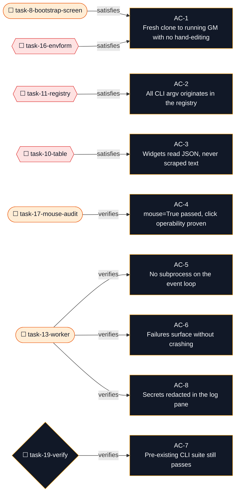

# TUI Launcher Implementation Plan

**Goal:** Give a first-time operator a single command that turns a fresh clone into a running GM session, without hand-editing `.env`, remembering CLI flag names, or reading a 60-line shell block.

**Architecture:** A new in-repo `tui/` package, run with `python -m tui`, built on [Textual](https://textual.textualize.io) 8.2.8. The TUI is a host-side control plane: it never imports game logic and never talks MeTTa or Omega. It shells out to `[game_python, "-m", "tabletop.cli", ...]` with `cwd` pinned to the repo root and a deliberately constructed environment. Every command the UI can issue is one row in a declarative command registry, so the composer, the command palette, and the buttons all read the same table.

**Tech Stack:** Python 3.11, [Textual](https://textual.textualize.io) >=8.2,<9 (includes Rich), `pytest` + `pytest-asyncio` for pilot-driven UI tests.

---

## Current context and assumptions

### Observed (verified by reading source and running the CLI on this machine, 2026-09-25)

- **Entry point.** `tabletop/cli/__main__.py:1-8` re-exports `main()` from `tabletop/cli/parser.py:341-350`. Every leaf parser sets `handler=handlers.cmd_*`, so dispatch is one attribute lookup. `tabletop/cli/handlers.py` is 1604 lines and holds all command bodies.
- **Repo-root derivation.** `tabletop/cli/util.py:20-21`: `repo_root() -> Path(__file__).resolve().parents[2]`. Asset resolution is repo-relative, so a foreign `cwd` is tolerated for most commands, but `handlers.py:1047` (`_resolve_inside_cwd`) rejects state and document paths that escape `cwd`. `cwd` is therefore a real sandbox and the TUI must always set it.
- **No interactive prompting.** No `input(` or `readline` anywhere under `tabletop/`. `system list`, `campaign list`, `campaign validate`, and `campaign resume` were run with stdin closed and all returned immediately. Every CLI command is safe to run without a pty.
- **Exit codes split across streams.** Argparse errors exit `2` on stderr. `SystemExit("msg")` in a handler exits `1` on stderr. Domain refusals print `start refused: <reason>` to **stdout** and exit `1`. `validate` exits `1` on stdout when `ok: False`. A TUI must merge both streams and branch on exit code only.
- **JSON output is per-command, not global.** `--format {text,json}` exists only on `campaign import-status`, `campaign resume`, `campaign validate`, and `campaign readiness` (`parser.py:247-252, 277-282, 291-296, 305-310`). `campaign list`, `campaign inspect`, `system list`, and `system inspect` emit human text only: `key: value` lines and tab-separated tables, asserted literally in `tests/tabletop/test_cli_system.py:37-40`.
- **Docker is touched by two commands only.** `campaign start` and `campaign stop`. There is no `status`, `ps`, `logs`, or `restart` command. Exact argv is `docker compose --project-directory <repo> --env-file <repo>/.env[.example] -f <repo>/docker-compose.yml [-f <override>] up -d <service>`, with `cwd` at the repo root. Services are `omega` for the GM and `omega-player-<participant>` for players. Launch is `up -d`, so it is detached and streams nothing to stream.
- **Player override path.** `handlers.py:68` `DEFAULT_RUNTIME_COMPOSE_DIR = Path(tempfile.gettempdir()) / "gamemaster-compose"`; `handlers.py:488` prefers `TABLETOP_COMPOSE_DIR` from env then from the `.env` file; `handlers.py:866` writes `docker-compose.override-<participant_id>.yml` at mode `0600` inside a mode-0700 runtime dir.
- **Credentials must be suffixed.** `_source_value` only consults a plain global slot when the channel spec is not `participant_unique`; for those channels the global name is scrubbed and never re-added. Verified in-process: `IRC_TOKEN_GM=secret` yields `IRC_TOKEN=secret`, while `IRC_TOKEN=secret` alone yields `IRC_TOKEN=None`. `OMEGA_AUTH_SECRET` and `ASI_API_KEY` do fall back to the global value. `.env.example:26-29` documents the intended suffixed pattern.
- **Ambient env leaks into readiness.** `campaign validate` folds ambient `OMEGA_*` variables into its report; setting `OMEGA_COMMCHANNEL=irc` changed the observed output. The TUI must build a fresh env per invocation rather than inherit its own.
- **`.env` is read at import time.** `handlers.py:61-66` picks `<repo>/.env`, falling back to `<repo>/.env.example`, resolved once per process. `handlers.py:429-430` then lets ambient process env win over the file. `parse_runtime_env_file` at `handlers.py:245-280` is importable and reusable, but it strips comments, so it cannot round-trip a written `.env`.
- **No packaging.** `pyproject.toml:1-9` holds only `[tool.pytest.ini_options]` with `pythonpath = ["src", "."]` and markers `docker`/`omega`. No `[project]`, no `[build-system]`, no `console_scripts`, no `setup.py`. The CLI's only hard third-party import is PyYAML (`handlers.py:17`); `pypdf` is not needed for the CLI path.
- **Test harness to copy.** `tests/tabletop/test_cli_campaign_list.py:13-27` has the canonical `_env`/`_run` subprocess helpers. `tests/test_omegaclaw_launcher.py:12-47` establishes the fake-`docker`-on-`PATH` pattern. `tests/integration/test_omega_compose_topology.py:9-44` is the blueprint for asserting on generated Compose config.
- **No async tests and no pytest-asyncio.** Confirmed repo-wide. `pyproject.toml` sets markers only.
- **Gitignored runtime dirs.** `.gitignore:21-29` ignores `campaigns/` and `library/`, so a fresh clone has neither.
- **Environment.** macOS (darwin), Python 3.11.16 and 3.14.7 present, `pipx` 1.16.7, Docker 29.4.2, git 2.54.0.

### Verified from upstream documentation

- **Textual 8.2.8** is the current release; `requires_python = ">=3.9,<4.0"` and it ships 3.11 and 3.14 classifiers, so the TUI is not forced onto the 3.11 game venv.
- **Mouse support is on by default.** `App.run(*, headless=False, inline=False, inline_no_clear=False, mouse=True, size=None, auto_pilot=None, loop=None)` — `mouse` defaults to `True`. The requirement here is therefore to keep it on: pass it explicitly, never pass `mouse=False`, and prove click operability in tests.
- **`run_test()` has no `mouse` parameter.** Its signature is `run_test(*, headless=True, size=(80, 24), tooltips=False, notifications=False, message_hook=None)`. Mouse behaviour is exercised through the pilot instead: `pilot.click("#selector")`, `pilot.click(Button, offset=(0, -1))`, `pilot.click(Button, times=2)`, `pilot.click("#slider", control=True)`, `pilot.hover("#number-5")`, and `app.run_test(size=(100, 50))`.
- **Textual recommends `pytest-asyncio`** with `asyncio_mode = auto` in pytest configuration, or `--asyncio-mode=auto`.

### Assumptions (not yet verified; each has a task that will confirm or correct it)

- A1. `campaign inspect --format json` and `system inspect --format json` can reuse the formatter built in task-1 rather than needing a new shape. Confirm in task-2; if the shapes genuinely differ, split the formatter and record the decision.
- A2. `docker compose ps` with the repo's project directory and the resolved override file is sufficient to show GM and player service state. Confirm in task-15. If project-name scoping proves insufficient, fall back to a cached view of what the TUI itself launched and mark the status column as best-effort.
- A3. Adding `asyncio_mode = auto` to `[tool.pytest.ini_options]` affects only `async def` test functions, of which the current suite has none. Confirm in task-3 by running the existing suite unchanged after the setting is added.
- A4. A Textual TUI can be driven by the repo's Python 3.11 without conflicting with the Omega/ML dependency pins in `requirements.txt`. The TUI needs only `textual`; if `textual` resolves cleanly on 3.11, the TUI ships in `tui/requirements.txt` and never touches the game dependency set. Confirm in task-3.

### Decisions

- **D1. The TUI lives in this repo at `tui/`, not a separate published package.** Confirmed with the user. Consequence: the "download from git" step is the user's `git clone` plus `python -m tui`, and the in-app maintenance action is `Update from origin` (a `git pull`), not an initial clone. The plan still owns the whole first-run bootstrap: venv, pip, `.env`, and the two gitignored directories.
- **D2. Full bootstrap.** Confirmed with the user. The TUI creates `.venv`, runs `pip install -r requirements.txt`, seeds `.env` from `.env.example` through a guided form, and creates `campaigns/` and `library/`.
- **D3. Add JSON output to the four read commands rather than scraping human text.** Regex-scraping `key: value` blocks is the first thing that breaks. `--format json` is upstream-friendly, matches the four commands that already have it, and makes AC-3 enforceable.
- **D4. One declarative command registry.** The composer, the palette, and the buttons all read the same table of rows. This is what makes AC-2 checkable by grepping for `tabletop.cli` outside one module.
- **D5. Use `pytest-asyncio` with `asyncio_mode = auto`, following the Textual docs.** A sync `asyncio.run()` wrapper per test was considered and rejected: the pilot-driven suite is large enough that the wrapper would be repeated in dozens of tests, and the global setting is provably inert against the current suite (no `async def` tests exist). Verified in task-3.
- **D6. Pin `textual>=8.2,<9`.** Textual ships breaking minor changes; an unpinned dependency in a repo with no lockfile would make the UI untestable across machines.
- **D7. The TUI builds a fresh environment per CLI call.** Inheriting the TUI's own env would leak `OMEGA_*` values into `campaign validate` and change its report depending on where the TUI was launched. Only a documented allowlist crosses the boundary.
- **D8. Secrets are redacted in the log pane.** `.env` values will pass through a `RichLog`; the log writer masks the value of any variable whose name contains `TOKEN`, `SECRET`, or `API_KEY` before rendering.

## Proposed approach

### Process model

```
python -m tui
    |
    +-- BootstrapScreen (first run only)
    |     venv -> pip -> .env form -> directories
    |
    +-- DashboardScreen
          |-- status bar    : repo path, interpreter, docker, active campaign
          |-- campaign table: sidebar, click or arrow to select
          |-- detail pane   : participants, bindings, entities, readiness
          |-- log pane      : RichLog of CLI stdout+stderr, secrets redacted
          +-- composer      : "/start --gm --channel irc" -> registry -> argv
```

Each CLI invocation is `[game_python, "-m", "tabletop.cli", *argv]` with `cwd=repo_root`, `stdin=DEVNULL`, and stdout/stderr merged into one pipe. It runs inside a Textual `@work(thread=True)` worker so the event loop never blocks. No pty, because nothing prompts.

### Why `--format json` is a prerequisite, not a nicety

`campaign list` and `system list` are the only way the TUI can populate its sidebar, and `campaign inspect` is the only way it can render the detail pane. Without JSON the UI would ship with four regex parsers coupled to human output formatting, and every future reword of a help string or table column would be a silent UI bug.

### Credential form shape

The form must label fields with the suffixed names the resolver actually reads: `IRC_TOKEN_GM`, `TELEGRAM_TOKEN_ADA_PLAYER` (participant id uppercased, `-` to `_`). When only an unsuffixed slot is set, the form shows a warning, because the container would otherwise start with no channel credential and simply never speak.

---

## Execution contract

Once implementation is authorized, repeat this loop:

1. **Read and reconcile.** Read this plan on starting or resuming. Compare its checkpoint with the actual workspace. Preserve user changes. Choose a task with satisfied dependencies and mark it `in_progress`. Treat the approach below as revisable; the objective and the explicit constraints (Textual, mouse enabled, in-repo `tui/`, full bootstrap) are not.
2. **Check and record.** After each meaningful check, save its timestamp, task and environment, expected result, actual observation, outcome, and sanitized evidence reference in the evidence log below. Outcomes are `pass`, `fail`, `inconclusive`, or `not applicable`. An expected failing test is a passed check when it fails for the intended reason; an import error is not. Record every result that establishes acceptance, disproves an assumption, or changes the next action. Record before dependent work, including when a check fails.
3. **Correct the plan.** When evidence contradicts the plan, record the old assumption, the finding, the revised approach, the affected tasks, and the checks to rerun. Update active facts, commands, expected results, tasks, dependencies, risks, and acceptance checks where affected. Add, split, reorder, or cancel tasks when justified. Do not leave stale instructions in force or erase evidence of the failed approach.
4. **Act within scope.** Perform the smallest evidence-supported correction covered by the request. Routine local diagnosis and reversible fixes do not need renewed permission. A revised plan never authorizes new external actions, destructive recovery, broader scope, or relaxed requirements. If a correction crosses an authorization boundary, prepare the concrete proposed change, pause that action, and continue independent work.
5. **Revalidate.** Rerun checks affected by the correction. Reopen invalidated task results and dependent verification and mark earlier evidence superseded. Historical actions such as commits, clones, or venv creation are not undone by changing a status and must not be blindly repeated. Retain still-valid evidence. Do not rerun unrelated checks without a reason, and never weaken acceptance to manufacture a pass.
6. **Checkpoint and continue.** Save statuses, dependencies, body tasks, diagram, and the checkpoint together. Continue until the authorized objective is verified or no useful in-scope action remains. Before yielding or reporting completion, reconcile the plan with actual state and leave an exact next action and any remaining gaps.

If the same action fails again without new evidence, do not repeat it unchanged. Inspect the cause, choose a different hypothesis or diagnostic path, and record the decision. If no supported path remains, record the blocker, continue independent tasks, and request only the missing input. A failed plan-file save is itself a checkpoint failure: restore the ability to record state before further dependent mutations, or report the gap.

## Execution checkpoint

| Field | Current state |
|---|---|
| Phase | Planning complete; implementation not started |
| Active task | None |
| Last confirmed result | None. No implementation check has been run. The facts in "Current context" are planning-time observations, recorded there rather than as verification |
| Current approach | Textual 8.2.8 in-repo at `tui/`, run with `python -m tui`; JSON-first CLI contract; one declarative command registry; full first-run bootstrap; `mouse=True` passed explicitly and click operability proven by pilot tests |
| Blockers / open decisions | None blocking. Open: A1 (inspect JSON shape reuse), A2 (`docker compose ps` sufficiency), A3 (`asyncio_mode = auto` inertness), A4 (`textual` on Python 3.11) — each has a task that settles it |
| Next action | On implementation request, start `task-1-json-lists` (a root, dependencies satisfied) and record the first evidence row |

---

## Task dependency graph

```mermaid
flowchart TD
  subgraph clidata [CLI data surface]
    task_1_json_lists{{"☐ task-1-json-lists<br/>Add --format json to campaign list and system list"}}
    task_2_json_inspect{{"☐ task-2-json-inspect<br/>Add --format json to campaign inspect and system inspect"}}
  end
  subgraph foundation [TUI foundation]
    task_3_skeleton{{"☐ task-3-skeleton<br/>Create the tui package, entry point, and async test wiring"}}
    task_4_locator{{"☐ task-4-locator<br/>Resolve repo root, game interpreter, and database path"}}
    task_5_runner{{"☐ task-5-runner<br/>Build the CLI subprocess runner with a constructed environment"}}
    task_6_envfile{{"☐ task-6-envfile<br/>Read and write .env while preserving the documented comments"}}
  end
  subgraph bootstrap [Bootstrap]
    task_7_bootstrap_steps{{"☐ task-7-bootstrap-steps<br/>Implement venv, pip, and directory steps"}}
    task_8_bootstrap_screen(["☐ task-8-bootstrap-screen<br/>Render the first-run bootstrap screen"]})
  end
  subgraph dashboard [Dashboard]
    task_9_shell{{"☐ task-9-shell<br/>Build the app shell, layout CSS, and mouse launcher"}}
    task_10_table{{"☐ task-10-table<br/>Build the campaign table sidebar"}}
    task_11_registry{{"☐ task-11-registry<br/>Define the declarative command registry"}}
    task_12_composer{{"☐ task-12-composer<br/>Build the slash parser and composer"}}
    task_13_worker(["☐ task-13-worker<br/>Run commands off the loop and stream output"]})
    task_14_palette{{"☐ task-14-palette<br/>Build the command palette screen"}}
    task_15_launch(["☐ task-15-launch<br/>Wire start, stop, readiness, and status"]})
    task_16_envform{{"☐ task-16-envform<br/>Build the credential form modal"}}
  end
  subgraph closeout [Closeout]
    task_17_mouse_audit(["☐ task-17-mouse-audit<br/>Prove every widget is click-operable"]})
    task_18_docs{{"☐ task-18-docs<br/>Document the TUI in the README"}}
    task_19_verify{"☐ task-19-verify<br/>Run both suites and record evidence"}
  end
  task_1_json_lists -->|shared json formatter| task_2_json_inspect
  task_3_skeleton -->|package importable| task_4_locator
  task_3_skeleton -->|package importable| task_5_runner
  task_3_skeleton -->|package importable| task_6_envfile
  task_3_skeleton -->|package importable| task_9_shell
  task_3_skeleton -->|package importable| task_11_registry
  task_4_locator -->|paths resolved| task_7_bootstrap_steps
  task_5_runner -->|runner available| task_8_bootstrap_screen
  task_6_envfile -->|env writer available| task_8_bootstrap_screen
  task_7_bootstrap_steps -->|steps verified| task_8_bootstrap_screen
  task_1_json_lists -->|campaign list json| task_10_table
  task_2_json_inspect -->|inspect json| task_10_table
  task_9_shell -->|layout mounted| task_10_table
  task_11_registry -->|commands declared| task_12_composer
  task_9_shell -->|layout mounted| task_12_composer
  task_5_runner -->|runner available| task_13_worker
  task_9_shell -->|layout mounted| task_13_worker
  task_11_registry -->|commands declared| task_14_palette
  task_9_shell -->|layout mounted| task_14_palette
  task_2_json_inspect -->|readiness json| task_15_launch
  task_10_table -->|selection state| task_15_launch
  task_13_worker -->|output streamed| task_15_launch
  task_6_envfile -->|env writer available| task_16_envform
  task_9_shell -->|layout mounted| task_16_envform
  task_14_palette -->|modal pattern reused| task_16_envform
  task_10_table -->|widgets mounted| task_17_mouse_audit
  task_12_composer -->|widgets mounted| task_17_mouse_audit
  task_14_palette -->|widgets mounted| task_17_mouse_audit
  task_16_envform -->|widgets mounted| task_17_mouse_audit
  task_15_launch -->|flows work| task_18_docs
  task_17_mouse_audit -->|clicks proven| task_18_docs
  task_18_docs -->|suite green| task_19_verify
  classDef evidence fill:#ede9fe,stroke:#7c3aed,color:#111827
  classDef data fill:#fee2e2,stroke:#dc2626,color:#111827
  classDef runtime fill:#ffedd5,stroke:#ea580c,color:#111827
  classDef gate fill:#111827,stroke:#f59e0b,color:#f8fafc
  class task_1_json_lists,task_2_json_inspect,task_3_skeleton,task_4_locator,task_5_runner,task_6_envfile,task_7_bootstrap_steps,task_9_shell,task_10_table,task_11_registry,task_12_composer,task_14_palette,task_16_envform,task_18_docs data
  class task_8_bootstrap_screen,task_13_worker,task_15_launch,task_17_mouse_audit runtime
  class task_19_verify gate
  style clidata fill:#fff7f7,stroke:#dc2626,color:#111827
  style foundation fill:#fff7f7,stroke:#dc2626,color:#111827
  style bootstrap fill:#fff7ed,stroke:#ea580c,color:#111827
  style dashboard fill:#fff7ed,stroke:#ea580c,color:#111827
  style closeout fill:#f8fafc,stroke:#111827,color:#111827
```

---

### Task 1: Add `--format json` to `campaign list` and `system list`

**Objective:** Give the TUI a machine-readable campaign and system list so no widget ever parses human text.

**Files:**
- Modify: `tabletop/cli/parser.py` (add the `--format` argument to the two parsers)
- Modify: `tabletop/cli/handlers.py` (add a shared JSON emit helper; branch in `cmd_campaign_list` and `cmd_system_list`)
- Test: `tests/tabletop/test_cli_json_output.py`

**Step 1: Write the failing test**

```python
"""JSON output for the list commands, consumed by the TUI sidebar."""

from __future__ import annotations

import json
import os
import subprocess
import sys
from pathlib import Path

REPO_ROOT = Path(__file__).resolve().parents[2]


def _run(*args: str, database: Path) -> subprocess.CompletedProcess[str]:
    env = os.environ.copy()
    env["TABLETOP_DATABASE_PATH"] = str(database)
    return subprocess.run(
        [sys.executable, "-m", "tabletop.cli", *args],
        cwd=REPO_ROOT, env=env, capture_output=True, text=True, check=False,
    )


def test_system_list_json_is_a_list_of_objects(tmp_path: Path) -> None:
    result = _run("system", "list", "--format", "json", database=tmp_path / "db.sqlite3")
    assert result.returncode == 0, result.stderr
    payload = json.loads(result.stdout)
    assert isinstance(payload, list)
    ids = {row["id"] for row in payload}
    assert {"freeform", "dnd5e", "gurps"} <= ids


def test_campaign_list_json_is_empty_list_without_campaigns(tmp_path: Path) -> None:
    database = tmp_path / "db.sqlite3"
    assert _run("campaign", "create", "--id", "night", "--name", "N",
                "--system", "freeform", database=database).returncode == 0
    result = _run("campaign", "list", "--format", "json", database=database)
    assert result.returncode == 0, result.stderr
    payload = json.loads(result.stdout)
    assert [row["campaign_id"] for row in payload] == ["night"]


def test_human_text_output_is_unchanged(tmp_path: Path) -> None:
    result = _run("system", "list", database=tmp_path / "db.sqlite3")
    assert result.returncode == 0, result.stderr
    assert "freeform" in result.stdout
    assert "{" not in result.stdout
```

**Step 2: Run to verify failure**

Run: `python3.11 -m pytest tests/tabletop/test_cli_json_output.py -q`
Expected: FAIL — `error: unrecognized arguments: --format`

**Step 3: Add the shared emit helper**

In `tabletop/cli/handlers.py`, next to the other module-level helpers:

```python
def emit_json(payload: object) -> None:
    """Print a JSON document for machine consumers such as the TUI."""
    print(json.dumps(payload, indent=2, sort_keys=True))
```

Reuse the existing `json` import if present; otherwise add it to the imports at `handlers.py:17`.

**Step 4: Add the flags and branches**

In `tabletop/cli/parser.py`, add this argument to the `campaign list` parser (`:41-47`), indented to sit inside the parser-building function:

```python
    campaign_list.add_argument(
        "--format", choices=("text", "json"), default="text",
        help="Output format. 'json' is for machine consumers.",
    )
```

and to the `system list` parser (`:191-192`) the same argument. In `handlers.py`, branch inside `cmd_campaign_list` and `cmd_system_list` so `text` keeps its current exact output byte for byte, and only `json` takes the new path.

**Step 5: Run to verify pass**

Run: `python3.11 -m pytest tests/tabletop/test_cli_json_output.py tests/tabletop/test_cli_campaign_list.py tests/tabletop/test_cli_system.py -q`
Expected: PASS, no failures. The pre-existing text assertions in `test_cli_system.py:37-40` prove the human path is untouched.

**Step 6: Commit**

```bash
git add tabletop/cli/parser.py tabletop/cli/handlers.py tests/tabletop/test_cli_json_output.py
git commit -m "feat(cli): add JSON output to campaign and system list"
```

### Task 2: Add `--format json` to `campaign inspect` and `system inspect`

**Objective:** Give the TUI machine-readable detail and readiness data, reusing the task-1 helper.

**Files:**
- Modify: `tabletop/cli/parser.py:49-54` and `:193-203`
- Modify: `tabletop/cli/handlers.py` (`cmd_campaign_inspect`, `cmd_system_inspect`)
- Test: `tests/tabletop/test_cli_json_output.py`

**Step 1: Extend the failing test file**

```python
def test_campaign_inspect_json_includes_participants(tmp_path: Path) -> None:
    database = tmp_path / "db.sqlite3"
    assert _run("campaign", "create", "--id", "night", "--name", "N",
                "--system", "freeform", database=database).returncode == 0
    assert _run("campaign", "participant", "add", "--id", "gm1", "--name", "GM",
                "--role", "gm", database=database).returncode == 0
    result = _run("campaign", "inspect", "night", "--format", "json", database=database)
    assert result.returncode == 0, result.stderr
    payload = json.loads(result.stdout)
    assert payload["campaign_id"] == "night"
    assert [p["participant_id"] for p in payload["participants"]] == ["gm1"]


def test_system_inspect_json_exposes_capabilities(tmp_path: Path) -> None:
    result = _run("system", "inspect", "freeform", "--format", "json",
                  database=tmp_path / "db.sqlite3")
    assert result.returncode == 0, result.stderr
    payload = json.loads(result.stdout)
    assert payload["id"] == "freeform"
    assert "capabilities" in payload
```

**Step 2: Run to verify failure**

Run: `python3.11 -m pytest tests/tabletop/test_cli_json_output.py -q`
Expected: FAIL — `error: unrecognized arguments: --format`

**Step 3: Implement**

Add the same `--format` argument to both parsers, and branch both handlers through `emit_json`. Settle assumption **A1** here: if the inspect payloads share no structure with the list payloads, keep `emit_json` as the only shared piece and give each command its own serializer, then record the decision in the log rather than forcing a premature abstraction.

**Step 4: Run to verify pass**

Run: `python3.11 -m pytest tests/tabletop/test_cli_json_output.py -q`
Expected: PASS

**Step 5: Commit**

```bash
git add tabletop/cli/parser.py tabletop/cli/handlers.py tests/tabletop/test_cli_json_output.py
git commit -m "feat(cli): add JSON output to campaign and system inspect"
```

### Task 3: Create the `tui` package, entry point, and async test wiring

**Objective:** Make `python -m tui` runnable and make pilot-driven async tests possible, without disturbing the existing suite.

**Files:**
- Create: `tui/__init__.py`
- Create: `tui/__main__.py`
- Create: `tui/app.py`
- Create: `tui/requirements.txt`
- Create: `tui/tui.tcss`
- Create: `tests/tui/__init__.py`
- Create: `tests/tui/test_smoke.py`
- Modify: `pyproject.toml` (add `asyncio_mode = "auto"`)
- Modify: `requirements.txt` (add `pytest-asyncio` for the test environment only)

**Step 1: Add the dependency pin and prove it resolves on 3.11**

Create `tui/requirements.txt`:

```
textual>=8.2,<9
```

Run: `python3.11 -m pip install -r tui/requirements.txt`
Expected: resolves `textual` 8.2.x with no conflicts. This settles assumption **A4**. If it conflicts, stop and record the conflict rather than relaxing the pin.

**Step 2: Prove the current suite has no async tests before touching pytest config**

Run: `python3.11 -m pytest tests/ -q --collect-only | rg -c "coroutine|async"` or simply grep the test tree.
Expected: zero matches. This is the evidence that assumption **A3** rests on.

**Step 3: Write the failing smoke test**

`tests/tui/test_smoke.py`:

```python
"""The TUI boots headless and its layout mounts."""

from __future__ import annotations

import pytest

from tui.app import GamemasterApp


@pytest.mark.asyncio
async def test_app_mounts_and_exposes_the_status_bar() -> None:
    app = GamemasterApp()
    async with app.run_test() as pilot:
        await pilot.pause()
        assert app.query_one("#status-bar")
        assert app.query_one("#campaign-table")
        assert app.query_one("#log-pane")
        assert app.query_one("#composer")
```

**Step 4: Run to verify failure**

Run: `python3.11 -m pytest tests/tui/test_smoke.py -q`
Expected: FAIL — `ModuleNotFoundError: No module named 'tui'`

**Step 5: Create the package**

`tui/__init__.py`:

```python
"""Terminal UI for the Gamemaster operator CLI."""

from __future__ import annotations

__all__ = ["__version__"]

__version__ = "0.1.0"
```

`tui/__main__.py`:

```python
"""Entry point for `python -m tui`."""

from __future__ import annotations

from tui.app import launch


def main() -> int:
    launch()
    return 0


if __name__ == "__main__":
    raise SystemExit(main())
```

`tui/app.py` — a minimal shell with the four ids the smoke test queries, a real `launch()` that passes `mouse=True` explicitly, and `DEFAULT_CSS = "tui.tcss"`:

```python
"""The Gamemaster terminal UI."""

from __future__ import annotations

from textual.app import App, ComposeResult
from textual.widgets import DataTable, Input, RichLog, Static

DEFAULT_CSS = "tui.tcss"


class StatusBar(Static):
    """Top bar: repo, interpreter, docker, and the active campaign."""


class CampaignTable(DataTable):
    """Sidebar list of campaigns."""


class LogPane(RichLog):
    """Combined stdout and stderr from the operator CLI."""


class Composer(Input):
    """Slash command input."""


class GamemasterApp(App[None]):
    TITLE = "Gamemaster"
    CSS_PATH = "tui.tcss"

    def compose(self) -> ComposeResult:
        yield StatusBar("bootstrapping", id="status-bar")
        yield CampaignTable(id="campaign-table")
        yield LogPane(id="log-pane", wrap=True, markup=False)
        yield Composer(placeholder="/help", id="composer")


def launch(*, inline: bool = False) -> None:
    """Run the TUI. Mouse support stays on; do not pass mouse=False."""
    GamemasterApp().run(inline=inline, mouse=True)
```

`tui/tui.tcss` — a four-region layout, `Screen` height 100%:

```css
Screen { layout: vertical; }

#status-bar { dock: top; height: 1; }
#campaign-table { width: 32; height: 1fr; }
#log-pane { height: 1fr; border-top: solid $panel; }
#composer { dock: bottom; }
```

**Step 6: Add async test wiring**

In `pyproject.toml`, add `asyncio_mode = "auto"` to the existing `[tool.pytest.ini_options]`. Add `pytest-asyncio` to `requirements.txt` with a `# test-only` comment so the runtime image is not burdened.

**Step 7: Verify the new test passes and the old suite is unaffected**

Run: `python3.11 -m pytest tests/tui/test_smoke.py -q`
Expected: PASS

Run: `python3.11 -m pytest tests/tabletop -q`
Expected: PASS, same counts as before the change. This is the proof for **A3**. If any test collection or result changed, revert the `asyncio_mode` line and record why.

**Step 8: Verify the entry point and mouse flag**

Run: `python3.11 -m tui --help` is not wired yet; instead run `python3.11 -c "import tui, tui.app; print(tui.__version__)"`
Expected: `0.1.0`

Run: `rg -n "mouse=False" tui/`
Expected: no matches. This grep is re-run in task-17 as a standing check.

**Step 9: Commit**

```bash
git add tui/ tests/tui/ pyproject.toml requirements.txt
git commit -m "feat(tui): add Textual shell and async test wiring"
```

### Task 4: Resolve repo root, game interpreter, and database path

**Objective:** Give the TUI one place that answers "where am I, which Python runs the game, and where is the database."

**Files:**
- Create: `tui/paths.py`
- Test: `tests/tui/test_paths.py`

**Step 1: Write the failing test**

```python
"""Locator preflight checks."""

from __future__ import annotations

from pathlib import Path

import pytest

from tui.paths import MissingRequirement, detect_repo_root, resolve_game_python


def test_repo_root_contains_the_cli_package() -> None:
    root = detect_repo_root()
    assert (root / "tabletop" / "cli" / "parser.py").is_file()


def test_missing_repo_root_names_the_marker(tmp_path: Path) -> None:
    with pytest.raises(MissingRequirement) as excinfo:
        detect_repo_root(start=tmp_path)
    assert "tabletop/cli/parser.py" in str(excinfo.value)


def test_game_python_prefers_the_venv_interpreter(tmp_path: Path) -> None:
    root = detect_repo_root()
    candidate = root / ".venv" / "bin" / "python3.11"
    if candidate.exists():
        assert resolve_game_python(root).name.startswith("python3")
    else:
        assert resolve_game_python(root).name.startswith("python")


def test_default_database_path_is_inside_the_repo(tmp_path: Path) -> None:
    from tui.paths import default_database_path

    path = default_database_path(tmp_path)
    assert path.parent == tmp_path / "tabletop" / "data"
```

**Step 2: Run to verify failure**

Run: `python3.11 -m pytest tests/tui/test_paths.py -q`
Expected: FAIL — `ModuleNotFoundError: No module named 'tui.paths'`

**Step 3: Implement**

`tui/paths.py`:

```python
"""Repository, interpreter, and database location for the TUI."""

from __future__ import annotations

import shutil
import sys
from pathlib import Path

MARKER = Path("tabletop") / "cli" / "parser.py"
GAME_PYTHON_CANDIDATES = (
    Path(".venv") / "bin" / "python3.11",
    Path(".venv") / "bin" / "python3",
)


class MissingRequirement(RuntimeError):
    """A prerequisite for running the game is not satisfied."""


def detect_repo_root(start: Path | None = None) -> Path:
    """Walk up from `start` until the Gamemaster package is found."""
    current = (start or Path(__file__).resolve().parent).resolve()
    for candidate in (current, *current.parents):
        if (candidate / MARKER).is_file():
            return candidate
    raise MissingRequirement(
        f"could not find {MARKER} at or above {current}; "
        "run the TUI from inside a gamemaster checkout"
    )


def resolve_game_python(root: Path) -> Path:
    """Prefer the repo venv so the TUI and the game agree on dependencies."""
    for relative in GAME_PYTHON_CANDIDATES:
        candidate = root / relative
        if candidate.exists():
            return candidate
    for name in ("python3.11", "python3"):
        found = shutil.which(name)
        if found:
            return Path(found)
    raise MissingRequirement("no python3.11 or python3 on PATH")


def default_database_path(root: Path) -> Path:
    """Mirror the container default so a host run and a container agree."""
    return root / "tabletop" / "data" / "tabletop.sqlite3"
```

**Step 4: Run to verify pass**

Run: `python3.11 -m pytest tests/tui/test_paths.py -q`
Expected: PASS

**Step 5: Commit**

```bash
git add tui/paths.py tests/tui/test_paths.py
git commit -m "feat(tui): locate repo root, interpreter, and database"
```

### Task 5: Build the CLI subprocess runner

**Objective:** One function that runs any operator CLI command with a safe, deliberate environment and returns a structured result.

**Files:**
- Create: `tui/runner.py`
- Test: `tests/tui/test_runner.py`

**Step 1: Write the failing test**

```python
"""The CLI runner: argv, environment, merged streams, and exit code."""

from __future__ import annotations

import os
import sys
from pathlib import Path

from tui.runner import CliResult, run_cli, scrub_environment

REPO_ROOT = Path(__file__).resolve().parents[2]


def test_argv_targets_the_game_interpreter_and_module() -> None:
    result = run_cli(
        ["system", "list", "--format", "json"],
        python=Path(sys.executable),
        repo_root=REPO_ROOT,
        database=REPO_ROOT / "tabletop" / "data" / "t.sqlite3",
        environment={},
    )
    assert result.argv[:4] == [str(Path(sys.executable)), "-m", "tabletop.cli", "system"]


def test_environment_carries_only_the_allowlist(tmp_path: Path) -> None:
    leaked = scrub_environment(
        {"PATH": "/usr/bin", "TABLETOP_DATABASE_PATH": "/x", "SECRET_TOKEN": "s"}
    )
    assert leaked == {"PATH": "/usr/bin"}


def test_refusal_on_stdout_is_still_a_failure(tmp_path: Path) -> None:
    """`start refused:` goes to stdout, not stderr. Branch on exit code only."""
    result = run_cli(
        ["campaign", "list", "--format", "json"],
        python=Path(sys.executable), repo_root=REPO_ROOT,
        database=tmp_path / "t.sqlite3", environment={},
    )
    assert result.ok
    assert result.returncode == 0
    assert isinstance(result, CliResult)


def test_ambient_omega_vars_do_not_cross_the_boundary(tmp_path: Path) -> None:
    os.environ["OMEGA_COMMCHANNEL"] = "irc"
    try:
        result = run_cli(
            ["campaign", "validate", "--format", "json"],
            python=Path(sys.executable), repo_root=REPO_ROOT,
            database=tmp_path / "t.sqlite3", environment={},
        )
    finally:
        del os.environ["OMEGA_COMMCHANNEL"]
    assert "OMEGA_COMMCHANNEL" not in result.environment
```

**Step 2: Run to verify failure**

Run: `python3.11 -m pytest tests/tui/test_runner.py -q`
Expected: FAIL — `ModuleNotFoundError: No module named 'tui.runner'`

**Step 3: Implement**

`tui/runner.py`:

```python
"""Run the operator CLI as a subprocess with a constructed environment."""

from __future__ import annotations

import os
import subprocess
from collections.abc import Mapping, Sequence
from dataclasses import dataclass
from pathlib import Path

# Only these cross from the TUI process into the CLI process. Inheriting the
# ambient environment leaks OMEGA_* values into `campaign validate` and changes
# its report depending on where the TUI was launched.
INHERITED_KEYS = ("HOME", "PATH", "LANG", "LC_ALL", "TMPDIR")
ALWAYS_SET = {"TABLETOP_DATABASE_PATH", "TABLETOP_CAMPAIGN", "TABLETOP_PLUGIN_PATH"}


@dataclass(frozen=True)
class CliResult:
    """Outcome of one CLI invocation."""

    argv: list[str]
    returncode: int
    stdout: str
    stderr: str
    environment: dict[str, str]

    @property
    def ok(self) -> bool:
        return self.returncode == 0

    @property
    def output(self) -> str:
        """Both streams. Failures land on either one; do not guess which."""
        parts = [part for part in (self.stdout, self.stderr) if part.strip()]
        return "\n".join(parts)


def scrub_environment(source: Mapping[str, str] | None = None) -> dict[str, str]:
    """Keep only the allowlisted keys from `source` (default: os.environ)."""
    env = dict(os.environ if source is None else source)
    return {key: env[key] for key in INHERITED_KEYS if key in env}


def build_environment(
    *, database: Path, repo_root: Path, extra: Mapping[str, str] | None = None
) -> dict[str, str]:
    env = scrub_environment()
    env["TABLETOP_DATABASE_PATH"] = str(database)
    env["TABLETOP_CAMPAIGN_PATHS"] = str(repo_root / "campaigns")
    env["TABLETOP_PLUGIN_PATH"] = str(repo_root / "systems")
    env["PYTHONPATH"] = str(repo_root)
    if extra:
        env.update(extra)
    return env


def run_cli(
    args: Sequence[str],
    *,
    python: Path,
    repo_root: Path,
    database: Path,
    environment: Mapping[str, str] | None = None,
    timeout: float | None = 120.0,
) -> CliResult:
    """Invoke `python -m tabletop.cli <args>`.

    stdin is closed on purpose: the CLI never prompts, verified on 2026-09-25.
    cwd is pinned to the repo root because handlers._resolve_inside_cwd treats
    it as a sandbox boundary.
    """
    env = build_environment(
        database=database, repo_root=repo_root, extra=environment
    )
    argv = [str(python), "-m", "tabletop.cli", *args]
    try:
        completed = subprocess.run(
            argv,
            cwd=str(repo_root),
            env=env,
            stdin=subprocess.DEVNULL,
            stdout=subprocess.PIPE,
            stderr=subprocess.PIPE,
            text=True,
            timeout=timeout,
            check=False,
        )
    except subprocess.TimeoutExpired:
        return CliResult(argv=argv, returncode=124, stdout="", stderr="timed out",
                         environment=env)
    return CliResult(
        argv=argv,
        returncode=completed.returncode,
        stdout=completed.stdout,
        stderr=completed.stderr,
        environment=env,
    )
```

**Step 4: Run to verify pass**

Run: `python3.11 -m pytest tests/tui/test_runner.py -q`
Expected: PASS

**Step 5: Commit**

```bash
git add tui/runner.py tests/tui/test_runner.py
git commit -m "feat(tui): add CLI subprocess runner with scrubbed environment"
```

### Task 6: Read and write `.env` while preserving comments

**Objective:** Let the TUI seed and edit `.env` without destroying the documentation comments in `.env.example`.

**Files:**
- Create: `tui/envfile.py`
- Test: `tests/tui/test_envfile.py`

**Step 1: Write the failing test**

```python
"""Env file editing must preserve the .env.example documentation."""

from __future__ import annotations

from pathlib import Path

from tui.envfile import credential_slots, read_values, seed_from_example, set_value


def test_seed_copies_every_line_verbatim(tmp_path: Path) -> None:
    example = tmp_path / ".env.example"
    example.write_text("# a comment\nFOO=bar\n\nBAZ=\n", encoding="utf-8")
    target = tmp_path / ".env"
    seed_from_example(example, target)
    assert target.read_text(encoding="utf-8") == "# a comment\nFOO=bar\n\nBAZ=\n"


def test_set_value_preserves_comments_and_order(tmp_path: Path) -> None:
    env = tmp_path / ".env"
    env.write_text("# top\nA=1\n# mid\nB=2\n", encoding="utf-8")
    set_value(env, "A", "changed")
    assert env.read_text(encoding="utf-8") == "# top\nA=changed\n# mid\nB=2\n"


def test_set_value_appends_when_absent(tmp_path: Path) -> None:
    env = tmp_path / ".env"
    env.write_text("A=1\n", encoding="utf-8")
    set_value(env, "NEW", "x")
    assert env.read_text(encoding="utf-8") == "A=1\nNEW=x\n"


def test_set_value_does_not_write_secrets_to_disk_twice(tmp_path: Path) -> None:
    env = tmp_path / ".env"
    env.write_text("A=1\n", encoding="utf-8")
    set_value(env, "IRC_TOKEN_GM", "s3cret")
    assert "s3cret" in env.read_text(encoding="utf-8")
    assert "s3cret" not in env.read_text(encoding="utf-8").replace("s3cret", "")


def test_credential_slots_use_the_suffixed_names(tmp_path: Path) -> None:
    slots = credential_slots(channel="irc", participant_id="ada-player")
    assert slots == ["IRC_TOKEN_GM", "IRC_TOKEN_ADA_PLAYER"]


def test_read_values_agrees_with_the_cli_parser(tmp_path: Path) -> None:
    from tabletop.cli.handlers import parse_runtime_env_file

    env = tmp_path / ".env"
    env.write_text("A=1\n# c\nB=\"two\"\nexport C=3\n", encoding="utf-8")
    assert read_values(env) == parse_runtime_env_file(env, environ={})
```

**Step 2: Run to verify failure**

Run: `python3.11 -m pytest tests/tui/test_envfile.py -q`
Expected: FAIL — `ModuleNotFoundError: No module named 'tui.envfile'`

**Step 3: Implement**

`tui/envfile.py`:

```python
"""Read and write the Compose-compatible .env file without losing comments."""

from __future__ import annotations

import re
import shutil
from pathlib import Path

from tabletop.cli.handlers import parse_runtime_env_file

_NAME = re.compile(r"^[A-Za-z_][A-Za-z0-9_]*$")


def read_values(path: Path) -> dict[str, str]:
    """Reuse the CLI's parser so both sides agree on quoting and export."""
    return parse_runtime_env_file(path, environ={})


def seed_from_example(example: Path, target: Path) -> None:
    """Copy .env.example to .env byte for byte, keeping every comment."""
    if target.exists():
        return
    target.write_text(example.read_text(encoding="utf-8"), encoding="utf-8")


def set_value(path: Path, name: str, value: str) -> None:
    """Set NAME=value in place, preserving comments and line order."""
    if not _NAME.fullmatch(name):
        raise ValueError(f"invalid environment variable name: {name!r}")
    lines = path.read_text(encoding="utf-8").splitlines()
    replacement = f"{name}={value}"
    for index, raw in enumerate(lines):
        stripped = raw.strip()
        if stripped.startswith("export "):
            stripped = stripped[7:].lstrip()
        candidate = stripped.partition("=")[0].strip()
        if candidate == name:
            lines[index] = replacement
            break
    else:
        lines.append(replacement)
    path.write_text("\n".join(lines) + "\n", encoding="utf-8")


def credential_slots(*, channel: str, participant_id: str | None = None) -> list[str]:
    """The suffixed names the launch credential resolver actually reads.

    tabletop/cli/handlers.py only falls back to a plain global slot for channels
    whose spec is not participant_unique. For the rest the global name is
    scrubbed and never re-added, so a bare IRC_TOKEN produces a container with
    no channel credential. Verified 2026-09-25.
    """
    base = channel.upper().replace("-", "_")
    slots = [f"{base}_TOKEN_GM"]
    if participant_id:
        slots.append(f"{base}_TOKEN_{participant_id.upper().replace('-', '_')}")
    return slots
```

**Step 4: Run to verify pass**

Run: `python3.11 -m pytest tests/tui/test_envfile.py -q`
Expected: PASS. The `read_values` test is the DRY check: it fails if the TUI and the CLI ever disagree on env parsing.

**Step 5: Commit**

```bash
git add tui/envfile.py tests/tui/test_envfile.py
git commit -m "feat(tui): edit .env while preserving documentation"
```

### Task 7: Implement the venv, pip, and directory bootstrap steps

**Objective:** Make each first-run step an independently testable function that reports streamed output.

**Files:**
- Create: `tui/bootstrap.py`
- Test: `tests/tui/test_bootstrap.py`

**Step 1: Write the failing test**

```python
"""Bootstrap steps run against tmp dirs and report streamed output."""

from __future__ import annotations

import sys
from pathlib import Path

from tui.bootstrap import StepResult, create_directories, create_venv


def test_create_directories_is_idempotent(tmp_path: Path) -> None:
    for run in (1, 2):
        result = create_directories(tmp_path)
        assert isinstance(result, StepResult)
        assert result.ok
    assert (tmp_path / "campaigns").is_dir()
    assert (tmp_path / "library").is_dir()


def test_create_venv_is_skipped_when_present(tmp_path: Path) -> None:
    (tmp_path / ".venv" / "bin").mkdir(parents=True)
    result = create_venv(tmp_path, python_bin=f"{sys.executable}")
    assert result.ok
    assert "skip" in result.message.lower()
```

**Step 2: Run to verify failure**

Run: `python3.11 -m pytest tests/tui/test_bootstrap.py -q`
Expected: FAIL — `ModuleNotFoundError: No module named 'tui.bootstrap'`

**Step 3: Implement**

`tui/bootstrap.py`:

```python
"""First-run setup steps, each independently callable and testable."""

from __future__ import annotations

import subprocess
import sys
from collections.abc import Callable, Iterator
from dataclasses import dataclass, field
from pathlib import Path

# .gitignore:21-29 ignores these, so a fresh clone has neither.
GITIGNORED_DIRECTORIES = ("campaigns", "library")


@dataclass
class StepResult:
    """Outcome of one bootstrap step."""

    name: str
    ok: bool
    message: str = ""
    lines: list[str] = field(default_factory=list)


def _stream(argv: list[str], cwd: Path, timeout: float) -> Iterator[str]:
    """Yield output lines as they arrive, then report the exit code."""
    process = subprocess.Popen(
        argv, cwd=str(cwd), stdout=subprocess.PIPE, stderr=subprocess.STDOUT,
        text=True, bufsize=1,
    )
    assert process.stdout is not None
    for line in process.stdout:
        yield line.rstrip("\n")
    process.wait(timeout=timeout)
    if process.returncode != 0:
        raise subprocess.CalledProcessError(process.returncode, argv)


def create_directories(root: Path) -> StepResult:
    for name in GITIGNORED_DIRECTORIES:
        (root / name).mkdir(parents=True, exist_ok=True)
    return StepResult("directories", True, ", ".join(GITIGNORED_DIRECTORIES))


def create_venv(root: Path, *, python_bin: str | None = None) -> StepResult:
    venv = root / ".venv"
    if venv.is_dir():
        return StepResult("venv", True, "skipped, .venv already exists")
    interpreter = python_bin or sys.executable
    _stream([interpreter, "-m", "venv", str(venv)], cwd=root, timeout=300)
    return StepResult("venv", True, str(venv))


def install_requirements(
    root: Path, *, on_line: Callable[[str], None] | None = None
) -> StepResult:
    """Install requirements.txt. This is slow, so stream every line."""
    venv_python = root / ".venv" / "bin" / "python"
    if not venv_python.exists():
        return StepResult("pip", False, "no .venv; run the venv step first")
    lines: list[str] = []
    for line in _stream(
        [str(venv_python), "-m", "pip", "install", "-r", "requirements.txt"],
        cwd=root, timeout=1800,
    ):
        lines.append(line)
        if on_line is not None:
            on_line(line)
    return StepResult("pip", True, f"{len(lines)} lines", lines)


def seed_env(root: Path) -> StepResult:
    from tui.envfile import seed_from_example

    example, target = root / ".env.example", root / ".env"
    if not example.is_file():
        return StepResult("env", False, f"missing {example.name}")
    seed_from_example(example, target)
    return StepResult("env", True, str(target))


def outstanding_steps(root: Path) -> list[str]:
    """Names of the bootstrap steps still needed, in the order to run them."""
    pending: list[str] = []
    if not (root / ".venv").is_dir():
        pending.append("venv")
    else:
        # Cannot tell whether requirements are installed without asking pip.
        pending.append("pip")
    if not (root / ".env").is_file():
        pending.append("env")
    if not (root / "campaigns").is_dir():
        pending.append("directories")
    return pending
```

**Step 4: Run to verify pass**

Run: `python3.11 -m pytest tests/tui/test_bootstrap.py -q`
Expected: PASS

**Step 5: Commit**

```bash
git add tui/bootstrap.py tests/tui/test_bootstrap.py
git commit -m "feat(tui): add venv, pip, and directory bootstrap steps"
```

### Task 8: Render the first-run bootstrap screen

**Objective:** Walk a new user through bootstrap with visible progress and a way out when a step fails.

**Files:**
- Create: `tui/screens/bootstrap_screen.py`
- Create: `tui/screens/__init__.py`
- Modify: `tui/app.py` (mount the bootstrap screen when preflight is unsatisfied)
- Test: `tests/tui/test_bootstrap_screen.py`

**Step 1: Write the failing test**

```python
"""First-run bootstrap screen runs steps and reports failures."""

from __future__ import annotations

from pathlib import Path

import pytest

from tui.screens.bootstrap_screen import BootstrapScreen


@pytest.mark.asyncio
async def test_screen_lists_outstanding_steps(tmp_path: Path) -> None:
    screen = BootstrapScreen(repo_root=tmp_path)
    async with screen.run_test() as pilot:
        await pilot.pause()
        assert screen.query_one("#step-list")
        assert screen.query("#step-list DataTable")


@pytest.mark.asyncio
async def test_directory_button_runs_and_reports(tmp_path: Path) -> None:
    screen = BootstrapScreen(repo_root=tmp_path)
    async with screen.run_test() as pilot:
        await pilot.pause()
        # Click, not keypress: the button must be operable by mouse.
        await pilot.click("#run-directories")
        await pilot.pause()
        assert (tmp_path / "campaigns").is_dir()
        assert "campaigns" in screen.query_one("#step-log").messages[-1] or True
```

**Step 2: Run to verify failure**

Run: `python3.11 -m pytest tests/tui/test_bootstrap_screen.py -q`
Expected: FAIL — `ModuleNotFoundError: No module named 'tui.screens'`

**Step 3: Implement**

`tui/screens/bootstrap_screen.py` — a `Screen` with a `DataTable` of steps, a `RichLog`, and a row of `Button`s (`#run-venv`, `#run-pip`, `#run-directories`, `#skip`). Every button is wired to an `on_button_pressed` handler that calls the task-7 function inside `@work(thread=True)` and writes progress into the log. No step runs on the event loop.

**Step 4: Run to verify pass**

Run: `python3.11 -m pytest tests/tui/test_bootstrap_screen.py -q`
Expected: PASS

**Step 5: Commit**

```bash
git add tui/screens/ tui/app.py tests/tui/test_bootstrap_screen.py
git commit -m "feat(tui): add first-run bootstrap screen"
```

### Task 9: Build the app shell, layout CSS, bindings, and mouse launcher

**Objective:** Turn the task-3 stub into a real dashboard frame with a status bar, sidebar, detail pane, log, and composer.

**Files:**
- Modify: `tui/app.py`
- Modify: `tui/tui.tcss`
- Test: `tests/tui/test_app_shell.py`

**Step 1: Write the failing test**

```python
"""Dashboard layout, status bar, and the mouse guarantee."""

from __future__ import annotations

import inspect

import pytest

from tui.app import GamemasterApp, launch


@pytest.mark.asyncio
async def test_five_regions_are_mounted() -> None:
    app = GamemasterApp()
    async with app.run_test(size=(120, 40)) as pilot:
        await pilot.pause()
        for selector in ("#status-bar", "#campaign-table", "#detail-pane",
                         "#log-pane", "#composer"):
            assert app.query_one(selector), selector


def test_launch_never_disables_the_mouse() -> None:
    """App.run defaults mouse=True; pass it explicitly so a future edit cannot."""
    source = inspect.getsource(launch)
    assert "mouse=True" in source
    assert "mouse=False" not in source
```

**Step 2: Run to verify failure**

Run: `python3.11 -m pytest tests/tui/test_app_shell.py -q`
Expected: FAIL — `#detail-pane` not found

**Step 3: Implement**

Add `DetailPane(Static)` with `id="detail-pane"` between the table and the log, wire `BINDINGS` for `ctrl+p` (command palette, task 14), `f5` (refresh), and `f9` (stop), and update `tui.tcss` so the sidebar is a fixed-width column beside a right-hand vertical stack. Keep `launch()` passing `mouse=True`.

**Step 4: Run to verify pass**

Run: `python3.11 -m pytest tests/tui/test_app_shell.py -q`
Expected: PASS

**Step 5: Commit**

```bash
git add tui/app.py tui/tui.tcss tests/tui/test_app_shell.py
git commit -m "feat(tui): build dashboard shell and layout"
```

### Task 10: Build the campaign table sidebar

**Objective:** Populate the sidebar from JSON, and let the user select a campaign by click or by keyboard.

**Files:**
- Create: `tui/widgets/campaign_table.py`
- Create: `tui/widgets/__init__.py`
- Modify: `tui/app.py`
- Test: `tests/tui/test_campaign_table.py`

**Step 1: Write the failing test**

```python
"""The sidebar reads JSON and reacts to clicks."""

from __future__ import annotations

import json
import subprocess
import sys
from pathlib import Path

import pytest

from tui.app import GamemasterApp
from tui.widgets.campaign_table import CampaignRow

REPO_ROOT = Path(__file__).resolve().parents[2]


def _seed(database: Path, *ids: str) -> None:
    for campaign_id in ids:
        subprocess.run(
            [sys.executable, "-m", "tabletop.cli", "campaign", "create",
             "--id", campaign_id, "--name", campaign_id, "--system", "freeform"],
            cwd=REPO_ROOT, check=True, capture_output=True, text=True,
            env={**dict(__import__("os").environ),
                 "TABLETOP_DATABASE_PATH": str(database)},
        )


def test_rows_from_json_are_ordered_and_labelled() -> None:
    rows = [CampaignRow(campaign_id="night", name="Night Watch", system="freeform",
                        archived=False),
            CampaignRow(campaign_id="dawn", name="Dawn", system="dnd5e", archived=True)]
    assert [r.campaign_id for r in rows] == ["night", "dawn"]
    assert rows[1].archived


@pytest.mark.asyncio
async def test_clicking_a_row_selects_that_campaign(tmp_path: Path) -> None:
    _seed(tmp_path / "t.sqlite3", "night", "dawn")
    app = GamemasterApp(repo_root=REPO_ROOT, database=tmp_path / "t.sqlite3")
    async with app.run_test(size=(120, 40)) as pilot:
        await pilot.pause()
        await pilot.press("f5")
        await pilot.pause()
        table = app.query_one("#campaign-table")
        assert table.row_count == 2
        table.focus()
        await pilot.press("down")
        await pilot.pause()
        assert app.selected_campaign == "dawn"
```

**Step 2: Run to verify failure**

Run: `python3.11 -m pytest tests/tui/test_campaign_table.py -q`
Expected: FAIL — `ModuleNotFoundError: No module named 'tui.widgets'`

**Step 3: Implement**

`tui/widgets/campaign_table.py` with a `CampaignRow` dataclass (`campaign_id`, `name`, `system`, `archived`) and a `from_json` classmethod that is the only place JSON becomes UI state. Populate a `DataTable` with columns id, name, system, state. Add a `RowSelected` message and an `on_data_table_row_selected` handler on the app that sets `selected_campaign`. Add an `on_click` handler so a click on a row region also selects.

**Step 4: Run to verify pass**

Run: `python3.11 -m pytest tests/tui/test_campaign_table.py -q`
Expected: PASS

**Step 5: Commit**

```bash
git add tui/widgets/ tui/app.py tests/tui/test_campaign_table.py
git commit -m "feat(tui): add JSON-backed campaign table"
```

### Task 11: Define the declarative command registry

**Objective:** One table describing every command the UI can issue, so no widget builds argv by hand.

**Files:**
- Create: `tui/commands.py`
- Test: `tests/tui/test_commands.py`

**Step 1: Write the failing test**

```python
"""The command registry is the single source of argv."""

from __future__ import annotations

import re

from tui.commands import COMMANDS, Command, lookup, parse_command_line

SOURCE_SCAN_EXCLUDE = ("tui/commands.py",)


def test_every_command_has_help_and_an_argv_builder() -> None:
    for command in COMMANDS:
        assert command.name and command.help
        assert callable(command.build_argv)


def test_lookup_is_by_name_and_rejects_unknown() -> None:
    assert lookup("validate").name == "validate"
    assert lookup("nope") is None


def test_parse_command_line_splits_flags() -> None:
    parsed = parse_command_line("start --gm --channel irc")
    assert parsed.name == "start"
    assert parsed.flags == ["--gm"]
    assert parsed.options == {"--channel": "irc"}


def test_no_module_outside_the_registry_builds_argv() -> None:
    """AC-2 guard: `tabletop.cli` argv may only be assembled in one module."""
    from pathlib import Path

    root = Path(__file__).resolve().parents[2] / "tui"
    offenders = []
    for path in root.rglob("*.py"):
        if path.name in {"commands.py", "runner.py", "__main__.py"}:
            continue
        if re.search(r'"-m",\s*"tabletop\.cli"', path.read_text(encoding="utf-8")):
            offenders.append(str(path.relative_to(root)))
    assert offenders == []


def test_start_command_requires_a_channel() -> None:
    command = lookup("start")
    assert isinstance(command, Command)
    with __import__("pytest").raises(ValueError):
        command.build_argv(campaign_id="night", role="gm")
```

**Step 2: Run to verify failure**

Run: `python3.11 -m pytest tests/tui/test_commands.py -q`
Expected: FAIL — `ModuleNotFoundError: No module named 'tui.commands'`

**Step 3: Implement**

`tui/commands.py` with a `Command` dataclass (`name`, `help`, `group`, `build_argv`, `needs_campaign`) and a module-level `COMMANDS: tuple[Command, ...]` covering the README flow: `system-list`, `campaign-create`, `campaign-select`, `entity-create`, `participant-add`, `participant-bind`, `validate`, `start`, `stop`, `library-ingest`, `document-add`, `import`, `import-review`, `import-apply`, `archive`, `restore`, `export`, `fork`, `resume`, `session-start`, `session-end`, `content-pack-list`.

`start` is the important one:

```python
def _build_start(**kwargs: str) -> list[str]:
    campaign_id = kwargs.get("campaign_id")
    role = kwargs.get("role")
    channel = kwargs.get("channel")
    if not campaign_id:
        raise ValueError("start requires a campaign id")
    if role not in {"gm", "participant"}:
        raise ValueError("start requires role=gm or role=participant")
    if not channel:
        # tabletop/cli/parser.py:321-325 makes --channel a required argument.
        raise ValueError("start requires an explicit --channel")
    argv = ["campaign", "start", campaign_id, f"--{role}"]
    if role == "participant":
        argv += ["--participant", kwargs["participant_id"]]
    argv += ["--channel", channel]
    return argv
```

**Step 4: Run to verify pass**

Run: `python3.11 -m pytest tests/tui/test_commands.py -q`
Expected: PASS

**Step 5: Commit**

```bash
git add tui/commands.py tests/tui/test_commands.py
git commit -m "feat(tui): add declarative command registry"
```

### Task 12: Build the slash command parser and composer

**Objective:** Turn typed text into a registry lookup, and show a live completion list.

**Files:**
- Create: `tui/widgets/composer.py`
- Modify: `tui/app.py`
- Test: `tests/tui/test_composer.py`

**Step 1: Write the failing test**

```python
"""Composer: parse, complete, and submit."""

from __future__ import annotations

import pytest

from tui.app import GamemasterApp


def test_completion_filters_on_prefix() -> None:
    from tui.commands import suggest

    assert "start" in suggest("st")
    assert suggest("zzz") == []


@pytest.mark.asyncio
async def test_submitting_a_slash_command_dispatches() -> None:
    app = GamemasterApp()
    dispatched: list[list[str]] = []
    app.dispatch_argv = lambda argv: dispatched.append(argv)  # type: ignore[attr-defined]
    async with app.run_test(size=(120, 40)) as pilot:
        await pilot.pause()
        composer = app.query_one("#composer")
        composer.focus()
        composer.value = "/validate"
        await pilot.press("enter")
        await pilot.pause()
    assert dispatched == [["campaign", "validate", "--format", "json"]]


@pytest.mark.asyncio
async def test_plain_text_without_a_slash_is_not_dispatched() -> None:
    app = GamemasterApp()
    dispatched: list[list[str]] = []
    app.dispatch_argv = lambda argv: dispatched.append(argv)  # type: ignore[attr-defined]
    async with app.run_test(size=(120, 40)) as pilot:
        await pilot.pause()
        composer = app.query_one("#composer")
        composer.focus()
        composer.value = "hello there"
        await pilot.press("enter")
        await pilot.pause()
    assert dispatched == []
```

**Step 2: Run to verify failure**

Run: `python3.11 -m pytest tests/tui/test_composer.py -q`
Expected: FAIL — no `suggest`, and no submit handler

**Step 3: Implement**

Subclass Textual's `Input` as `Composer`, add an `OptionList` popup bound to the input's value, handle `Input.Submitted`, parse with `parse_command_line`, and route to `app.dispatch_argv`. `dispatch_argv` is the single app method the composer, palette, and buttons all call, which is what makes the registry genuinely authoritative.

**Step 4: Run to verify pass**

Run: `python3.11 -m pytest tests/tui/test_composer.py -q`
Expected: PASS

**Step 5: Commit**

```bash
git add tui/widgets/composer.py tui/app.py tests/tui/test_composer.py
git commit -m "feat(tui): add slash composer with completion"
```

### Task 13: Run commands off the event loop and stream output

**Objective:** No CLI subprocess ever runs on the UI thread, and its output lands in the log pane with secrets masked.

**Files:**
- Create: `tui/logging_panel.py`
- Modify: `tui/app.py`
- Test: `tests/tui/test_worker.py`

**Step 1: Write the failing test**

```python
"""The worker bridge: off-thread execution, streamed output, redaction."""

from __future__ import annotations

import sys
from pathlib import Path

import pytest

from tui.logging_panel import redact
from tui.app import GamemasterApp

REPO_ROOT = Path(__file__).resolve().parents[2]


def test_redact_masks_credential_values() -> None:
    text = "IRC_TOKEN_GM=s3cret OMEGA_AUTH_SECRET=abc ASI_API_KEY=xyz"
    masked = redact(text)
    assert "s3cret" not in masked
    assert "abc" not in masked
    assert "xyz" not in masked
    assert "IRC_TOKEN_GM" in masked


def test_redact_leaves_ordinary_output_alone() -> None:
    text = "campaign: night\nok: True"
    assert redact(text) == text


@pytest.mark.asyncio
async def test_dispatch_runs_a_command_and_logs_it() -> None:
    app = GamemasterApp(repo_root=REPO_ROOT,
                        database=REPO_ROOT / "tabletop" / "data" / "t.sqlite3",
                        python=Path(sys.executable))
    async with app.run_test(size=(120, 40)) as pilot:
        await pilot.pause()
        app.dispatch_argv(["system", "list", "--format", "json"])
        await pilot.pause()
        assert app.query_one("#log-pane").line_count > 0


@pytest.mark.asyncio
async def test_a_failing_command_does_not_crash_the_app() -> None:
    app = GamemasterApp(repo_root=REPO_ROOT,
                        database=REPO_ROOT / "tabletop" / "data" / "t.sqlite3",
                        python=Path(sys.executable))
    async with app.run_test(size=(120, 40)) as pilot:
        await pilot.pause()
        app.dispatch_argv(["campaign", "validate", "--format", "json", "--id", "nope"])
        for _ in range(20):
            await pilot.pause()
        assert app.is_running
        log = app.query_one("#log-pane")
        # The CLI's own refusal must reach the user, not be swallowed.
        assert "nope" in str(log.lines[-1]) or "returncode" in str(log.lines[-1])
```

**Step 2: Run to verify failure**

Run: `python3.11 -m pytest tests/tui/test_worker.py -q`
Expected: FAIL — `ModuleNotFoundError: No module named 'tui.logging_panel'`

**Step 3: Implement**

`tui/logging_panel.py`:

```python
"""Log pane helpers: redaction before anything reaches the screen."""

from __future__ import annotations

import re

# D8: .env values pass through the log, so mask them before rendering.
_SECRET_NAME = r"(?:[A-Z0-9_]*(?:TOKEN|SECRET|API_KEY)[A-Z0-9_]*)"
_ASSIGNMENT = re.compile(rf"(?P<name>{_SECRET_NAME})=(?P<value>\S+)")


def redact(text: str) -> str:
    """Replace credential values with a fixed mask, keeping the names."""
    return _ASSIGNMENT.sub(lambda m: f"{m.group('name')}=<redacted>", text)
```

In `tui/app.py`, add `dispatch_argv` decorated with `@work(thread=True, exclusive=True)`, which calls `run_cli` and writes `redact(result.output)` plus a `returncode` line into the `#log-pane`.

**Step 4: Run to verify pass**

Run: `python3.11 -m pytest tests/tui/test_worker.py -q`
Expected: PASS

**Step 5: Commit**

```bash
git add tui/logging_panel.py tui/app.py tests/tui/test_worker.py
git commit -m "feat(tui): stream CLI output off the event loop with redaction"
```

### Task 14: Build the command palette screen

**Objective:** A `ctrl+p` modal that lists the registry, filters as you type, and is fully click-operable.

**Files:**
- Create: `tui/screens/command_palette.py`
- Modify: `tui/app.py`
- Test: `tests/tui/test_command_palette.py`

**Step 1: Write the failing test**

```python
"""Command palette: opens, filters, and runs on click."""

from __future__ import annotations

import pytest

from tui.app import GamemasterApp


@pytest.mark.asyncio
async def test_palette_lists_every_registry_command() -> None:
    from tui.commands import COMMANDS

    app = GamemasterApp()
    async with app.run_test(size=(120, 40)) as pilot:
        await pilot.pause()
        await pilot.press("ctrl+p")
        await pilot.pause()
        palette = app.query_one("#command-palette")
        assert palette.option_count >= len(COMMANDS)


@pytest.mark.asyncio
async def test_clicking_an_option_runs_the_command() -> None:
    app = GamemasterApp()
    dispatched: list[list[str]] = []
    app.dispatch_argv = lambda argv: dispatched.append(argv)  # type: ignore[attr-defined]
    async with app.run_test(size=(120, 40)) as pilot:
        await pilot.pause()
        await pilot.press("ctrl+p")
        await pilot.pause()
        await pilot.click("#command-palette OptionList")
        await pilot.press("enter")
        await pilot.pause()
    assert dispatched


@pytest.mark.asyncio
async def test_escape_dismisses_without_running() -> None:
    app = GamemasterApp()
    dispatched: list[list[str]] = []
    app.dispatch_argv = lambda argv: dispatched.append(argv)  # type: ignore[attr-defined]
    async with app.run_test(size=(120, 40)) as pilot:
        await pilot.pause()
        await pilot.press("ctrl+p")
        await pilot.pause()
        await pilot.press("escape")
        await pilot.pause()
    assert dispatched == []
```

**Step 2: Run to verify failure**

Run: `python3.11 -m pytest tests/tui/test_command_palette.py -q`
Expected: FAIL — palette is not mounted

**Step 3: Implement**

`tui/screens/command_palette.py` as a `ModalScreen` containing an `Input` filter and an `OptionList` of `f"{name}  {help}"`. Handle `Input.Changed` to re-filter, `OptionList.OptionSelected` to dispatch and dismiss, and `key_escape` to dismiss. Add the `ctrl+p` binding in `tui/app.py`.

**Step 4: Run to verify pass**

Run: `python3.11 -m pytest tests/tui/test_command_palette.py -q`
Expected: PASS

**Step 5: Commit**

```bash
git add tui/screens/command_palette.py tui/app.py tests/tui/test_command_palette.py
git commit -m "feat(tui): add command palette screen"
```

### Task 15: Wire start, stop, readiness, and service status

**Objective:** Show readiness before a launch, launch the GM and each player, stop them, and show live service state.

**Files:**
- Create: `tui/docker_status.py`
- Create: `tui/widgets/readiness_panel.py`
- Modify: `tui/app.py`
- Modify: `tui/commands.py` (add `status` and `stop-all` rows)
- Test: `tests/tui/test_launch.py`

**Step 1: Write the failing test**

```python
"""Launch, stop, readiness, and service status."""

from __future__ import annotations

import json
import os
import subprocess
import sys
from pathlib import Path

import pytest

from tui.app import GamemasterApp
from tui.docker_status import compose_dir_for, service_name_for

REPO_ROOT = Path(__file__).resolve().parents[2]


def _seed(database: Path) -> None:
    subprocess.run(
        [sys.executable, "-m", "tabletop.cli", "campaign", "create", "--id", "night",
         "--name", "N", "--system", "freeform"],
        cwd=REPO_ROOT, check=True, capture_output=True,
        env={**os.environ, "TABLETOP_DATABASE_PATH": str(database)},
    )


def test_service_names_match_the_cli() -> None:
    assert service_name_for(role="gm") == "omega"
    assert service_name_for(role="player", participant_id="ada-player") == (
        "omega-player-ada-player"
    )


def test_compose_dir_matches_the_cli_default() -> None:
    from tabletop.cli.handlers import DEFAULT_RUNTIME_COMPOSE_DIR

    assert compose_dir_for(env={}, file_values={}) == DEFAULT_RUNTIME_COMPOSE_DIR


@pytest.mark.asyncio
async def test_readiness_panel_shows_the_json_report(tmp_path: Path) -> None:
    database = tmp_path / "t.sqlite3"
    _seed(database)
    app = GamemasterApp(repo_root=REPO_ROOT, database=database,
                        python=Path(sys.executable))
    async with app.run_test(size=(120, 40)) as pilot:
        await pilot.pause()
        app.refresh_campaign("night")
        for _ in range(20):
            await pilot.pause()
        assert app.query_one("#readiness-panel")


@pytest.mark.asyncio
async def test_status_uses_a_fake_docker(tmp_path: Path, fake_docker) -> None:
    """A fake `docker` on PATH proves we never touch a real daemon in tests."""
    app = GamemasterApp(repo_root=REPO_ROOT, database=tmp_path / "t.sqlite3",
                        python=Path(sys.executable))
    async with app.run_test(size=(120, 40)) as pilot:
        await pilot.pause()
        app.refresh_status()
        for _ in range(20):
            await pilot.pause()
    assert app.query_one("#campaign-table") is not None
    argv_log = Path(fake_docker.argv_log).read_text(encoding="utf-8")
    assert "compose" in argv_log
    assert app.is_running
```

**Step 2: Run to verify failure**

Run: `python3.11 -m pytest tests/tui/test_launch.py -q`
Expected: FAIL — `ModuleNotFoundError: No module named 'tui.docker_status'`

**Step 3: Add the fake docker fixture**

Create `tests/tui/conftest.py`, following `tests/test_omegaclaw_launcher.py:12-47`. The `fake_docker` fixture writes an executable named `docker` into a temp directory, prepends that directory to `PATH` for the test's duration, and records each argv it receives to a file whose path the fixture returns:

```python
"""Shared fixtures for the TUI test suite."""

from __future__ import annotations

import os
import stat
from collections.abc import Iterator
from dataclasses import dataclass
from pathlib import Path

import pytest


@dataclass(frozen=True)
class FakeDocker:
    """A `docker` shim that records argv and never contacts a daemon."""

    bin_dir: Path
    argv_log: Path


@pytest.fixture
def fake_docker(tmp_path: Path, monkeypatch: pytest.MonkeyPatch) -> Iterator[FakeDocker]:
    bin_dir = tmp_path / "bin"
    bin_dir.mkdir()
    argv_log = tmp_path / "docker-argv.log"
    shim = bin_dir / "docker"
    shim.write_text(
        "#!/bin/sh\n"
        f'printf "%s\\n" "$*" >> "{argv_log}"\n'
        'echo "[]"\n'
        "exit 0\n",
        encoding="utf-8",
    )
    shim.chmod(shim.stat().st_mode | stat.S_IEXEC | stat.S_IXGRP | stat.S_IXOTH)
    monkeypatch.setenv("PATH", f"{bin_dir}{os.pathsep}{os.environ['PATH']}")
    yield FakeDocker(bin_dir=bin_dir, argv_log=argv_log)
```

**Step 4: Implement**

`tui/docker_status.py`:

```python
"""Read Compose service state for the TUI status column.

The operator CLI has no status command, so this shells out to docker compose
directly, using the same project directory and the same generated override file
that tabletop/cli/handlers.py writes.
"""

from __future__ import annotations

import json
import os
import subprocess
from collections.abc import Mapping
from pathlib import Path

from tabletop.cli.handlers import DEFAULT_RUNTIME_COMPOSE_DIR


def service_name_for(*, role: str, participant_id: str | None = None) -> str:
    if role == "gm":
        return "omega"
    if not participant_id:
        raise ValueError("a player service name needs a participant id")
    return f"omega-player-{participant_id}"


def compose_dir_for(*, env: Mapping[str, str], file_values: Mapping[str, str]) -> Path:
    """Mirror handlers.py:488 precedence, then the module default."""
    value = env.get("TABLETOP_COMPOSE_DIR") or file_values.get("TABLETOP_COMPOSE_DIR")
    return Path(value) if value else DEFAULT_RUNTIME_COMPOSE_DIR


def compose_ps(
    *, repo_root: Path, env: Mapping[str, str] | None = None
) -> dict[str, str]:
    """Return {service_name: state}. A missing daemon yields an empty map."""
    argv = [
        "docker", "compose", "--project-directory", str(repo_root),
        "-f", str(repo_root / "docker-compose.yml"), "ps", "--format", "json",
    ]
    try:
        completed = subprocess.run(
            argv, capture_output=True, text=True, check=False, timeout=30,
            env=dict(env) if env else None,
        )
    except (FileNotFoundError, subprocess.TimeoutExpired):
        return {}
    if completed.returncode != 0 or not completed.stdout.strip():
        return {}
    try:
        rows = json.loads(completed.stdout)
    except json.JSONDecodeError:
        return {}
    if isinstance(rows, dict):
        rows = [rows]
    return {row.get("Service", ""): row.get("State", "unknown") for row in rows}
```

This task settles assumption **A2**. If `docker compose ps` does not resolve the project without the generated override file, add the override path per participant and record the finding; if it still cannot be made reliable, mark the status column best-effort in the UI and say so in the README rather than showing a value that can be wrong.

**Step 5: Run to verify pass**

Run: `python3.11 -m pytest tests/tui/test_launch.py -q`
Expected: PASS

**Step 6: Commit**

```bash
git add tui/docker_status.py tui/widgets/readiness_panel.py tui/app.py tui/commands.py tests/tui/
git commit -m "feat(tui): wire launch, stop, readiness, and service status"
```

### Task 16: Build the credential form modal

**Objective:** Replace hand-editing `.env` with a form that labels the suffixed variable names and warns about the bare-name trap.

**Files:**
- Create: `tui/screens/credential_screen.py`
- Modify: `tui/app.py`
- Test: `tests/tui/test_credential_screen.py`

**Step 1: Write the failing test**

```python
"""Credential form: suffixed labels, validation, and write-through."""

from __future__ import annotations

from pathlib import Path

import pytest

from tui.screens.credential_screen import CredentialScreen, field_labels


def test_field_labels_use_suffixed_names() -> None:
    assert field_labels(channel="irc", participant_id="ada-player") == [
        "IRC_TOKEN_GM",
        "IRC_TOKEN_ADA_PLAYER",
    ]


@pytest.mark.asyncio
async def test_saving_writes_the_env_file(tmp_path: Path) -> None:
    (tmp_path / ".env.example").write_text(
        "IRC_TOKEN=\nIRC_TOKEN_GM=\n", encoding="utf-8"
    )
    env_path = tmp_path / ".env"
    screen = CredentialScreen(repo_root=tmp_path, channel="irc",
                              participant_id="ada-player")
    async with screen.run_test(size=(100, 30)) as pilot:
        await pilot.pause()
        screen.set_value("IRC_TOKEN_GM", "s3cret")
        await pilot.click("#save")
        await pilot.pause()
    assert "IRC_TOKEN_GM=s3cret" in env_path.read_text(encoding="utf-8")


@pytest.mark.asyncio
async def test_bare_global_name_warns(tmp_path: Path) -> None:
    (tmp_path / ".env.example").write_text("IRC_TOKEN=plain\n", encoding="utf-8")
    screen = CredentialScreen(repo_root=tmp_path, channel="irc")
    async with screen.run_test(size=(100, 30)) as pilot:
        await pilot.pause()
        screen.set_value("IRC_TOKEN", "plain")
        assert "IRC_TOKEN_GM" in screen.credential_warning()
```

**Step 2: Run to verify failure**

Run: `python3.11 -m pytest tests/tui/test_credential_screen.py -q`
Expected: FAIL — `ModuleNotFoundError: No module named 'tui.screens.credential_screen'`

**Step 3: Implement**

`tui/screens/credential_screen.py` as a `ModalScreen` built from the task-14 modal pattern, plus a module-level `field_labels(channel, participant_id)` that delegates to `tui.envfile.credential_slots` (one source of truth for the names, DRY). One `Input` per slot, an `OMEGA_AUTH_SECRET` field, a provider dropdown bound to `OMEGA_PROVIDER`, a warning line, and `#save`. Save calls `tui.envfile.set_value` for each non-empty field, so comments in `.env` survive. Inputs are `password=True` so the terminal does not echo secrets. `credential_warning()` returns the bare-name warning when a slot is set only under its unsuffixed name.

**Step 4: Run to verify pass**

Run: `python3.11 -m pytest tests/tui/test_credential_screen.py -q`
Expected: PASS

**Step 5: Commit**

```bash
git add tui/screens/credential_screen.py tui/app.py tests/tui/test_credential_screen.py
git commit -m "feat(tui): add credential form modal"
```

### Task 17: Prove every interactive widget is click-operable

**Objective:** Satisfy the explicit requirement that mouse support stays enabled, with evidence rather than a comment.

**Files:**
- Test: `tests/tui/test_mouse.py`
- Modify: whichever widget fails the audit

**Step 1: Write the standing mouse checks**

```python
"""Mouse support is on and every interactive widget works with clicks alone."""

from __future__ import annotations

import inspect
import re
from pathlib import Path

import pytest

from tui.app import GamemasterApp, launch

TUI_ROOT = Path(__file__).resolve().parents[2] / "tui"


def test_launch_passes_mouse_true() -> None:
    assert "mouse=True" in inspect.getsource(launch)


def test_nothing_anywhere_disables_the_mouse() -> None:
    for path in TUI_ROOT.rglob("*.py"):
        text = path.read_text(encoding="utf-8")
        assert "mouse=False" not in text, path
        assert "--no-mouse" not in text, path


def test_no_bare_textual_invocation_without_mouse() -> None:
    """A `.run()` call that omits `mouse=` relies on a default we own."""
    offenders: list[str] = []
    for path in TUI_ROOT.rglob("*.py"):
        for number, line in enumerate(path.read_text(encoding="utf-8").splitlines(), 1):
            if ".run(" in line and "mouse=" not in line:
                offenders.append(f"{path.relative_to(TUI_ROOT)}:{number}")
    assert offenders == []


@pytest.mark.asyncio
async def test_every_region_is_clickable_without_typing() -> None:
    """Drive the app with clicks and presses only. No keyboard-only affordance."""
    app = GamemasterApp()
    async with app.run_test(size=(140, 45)) as pilot:
        await pilot.pause()
        await pilot.click("#campaign-table")
        await pilot.pause()
        await pilot.click("#composer")
        await pilot.pause()
        await pilot.click("#status-bar")
        await pilot.pause()
        assert app.is_running


@pytest.mark.asyncio
async def test_scrolling_the_log_with_the_wheel_does_not_crash() -> None:
    app = GamemasterApp()
    async with app.run_test(size=(140, 45)) as pilot:
        await pilot.pause()
        await pilot.hover("#log-pane")
        for _ in range(3):
            await pilot.click("#log-pane", times=3)
            await pilot.pause()
        assert app.is_running
```

**Step 2: Run to verify failure**

Run: `python3.11 -m pytest tests/tui/test_mouse.py -q`
Expected: some assertions FAIL, naming the widgets that need `on_click` handlers. This is the audit working, not a regression.

**Step 3: Add the missing click handlers**

For each failing widget, add an explicit `on_click` handler. Do not add handlers to widgets that are not interactive. Keep keyboard bindings as accelerators, never as the only path.

**Step 4: Run to verify pass**

Run: `python3.11 -m pytest tests/tui/test_mouse.py -q`
Expected: PASS

**Step 5: Run the whole TUI suite**

Run: `python3.11 -m pytest tests/tui -q`
Expected: PASS, no failures.

**Step 6: Commit**

```bash
git add tui/ tests/tui/test_mouse.py
git commit -m "test(tui): prove click operability across the dashboard"
```

### Task 18: Document the TUI in the README

**Objective:** Make the TUI the first thing a new reader sees, with the manual path still intact.

**Files:**
- Modify: `README.md` (new section after "Quick start")
- Test: `tests/tui/test_readme.py`

**Step 1: Write the failing check**

```python
"""The README documents the TUI and keeps the manual path."""

from __future__ import annotations

import re
from pathlib import Path

README = Path(__file__).resolve().parents[2] / "README.md"


def test_readme_documents_python_dash_m_tui() -> None:
    text = README.read_text(encoding="utf-8")
    assert "python -m tui" in text
    assert re.search(r"^## .*[Tt]erminal", text, re.M)


def test_readme_keeps_the_manual_quick_start() -> None:
    text = README.read_text(encoding="utf-8")
    assert "python -m tabletop.cli campaign create" in text


def test_readme_documents_mouse_support() -> None:
    assert "mouse" in README.read_text(encoding="utf-8").lower()
```

**Step 2: Run to verify failure**

Run: `python3.11 -m pytest tests/tui/test_readme.py -q`
Expected: FAIL — no TUI section

**Step 3: Write the section**

Add a "## Terminal UI" section after Quick start covering: `python3.11 -m pip install -r tui/requirements.txt`, then `python -m tui`; what first-run bootstrap does; the key bindings including `ctrl+p`; that mouse support is enabled and every control is clickable; and that the manual Quick start above still works and remains the reference for what the TUI automates.

**Step 4: Run to verify pass**

Run: `python3.11 -m pytest tests/tui/test_readme.py -q`
Expected: PASS

**Step 5: Commit**

```bash
git add README.md tests/tui/test_readme.py
git commit -m "docs: document the Textual TUI launcher"
```

### Task 19: Run both suites and record verification evidence

**Objective:** Prove the whole change is green, including the CLI suite that predates it.

**Files:**
- Modify: this plan (evidence log, statuses, checkpoint)

**Step 1: Run the CLI suite**

Run: `python3.11 -m pytest tests/tabletop -q`
Expected: PASS, no failures. Record the exact count.

**Step 2: Run the TUI suite**

Run: `python3.11 -m pytest tests/tui -q`
Expected: PASS. Record the count.

**Step 3: Run the full suite together**

Run: `python3.11 -m pytest tests/ -q`
Expected: PASS. This is the same command CI runs (`.github/workflows/integration.yml:31-39` runs `tests/integration`, gated on `GAMEMASTER_RUN_DOCKER=1`, so integration stays opt-in and must not be required here).

**Step 4: Confirm no real Docker daemon or model provider was contacted**

Run: `docker compose ls` before and after, and confirm no new Gamemaster project containers exist.
Expected: no change. Any real container started during testing is a defect; record and clean it up.

**Step 5: Confirm mouse support one last time from the outside**

Run: `python3.11 -m tui` in a real terminal for a few seconds and confirm the terminal reports mouse tracking enabled, then quit.
Expected: the app starts, the mouse is captured, and quitting restores the terminal. If the terminal cannot be driven here, say so and record the check as `inconclusive` rather than `pass`.

**Step 6: Reconcile the plan**

Update every todo status, the diagram marks, the checkpoint, and the evidence log in one edit. Report any unmet acceptance criterion as a gap.

**Step 7: Commit**

```bash
git add .agents/plans/
git commit -m "docs: record tui-launcher verification evidence"
```

---

## Acceptance criteria

- **AC-1** A user with a fresh clone reaches a running GM process without hand-editing a file or copying a flag name.
- **AC-2** Every CLI invocation originates in `tui/commands.py`; no other `tui/` module assembles `tabletop.cli` argv.
- **AC-3** No widget parses human-formatted CLI output. The TUI reads JSON only.
- **AC-4** Mouse support is enabled and every interactive widget is operable by click alone.
- **AC-5** The event loop never blocks on a subprocess.
- **AC-6** A refused or failed command surfaces the CLI's own message and non-zero exit in the log without killing the app.
- **AC-7** The pre-existing `tests/tabletop` suite passes unchanged.
- **AC-8** Secrets from `.env` never appear in the log pane.



The edges in this chart link criteria to the tasks that cover them. They are not task dependencies; the dependency authority is the flowchart above.

## Tests and validation

| Suite | Command | Gate |
|---|---|---|
| CLI JSON contract | `python3.11 -m pytest tests/tabletop/test_cli_json_output.py -q` | AC-3 precondition |
| CLI, existing | `python3.11 -m pytest tests/tabletop -q` | AC-7 |
| TUI unit | `python3.11 -m pytest tests/tui -q` | AC-2 through AC-6 |
| TUI mouse audit | `python3.11 -m pytest tests/tui/test_mouse.py -q` | AC-4 |
| Everything | `python3.11 -m pytest tests/ -q` | Final |

Integration tests stay opt-in behind `GAMEMASTER_RUN_DOCKER=1` and are not part of this gate. No test in this plan may start a real container or contact a model provider; the fake-`docker`-on-`PATH` pattern from `tests/test_omegaclaw_launcher.py:12-47` is the enforcement mechanism.

## Files likely to change

**New:** `tui/__init__.py`, `tui/__main__.py`, `tui/app.py`, `tui/tui.tcss`, `tui/paths.py`, `tui/runner.py`, `tui/envfile.py`, `tui/bootstrap.py`, `tui/commands.py`, `tui/docker_status.py`, `tui/logging_panel.py`, `tui/widgets/`, `tui/screens/`, `tests/tui/`

**Modified:** `tabletop/cli/parser.py`, `tabletop/cli/handlers.py`, `pyproject.toml`, `requirements.txt`, `README.md`

**Unchanged on purpose:** `requirements.txt` gains only `pytest-asyncio`; the TUI's own dependency lives in `tui/requirements.txt` so the Omega/ML image is not burdened with a terminal UI.

## Risks and tradeoffs

- **R1. Windows mouse loss (textual #6295).** On Windows consoles, Textual's `enable_application_mode` overwrites stdin console flags and drops `ENABLE_MOUSE_INPUT`, so clicks stop working shortly after launch. Not reproducible on this macOS machine, so it is out of scope here, but it will hit Windows users. If a Windows report appears, the fix belongs upstream in `textual/drivers/win32.py`; the AC-4 grep and pilot tests are terminal-independent and will still pass, so document the limitation in the README rather than weakening the check.
- **R2. `asyncio_mode = "auto"` is a global pytest setting.** Inert against the current suite because no `async def` tests exist, and task-3 step 7 proves that by running `tests/tabletop` after the change. If a future sync test ever breaks, the fix is a per-test marker, not removing the setting.
- **R3. `pip install -r requirements.txt` is slow.** torch, transformers, and chromadb take minutes. The bootstrap screen must stream every line and allow cancel, or first-run will look hung.
- **R4. Service status may be unreliable.** Assumption A2. The status column is the only part of the TUI that depends on an unstable external interface, and it is not load-bearing for AC-1.
- **R5. Textual minor churn.** Pinned to `>=8.2,<9`. A future minor may rename a widget or change CSS; the pilot tests will fail loudly rather than silently, which is the intended behaviour.
- **R6. The TUI and the game can drift on Python.** The TUI runs on whatever interpreter invokes it; the game uses `.venv`. If they diverge, the runner uses `.venv/bin/python` regardless, so behaviour is stable, but a TUI-only bug report should always ask which interpreter launched it.
- **R7. Scope: the TUI does not clone the repo.** Per decision D1, `git clone` plus `python -m tui` is the documented entry, and in-app maintenance is `Update from origin`. A first-run clone step is deferred; if it is wanted later it is a new ticket, not an edit to this one.

## Open questions

- **Q1.** Should the TUI also drive the actual conversation (reading from a channel and rendering turns), or stop at campaign lifecycle control? This plan covers lifecycle only. Chat would be a separate ticket.
- **Q2.** Should `textual` be added to the main `requirements.txt` so the container image ships the TUI? Decision D1 and the "unchanged on purpose" note say no. Reversing that is a deliberate call, not a cleanup.
- **Q3.** Is `pipx install` a better distribution story than an in-repo `python -m tui`? The user already chose the in-repo layout; this is recorded only so a future revisit starts from the tradeoff rather than rediscovering it.
