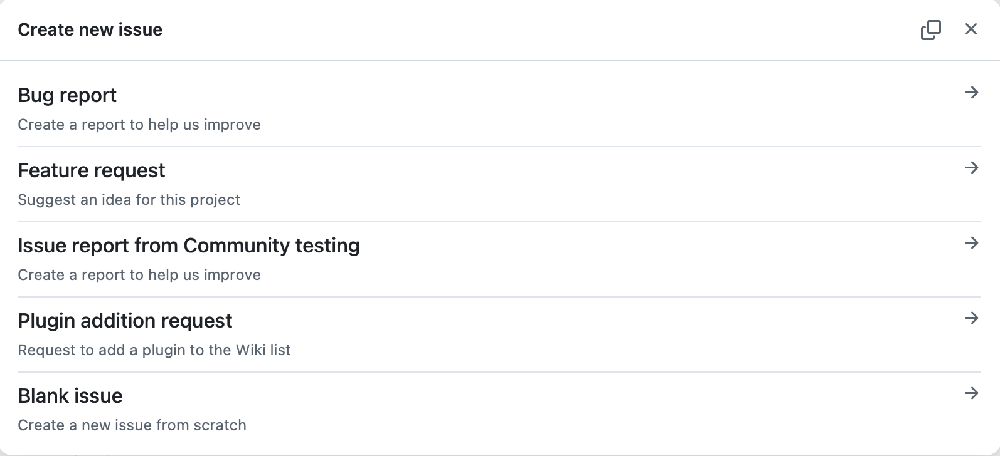

# Contributing to Omega

Thank you for your interest in contributing to Omega\! This document provides guidelines and instructions for contributing to this project. Omega is a neural-symbolic agent framework built on the Hyperon AGI stack, and we welcome contributions from the community.

## Table of Contents

- [Code of Conduct](#code-of-conduct) 
- [How to Contribute](#how-to-contribute)  
- [Development Setup](#development-setup)  
- [Pull Request Process](#pull-request-process)  
- [Coding Standards](#coding-standards)  
- [Writing Documentation](#writing-documentation)  
- [Reporting Bugs](#reporting-bugs)  
- [Suggesting Enhancements](#suggesting-enhancements)  
- [Community](#community)  
- [License](#license)

---

## Code of Conduct

This project follows the [Contributor Covenant Code of Conduct](CODE_OF_CONDUCT.md). By participating, you are expected to uphold this code. Please report unacceptable behavior to the maintainers.

---

## How to Contribute

There are many ways to contribute to Omega:

- **Bug fixes**: Fix issues reported by the community in the [issue tracker](https://github.com/singnet/Omega/issues) or found during your own testing.  
- **New features**: Propose and implement new capabilities for the agent framework.  
- **New skills:** Add new MeTTa skills following the skill dispatch architecture (see [tutorial-03](docs/tutorial-03-writing-a-custom-skill.md)).  
- **New channels:** Build communication channel adapters (see [tutorial-04](docs/tutorial-04-adding-a-channel.md)).  
- **New plugins**: Develop new plugins, or extensions that enhance Omega's functionality.  
- **Documentation**: Improve or expand documentation, tutorials, or inline code comments.  
- **Tests**: Add unit tests, integration tests, or autotest scenarios to improve code coverage and reliability.  
- **Code review**: Review open pull requests and provide constructive feedback.  
- **Provider integrations**: Add support for new LLM providers or communication channels.  
- **Docker:** Improve containerization, CI workflows, or deployment scripts.  
- **Reasoning engines:** Improve or extend NAL, PLN, or ONA reasoning integrations.

---

## Development Setup

### Fork and Clone

1. Fork the [Omega](https://github.com/singnet/Omega) repository.  
2. Clone your fork locally:

```shell
git clone https://github.com/<your-username>/Omega.git
cd Omega
```

3. Add the upstream remote to keep your fork synchronized:

```shell
git remote add upstream https://github.com/singnet/Omega.git
```

### Installation

Installation process described at [Readme](https://github.com/singnet/Omega#installation)

### Configuration and Usage

For usage and configuration instructions please refer to project [Readme](https://github.com/singnet/Omega#installation)

### Running Tests

Tests live in two places.

`tests/` holds the unit tests. The Python ones run on a plain checkout:

```shell
./tests/pytest.sh
```

The MeTTa ones need a PeTTa tree, so they run inside the container:

```shell
docker exec -e PETTA_PATH=/PeTTa omega /PeTTa/repos/Omega/tests/mettatest.sh
```

`Autotests/` holds the scenario tests, which drive a running agent, plus a unit tier in `Autotests/unit/`. Build the image, start an agent, then run the suite from that directory:

```shell
docker build -t omega:dev .
export TEST_SERVER_IP=host.docker.internal
./scripts/omega start -p Test -t test -d omega:dev -g http://host.docker.internal:18789
cd Autotests
pytest -s -v @run_mandatory
```

`run_mandatory` has to pass: CI treats it as blocking. `run_optional` is the non-blocking list, and one case in it needs `OMEGA_GIT_TOKEN`. The rest of `Autotests/` runs against real providers and needs their API keys, see `Autotests/README_live.md`.

CI runs all of this on every pull request to `main`: `build.yml` calls `common.yml`, which calls `autotests.yml`.

---

## Pull Request Process

1. **Create a branch** from `main` with a descriptive name:

```shell
git checkout main
git pull upstream main
git checkout -b fix/your-bug-fix    # or feature/your-feature, docs/your-docs
git push origin fix/your-bug-fix
```

2. **Make your changes** following the coding standards below.  
     
3. **Write tests** for your changes if applicable. Ensure all [existing tests](#running-tests) pass.

4. **Update documentation** if you are adding features, changing behavior, or modifying configuration options.  
     
5. **Commit** with clear, conventional commit messages:

```shell
git commit -m "feat(skills): add web-search skill with result caching"
git commit -m "fix(loop): handle empty LLM response in main loop"
git commit -m "docs(channels): update Telegram adapter setup guide"
```

We follow [Conventional Commits](https://www.conventionalcommits.org/) prefixes:

- `feat:` — new features  
- `fix:` — bug fixes  
- `docs:` — documentation only  
- `refactor:` — code changes that neither fix bugs nor add features  
- `test:` — adding or updating tests  
- `chore:` — build process, tooling, CI/CD  
- `perf:` — performance improvements  
    
6. **Open a Pull Request** against the `singnet/Omega` `main` branch. Use the PR framework provided at .github/pull\_request\_template.md, which includes a checklist including a "PR contains autogenerated code" disclosure. Provide a clear description of the change, its motivation, and any relevant issue numbers in the form.  
     
7. **Address review feedback** promptly. Maintainers may request changes, additional tests, or documentation updates.

---

## Coding Standards

### General

- No dead code: Remove unused imports, variables, and functions before submitting.  
- Consistent formatting: Use the same indentation and line length conventions as the surrounding code.  
- Backward compatibility: Avoid breaking changes to existing APIs. If a breaking change is necessary, discuss it in an issue first and document the migration path.

### Python Code

- Follow [PEP 8](https://peps.python.org/pep-0008/) style guidelines.  
- Use type hints for function signatures and return values where practical.  
- Write docstrings for all public functions, classes, and modules following the [Google Python Style Guide](https://google.github.io/styleguide/pyguide.html#384-functions-and-methods).  
- Keep functions focused and concise. If a function exceeds \~50 lines, consider breaking it up.  
- Import order: standard library, third-party packages, local modules (separated by blank lines).

### MeTTa Code

- Follow the existing skill dispatch pattern documented in [reference-internals-skill-dispatch.md](docs/reference-internals-skill-dispatch.md).  
- New skills must conform to the **Signature → Purpose → Parameters → Returns → Examples → Notes/Limits** template (see existing reference docs for examples).  
- Keep the MeTTa core (`src/*.metta`) minimal — the design goal is simplicity and transparency.  
- Add inline comments explaining non-obvious symbolic reasoning patterns.

### Prolog (SWI-Prolog) Code

- Follow existing conventions in `src/skills.pl`.  
- Document predicate arity, expected input formats, and failure modes.

### Shell Scripts

- Use `#!/usr/bin/env bash` shebang.  
- Follow [ShellCheck](https://www.shellcheck.net/) recommendations — ensure scripts pass `shellcheck` with no errors.  
- Quote all variable expansions unless you explicitly require word splitting.

### Docker

- Base images should be pinned by digest or specific tag (avoid `latest` in Dockerfiles).  
- Follow multi-stage build patterns to minimize image size where possible.  
- Document any port mappings, volume mounts, and environment variables in comments.

---

## Writing Documentation

Omega uses flat Markdown files in the [`docs/`](docs/) directory. Documentation is organized by prefix:

| Prefix | Type | Example |
| :---- | :---- | :---- |
| `intro-*` | Conceptual introduction | `introduction.md` |
| `tutorial-NN-*` | Numbered, task-oriented walkthrough | `tutorial-03-writing-a-custom-skill.md` |
| `reference-*` | API, engines, internals | `reference-skills-memory.md` |

### Guidelines

- Tutorials must be self-contained and walk the reader through a concrete task step by step.  
- Reference pages must follow the standard template: Signature → Purpose → Parameters → Returns → Examples → Notes/Limits.  
- Use relative links for intra-repo references.  
- Include runnable code examples wherever possible.  
- If adding a new skill or channel, you must add or update the corresponding reference documentation.

---

## Reporting Bugs

If you find a bug, please open an issue on the [issue tracker](https://github.com/singnet/Omega/issues) by choosing one of the issue forms, per the screenshot below:  


In your report, be sure to include all relevant details such as:

1. Clear title and description — What happened and what you expected to happen.  
2. Steps to reproduce — Minimal, specific steps that trigger the bug.  
3. Environment details —  
   - OS and version  
   - Python version  
   - SWI-Prolog version  
   - LLM provider and model used  
   - Omega version or commit hash  
4. Logs or error output — Paste relevant terminal output or log snippets.  
5. Configuration — Any non-default configuration settings (redact API keys).

---

## Suggesting Enhancements

We welcome feature ideas\! Please open an issue with:

- A clear description of the proposed feature and its use case.  
- Motivation — Why is this feature useful to Omega users?  
- Possible implementation approach — If you have ideas on how it could be built (optional but helpful).

---

## Community

- **Issues**: [GitHub Issue tracker](https://github.com/singnet/Omega/issues)  
- **Telegram**: Chat with the Omega Developers community at [BGI Commons Telegram Channel](https://t.me/+AWxn8CUgdyE3Y2Jh)  
- **Discord**: Chat with the Omega Developers at [SingularityNET Discord](https://discord.gg/snet)

---

## License

By contributing to Omega, you agree that your contributions will be licensed under the [Apache License 2.0](LICENSE).  
