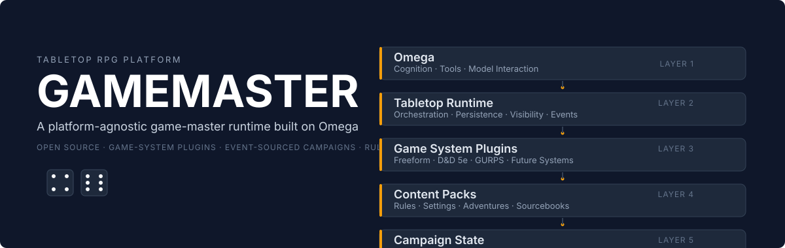

<p align="center">
  
</p>

Gamemaster is a platform-agnostic tabletop RPG game-master platform. It is not
a D&D chatbot. It is a modular runtime where cognition, mechanics, rules, and
world state are separate layers that can each be swapped, replaced, or
validated on their own.

Built on top of [SingularityNET Omega](https://github.com/singnet/Omega),
Gamemaster adds a tabletop orchestration layer above Omega's agent runtime.
Omega keeps doing what it does best, cognition, tools, model interaction, and
channels. The Tabletop Runtime owns everything else: campaign orchestration,
persistence, knowledge boundaries, and continuity.

## Why Omega

Omega is a neural-symbolic agent framework built on the Hyperon AGI stack. It
already provides the hardest parts of a game-master agent:

- a continuous agent loop with tool use and skill dispatch
- LLM provider and channel integrations
- reasoning and memory layers
- a plugin API for extending skills and the prompt

Rather than rebuild any of that, Gamemaster treats it as the foundation and
works above it.

## The boundary that holds it together

| Layer | Owns |
|---|---|
| **Omega** | cognition, tools, model interaction, channels |
| **Tabletop Runtime** | campaign orchestration, persistence, knowledge boundaries |
| **Game System Plugin** | mechanics and system-specific schemas |
| **Content Pack** | rules, settings, adventures, lore |
| **Campaign** | authoritative world state and history |
| **LLM** | intent interpretation, narration, ambiguous adjudication |

The rule that keeps the layers from collapsing: the LLM may interpret intent,
narrate outcomes, and adjudicate genuinely ambiguous situations, but it never
silently replaces deterministic mechanics. When a mechanic is known, a
game-system plugin resolves it. When a resolution cannot be decided, the
runtime returns a request for the GM to rule, with rule references attached,
instead of letting the model invent an outcome.

## Architecture

```text
Player / GM
   |
Omega channel / provider / runtime
   |
omega-tabletop adapter
   |
Tabletop Runtime
   |
   +-- Game System Plugins    capabilities-based mechanics
   +-- Content Packs          rules, settings, adventures (non-executable)
   +-- Campaign Store         SQLite, authoritative state
   +-- Rules / RAG            retrieval with provenance
   +-- Event Log              append-only sourced history
   +-- Visibility Engine      who may know which fact
   +-- Relationship Graph     typed edges over SQLite
   +-- Source Document Store  original files kept separate from RAG
```

Design constraints that shape the code:

- Omega-facing code is thin. One plugin (`plugins/tabletop`) is the only
  integration point, and it translates Omega skill calls into Tabletop Runtime
  calls.
- Game-system plugins never depend on Omega or MeTTa. They speak a
  platform-agnostic Python API.
- The tabletop API is not D&D-shaped. It uses generic concepts: entities,
  actions, resolution, visibility, events. Armor class, saving throws, spell
  slots, and sanity are meanings that game-system plugins attach, not concepts
  the core knows.
- Campaign truth does not depend on vector-memory recall. Facts live in a
  structured store and append-only event history; retrieval only helps the
  agent find material.

## Status

Early first draft. The upstream Omega bootstrap is committed on the
`tabletop-platform` branch, prior art has been researched and recorded, and the
execution plan with milestones and decisions is in
[.agents/plans/2026-09-06-tabletop-platform.md](.agents/plans/2026-09-06-tabletop-platform.md).
The tabletop runtime and plugin APIs are under construction.

Working today:

- Omega runs unchanged as the foundation (see Quick start).
- Architecture: [docs/architecture.md](docs/architecture.md).
- Prior-art research: [docs/research/prior-art.md](docs/research/prior-art.md).
- Project and upstream provenance: [UPSTREAM.md](UPSTREAM.md).

Not yet implemented (see Roadmap):

- game-system plugin API and the freeform reference system
- campaign persistence, event sourcing, visibility, relationships
- document ingestion and rules retrieval
- the Omega tabletop adapter plugin and skills

## Quick start

Gamemaster runs on top of Omega. The fastest way to see the foundation run is
to start Omega itself: see the upstream
[Omega README](https://github.com/singnet/Omega#readme) for installation. The
short path is:

```bash
git clone https://github.com/trueagi-io/PeTTa
cd PeTTa
mkdir -p repos
git clone https://github.com/singnet/Omega.git repos/Omega
git clone https://github.com/patham9/petta_lib_chromadb.git repos/petta_lib_chromadb
cp repos/Omega/run.metta ./
python3 -m venv ./.venv
source ./.venv/bin/activate
python3 -m pip install -r ./repos/Omega/requirements.txt
export ANTHROPIC_API_KEY=<your-key>   # or OPENAI_API_KEY
sh run.sh run.metta provider=Anthropic
```

The tabletop plugin is registered through Omega's `config/plugins.yaml` using
Omega's own plugin API. When the runtime is ready, adding it to that file is
the only integration step needed.

## Creating a game-system plugin

Game systems are capability-based. A plugin declares what it can do; the
runtime offers it those actions and nothing more. The initial capability set
includes `dice`, `action-resolution`, `opposed-resolution`, `turn-order`,
`damage`, `conditions`, and similar. A system that does not want hit points or
classes simply does not advertise those capabilities.

The intended plugin shape (API under construction in `tabletop/api/`):

```python
class GameSystemPlugin:
    id: str
    api_version: str

    def capabilities(self) -> set[str]: ...
    def resolve(self, action, context): ...
    def character_schema(self): ...
    def rule_namespaces(self): ...
```

See the full contract, manifest format, capability negotiation, and lifecycle
in the plugin API documentation (target: `docs/plugin-api.md` in the runtime
phase). Plugins live under
`systems/` (or a mounted `/tabletop/plugins/` directory in containers) and are
discovered at runtime without rebuilding Omega.

## Creating a content pack

Content packs are data, never code. They ship rules, settings, adventures, and
campaign seeds as markdown, text, or PDF, with a manifest declaring their
system compatibility and any GM-only material:

```yaml
id: example-adventure
kind: adventure          # rules | setting | adventure | campaign-seed | supplement
compatible_systems: [dnd5e-2014]
sources:
  - adventure.md
gm_only:
  - secrets.md
  - npc-agendas.md
```

Original source files stay available for direct inspection. RAG representations
are built from them separately and never replace the originals.

## Security

Sourcebooks and uploaded documents are treated as data, not instructions.
Game-system plugins are executable code and must be explicitly trusted; content
packs never execute code. A full security note lands in `docs/security.md` with
the runtime and container work.

## Roadmap

The milestones are tracked in `docs/roadmap.md` (written with the first draft):
runtime skeleton, persistence and visibility, documents and RAG, the play loop,
a D&D 5e reference system, a GURPS cross-validation, and channel/UI
improvements.

## Upstream Omega

This repository is a layer over
[SingularityNET Omega](https://github.com/singnet/Omega), Apache-2.0. Upstream
history is preserved in the `upstream` remote; the exact bootstrap commit is
recorded in [UPSTREAM.md](UPSTREAM.md). Gamemaster is itself Apache-2.0; see
[LICENSE](LICENSE).